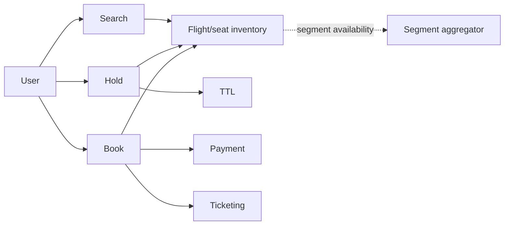
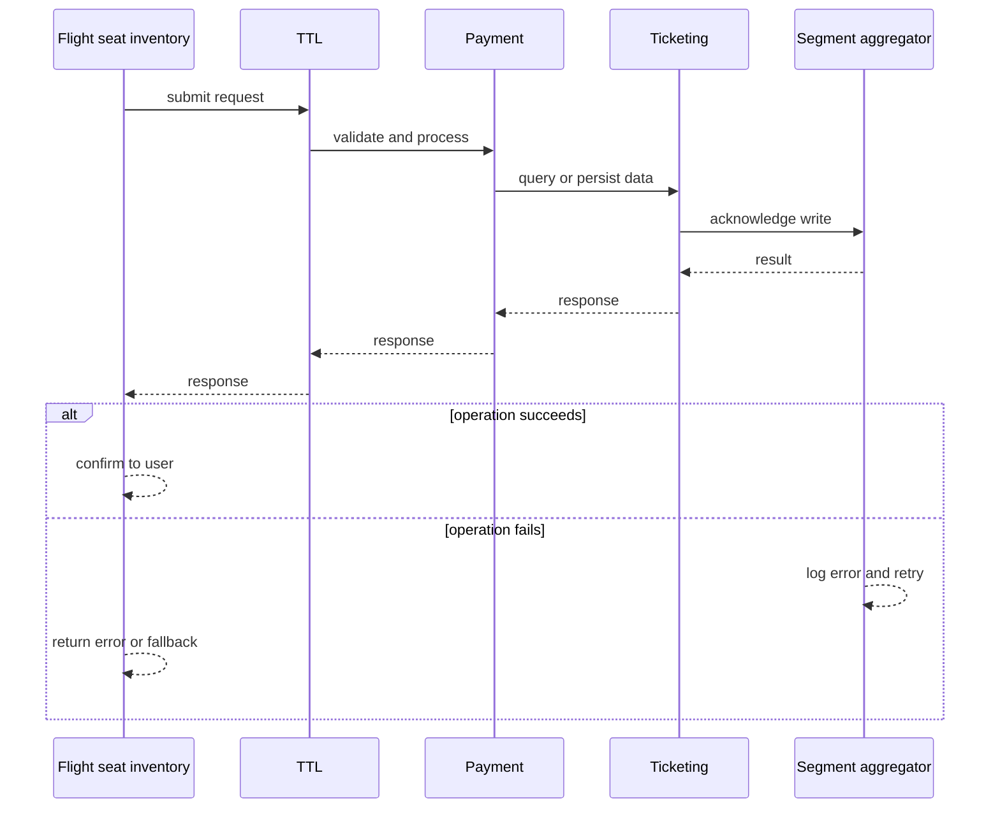
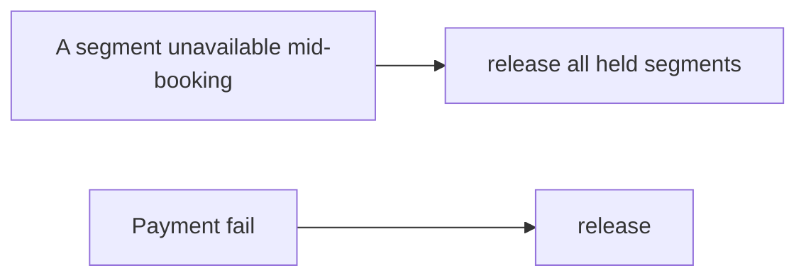
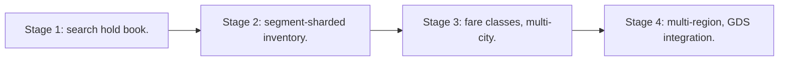

# Case Study: Airline-Reservation Platform

> **Tier:** advanced · **Status:** complete · Original numbers and diagrams.

## 1. Problem statement
Search flights, hold seats, book, and ticket across flights with complex fare/seat inventory and partial-availability across segments. This is a advanced-tier system design challenge because it must handle high availability under peak load while ensuring no single point of failure. The design must be production-grade: observable, debuggable, reversible, and able to survive component failures without data loss or cascading outages.

## 2. Scope
In (v1): flight search, seat hold, book, ticket, pay. Out: multi-city/fare classes (stage).

For Airline-Reservation Platform, these boundaries keep the first version focused on the core user value. Adding more features would dilute the design and delay shipping. Each excluded item is a scaling stage — a candidate for the next iteration once the baseline is proven.

## 3. Functional requirements
- Search flights by route/date.
- Hold a seat temporarily.
- Book + ticket + pay.
- Cancel/refund.

For Airline-Reservation Platform, these requirements drive specific architectural decisions: the read-write ratio determines the caching strategy, the durability target sets the replication mode, and the idempotency requirement shapes the API contract.

## 4. Non-functional requirements
- No double-book a seat.
- Search p99 < 2 s.
- Availability near-real-time across segments.

For Airline-Reservation Platform, each non-functional target constrains a specific component: the latency SLO bounds the number of synchronous hops, the availability target forces redundancy across availability zones, and the cost ceiling limits the replication factor and storage tier.

## 5. Explicit assumptions
1. 500 airlines, 50k flights/day, 2M bookings/day. [assumption] 2. Seat inventory per flight/segment. [assumption] 3. Hold 5 min TTL. [constraint]

For Airline-Reservation Platform, if these assumptions are off by an order of magnitude, the architecture must adapt: 10x traffic may require earlier sharding, a different read-write ratio changes the caching strategy, and a higher peak multiplier demands more headroom.

## 6. Traffic estimation
Search high; bookings ~23/s avg; availability checks per segment.

To derive the request rate: divide the daily volume by 86,400 seconds to get the average rate, then multiply by 5-10x for peak. The read-to-write ratio determines whether the system is cache-dominated (read-heavy) or write-path-dominated (write-heavy). For Airline-Reservation Platform, this ratio shapes the entire storage and replication strategy.

## 7. Storage estimation
Flight/seat inventory per (flight, segment, seat); bookings; fare rules.

For Airline-Reservation Platform, storage growth is projected from the daily write volume and retention policy. Index overhead and compression factors are accounted for in the total.

## 8. Bandwidth estimation
Search medium; booking small.

Bandwidth is request rate multiplied by average payload size for ingress, and response rate multiplied by response size for egress. CDN and edge caching reduce origin egress. Compression reduces bandwidth by 50-80 percent where applicable. For Airline-Reservation Platform, bandwidth may or may not be the binding constraint — compare it against compute and storage to find out.

## 9. API design
| Method | Path | Request | Response |
|--------|------|---------|----------|
| GET /search | route, date | flights |
| POST |/hold | flight, seat | hold id |
| POST /book | hold, pay | ticket |

## 10. Data model
inventory(flight, segment, seat, status); holds(id, flight, seat, exp); bookings(id, segments, passenger, fare, payment).

For Airline-Reservation Platform, the data model follows the access pattern. The primary lookup determines the partition key; secondary lookups determine indexes. Denormalization is used selectively on hot read paths.

## 11. High-level architecture

## 12. Request flow
Search across segments -> hold a seat (TTL) -> book confirms, pays, tickets; expiry releases holds. Multi-segment bookings reserve all segments atomically.

## 13. Component responsibilities
Search, segment inventory, hold, booking, ticketing, payment.

For Airline-Reservation Platform, each component has one job. The gateway authenticates and routes. Services are stateless and scale horizontally. The data tier is the stateful core that scales by sharding.

## 14. Database selection
Inventory per (flight,segment,seat) keyed for range queries; bookings transactional. Rejected: scanning all seats per query.

For Airline-Reservation Platform, the database was chosen by access pattern, not familiarity. The rejected alternatives were wrong for this workload, not bad in general.

## 15. Caching strategy
Search results TTL; availability cached with hold invalidation.

For Airline-Reservation Platform, the cache strategy matches the staleness tolerance. Cache-aside for most data, write-through where read-after-write matters, stampede protection on hot keys.

## 16. Partitioning strategy
Inventory by flight/airline; bookings by id; search by route/region.

For Airline-Reservation Platform, the partition key balances query locality with even load distribution. Sharding strategy matters because a poor key creates hot spots under real traffic patterns.

## 17. Replication strategy
Inventory RF=3; bookings durable; holds ephemeral.

For Airline-Reservation Platform, replication mode is split: synchronous where durability is critical, asynchronous elsewhere for throughput. RF=3 tolerates one failure. Failover is tested regularly.

## 18. Consistency model
Strong per seat: no double-book. Multi-segment booking atomic (all-or-none).

For Airline-Reservation Platform, the consistency level is the weakest users accept. Read-your-writes is provided where needed. Eventual consistency is bounded and monitored, not unbounded and silent.

## 19. Failure scenarios
Hold expiry releases seats. A segment unavailable mid-booking -> release all held segments. Payment fail -> release.

For Airline-Reservation Platform, each failure has a specific response plan. The design principle is degrade-don't-cascade: bulkheads isolate dependencies, circuit breakers stop calls to failing services, and timeouts bound every outbound call.

## 20. Reliability strategy
SLI search latency, double-book (0); SLO 99.9%. TTL + atomic multi-segment. Chaos: kill inventory shard, assert no double-book.

For Airline-Reservation Platform, the SLO makes reliability measurable. The error budget balances feature velocity with stability. Chaos testing validates that resilience claims hold under real failures.

## 21. Security considerations
Passenger PII protection; PCI; anti-scraping; fare-rule integrity.

For Airline-Reservation Platform, security layers TLS, encryption at rest, RBAC, PII redaction, and audit. The policy gateway is fail-closed for AI-augmented operations.

## 22. Observability strategy
Search latency, hold conversion, expiry, double-book guards, segment-availability freshness.

For Airline-Reservation Platform, observability combines logs, metrics, and traces with correlation IDs. Golden signals drive the first dashboard. Alerts fire on burn rate, not raw thresholds.

## 23. Cost considerations
Search infra + GDS/airline feeds + payment; seat accuracy is correctness.

For Airline-Reservation Platform, cost is driven by the binding resource. Caching, tiering, batching, and right-sizing are the levers. Cost per request is tracked and alerted on.

## 24. Scaling stages
Stage 1: search+hold+book. -> Stage 2: segment-sharded inventory. -> Stage 3: fare classes, multi-city. -> Stage 4: multi-region, GDS integration.

## 25. Trade-offs
Hold TTL vs abandoned inventory. Strong seat inventory vs search throughput. Multi-segment atomicity vs partial-booking availability.

For Airline-Reservation Platform, each trade-off lists what was chosen, what was rejected, and why. This makes the design defensible in review — every decision has documented reasoning.

## 26. Alternative designs
No hold (double-book). Eventual seat (double-book). Partial multi-segment bookings (orphan legs).

For Airline-Reservation Platform, the alternatives are real architectures that work under different constraints. They were rejected for this workload's specific requirements, not because they are bad designs.

## 27. Interview discussion points
Clarify multi-segment, seat inventory, overbooking. Surface atomic multi-segment reservation and hold TTL.

For Airline-Reservation Platform in an interview: clarify scope first, surface the read-write ratio, design the hot path deeply, discuss failures, and offer an alternative. Weak candidates skip failure modes.

## 28. Original Mermaid diagrams
Standalone sources under `diagrams/case-studies/airline-reservation/`: `context.mmd`, `request-sequence.mmd`, `failure-flow.mmd`, `scaling-evolution.mmd`. The diagrams are embedded in their respective sections: architecture in section 11, request flow in section 12, failure scenarios in section 19, and scaling stages in section 24.

## 29. Further reading
Inventory: Level 4; search: Level 2; payment: Level 10. Sources: `S-CHASH` `S-DYNAMO`.

## 30. Practical exercises

1. Multi-segment atomic booking. 2. Overbooking controlled by fare class. 3. Search across 500 airlines. 4. Hold expiry vs payment pending. 5. GDS feed lag handling.

---
Previous: Hotel-booking · Next: Online multiplayer game

