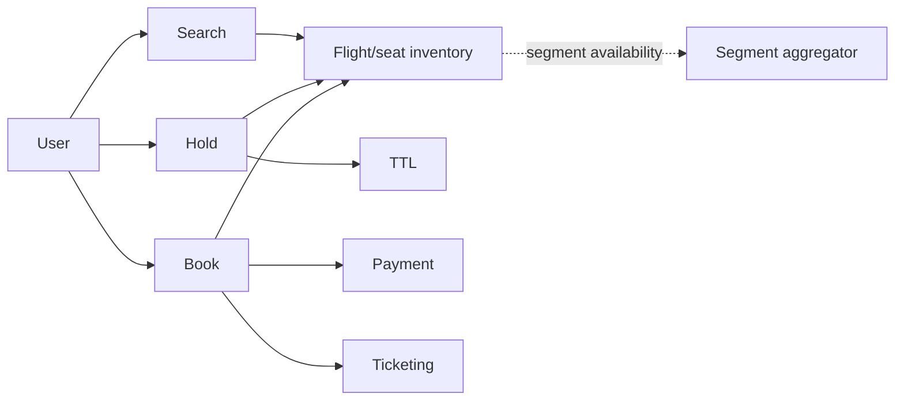
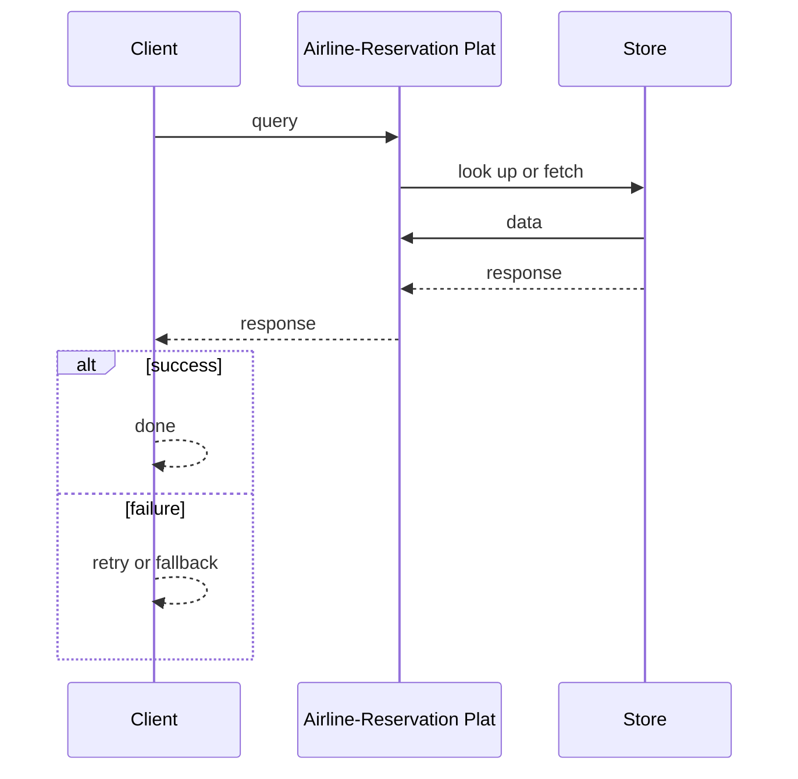
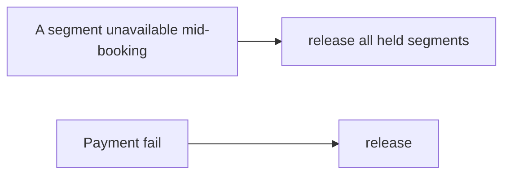

# Case Study: Airline-Reservation Platform

> **Tier:** advanced · **Status:** complete · Original numbers and diagrams.

## 1. Problem statement

Search flights, hold seats, book, and ticket across flights with complex fare/seat inventory and partial-availability across segments.

## 2. Scope

In (v1): flight search, seat hold, book, ticket, pay. Out: multi-city/fare classes (stage).

## 3. Functional requirements

- Search flights by route/date.
- Hold a seat temporarily.
- Book + ticket + pay.
- Cancel/refund.

## 4. Non-functional requirements

- No double-book a seat.
- Search p99 < 2 s.
- Availability near-real-time across segments.

## 5. Explicit assumptions

1. 500 airlines, 50k flights/day, 2M bookings/day. [assumption] 2. Seat inventory per flight/segment. [assumption] 3. Hold 5 min TTL. [constraint]

## 6. Traffic estimation

Search high; bookings ~23/s avg; availability checks per segment.

## 7. Storage estimation

Flight/seat inventory per (flight, segment, seat); bookings; fare rules.

## 8. Bandwidth estimation

Search medium; booking small.

## 9. API design

| GET /search | route, date | flights |
| POST |/hold | flight, seat | hold id | | POST /book | hold, pay | ticket |

## 10. Data model

inventory(flight, segment, seat, status); holds(id, flight, seat, exp); bookings(id, segments, passenger, fare, payment).

## 11. High-level architecture

## 12. Request flow

Search across segments -> hold a seat (TTL) -> book confirms, pays, tickets; expiry releases holds. Multi-segment bookings reserve all segments atomically.

## 13. Component responsibilities

Search, segment inventory, hold, booking, ticketing, payment.

## 14. Database selection

Inventory per (flight,segment,seat) keyed for range queries; bookings transactional. Rejected: scanning all seats per query.

## 15. Caching strategy

Search results TTL; availability cached with hold invalidation.

## 16. Partitioning strategy

Inventory by flight/airline; bookings by id; search by route/region.

## 17. Replication strategy

Inventory RF=3; bookings durable; holds ephemeral.

## 18. Consistency model

Strong per seat: no double-book. Multi-segment booking atomic (all-or-none).

## 19. Failure scenarios

Hold expiry releases seats. A segment unavailable mid-booking -> release all held segments. Payment fail -> release.

## 20. Reliability strategy

SLI search latency, double-book (0); SLO 99.9%. TTL + atomic multi-segment. Chaos: kill inventory shard, assert no double-book.

## 21. Security considerations

Passenger PII protection; PCI; anti-scraping; fare-rule integrity.

## 22. Observability strategy

Search latency, hold conversion, expiry, double-book guards, segment-availability freshness.

## 23. Cost considerations

Search infra + GDS/airline feeds + payment; seat accuracy is correctness.

## 24. Scaling stages

Stage 1: search+hold+book. -> Stage 2: segment-sharded inventory. -> Stage 3: fare classes, multi-city. -> Stage 4: multi-region, GDS integration.

## 25. Trade-offs

Hold TTL vs abandoned inventory. Strong seat inventory vs search throughput. Multi-segment atomicity vs partial-booking availability.

## 26. Alternative designs

No hold (double-book). Eventual seat (double-book). Partial multi-segment bookings (orphan legs).

## 27. Interview discussion points

Clarify multi-segment, seat inventory, overbooking. Surface atomic multi-segment reservation and hold TTL.

## 28. Original Mermaid diagrams

Standalone sources under `diagrams/case-studies/airline-reservation/`: `context.mmd`, `request-sequence.mmd`, `failure-flow.mmd`, `scaling-evolution.mmd`. Request sequence and failure flow:

## 29. Further reading

Inventory: Level 4; search: Level 2; payment: Level 10.

## 30. Practical exercises

1. Multi-segment atomic booking. 2. Overbooking controlled by fare class. 3. Search across 500 airlines. 4. Hold expiry vs payment pending. 5. GDS feed lag handling.

---
Previous: Hotel-booking · Next: Online multiplayer game

