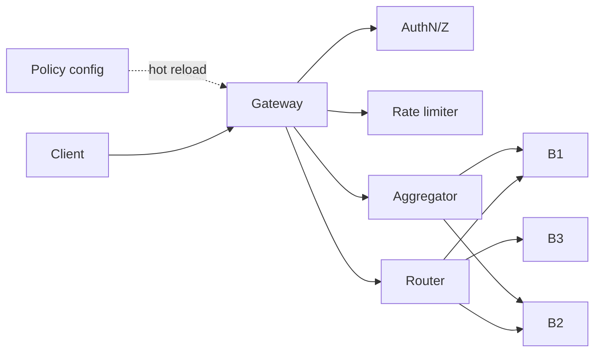
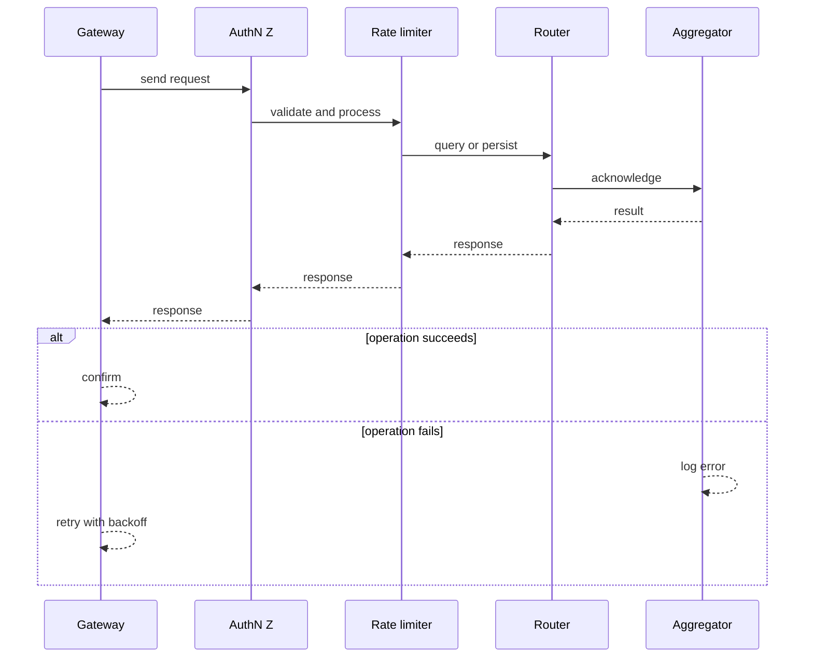
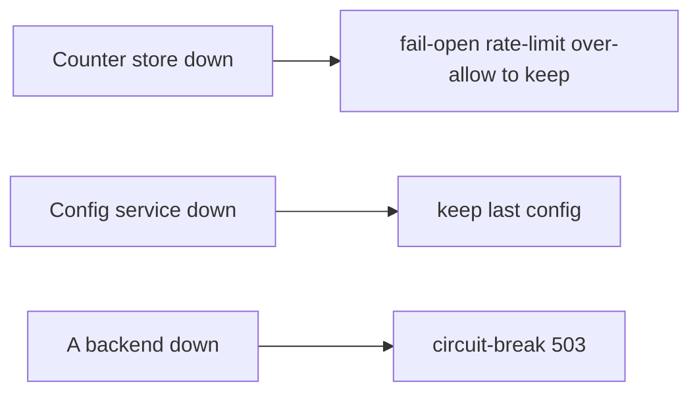
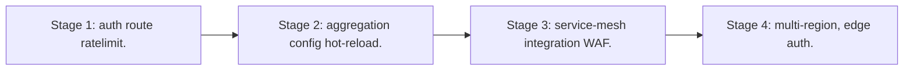

# Case Study: API Gateway

> **Tier:** advanced · **Status:** complete · Original numbers and diagrams.

## 1. Problem statement

A single entry point for a fleet of APIs: auth, rate limit, routing, transformation, and aggregation — a high-QPS, policy-heavy edge.

## 2. Scope

In (v1): auth, rate limit, route, transform, aggregate, observability. Out: full BFF logic (stage).

## 3. Functional requirements

- Authenticate/authorize requests.
- Rate-limit per client/tenant.
- Route to backends.
- Transform request/response.
- Aggregate multiple backends.

## 4. Non-functional requirements

- p99 < 50 ms overhead.
- Availability 99.95% (it's the front door).
- High QPS; horizontally scalable.

## 5. Explicit assumptions

1. 100k RPS, 50 backends. [assumption] 2. Mostly stateless routing. [assumption] 3. Policy config hot-reloadable. [constraint]

## 6. Traffic estimation
100k RPS; every request passes through. The gateway is on the critical path of everything.

## 7. Storage estimation

Config (routes, quotas) small; rate-limit counters ephemeral. Negligible durable storage.

## 8. Bandwidth estimation
In+out equals backend traffic; the gateway is a pass-through — bandwidth is whatever the fleet moves.

## 9. API design

The gateway itself is the API; backends are internal.

## 10. Data model

routes(host,path -> backend, policy); quotas(client, limit); counters(client, window).

## 11. High-level architecture

## 12. Request flow
Request -> auth -> rate-limit -> route (or aggregate fan-out) -> backend(s) -> transform response -> client. Config hot-reloads without dropping requests.

## 13. Component responsibilities

Auth, rate limiter, router, transformer, aggregator, config service, counter store.

## 14. Database selection

Config in a KV with hot reload; rate-limit counters in a fast in-memory store. Rejected: per-request DB lookup for routing.

## 15. Caching strategy

Route config cached in-process (hot-reload); rate-limit hot keys in-process; response caching for cacheable endpoints.

## 16. Partitioning strategy

Counters sharded by client; gateway instances stateless behind a LB; config pushed to all.

## 17. Replication strategy

Gateway stateless (RF = instances); counter store replicated; config replicated.

## 18. Consistency model

Config eventually consistent across instances (a route change propagates in seconds). Counters approximate.

## 19. Failure scenarios
Counter store down -> fail-open rate-limit (over-allow) to keep traffic flowing. Config service down -> keep last config. A backend down -> circuit-break/503.

## 20. Reliability strategy

SLI overhead latency, availability; SLO 99.95%. Stateless + redundancy. Chaos: kill a gateway instance, assert no client impact.

## 21. Security considerations

Authn/Z at the edge; mTLS to backends; per-tenant quotas; WAF hooks; no secrets in config.

## 22. Observability strategy

RPS, p99 latency, 4xx/5xx, rate-limit denials, per-backend latency/errors, circuit-break trips.

## 23. Cost considerations

Compute (always-on, critical path) + counter store. Efficiency (low overhead) directly cuts cost.

## 24. Scaling stages
Stage 1: auth+route+ratelimit. -> Stage 2: aggregation + config hot-reload. -> Stage 3: service-mesh integration + WAF. -> Stage 4: multi-region, edge auth.

## 25. Trade-offs

Centralized policy (consistency) vs a shared SPOF/bottleneck. Fail-open rate-limit (availability) vs over-allow. Aggregation (fewer client calls) vs gateway coupling.

## 26. Alternative designs

Per-service auth (duplicated, inconsistent). Fat gateway (business logic, unmaintainable). Single instance (SPOF).

## 27. Interview discussion points

Clarify QPS, policies, aggregation. Surface stateless edge, hot-reload config, fail-open rate-limit.

## 28. Original Mermaid diagrams
Standalone sources under `diagrams/case-studies/api-gateway-system/`: `context.mmd`, `request-sequence.mmd`, `failure-flow.mmd`, `scaling-evolution.mmd`. The diagrams are embedded in their respective sections: architecture in section 11, request flow in section 12, failure scenarios in section 19, and scaling stages in section 24.

## 29. Further reading
API gateway: Level 2; rate limiting: Level 5; auth: Level 7. Sources: `S-CHASH` `S-DYNAMO`.

## 30. Practical exercises

1. Hot-reload config with zero dropped requests. 2. Fail-open vs fail-closed rate-limit. 3. Aggregate 3 backends within p99 budget. 4. Per-tenant quotas at 100k RPS. 5. Multi-region gateway failover.

---
Previous: Continuous integration platform · Next: Identity & access-management

