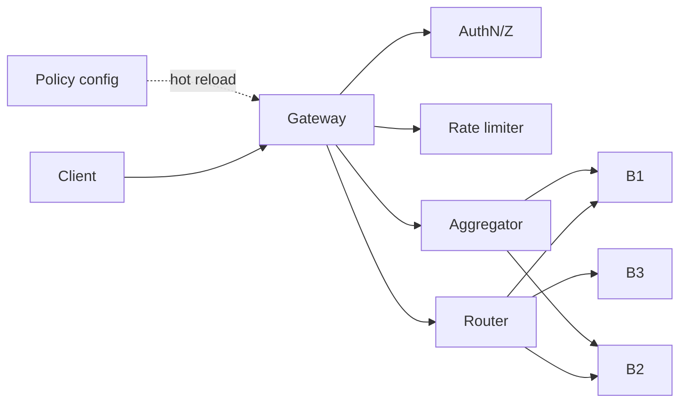
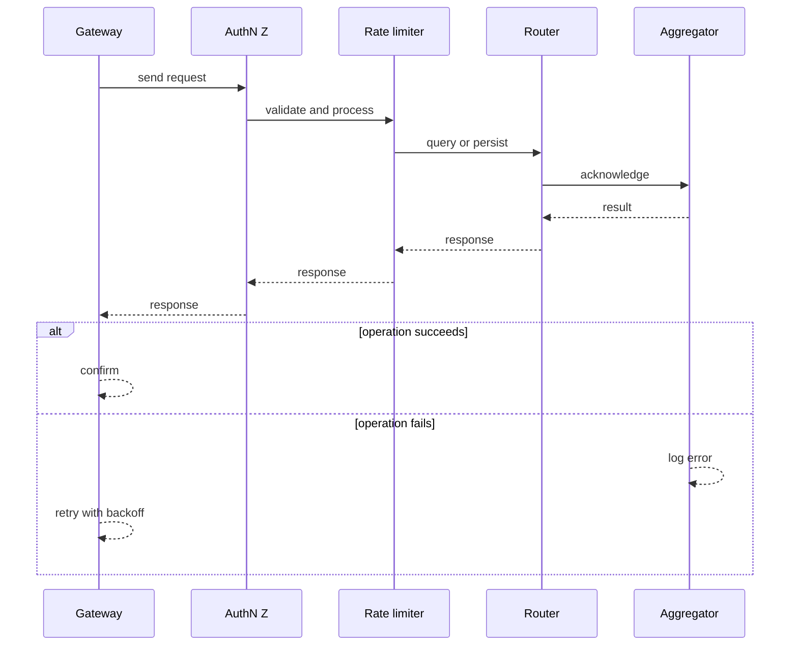
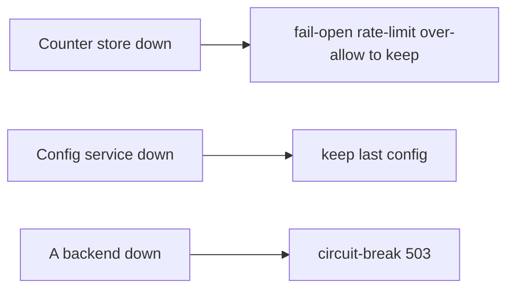
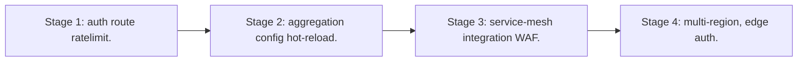

# Case Study: API Gateway

> **Tier:** advanced · **Status:** complete · Original numbers and diagrams.

## 1. Problem statement
A single entry point for a fleet of APIs: auth, rate limit, routing, transformation, and aggregation — a high-QPS, policy-heavy edge. This is a advanced-tier system design challenge because it must handle high availability under peak load while ensuring no single point of failure. The design must be production-grade: observable, debuggable, reversible, and able to survive component failures without data loss or cascading outages.

## 2. Scope
In (v1): auth, rate limit, route, transform, aggregate, observability. Out: full BFF logic (stage).

For API Gateway, these boundaries keep the first version focused on the core user value. Adding more features would dilute the design and delay shipping. Each excluded item is a scaling stage — a candidate for the next iteration once the baseline is proven.

## 3. Functional requirements
- Authenticate/authorize requests.
- Rate-limit per client/tenant.
- Route to backends.
- Transform request/response.
- Aggregate multiple backends.

For API Gateway, these requirements drive specific architectural decisions: the read-write ratio determines the caching strategy, the durability target sets the replication mode, and the idempotency requirement shapes the API contract.

## 4. Non-functional requirements
- p99 < 50 ms overhead.
- Availability 99.95% (it's the front door).
- High QPS; horizontally scalable.

For API Gateway, each non-functional target constrains a specific component: the latency SLO bounds the number of synchronous hops, the availability target forces redundancy across availability zones, and the cost ceiling limits the replication factor and storage tier.

## 5. Explicit assumptions
1. 100k RPS, 50 backends. [assumption] 2. Mostly stateless routing. [assumption] 3. Policy config hot-reloadable. [constraint]

For API Gateway, if these assumptions are off by an order of magnitude, the architecture must adapt: 10x traffic may require earlier sharding, a different read-write ratio changes the caching strategy, and a higher peak multiplier demands more headroom.

## 6. Traffic estimation
100k RPS; every request passes through. The gateway is on the critical path of everything.

To derive the request rate: divide the daily volume by 86,400 seconds to get the average rate, then multiply by 5-10x for peak. The read-to-write ratio determines whether the system is cache-dominated (read-heavy) or write-path-dominated (write-heavy). For API Gateway, this ratio shapes the entire storage and replication strategy.

## 7. Storage estimation
Config (routes, quotas) small; rate-limit counters ephemeral. Negligible durable storage.

For API Gateway, storage growth is projected from the daily write volume and retention policy. Index overhead and compression factors are accounted for in the total.

## 8. Bandwidth estimation
In+out equals backend traffic; the gateway is a pass-through — bandwidth is whatever the fleet moves.

Bandwidth is request rate multiplied by average payload size for ingress, and response rate multiplied by response size for egress. CDN and edge caching reduce origin egress. Compression reduces bandwidth by 50-80 percent where applicable. For API Gateway, bandwidth may or may not be the binding constraint — compare it against compute and storage to find out.

## 9. API design

The gateway itself is the API; backends are internal.

## 10. Data model
routes(host,path -> backend, policy); quotas(client, limit); counters(client, window).

For API Gateway, the data model follows the access pattern. The primary lookup determines the partition key; secondary lookups determine indexes. Denormalization is used selectively on hot read paths.

## 11. High-level architecture

## 12. Request flow
Request -> auth -> rate-limit -> route (or aggregate fan-out) -> backend(s) -> transform response -> client. Config hot-reloads without dropping requests.

## 13. Component responsibilities
Auth, rate limiter, router, transformer, aggregator, config service, counter store.

For API Gateway, each component has one job. The gateway authenticates and routes. Services are stateless and scale horizontally. The data tier is the stateful core that scales by sharding.

## 14. Database selection
Config in a KV with hot reload; rate-limit counters in a fast in-memory store. Rejected: per-request DB lookup for routing.

For API Gateway, the database was chosen by access pattern, not familiarity. The rejected alternatives were wrong for this workload, not bad in general.

## 15. Caching strategy
Route config cached in-process (hot-reload); rate-limit hot keys in-process; response caching for cacheable endpoints.

For API Gateway, the cache strategy matches the staleness tolerance. Cache-aside for most data, write-through where read-after-write matters, stampede protection on hot keys.

## 16. Partitioning strategy
Counters sharded by client; gateway instances stateless behind a LB; config pushed to all.

For API Gateway, the partition key balances query locality with even load distribution. Sharding strategy matters because a poor key creates hot spots under real traffic patterns.

## 17. Replication strategy
Gateway stateless (RF = instances); counter store replicated; config replicated.

For API Gateway, replication mode is split: synchronous where durability is critical, asynchronous elsewhere for throughput. RF=3 tolerates one failure. Failover is tested regularly.

## 18. Consistency model
Config eventually consistent across instances (a route change propagates in seconds). Counters approximate.

For API Gateway, the consistency level is the weakest users accept. Read-your-writes is provided where needed. Eventual consistency is bounded and monitored, not unbounded and silent.

## 19. Failure scenarios
Counter store down -> fail-open rate-limit (over-allow) to keep traffic flowing. Config service down -> keep last config. A backend down -> circuit-break/503.

## 20. Reliability strategy
SLI overhead latency, availability; SLO 99.95%. Stateless + redundancy. Chaos: kill a gateway instance, assert no client impact.

For API Gateway, the SLO makes reliability measurable. The error budget balances feature velocity with stability. Chaos testing validates that resilience claims hold under real failures.

## 21. Security considerations
Authn/Z at the edge; mTLS to backends; per-tenant quotas; WAF hooks; no secrets in config.

For API Gateway, security layers TLS, encryption at rest, RBAC, PII redaction, and audit. The policy gateway is fail-closed for AI-augmented operations.

## 22. Observability strategy
RPS, p99 latency, 4xx/5xx, rate-limit denials, per-backend latency/errors, circuit-break trips.

For API Gateway, observability combines logs, metrics, and traces with correlation IDs. Golden signals drive the first dashboard. Alerts fire on burn rate, not raw thresholds.

## 23. Cost considerations
Compute (always-on, critical path) + counter store. Efficiency (low overhead) directly cuts cost.

For API Gateway, cost is driven by the binding resource. Caching, tiering, batching, and right-sizing are the levers. Cost per request is tracked and alerted on.

## 24. Scaling stages
Stage 1: auth+route+ratelimit. -> Stage 2: aggregation + config hot-reload. -> Stage 3: service-mesh integration + WAF. -> Stage 4: multi-region, edge auth.

## 25. Trade-offs
Centralized policy (consistency) vs a shared SPOF/bottleneck. Fail-open rate-limit (availability) vs over-allow. Aggregation (fewer client calls) vs gateway coupling.

For API Gateway, each trade-off lists what was chosen, what was rejected, and why. This makes the design defensible in review — every decision has documented reasoning.

## 26. Alternative designs
Per-service auth (duplicated, inconsistent). Fat gateway (business logic, unmaintainable). Single instance (SPOF).

For API Gateway, the alternatives are real architectures that work under different constraints. They were rejected for this workload's specific requirements, not because they are bad designs.

## 27. Interview discussion points
Clarify QPS, policies, aggregation. Surface stateless edge, hot-reload config, fail-open rate-limit.

For API Gateway in an interview: clarify scope first, surface the read-write ratio, design the hot path deeply, discuss failures, and offer an alternative. Weak candidates skip failure modes.

## 28. Original Mermaid diagrams
Standalone sources under `diagrams/case-studies/api-gateway-system/`: `context.mmd`, `request-sequence.mmd`, `failure-flow.mmd`, `scaling-evolution.mmd`. The diagrams are embedded in their respective sections: architecture in section 11, request flow in section 12, failure scenarios in section 19, and scaling stages in section 24.

## 29. Further reading
API gateway: Level 2; rate limiting: Level 5; auth: Level 7. Sources: `S-CHASH` `S-DYNAMO`.

## 30. Practical exercises

1. Hot-reload config with zero dropped requests. 2. Fail-open vs fail-closed rate-limit. 3. Aggregate 3 backends within p99 budget. 4. Per-tenant quotas at 100k RPS. 5. Multi-region gateway failover.

---
Previous: Continuous integration platform · Next: Identity & access-management

