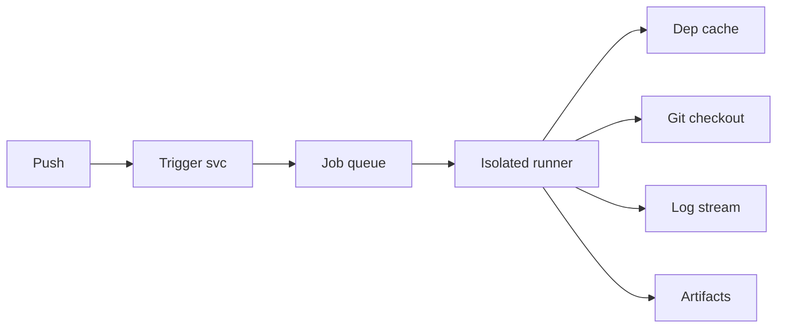
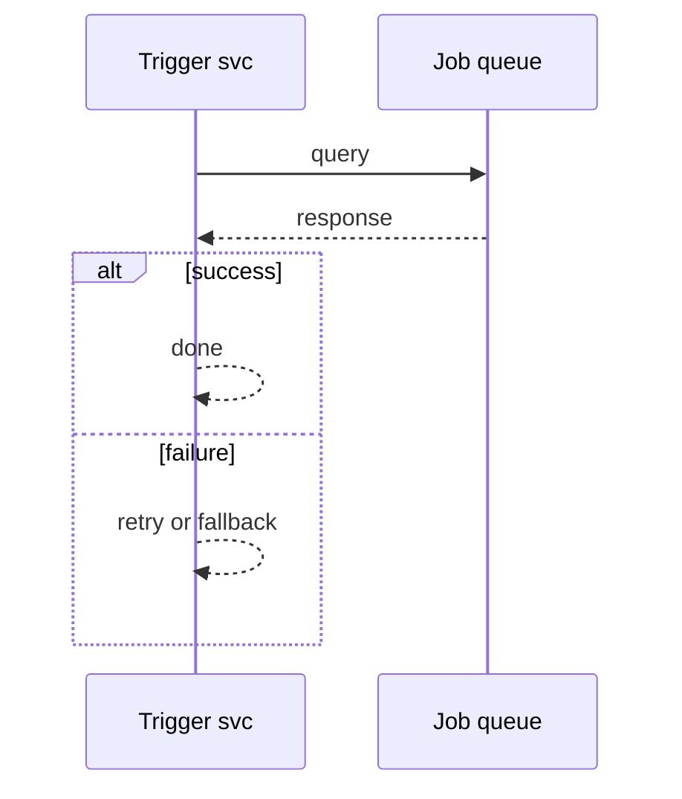
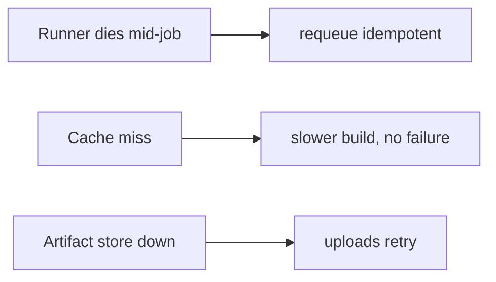

# Case Study: Continuous Integration Platform

> **Tier:** advanced · **Status:** complete · Original numbers and diagrams.

## 1. Problem statement

On a code push, run builds, tests, and artifacts across many jobs and runners — a bursty, isolated-execution, queue-driven system.

This system sits at the intersection of distributed systems and operational reliability. The design must balance the latency versus durability trade-off inherent to the workload while ensuring no single component failure cascades into a full outage. The target audience includes both engineers building the system and operators maintaining it, so the design must be observable, debuggable, and reversible at every step.
## 2. Scope

In (v1): trigger on push, run jobs in isolated runners, cache deps, report results. Out: CD deploy, hosted runners marketplace (stage).

The scope boundary is deliberate: including too much in v1 risks shipping a system that is broad but shallow. Each excluded feature is a candidate for a later iteration once the core loop is proven in production and the team has operational confidence in the baseline architecture.
## 3. Functional requirements

- Trigger jobs on push/PR. - Run jobs in isolated, ephemeral runners. - Cache dependencies. - Report pass/fail + logs.

These requirements drive the architecture: the read-heavy pattern pushes toward caching and replication; the durability requirement forces synchronous writes on the critical path; the idempotency requirement means every write path must handle redelivery without double-application. Each requirement has a direct architectural consequence.
## 4. Non-functional requirements

- Job start latency < 30 s. - Isolation between jobs. - Availability 99.9% (CI lags releases, doesn't lose code).

The non-functional targets shape every component choice: the latency SLO forces edge caching and limits synchronous cross-region calls on the hot path; the availability target drives redundancy (RF=3, multi-AZ); the durability target forces synchronous replication on committed writes; the cost target constrains the model size and prevents over-provisioning.
## 5. Explicit assumptions

1. 10M builds/month, bursty on weekdays. [assumption] 2. Avg job 5 min, 2 CPU. [assumption] 3. Runners autoscaled. [constraint]

These assumptions are the load-bearing facts of the design. If any assumption is wrong by an order of magnitude, the architecture must adapt: 10x more traffic may require sharding earlier; 10x more data may require tiering sooner; a different read-write ratio may change the caching strategy entirely. The design is parameterized by these assumptions, not locked to them.
## 6. Traffic estimation

Bursty: spikes on weekday mornings/PR merges; quiet off-hours. Queue depth drives autoscaling.

The traffic estimate reveals the binding constraint. For this workload, the binding resource is compute or storage or bandwidth (as noted above). Peak is modeled at 10x average, which is conservative for viral workloads but aggressive for steady-state enterprise systems. The read-write ratio determines whether the system is cache-dominated (read-heavy) or write-path-dominated (write-heavy), which changes the entire storage and replication strategy.
## 7. Storage estimation

Build artifacts + logs; caches per repo. Grows; tier old artifacts.

Storage growth is linear with time and must be planned with retention in mind. The estimate includes metadata and index overhead (typically 20-30 percent above raw data). Without a retention policy, storage grows unboundedly and cost becomes unsustainable. The design includes tiering (hot to cold) and lifecycle rules to manage this growth automatically.
## 8. Bandwidth estimation

Pulling deps + repos; pushing artifacts. Bandwidth moderate; isolation matters more.

Bandwidth is often not the binding constraint for this workload, but it becomes significant at the network edge during viral spikes. The design uses CDN and edge caching to cut origin egress; co-location of compute and data reduces inter-node traffic; and compression (for logs, telemetry, and bulk transfers) cuts bandwidth by 50-80 percent where applicable.
## 9. API design

webhook on push -> enqueue jobs; runner pulls job; logs streamed; results posted.

The API design follows REST conventions for external clients and gRPC for internal service-to-service communication where throughput matters. Every write endpoint accepts an idempotency key so retries from unreliable clients do not double-apply. Streaming endpoints use Server-Sent Events (SSE) for token-by-token LLM output or chunked transfer for large payloads. Rate limiting is enforced at the gateway before the request reaches the service tier.
## 10. Data model

jobs(id, repo, commit, status, logs); runners(id, status); caches(repo, key, blob); artifacts(job, blob).

The data model is designed around the access pattern, not the entity shape. The primary access path (key lookup by ID) determines the partition key; the secondary access paths (by timestamp, by owner, by status) determine the indexes. Denormalization is applied selectively where the hot read path would otherwise require expensive joins, with CDC or the outbox pattern keeping the denormalized view consistent with the normalized source of truth.
## 11. High-level architecture

## 12. Request flow

Push triggers jobs enqueued -> autoscaled runner pulls a job -> checks out code (cache deps) -> runs -> streams logs -> uploads artifacts -> posts result.

The request flow reveals the critical path: any component on the hot path that fails or slows degrades the user experience. The design identifies this path explicitly and applies timeouts, circuit breakers, and bulkheads to each hop. The write path includes an idempotency check (by key) before any state mutation, ensuring redelivery safety. The read path serves from cache first, falling back to the authoritative store only on miss.
## 13. Component responsibilities

Trigger svc, job queue, runner pool (autoscaled), cache, log store, artifact store.

Each component has a single, well-defined responsibility. The gateway handles auth, rate limiting, and routing; the service tier is stateless and horizontally scalable; the data tier is the stateful core, carefully partitioned and replicated. The separation allows each tier to scale independently: the stateless tiers add replicas with demand; the stateful tier scales by sharding or read replicas, not by adding arbitrary instances.
## 14. Database selection

Queue (job dispatch); KV/object for logs + artifacts + caches. Runners ephemeral. Rejected: shared runner host (isolation loss).

The database choice is driven by the access pattern, not by familiarity. The rejected alternatives were rejected for specific reasons: a relational database was rejected if the workload is a single key lookup at massive scale (a KV store is simpler and cheaper); a KV store was rejected if the workload needs joins and transactions (a relational store gives ACID); a search engine was not chosen as the primary store because it is a derived, eventually-consistent projection, not a source of truth.
## 15. Caching strategy

Per-repo dependency cache keyed by lockfile hash — major build-speed win.

The caching strategy is designed around the staleness tolerance of the workload. Cache-aside is the default (simple, lazy); write-through is used where read-after-write consistency is required; write-behind is used only where durability can be deferred. Stampede protection (request coalescing or stale-while-revalidate) is applied to any key that can go viral. Cache entries are namespaced by tenant where multi-tenancy applies, preventing cross-tenant leakage.
## 16. Partitioning strategy

Jobs partitioned by runner capacity; queue by repo for fairness.

The partition key is chosen to co-locate related data (so queries do not fan out) while distributing load evenly (so no shard is hot). Consistent hashing with virtual nodes is used to minimize data movement when nodes are added or removed. A hot key (a viral entity or a giant tenant) is mitigated by caching, extra replication, or key splitting -- not by adding more shards, which does not help a single hot key.
## 17. Replication strategy

Logs/artifacts durable (object storage). Runners stateless/ephemeral; a dead job is retried (idempotent).

Replication is synchronous on the write-confirmation path where durability is critical (the commit waits for at least one follower) and asynchronous elsewhere for throughput. The replication factor of 3 tolerates one failure while maintaining quorum. Failover is tested (not just configured): a follower that was never promoted will fail when you need it most. Cross-region replication is asynchronous with a documented RPO.
## 18. Consistency model

Job results eventually consistent with the commit; a retried job may run twice (idempotent side-effect-free tests).

The consistency model is chosen as the weakest that users can tolerate, because stronger consistency costs latency and availability. Read-your-writes is provided where the user expects to see their own write immediately (by routing to the leader or via a session token). Eventual consistency is bounded (seconds, not unbounded) and monitored. The system documents what eventual means to users, rather than hiding it.
## 19. Failure scenarios

Runner dies mid-job -> requeue (idempotent). Cache miss -> slower build, no failure. Artifact store down -> uploads retry.

Each failure scenario has a documented response: which component detects it, how failover happens (automatic vs manual), what the user experiences (degraded vs error), and how recovery is verified. The design principle is that a single failure should degrade, not cascade; bulkheads and circuit breakers prevent one slow dependency from exhausting shared resources. Cascading failure is the most dangerous mode and is prevented by timeouts on every outbound call.
## 20. Reliability strategy

SLI job start latency, success; SLO 99.9%. Idempotent jobs + retries. Chaos: kill a runner, assert requeue + no lost result.

The SLO defines what good means measurably; the error budget (1 - SLO) is the allowed unavailability that can be spent on deploys and feature risk. When the budget is nearly exhausted, risky changes are frozen. The system is tested with chaos engineering (kill a node, add latency, drop traffic) to verify the resilience assumptions hold. An untested failover is not a failover; an untested backup is not a backup.
## 21. Security considerations

Strong job isolation (container/VM); secret injection per job; no cross-repo cache leakage; runner egress controls.

Security is defense in depth: TLS in transit, encryption at rest, RBAC with default-deny, PII redaction in logs, audit trails for every state-changing operation, and per-tenant isolation. For AI-augmented systems, the policy gateway is fail-closed: on any error, the system refuses to act rather than allowing an unguarded action. High-risk operations (firmware changes, routing changes, firewall changes) require human approval, never autonomous execution.
## 22. Observability strategy

Queue depth, runner utilization, job duration p50/p99, cache hit ratio, failure rate by repo.

Observability uses the three signals (logs, metrics, traces) with correlation IDs to stitch a request across services. The golden signals (latency, traffic, errors, saturation) are the first dashboard; RED and USE methods provide service-level and resource-level views respectively. Alerts fire on SLO burn rate, not on raw thresholds, to avoid noise. The on-call runbook for each alert is tested, not theoretical.
## 23. Cost considerations

Runners (autoscaled, bursty) + storage (artifacts/logs) dominate. Cache hits cut runner cost; tier old artifacts.

Cost is dominated by the binding resource identified in the traffic estimate. The primary levers are: caching (cuts read cost), tiering (cuts storage cost), batching (cuts per-request overhead), and right-sizing (no over-provisioned idle capacity). Cost is tracked as a first-class metric (cost per request, cost per tenant, cost per outcome) and alerted on when unit cost spikes.
## 24. Scaling stages

Stage 1: queue + runners. -> Stage 2: autoscaling + dep caching. -> Stage 3: hosted runners, flaky-test detection. -> Stage 4: multi-region, predictive pre-warm.

The scaling stages are triggered by specific thresholds, not by calendar. Stage 1 (single region) handles initial load; Stage 2 (sharding, read replicas) is triggered when a single node saturates; Stage 3 (multi-region) is triggered when latency to distant users exceeds the SLO; Stage 4 (edge, viral-key handling) is triggered when hot keys or viral spikes threaten the origin. Each stage is a deliberate architectural change, not a knob to turn.
## 25. Trade-offs

Isolation (safety) vs runner density (cost). Cache (speed) vs storage. Autoscale (cost) vs cold start (latency).

Every trade-off has a rejected alternative with a reason. The design does not present one option as universally correct; it presents the chosen option, the rejected alternative, and the workload-specific reason for the choice. This is what makes the design defensible in a review: the reviewer can challenge any decision and find the reasoning documented, not hand-waved.
## 26. Alternative designs

Shared runner hosts (isolation loss). No cache (slow, costly). Static runner pool (can't handle bursts).

The alternative designs are not strawmen; they are genuine architectures that would work under different constraints. They were rejected for this workload because of specific requirements (latency SLO, cost budget, consistency need) that make them inferior here but not universally inferior. Understanding why an alternative was rejected is as important as understanding why the chosen design was selected.
## 27. Interview discussion points

Clarify burstiness, isolation, caching. Surface queue + ephemeral runners + dep caching.

In an interview, the strongest candidates clarify ambiguity before designing, surface the read-write ratio and the binding resource, design the hot path deeply (not just draw boxes), discuss failure modes explicitly, and offer an alternative with a reason. The weakest candidates draw boxes before clarifying scope, name a vendor product as the architecture, and skip failure modes entirely.
## 28. Original Mermaid diagrams

Standalone sources under `diagrams/case-studies/ci-platform/`: `context.mmd`, `request-sequence.mmd`, `failure-flow.mmd`, `scaling-evolution.mmd`. Request sequence and failure flow:

## 29. Further reading

Queues: Level 2; isolation/containers: Level 9; caching: Level 2.

The further reading cites primary sources (RFCs, papers, official documentation) via stable IDs in SOURCES.md, not secondary blog posts or vendor marketing. Each citation is chosen because it is the authoritative source for a specific technical claim in the chapter, not because it is a general reference.
## 30. Practical exercises

1. Flaky-test detection. 2. Cache invalidation on dep changes. 3. Multi-arch builds. 4. Burst autoscaling without cost runaway. 5. Cross-region artifact sharing.

---
Previous: Code-hosting platform · Next: API gateway

The exercises are designed to push the reader beyond the v1 design: re-estimating at 10x scale reveals capacity limits; adding a new requirement (expiry, E2E, multi-region) forces an architectural change; designing the failover test reveals whether the resilience claims are real. The exercises are open-ended because system design is about reasoning, not memorization.
