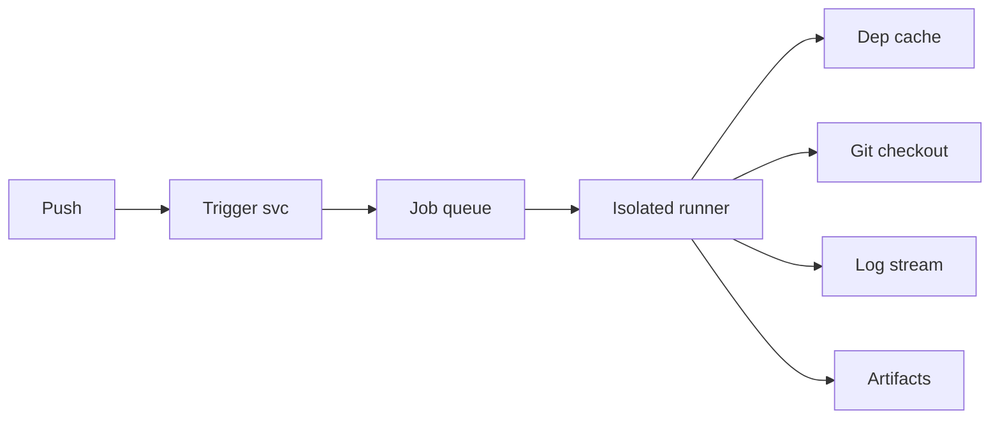
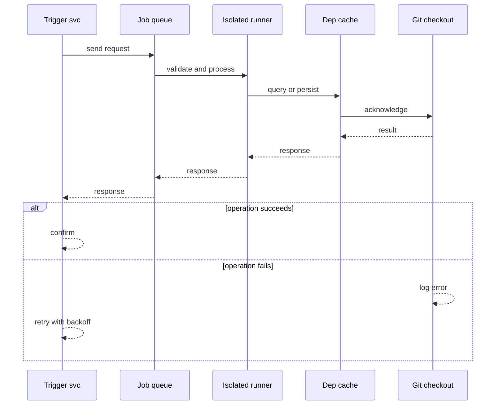
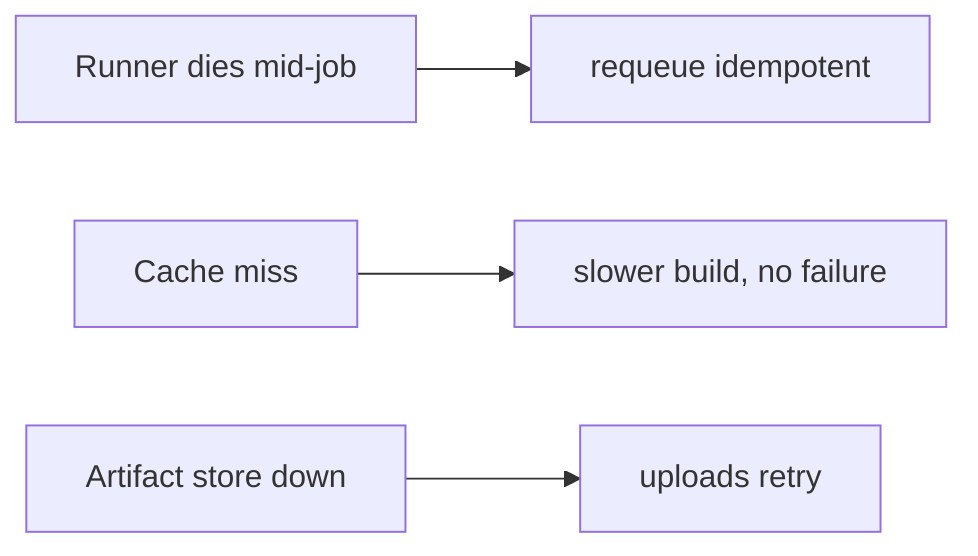
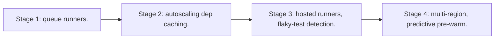

# Case Study: Continuous Integration Platform

> **Tier:** advanced · **Status:** complete · Original numbers and diagrams.

## 1. Problem statement

On a code push, run builds, tests, and artifacts across many jobs and runners — a bursty, isolated-execution, queue-driven system.

## 2. Scope

In (v1): trigger on push, run jobs in isolated runners, cache deps, report results. Out: CD deploy, hosted runners marketplace (stage).

## 3. Functional requirements

- Trigger jobs on push/PR.
- Run jobs in isolated, ephemeral runners.
- Cache dependencies.
- Report pass/fail + logs.

## 4. Non-functional requirements

- Job start latency < 30 s.
- Isolation between jobs.
- Availability 99.9% (CI lags releases, doesn't lose code).

## 5. Explicit assumptions

1. 10M builds/month, bursty on weekdays. [assumption] 2. Avg job 5 min, 2 CPU. [assumption] 3. Runners autoscaled. [constraint]

## 6. Traffic estimation

Bursty: spikes on weekday mornings/PR merges; quiet off-hours. Queue depth drives autoscaling.

## 7. Storage estimation

Build artifacts + logs; caches per repo. Grows; tier old artifacts.

## 8. Bandwidth estimation
Pulling deps + repos; pushing artifacts. Bandwidth moderate; isolation matters more.

## 9. API design

webhook on push -> enqueue jobs; runner pulls job; logs streamed; results posted.

## 10. Data model

jobs(id, repo, commit, status, logs); runners(id, status); caches(repo, key, blob); artifacts(job, blob).

## 11. High-level architecture

## 12. Request flow
Push triggers jobs enqueued -> autoscaled runner pulls a job -> checks out code (cache deps) -> runs -> streams logs -> uploads artifacts -> posts result.

## 13. Component responsibilities

Trigger svc, job queue, runner pool (autoscaled), cache, log store, artifact store.

## 14. Database selection

Queue (job dispatch); KV/object for logs + artifacts + caches. Runners ephemeral. Rejected: shared runner host (isolation loss).

## 15. Caching strategy

Per-repo dependency cache keyed by lockfile hash — major build-speed win.

## 16. Partitioning strategy

Jobs partitioned by runner capacity; queue by repo for fairness.

## 17. Replication strategy

Logs/artifacts durable (object storage). Runners stateless/ephemeral; a dead job is retried (idempotent).

## 18. Consistency model

Job results eventually consistent with the commit; a retried job may run twice (idempotent side-effect-free tests).

## 19. Failure scenarios
Runner dies mid-job -> requeue (idempotent). Cache miss -> slower build, no failure. Artifact store down -> uploads retry.

## 20. Reliability strategy

SLI job start latency, success; SLO 99.9%. Idempotent jobs + retries. Chaos: kill a runner, assert requeue + no lost result.

## 21. Security considerations

Strong job isolation (container/VM); secret injection per job; no cross-repo cache leakage; runner egress controls.

## 22. Observability strategy

Queue depth, runner utilization, job duration p50/p99, cache hit ratio, failure rate by repo.

## 23. Cost considerations

Runners (autoscaled, bursty) + storage (artifacts/logs) dominate. Cache hits cut runner cost; tier old artifacts.

## 24. Scaling stages
Stage 1: queue + runners. -> Stage 2: autoscaling + dep caching. -> Stage 3: hosted runners, flaky-test detection. -> Stage 4: multi-region, predictive pre-warm.

## 25. Trade-offs

Isolation (safety) vs runner density (cost). Cache (speed) vs storage. Autoscale (cost) vs cold start (latency).

## 26. Alternative designs

Shared runner hosts (isolation loss). No cache (slow, costly). Static runner pool (can't handle bursts).

## 27. Interview discussion points

Clarify burstiness, isolation, caching. Surface queue + ephemeral runners + dep caching.

## 28. Original Mermaid diagrams
Standalone sources under `diagrams/case-studies/ci-platform/`: `context.mmd`, `request-sequence.mmd`, `failure-flow.mmd`, `scaling-evolution.mmd`. The diagrams are embedded in their respective sections: architecture in section 11, request flow in section 12, failure scenarios in section 19, and scaling stages in section 24.

## 29. Further reading
Queues: Level 2; isolation/containers: Level 9; caching: Level 2. Sources: `S-CHASH` `S-DYNAMO`.

## 30. Practical exercises

1. Flaky-test detection. 2. Cache invalidation on dep changes. 3. Multi-arch builds. 4. Burst autoscaling without cost runaway. 5. Cross-region artifact sharing.

---
Previous: Code-hosting platform · Next: API gateway

