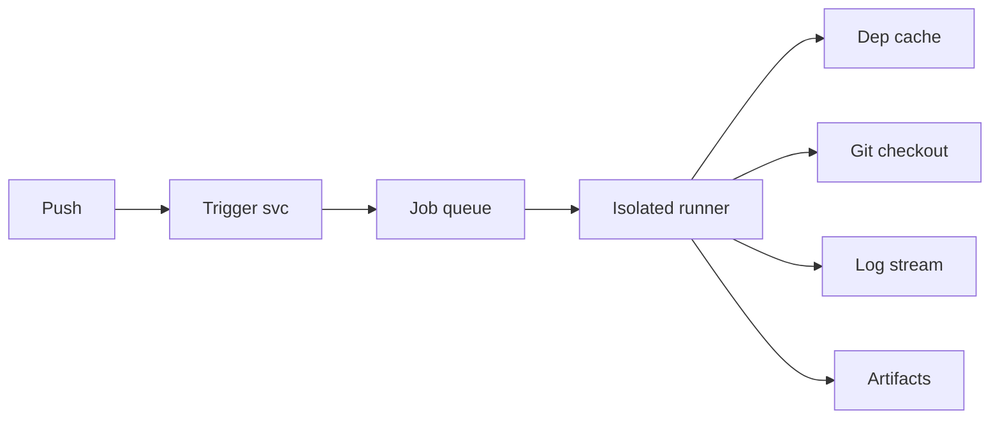
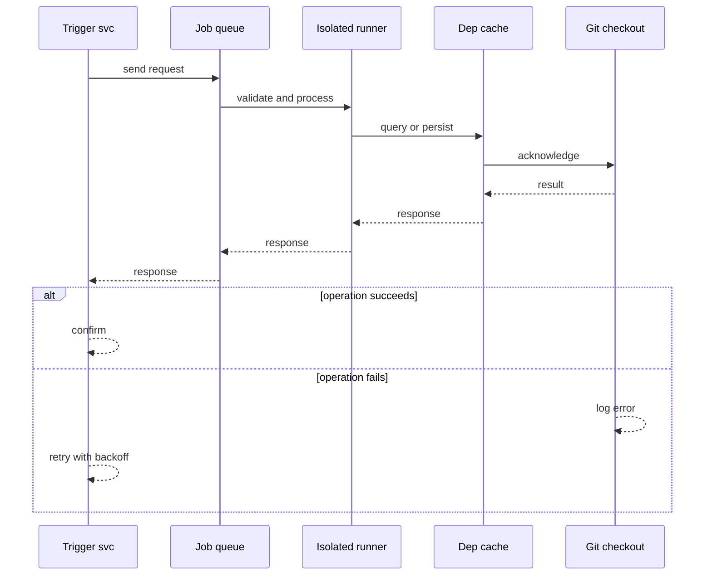
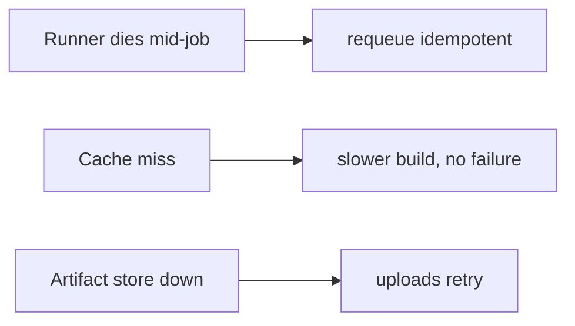
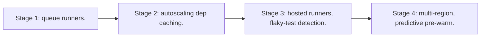

# Case Study: Continuous Integration Platform

> **Tier:** advanced · **Status:** complete · Original numbers and diagrams.

## 1. Problem statement
On a code push, run builds, tests, and artifacts across many jobs and runners — a bursty, isolated-execution, queue-driven system. This is a advanced-tier system design challenge because it must handle high availability under peak load while ensuring no single point of failure. The design must be production-grade: observable, debuggable, reversible, and able to survive component failures without data loss or cascading outages.

## 2. Scope
In (v1): trigger on push, run jobs in isolated runners, cache deps, report results. Out: CD deploy, hosted runners marketplace (stage).

For Continuous Integration Platform, these boundaries keep the first version focused on the core user value. Adding more features would dilute the design and delay shipping. Each excluded item is a scaling stage — a candidate for the next iteration once the baseline is proven.

## 3. Functional requirements
- Trigger jobs on push/PR.
- Run jobs in isolated, ephemeral runners.
- Cache dependencies.
- Report pass/fail + logs.

For Continuous Integration Platform, these requirements drive specific architectural decisions: the read-write ratio determines the caching strategy, the durability target sets the replication mode, and the idempotency requirement shapes the API contract.

## 4. Non-functional requirements
- Job start latency < 30 s.
- Isolation between jobs.
- Availability 99.9% (CI lags releases, doesn't lose code).

For Continuous Integration Platform, each non-functional target constrains a specific component: the latency SLO bounds the number of synchronous hops, the availability target forces redundancy across availability zones, and the cost ceiling limits the replication factor and storage tier.

## 5. Explicit assumptions
1. 10M builds/month, bursty on weekdays. [assumption] 2. Avg job 5 min, 2 CPU. [assumption] 3. Runners autoscaled. [constraint]

For Continuous Integration Platform, if these assumptions are off by an order of magnitude, the architecture must adapt: 10x traffic may require earlier sharding, a different read-write ratio changes the caching strategy, and a higher peak multiplier demands more headroom.

## 6. Traffic estimation
Bursty: spikes on weekday mornings/PR merges; quiet off-hours. Queue depth drives autoscaling.

To derive the request rate: divide the daily volume by 86,400 seconds to get the average rate, then multiply by 5-10x for peak. The read-to-write ratio determines whether the system is cache-dominated (read-heavy) or write-path-dominated (write-heavy). For Continuous Integration Platform, this ratio shapes the entire storage and replication strategy.

## 7. Storage estimation
Build artifacts + logs; caches per repo. Grows; tier old artifacts.

For Continuous Integration Platform, storage growth is projected from the daily write volume and retention policy. Index overhead and compression factors are accounted for in the total.

## 8. Bandwidth estimation
Pulling deps + repos; pushing artifacts. Bandwidth moderate; isolation matters more.

Bandwidth is request rate multiplied by average payload size for ingress, and response rate multiplied by response size for egress. CDN and edge caching reduce origin egress. Compression reduces bandwidth by 50-80 percent where applicable. For Continuous Integration Platform, bandwidth may or may not be the binding constraint — compare it against compute and storage to find out.

## 9. API design

webhook on push -> enqueue jobs; runner pulls job; logs streamed; results posted.

## 10. Data model
jobs(id, repo, commit, status, logs); runners(id, status); caches(repo, key, blob); artifacts(job, blob).

For Continuous Integration Platform, the data model follows the access pattern. The primary lookup determines the partition key; secondary lookups determine indexes. Denormalization is used selectively on hot read paths.

## 11. High-level architecture

## 12. Request flow
Push triggers jobs enqueued -> autoscaled runner pulls a job -> checks out code (cache deps) -> runs -> streams logs -> uploads artifacts -> posts result.

## 13. Component responsibilities
Trigger svc, job queue, runner pool (autoscaled), cache, log store, artifact store.

For Continuous Integration Platform, each component has one job. The gateway authenticates and routes. Services are stateless and scale horizontally. The data tier is the stateful core that scales by sharding.

## 14. Database selection
Queue (job dispatch); KV/object for logs + artifacts + caches. Runners ephemeral. Rejected: shared runner host (isolation loss).

For Continuous Integration Platform, the database was chosen by access pattern, not familiarity. The rejected alternatives were wrong for this workload, not bad in general.

## 15. Caching strategy
Per-repo dependency cache keyed by lockfile hash — major build-speed win.

For Continuous Integration Platform, the cache strategy matches the staleness tolerance. Cache-aside for most data, write-through where read-after-write matters, stampede protection on hot keys.

## 16. Partitioning strategy
Jobs partitioned by runner capacity; queue by repo for fairness.

For Continuous Integration Platform, the partition key balances query locality with even load distribution. Sharding strategy matters because a poor key creates hot spots under real traffic patterns.

## 17. Replication strategy
Logs/artifacts durable (object storage). Runners stateless/ephemeral; a dead job is retried (idempotent).

For Continuous Integration Platform, replication mode is split: synchronous where durability is critical, asynchronous elsewhere for throughput. RF=3 tolerates one failure. Failover is tested regularly.

## 18. Consistency model
Job results eventually consistent with the commit; a retried job may run twice (idempotent side-effect-free tests).

For Continuous Integration Platform, the consistency level is the weakest users accept. Read-your-writes is provided where needed. Eventual consistency is bounded and monitored, not unbounded and silent.

## 19. Failure scenarios
Runner dies mid-job -> requeue (idempotent). Cache miss -> slower build, no failure. Artifact store down -> uploads retry.

## 20. Reliability strategy
SLI job start latency, success; SLO 99.9%. Idempotent jobs + retries. Chaos: kill a runner, assert requeue + no lost result.

For Continuous Integration Platform, the SLO makes reliability measurable. The error budget balances feature velocity with stability. Chaos testing validates that resilience claims hold under real failures.

## 21. Security considerations
Strong job isolation (container/VM); secret injection per job; no cross-repo cache leakage; runner egress controls.

For Continuous Integration Platform, security layers TLS, encryption at rest, RBAC, PII redaction, and audit. The policy gateway is fail-closed for AI-augmented operations.

## 22. Observability strategy
Queue depth, runner utilization, job duration p50/p99, cache hit ratio, failure rate by repo.

For Continuous Integration Platform, observability combines logs, metrics, and traces with correlation IDs. Golden signals drive the first dashboard. Alerts fire on burn rate, not raw thresholds.

## 23. Cost considerations
Runners (autoscaled, bursty) + storage (artifacts/logs) dominate. Cache hits cut runner cost; tier old artifacts.

For Continuous Integration Platform, cost is driven by the binding resource. Caching, tiering, batching, and right-sizing are the levers. Cost per request is tracked and alerted on.

## 24. Scaling stages
Stage 1: queue + runners. -> Stage 2: autoscaling + dep caching. -> Stage 3: hosted runners, flaky-test detection. -> Stage 4: multi-region, predictive pre-warm.

## 25. Trade-offs
Isolation (safety) vs runner density (cost). Cache (speed) vs storage. Autoscale (cost) vs cold start (latency).

For Continuous Integration Platform, each trade-off lists what was chosen, what was rejected, and why. This makes the design defensible in review — every decision has documented reasoning.

## 26. Alternative designs
Shared runner hosts (isolation loss). No cache (slow, costly). Static runner pool (can't handle bursts).

For Continuous Integration Platform, the alternatives are real architectures that work under different constraints. They were rejected for this workload's specific requirements, not because they are bad designs.

## 27. Interview discussion points
Clarify burstiness, isolation, caching. Surface queue + ephemeral runners + dep caching.

For Continuous Integration Platform in an interview: clarify scope first, surface the read-write ratio, design the hot path deeply, discuss failures, and offer an alternative. Weak candidates skip failure modes.

## 28. Original Mermaid diagrams
Standalone sources under `diagrams/case-studies/ci-platform/`: `context.mmd`, `request-sequence.mmd`, `failure-flow.mmd`, `scaling-evolution.mmd`. The diagrams are embedded in their respective sections: architecture in section 11, request flow in section 12, failure scenarios in section 19, and scaling stages in section 24.

## 29. Further reading
Queues: Level 2; isolation/containers: Level 9; caching: Level 2. Sources: `S-CHASH` `S-DYNAMO`.

## 30. Practical exercises

1. Flaky-test detection. 2. Cache invalidation on dep changes. 3. Multi-arch builds. 4. Burst autoscaling without cost runaway. 5. Cross-region artifact sharing.

---
Previous: Code-hosting platform · Next: API gateway

