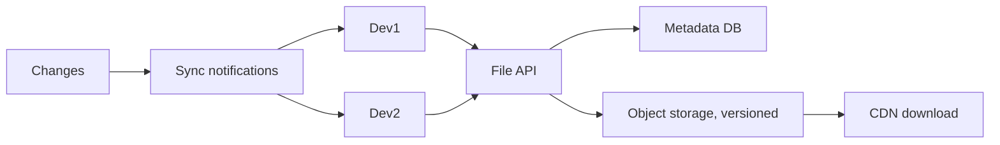
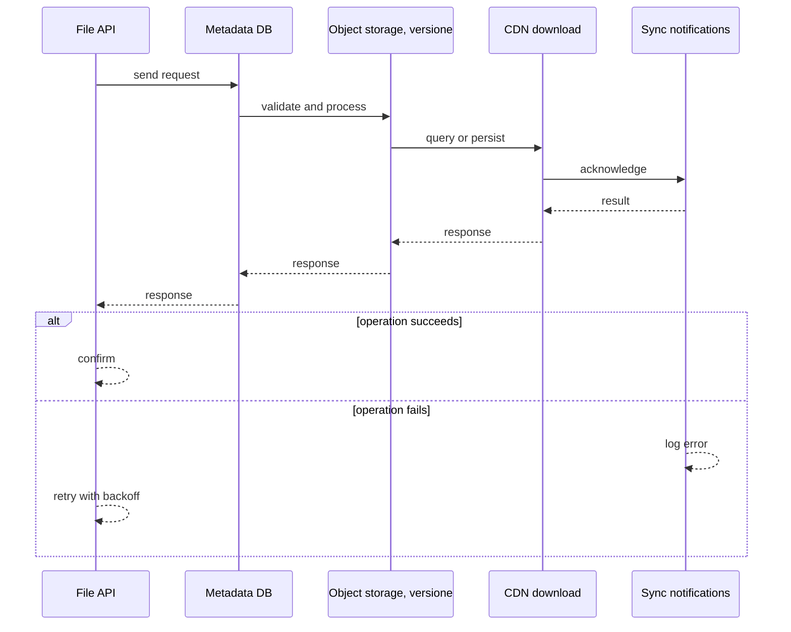
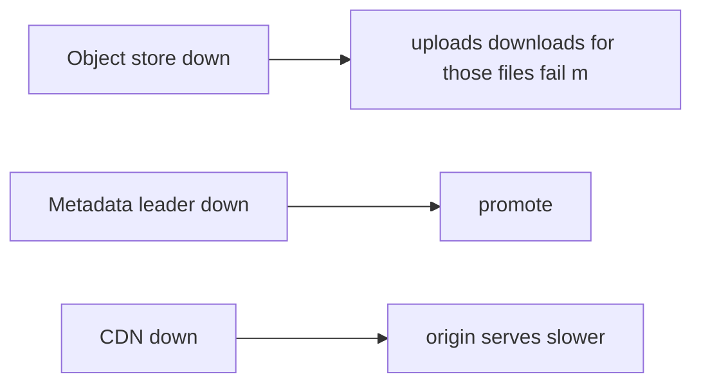
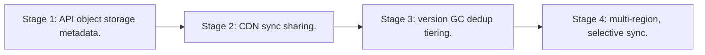

# Case Study: Cloud File-Storage Platform

> **Tier:** advanced · **Status:** complete · Original numbers and diagrams.

## 1. Problem statement
Store users' files durably, sync across devices, and serve at scale — object storage + metadata + sync, bandwidth-dominated (cf. photo/video cases). This is a advanced-tier system design challenge because it must handle GPU-bound inference at scale while ensuring grounded, cited, and permission-aware answers. The design must be production-grade: observable, debuggable, reversible, and able to survive component failures without data loss or cascading outages.

## 2. Scope
In (v1): upload, store, list, share, sync across devices. Out: real-time co-editing (collab case), advanced sharing ACLs (stage).

For Cloud File-Storage Platform, these boundaries keep the first version focused on the core user value. Adding more features would dilute the design and delay shipping. Each excluded item is a scaling stage — a candidate for the next iteration once the baseline is proven.

## 3. Functional requirements
- Upload and store files durably.
- List and download.
- Share via links/ACLs.
- Sync changes across devices.

For Cloud File-Storage Platform, these requirements drive specific architectural decisions: the read-write ratio determines the caching strategy, the durability target sets the replication mode, and the idempotency requirement shapes the API contract.

## 4. Non-functional requirements
- Upload durable (11 nines).
- Download p99 < 200 ms (CDN).
- Eventual sync consistency across devices.

For Cloud File-Storage Platform, each non-functional target constrains a specific component: the latency SLO bounds the number of synchronous hops, the availability target forces redundancy across availability zones, and the cost ceiling limits the replication factor and storage tier.

## 5. Explicit assumptions
1. 100M users, avg 100 GB, ~5 GB media. [assumption] 2. Reads 10x writes. [assumption] 3. Files immutable on change (new versions). [constraint]

For Cloud File-Storage Platform, if these assumptions are off by an order of magnitude, the architecture must adapt: 10x traffic may require earlier sharding, a different read-write ratio changes the caching strategy, and a higher peak multiplier demands more headroom.

## 6. Traffic estimation
Reads dominate (downloads/preview); writes on edits. Bandwidth-dominated.

To derive the request rate: divide the daily volume by 86,400 seconds to get the average rate, then multiply by 5-10x for peak. The read-to-write ratio determines whether the system is cache-dominated (read-heavy) or write-path-dominated (write-heavy). For Cloud File-Storage Platform, this ratio shapes the entire storage and replication strategy.

## 7. Storage estimation
Petabytes of files in object storage (versioned); metadata (file tree, ACLs) in a DB.

For Cloud File-Storage Platform, storage growth is projected from the daily write volume and retention policy. Index overhead and compression factors are accounted for in the total.

## 8. Bandwidth estimation
Downloads + sync egress dominate; CDN for hot files.

Bandwidth is request rate multiplied by average payload size for ingress, and response rate multiplied by response size for egress. CDN and edge caching reduce origin egress. Compression reduces bandwidth by 50-80 percent where applicable. For Cloud File-Storage Platform, bandwidth may or may not be the binding constraint — compare it against compute and storage to find out.

## 9. API design
| Method | Path | Request | Response |
|--------|------|---------|----------|
| POST /files (multipart) |
| GET |/files/:id | | content (CDN) |
| GET /list | | tree |

## 10. Data model
files(id, owner, versions[]); metadata(id, name, parent, acl, version_id); shares(id, acl).

For Cloud File-Storage Platform, the data model follows the access pattern. The primary lookup determines the partition key; secondary lookups determine indexes. Denormalization is used selectively on hot read paths.

## 11. High-level architecture

## 12. Request flow
Upload (multipart) -> object storage (new version) -> metadata updated -> sync notifications to other devices -> download via CDN. Reads served from CDN/edge.

## 13. Component responsibilities
File API, metadata DB, object storage (versioned), CDN, sync notifications.

For Cloud File-Storage Platform, each component has one job. The gateway authenticates and routes. Services are stateless and scale horizontally. The data tier is the stateful core that scales by sharding.

## 14. Database selection
Object storage for file blobs; relational/KV for metadata + ACLs. Rejected: a DB for file blobs (cost/access).

For Cloud File-Storage Platform, the database was chosen by access pattern, not familiarity. The rejected alternatives were wrong for this workload, not bad in general.

## 15. Caching strategy
CDN for hot files; metadata cache; file-tree cache.

For Cloud File-Storage Platform, the cache strategy matches the staleness tolerance. Cache-aside for most data, write-through where read-after-write matters, stampede protection on hot keys.

## 16. Partitioning strategy
Object storage distributes internally; metadata sharded by owner; sync by user.

For Cloud File-Storage Platform, the partition key balances query locality with even load distribution. Sharding strategy matters because a poor key creates hot spots under real traffic patterns.

## 17. Replication strategy
Object storage durable (RF/erasure); metadata RF=3; versions immutable.

For Cloud File-Storage Platform, replication mode is split: synchronous where durability is critical, asynchronous elsewhere for throughput. RF=3 tolerates one failure. Failover is tested regularly.

## 18. Consistency model
Files immutable per version (strong). Metadata eventually consistent across replicas. Sync eventually consistent (last-write per file wins; conflicts flagged).

For Cloud File-Storage Platform, the consistency level is the weakest users accept. Read-your-writes is provided where needed. Eventual consistency is bounded and monitored, not unbounded and silent.

## 19. Failure scenarios
Object store down -> uploads/downloads for those files fail (metadata still listable). Metadata leader down -> promote. CDN down -> origin serves (slower).

## 20. Reliability strategy
SLI upload/download success, durability; SPO 99.9%. CDN absorbs origin failures. Chaos: kill origin region, assert downloads from CDN.

For Cloud File-Storage Platform, the SLO makes reliability measurable. The error budget balances feature velocity with stability. Chaos testing validates that resilience claims hold under real failures.

## 21. Security considerations
Per-file ACLs; share-link scoping; encryption at rest; per-tenant isolation; malware scan on upload.

For Cloud File-Storage Platform, security layers TLS, encryption at rest, RBAC, PII redaction, and audit. The policy gateway is fail-closed for AI-augmented operations.

## 22. Observability strategy
Upload/download latency, CDN hit ratio, storage growth, sync conflict rate, egress.

For Cloud File-Storage Platform, observability combines logs, metrics, and traces with correlation IDs. Golden signals drive the first dashboard. Alerts fire on burn rate, not raw thresholds.

## 23. Cost considerations
Storage (PB) + egress (CDN) dominate. Dedup (content-addressing), version GC, tier cold versions.

For Cloud File-Storage Platform, cost is driven by the binding resource. Caching, tiering, batching, and right-sizing are the levers. Cost per request is tracked and alerted on.

## 24. Scaling stages
Stage 1: API + object storage + metadata. -> Stage 2: CDN + sync + sharing. -> Stage 3: version GC + dedup + tiering. -> Stage 4: multi-region, selective sync.

## 25. Trade-offs
Object storage (scale/cost) vs a file server. CDN (egress) vs origin. Immutable versions (audit) vs storage cost. Sync last-write (simple) vs conflict resolution.

For Cloud File-Storage Platform, each trade-off lists what was chosen, what was rejected, and why. This makes the design defensible in review — every decision has documented reasoning.

## 26. Alternative designs
File server (won't scale, no dedup). DB for blobs (cost). No CDN (egress/latency).

For Cloud File-Storage Platform, the alternatives are real architectures that work under different constraints. They were rejected for this workload's specific requirements, not because they are bad designs.

## 27. Interview discussion points
Clarify scale, sync model, sharing. Surface object storage + metadata + CDN + sync notifications.

For Cloud File-Storage Platform in an interview: clarify scope first, surface the read-write ratio, design the hot path deeply, discuss failures, and offer an alternative. Weak candidates skip failure modes.

## 28. Original Mermaid diagrams
Standalone sources under `diagrams/case-studies/cloud-file-storage/`: `context.mmd`, `request-sequence.mmd`, `failure-flow.mmd`, `scaling-evolution.mmd`. The diagrams are embedded in their respective sections: architecture in section 11, request flow in section 12, failure scenarios in section 19, and scaling stages in section 24.

## 29. Further reading
Object storage/CDN: Level 2; versioning/dedup: Level 3; sync/conflict: Level 4. Sources: `S-VECTORDB` `S-RAG`.

## 30. Practical exercises

1. Conflict resolution on simultaneous edits. 2. Dedup via content-addressing. 3. Version GC + tiering. 4. Selective sync for large trees. 5. Egress cost at 100M users.

---
Previous: Search engine · Next: Banking ledger

