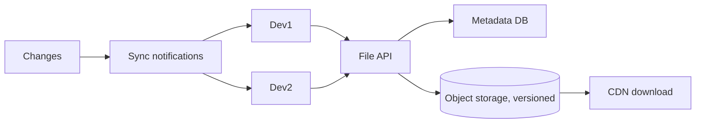
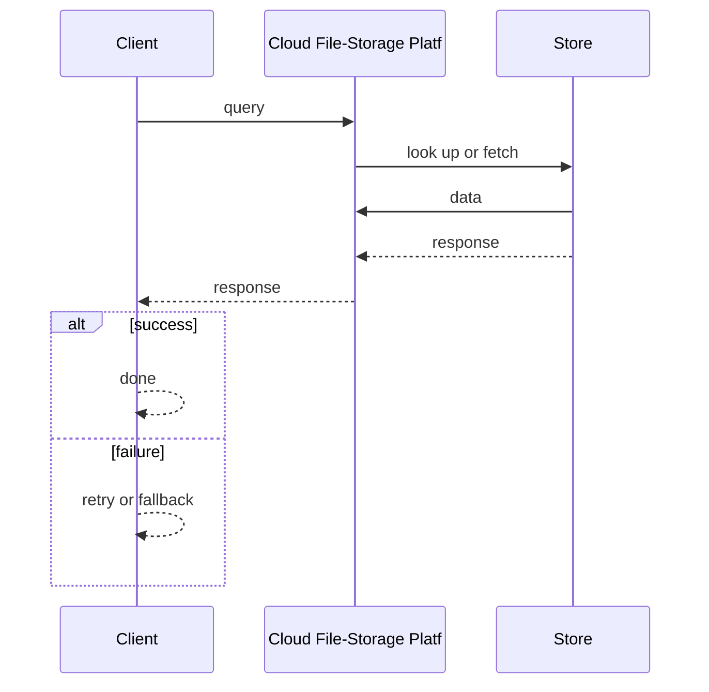
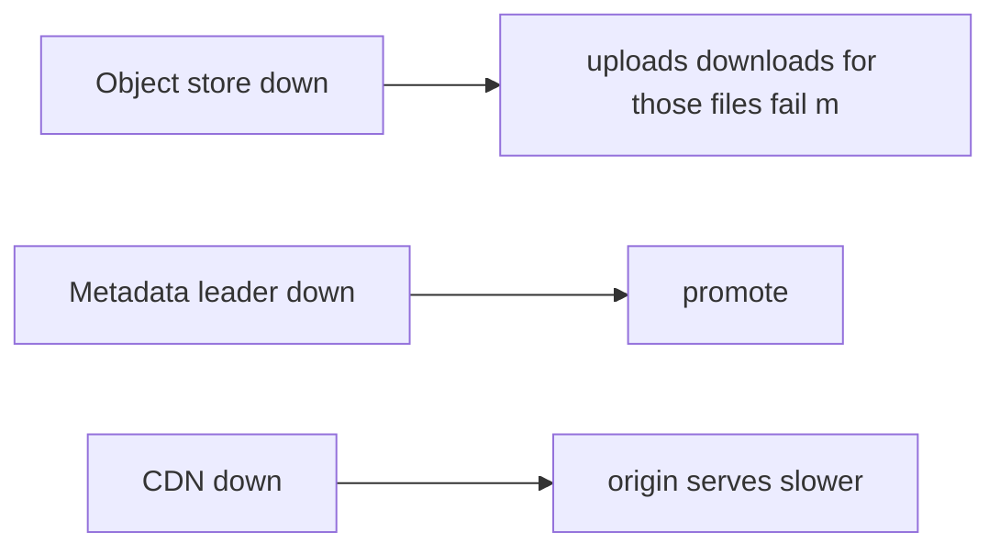

# Case Study: Cloud File-Storage Platform

> **Tier:** advanced · **Status:** complete · Original numbers and diagrams.

## 11. High-level architecture

## 28. Original Mermaid diagrams
Standalone sources under `diagrams/case-studies/cloud-file-storage/`: `context.mmd`, `request-sequence.mmd`, `failure-flow.mmd`, `scaling-evolution.mmd`. The diagrams are embedded in their respective sections: architecture in section 11, request flow in section 12, failure scenarios in section 19, and scaling stages in section 24.

## 1. Problem statement

Store users' files durably, sync across devices, and serve at scale — object storage + metadata + sync, bandwidth-dominated (cf. photo/video cases).

## 2. Scope

In (v1): upload, store, list, share, sync across devices. Out: real-time co-editing (collab case), advanced sharing ACLs (stage).

## 3. Functional requirements

- Upload and store files durably.
- List and download.
- Share via links/ACLs.
- Sync changes across devices.

## 4. Non-functional requirements

- Upload durable (11 nines).
- Download p99 < 200 ms (CDN).
- Eventual sync consistency across devices.

## 5. Explicit assumptions

1. 100M users, avg 100 GB, ~5 GB media. [assumption] 2. Reads 10x writes. [assumption] 3. Files immutable on change (new versions). [constraint]

## 6. Traffic estimation

Reads dominate (downloads/preview); writes on edits. Bandwidth-dominated.

## 7. Storage estimation

Petabytes of files in object storage (versioned); metadata (file tree, ACLs) in a DB.

## 8. Bandwidth estimation

Downloads + sync egress dominate; CDN for hot files.

## 9. API design

| POST /files (multipart) |
| file id |
| GET |/files/:id | | content (CDN) | | GET /list | | tree |

## 10. Data model

files(id, owner, versions[]); metadata(id, name, parent, acl, version_id); shares(id, acl).

## 12. Request flow
Upload (multipart) -> object storage (new version) -> metadata updated -> sync notifications to other devices -> download via CDN. Reads served from CDN/edge.

## 13. Component responsibilities

File API, metadata DB, object storage (versioned), CDN, sync notifications.

## 14. Database selection

Object storage for file blobs; relational/KV for metadata + ACLs. Rejected: a DB for file blobs (cost/access).

## 15. Caching strategy

CDN for hot files; metadata cache; file-tree cache.

## 16. Partitioning strategy

Object storage distributes internally; metadata sharded by owner; sync by user.

## 17. Replication strategy

Object storage durable (RF/erasure); metadata RF=3; versions immutable.

## 18. Consistency model

Files immutable per version (strong). Metadata eventually consistent across replicas. Sync eventually consistent (last-write per file wins; conflicts flagged).

## 19. Failure scenarios
Object store down -> uploads/downloads for those files fail (metadata still listable). Metadata leader down -> promote. CDN down -> origin serves (slower).

## 20. Reliability strategy

SLI upload/download success, durability; SPO 99.9%. CDN absorbs origin failures. Chaos: kill origin region, assert downloads from CDN.

## 21. Security considerations

Per-file ACLs; share-link scoping; encryption at rest; per-tenant isolation; malware scan on upload.

## 22. Observability strategy

Upload/download latency, CDN hit ratio, storage growth, sync conflict rate, egress.

## 23. Cost considerations

Storage (PB) + egress (CDN) dominate. Dedup (content-addressing), version GC, tier cold versions.

## 24. Scaling stages

Stage 1: API + object storage + metadata. -> Stage 2: CDN + sync + sharing. -> Stage 3: version GC + dedup + tiering. -> Stage 4: multi-region, selective sync.

## 25. Trade-offs

Object storage (scale/cost) vs a file server. CDN (egress) vs origin. Immutable versions (audit) vs storage cost. Sync last-write (simple) vs conflict resolution.

## 26. Alternative designs

File server (won't scale, no dedup). DB for blobs (cost). No CDN (egress/latency).

## 27. Interview discussion points

Clarify scale, sync model, sharing. Surface object storage + metadata + CDN + sync notifications.

## 29. Further reading

Object storage/CDN: Level 2; versioning/dedup: Level 3; sync/conflict: Level 4.

## 30. Practical exercises

1. Conflict resolution on simultaneous edits. 2. Dedup via content-addressing. 3. Version GC + tiering. 4. Selective sync for large trees. 5. Egress cost at 100M users.

---
Previous: Search engine · Next: Banking ledger

