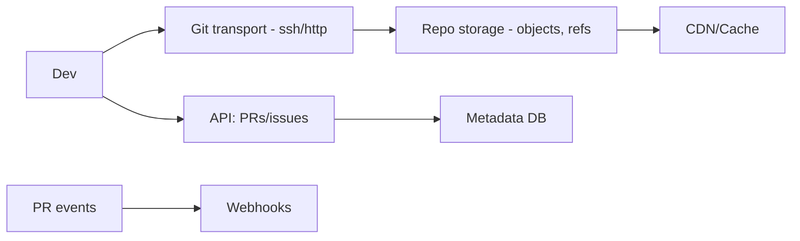
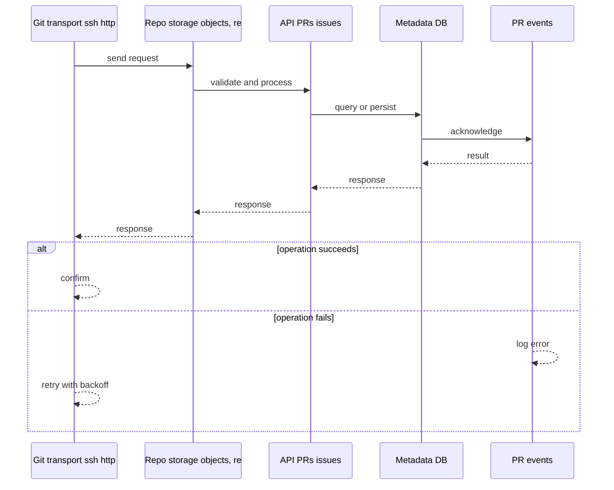
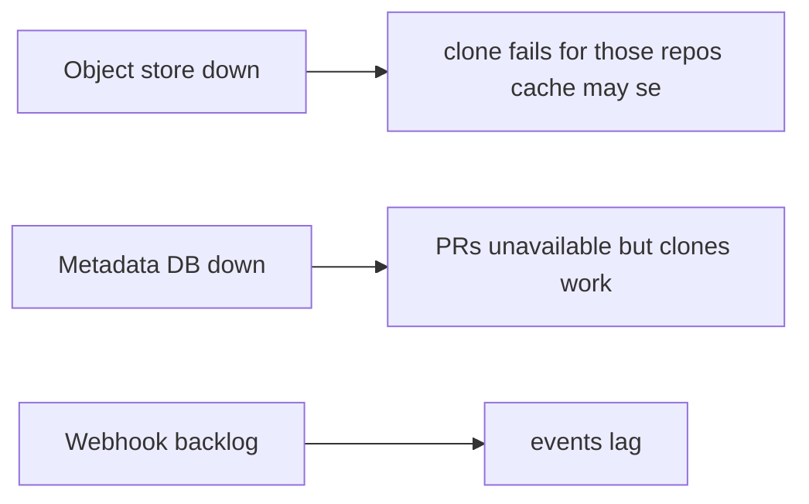
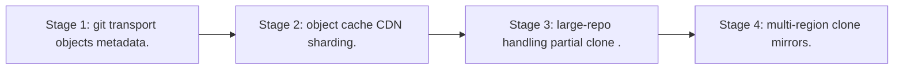

# Case Study: Code-Hosting Platform

> **Tier:** advanced · **Status:** complete · Original numbers and diagrams.

## 1. Problem statement
Host git repositories at scale: clone/push/pull, branch/merge, PRs, and notifications — a metadata-heavy, read-heavy, large-blob system. This is a advanced-tier system design challenge because it must handle high availability under peak load while ensuring no single point of failure. The design must be production-grade: observable, debuggable, reversible, and able to survive component failures without data loss or cascading outages.

## 2. Scope
In (v1): repos, push/pull/clone, PRs, reviews, webhooks. Out: CI (separate case), packages (stage).

For Code-Hosting Platform, these boundaries keep the first version focused on the core user value. Adding more features would dilute the design and delay shipping. Each excluded item is a scaling stage — a candidate for the next iteration once the baseline is proven.

## 3. Functional requirements
- Host git repos (push/pull/clone).
- Branches, merges, PRs.
- Reviews + comments.
- Webhooks/notifications.

For Code-Hosting Platform, these requirements drive specific architectural decisions: the read-write ratio determines the caching strategy, the durability target sets the replication mode, and the idempotency requirement shapes the API contract.

## 4. Non-functional requirements
- Clone latency reasonable for large repos.
- Availability 99.9%.
- Read-heavy (clones/fetches >> pushes).

For Code-Hosting Platform, each non-functional target constrains a specific component: the latency SLO bounds the number of synchronous hops, the availability target forces redundancy across availability zones, and the cost ceiling limits the replication factor and storage tier.

## 5. Explicit assumptions
1. 10M repos, avg 1 GB, many small. [assumption] 2. Clones 100x pushes. [assumption] 3. Large repos need special handling. [constraint]

For Code-Hosting Platform, if these assumptions are off by an order of magnitude, the architecture must adapt: 10x traffic may require earlier sharding, a different read-write ratio changes the caching strategy, and a higher peak multiplier demands more headroom.

## 6. Traffic estimation
Clones/fetches dominate; pushes fewer but write-critical.

To derive the request rate: divide the daily volume by 86,400 seconds to get the average rate, then multiply by 5-10x for peak. The read-to-write ratio determines whether the system is cache-dominated (read-heavy) or write-path-dominated (write-heavy). For Code-Hosting Platform, this ratio shapes the entire storage and replication strategy.

## 7. Storage estimation
Repo objects (git objects) — PB at scale; metadata (PRs, issues, users) relational.

For Code-Hosting Platform, storage growth is projected from the daily write volume and retention policy. Index overhead and compression factors are accounted for in the total.

## 8. Bandwidth estimation
Clone egress is the dominant cost — large objects over the network.

Bandwidth is request rate multiplied by average payload size for ingress, and response rate multiplied by response size for egress. CDN and edge caching reduce origin egress. Compression reduces bandwidth by 50-80 percent where applicable. For Code-Hosting Platform, bandwidth may or may not be the binding constraint — compare it against compute and storage to find out.

## 9. API design

git smart-http/ssh for transport; REST for PRs/issues/webhooks.

## 10. Data model
repos(id, objects, refs); metadata: users, PRs, issues, comments, webhooks. Git objects are content-addressed.

For Code-Hosting Platform, the data model follows the access pattern. The primary lookup determines the partition key; secondary lookups determine indexes. Denormalization is used selectively on hot read paths.

## 11. High-level architecture

## 12. Request flow
Push/fetch via git transport -> objects stored content-addressed -> refs updated. PR/review via API -> metadata DB -> events emit webhooks. Clones served from cached objects.

## 13. Component responsibilities
Git transport, repo storage (objects + refs), metadata DB, API, webhook bus.

For Code-Hosting Platform, each component has one job. The gateway authenticates and routes. Services are stateless and scale horizontally. The data tier is the stateful core that scales by sharding.

## 14. Database selection
Repo objects: content-addressed object store (often on object storage + a cache). Metadata: relational. Rejected: a DB for git objects (wrong model).

For Code-Hosting Platform, the database was chosen by access pattern, not familiarity. The rejected alternatives were wrong for this workload, not bad in general.

## 15. Caching strategy
Object cache for hot repos/clones; metadata cache. CDN for large clones.

For Code-Hosting Platform, the cache strategy matches the staleness tolerance. Cache-aside for most data, write-through where read-after-write matters, stampede protection on hot keys.

## 16. Partitioning strategy
Repos partitioned by id; objects content-addressed (dedup). Hot repos replicated for clone bandwidth.

For Code-Hosting Platform, the partition key balances query locality with even load distribution. Sharding strategy matters because a poor key creates hot spots under real traffic patterns.

## 17. Replication strategy
Objects immutable + content-addressed -> replicate widely for clone bandwidth. Metadata RF.

For Code-Hosting Platform, replication mode is split: synchronous where durability is critical, asynchronous elsewhere for throughput. RF=3 tolerates one failure. Failover is tested regularly.

## 18. Consistency model
Git's own model: refs are the mutable pointers; objects immutable. Strong per-repo via git semantics.

For Code-Hosting Platform, the consistency level is the weakest users accept. Read-your-writes is provided where needed. Eventual consistency is bounded and monitored, not unbounded and silent.

## 19. Failure scenarios
Object store down -> clone fails for those repos (cache may serve). Metadata DB down -> PRs unavailable but clones work. Webhook backlog -> events lag.

## 20. Reliability strategy
SLI clone latency, push success; SLO 99.9%. Object cache absorbs origin failures. Chaos: kill an object store node, assert clones from cache.

For Code-Hosting Platform, the SLO makes reliability measurable. The error budget balances feature velocity with stability. Chaos testing validates that resilience claims hold under real failures.

## 21. Security considerations
Auth (ssh keys/tokens); branch protection; secret scanning; webhook signing; repo ACLs.

For Code-Hosting Platform, security layers TLS, encryption at rest, RBAC, PII redaction, and audit. The policy gateway is fail-closed for AI-augmented operations.

## 22. Observability strategy
Clone latency/throughput, push success, object cache hit, metadata DB latency, webhook delivery.

For Code-Hosting Platform, observability combines logs, metrics, and traces with correlation IDs. Golden signals drive the first dashboard. Alerts fire on burn rate, not raw thresholds.

## 23. Cost considerations
Object storage + clone egress dominate. Object cache + CDN cut egress; dedup cuts storage.

For Code-Hosting Platform, cost is driven by the binding resource. Caching, tiering, batching, and right-sizing are the levers. Cost per request is tracked and alerted on.

## 24. Scaling stages
Stage 1: git transport + objects + metadata. -> Stage 2: object cache/CDN + sharding. -> Stage 3: large-repo handling (partial clone). -> Stage 4: multi-region clone mirrors.

## 25. Trade-offs
Object storage (cost/scale) vs a single file server. Cache hot repos (egress) vs cache size. Partial clone (latency) vs completeness.

For Code-Hosting Platform, each trade-off lists what was chosen, what was rejected, and why. This makes the design defensible in review — every decision has documented reasoning.

## 26. Alternative designs
File-server for repos (won't scale, no dedup). Metadata and objects in one store (wrong model). No clone cache (egress cost).

For Code-Hosting Platform, the alternatives are real architectures that work under different constraints. They were rejected for this workload's specific requirements, not because they are bad designs.

## 27. Interview discussion points
Clarify scale, large repos, clone volume. Surface content-addressed objects, metadata separation, egress cost.

For Code-Hosting Platform in an interview: clarify scope first, surface the read-write ratio, design the hot path deeply, discuss failures, and offer an alternative. Weak candidates skip failure modes.

## 28. Original Mermaid diagrams
Standalone sources under `diagrams/case-studies/code-hosting/`: `context.mmd`, `request-sequence.mmd`, `failure-flow.mmd`, `scaling-evolution.mmd`. The diagrams are embedded in their respective sections: architecture in section 11, request flow in section 12, failure scenarios in section 19, and scaling stages in section 24.

## 29. Further reading
Object storage: Level 2; content-addressing: Level 4; webhooks: Level 2. Sources: `S-CHASH` `S-DYNAMO`.

## 30. Practical exercises

1. Partial clone / sparse checkout. 2. Hot-repo clone bandwidth. 3. Large monorepo (GBs). 4. Webhook delivery guarantees. 5. Multi-region clone mirrors.

---
Previous: Collaborative document editor · Next: Continuous integration platform

