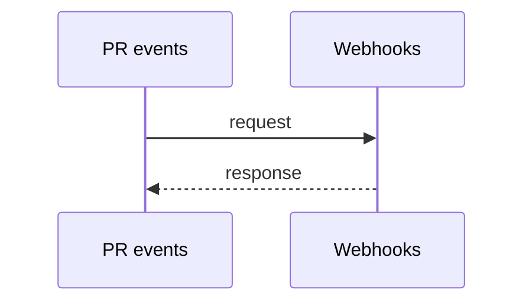
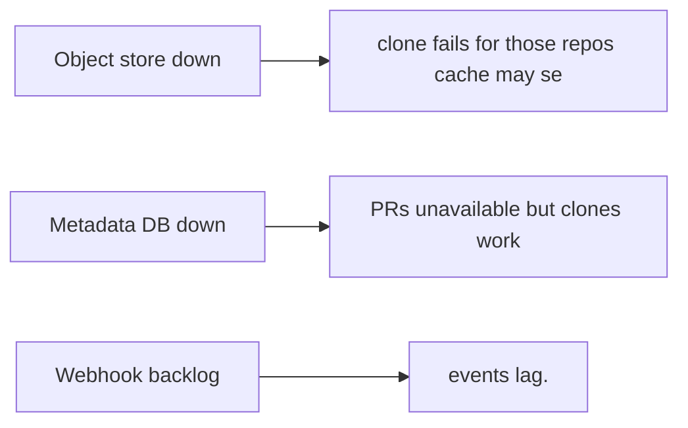
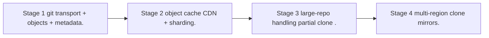

# Case Study: Code-Hosting Platform

> **Tier:** advanced · **Status:** beta · Original numbers and diagrams.

## 1. Problem statement

Host git repositories at scale: clone/push/pull, branch/merge, PRs, and notifications — a metadata-heavy, read-heavy, large-blob system.

## 2. Scope

In (v1): repos, push/pull/clone, PRs, reviews, webhooks. Out: CI (separate case), packages (stage).

## 3. Functional requirements

- Host git repos (push/pull/clone). - Branches, merges, PRs. - Reviews + comments. - Webhooks/notifications.

## 4. Non-functional requirements

- Clone latency reasonable for large repos. - Availability 99.9%. - Read-heavy (clones/fetches >> pushes).

## 5. Explicit assumptions

1. 10M repos, avg 1 GB, many small. [assumption] 2. Clones 100x pushes. [assumption] 3. Large repos need special handling. [constraint]

## 6. Traffic estimation

Clones/fetches dominate; pushes fewer but write-critical.

## 7. Storage estimation

Repo objects (git objects) — PB at scale; metadata (PRs, issues, users) relational.

## 8. Bandwidth estimation

Clone egress is the dominant cost — large objects over the network.

## 9. API design

git smart-http/ssh for transport; REST for PRs/issues/webhooks.

## 10. Data model

repos(id, objects, refs); metadata: users, PRs, issues, comments, webhooks. Git objects are content-addressed.

## 11. High-level architecture

```mermaid
%% created-for: system-design-mastery
flowchart LR
  Dev --> Trans[Git transport (ssh/http)]
  Trans --> Repo[Repo storage (objects, refs)]
  Dev --> API[API: PRs/issues]
  API --> Meta[Metadata DB]
  Repo --> CDN/Cache
  Events[PR events] --> Webhook[Webhooks]
```

## 12. Request flow

Push/fetch via git transport -> objects stored content-addressed -> refs updated. PR/review via API -> metadata DB -> events emit webhooks. Clones served from cached objects.

## 13. Component responsibilities

Git transport, repo storage (objects + refs), metadata DB, API, webhook bus.

## 14. Database selection

Repo objects: content-addressed object store (often on object storage + a cache). Metadata: relational. Rejected: a DB for git objects (wrong model).

## 15. Caching strategy

Object cache for hot repos/clones; metadata cache. CDN for large clones.

## 16. Partitioning strategy

Repos partitioned by id; objects content-addressed (dedup). Hot repos replicated for clone bandwidth.

## 17. Replication strategy

Objects immutable + content-addressed -> replicate widely for clone bandwidth. Metadata RF.

## 18. Consistency model

Git's own model: refs are the mutable pointers; objects immutable. Strong per-repo via git semantics.

## 19. Failure scenarios

Object store down -> clone fails for those repos (cache may serve). Metadata DB down -> PRs unavailable but clones work. Webhook backlog -> events lag.

## 20. Reliability strategy

SLI clone latency, push success; SLO 99.9%. Object cache absorbs origin failures. Chaos: kill an object store node, assert clones from cache.

## 21. Security considerations

Auth (ssh keys/tokens); branch protection; secret scanning; webhook signing; repo ACLs.

## 22. Observability strategy

Clone latency/throughput, push success, object cache hit, metadata DB latency, webhook delivery.

## 23. Cost considerations

Object storage + clone egress dominate. Object cache + CDN cut egress; dedup cuts storage.

## 24. Scaling stages

Stage 1: git transport + objects + metadata. -> Stage 2: object cache/CDN + sharding. -> Stage 3: large-repo handling (partial clone). -> Stage 4: multi-region clone mirrors.

## 25. Trade-offs

Object storage (cost/scale) vs a single file server. Cache hot repos (egress) vs cache size. Partial clone (latency) vs completeness.

## 26. Alternative designs

File-server for repos (won't scale, no dedup). Metadata and objects in one store (wrong model). No clone cache (egress cost).

## 27. Interview discussion points

Clarify scale, large repos, clone volume. Surface content-addressed objects, metadata separation, egress cost.

## 28. Original Mermaid diagrams

Standalone sources under `diagrams/case-studies/code-hosting/`: `context.mmd`, `request-sequence.mmd`, `failure-flow.mmd`, `scaling-evolution.mmd`. Additional diagrams for this case study:






## 29. Further reading

Object storage: Level 2; content-addressing: Level 4; webhooks: Level 2.

## 30. Practical exercises

1. Partial clone / sparse checkout. 2. Hot-repo clone bandwidth. 3. Large monorepo (GBs). 4. Webhook delivery guarantees. 5. Multi-region clone mirrors.


---
Previous: Collaborative document editor · Next: Continuous integration platform
