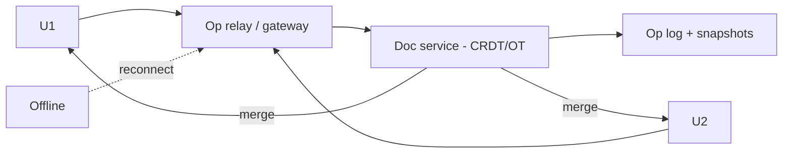
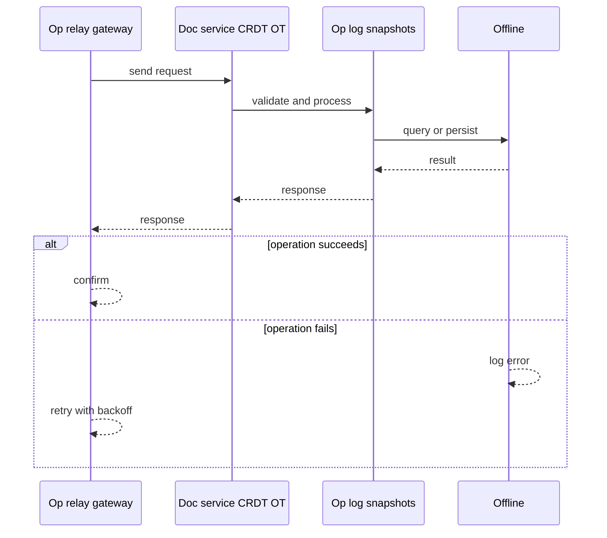
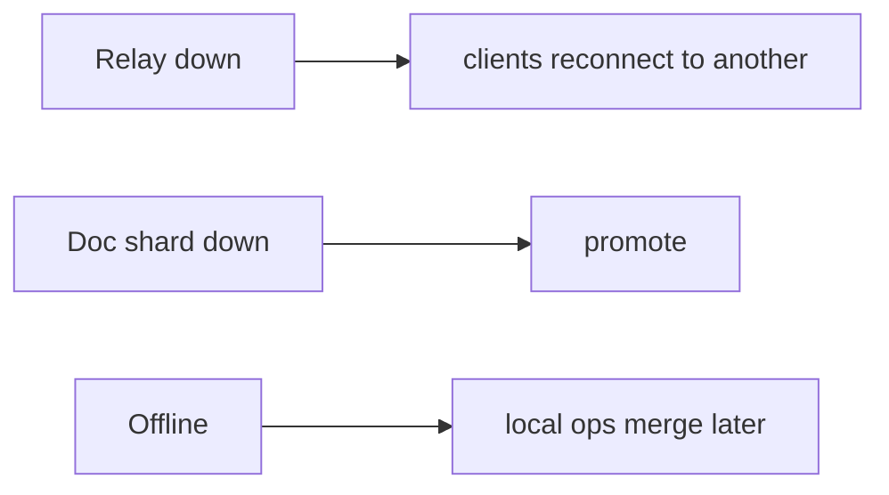
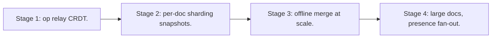

# Case Study: Collaborative Document Editor

> **Tier:** advanced · **Status:** complete · Original numbers and diagrams.

## 1. Problem statement
Real-time co-editing of a document by many users with conflict-free merging and presence — a CRDT/OT-based, offline-capable state system. This is a advanced-tier system design challenge because it must handle high availability under peak load while ensuring no single point of failure. The design must be production-grade: observable, debuggable, reversible, and able to survive component failures without data loss or cascading outages.

## 2. Scope
In (v1): real-time co-edit, presence, offline + merge, history. Out: comments, version branching (stage).

For Collaborative Document Editor, these boundaries keep the first version focused on the core user value. Adding more features would dilute the design and delay shipping. Each excluded item is a scaling stage — a candidate for the next iteration once the baseline is proven.

## 3. Functional requirements
- Multiple users edit concurrently.
- Merge edits without conflict.
- Show presence/cursors.
- Work offline and merge on reconnect.

For Collaborative Document Editor, these requirements drive specific architectural decisions: the read-write ratio determines the caching strategy, the durability target sets the replication mode, and the idempotency requirement shapes the API contract.

## 4. Non-functional requirements
- Keystroke-to-render < 50 ms local.
- Merge correctness (no lost edits).
- Availability 100% for editing (offline ok).

For Collaborative Document Editor, each non-functional target constrains a specific component: the latency SLO bounds the number of synchronous hops, the availability target forces redundancy across availability zones, and the cost ceiling limits the replication factor and storage tier.

## 5. Explicit assumptions
1. ~20 concurrent editors/doc, 10M docs. [assumption] 2. Ops ~1 KB. [assumption] 3. Merge must never lose edits. [constraint]

For Collaborative Document Editor, if these assumptions are off by an order of magnitude, the architecture must adapt: 10x traffic may require earlier sharding, a different read-write ratio changes the caching strategy, and a higher peak multiplier demands more headroom.

## 6. Traffic estimation
Edit ops per active doc; presence heartbeats. Modest aggregate; correctness is the challenge.

To derive the request rate: divide the daily volume by 86,400 seconds to get the average rate, then multiply by 5-10x for peak. The read-to-write ratio determines whether the system is cache-dominated (read-heavy) or write-path-dominated (write-heavy). For Collaborative Document Editor, this ratio shapes the entire storage and replication strategy.

## 7. Storage estimation
Doc as a CRDT/OT op log; snapshots for fast load. ~10M docs x KB-MB.

For Collaborative Document Editor, storage growth is projected from the daily write volume and retention policy. Index overhead and compression factors are accounted for in the total.

## 8. Bandwidth estimation
Small ops streamed; modest aggregate.

Bandwidth is request rate multiplied by average payload size for ingress, and response rate multiplied by response size for egress. CDN and edge caching reduce origin egress. Compression reduces bandwidth by 50-80 percent where applicable. For Collaborative Document Editor, bandwidth may or may not be the binding constraint — compare it against compute and storage to find out.

## 9. API design

WebSocket for ops/presence; REST for snapshots/history.

## 10. Data model
doc(id, crdt state, op log, snapshots); presence(user, doc, cursor). Op log is the source of truth; state derived.

For Collaborative Document Editor, the data model follows the access pattern. The primary lookup determines the partition key; secondary lookups determine indexes. Denormalization is used selectively on hot read paths.

## 11. High-level architecture

## 12. Request flow
Edits sent as ops -> doc service applies to CRDT -> merges deterministically -> broadcasts to all -> persisted in op log. Offline users accumulate ops locally and merge on reconnect.

## 13. Component responsibilities
Op relay/gateway, doc service (CRDT/OT engine), op log + snapshots, presence.

For Collaborative Document Editor, each component has one job. The gateway authenticates and routes. Services are stateless and scale horizontally. The data tier is the stateful core that scales by sharding.

## 14. Database selection
Op log (append-only) + snapshots; CRDT state in memory derived. Rejected: last-write-wins (lost edits); server-locked editing (no offline).

For Collaborative Document Editor, the database was chosen by access pattern, not familiarity. The rejected alternatives were wrong for this workload, not bad in general.

## 15. Caching strategy
Doc state in memory; snapshots for fast load.

For Collaborative Document Editor, the cache strategy matches the staleness tolerance. Cache-aside for most data, write-through where read-after-write matters, stampede protection on hot keys.

## 16. Partitioning strategy
Per doc (one doc's state on a shard); presence sharded by doc.

For Collaborative Document Editor, the partition key balances query locality with even load distribution. Sharding strategy matters because a poor key creates hot spots under real traffic patterns.

## 17. Replication strategy
Op log RF=3; CRDT state replicated for availability. CRDTs converge without coordination.

For Collaborative Document Editor, replication mode is split: synchronous where durability is critical, asynchronous elsewhere for throughput. RF=3 tolerates one failure. Failover is tested regularly.

## 18. Consistency model
Causal/eventual with no lost edits (CRDT). Concurrency safe; ordering preserved per the CRDT rules.

For Collaborative Document Editor, the consistency level is the weakest users accept. Read-your-writes is provided where needed. Eventual consistency is bounded and monitored, not unbounded and silent.

## 19. Failure scenarios
Relay down -> clients reconnect to another; CRDT merge resumes. Doc shard down -> promote; op log persists. Offline -> local ops merge later.

## 20. Reliability strategy
SLI merge correctness, edit latency; SLO 99.9%. CRDTs give offline + no-lost-edits. Chaos: partition clients, assert merge on heal.

For Collaborative Document Editor, the SLO makes reliability measurable. The error budget balances feature velocity with stability. Chaos testing validates that resilience claims hold under real failures.

## 21. Security considerations
Per-doc auth; PII in docs; audit of edits; presence privacy.

For Collaborative Document Editor, security layers TLS, encryption at rest, RBAC, PII redaction, and audit. The policy gateway is fail-closed for AI-augmented operations.

## 22. Observability strategy
Edit latency, merge conflicts rate, presence freshness, op-log lag, snapshot freshness.

For Collaborative Document Editor, observability combines logs, metrics, and traces with correlation IDs. Golden signals drive the first dashboard. Alerts fire on burn rate, not raw thresholds.

## 23. Cost considerations
Op-log storage + memory per active doc; snapshots cut load cost.

For Collaborative Document Editor, cost is driven by the binding resource. Caching, tiering, batching, and right-sizing are the levers. Cost per request is tracked and alerted on.

## 24. Scaling stages
Stage 1: op relay + CRDT. -> Stage 2: per-doc sharding + snapshots. -> Stage 3: offline + merge at scale. -> Stage 4: large docs, presence fan-out.

## 25. Trade-offs
CRDT (offline, no-lost) vs state metadata growth. OT (smaller state) vs central transform complexity. Snapshots (fast load) vs build cost.

For Collaborative Document Editor, each trade-off lists what was chosen, what was rejected, and why. This makes the design defensible in review — every decision has documented reasoning.

## 26. Alternative designs
Last-write-wins (lost edits). Lock-based (no concurrency/offline). Mutable state (no audit/merge).

For Collaborative Document Editor, the alternatives are real architectures that work under different constraints. They were rejected for this workload's specific requirements, not because they are bad designs.

## 27. Interview discussion points
Clarify offline, concurrency, no-lost-edits. Surface CRDT/OT, op log, offline merge.

For Collaborative Document Editor in an interview: clarify scope first, surface the read-write ratio, design the hot path deeply, discuss failures, and offer an alternative. Weak candidates skip failure modes.

## 28. Original Mermaid diagrams
Standalone sources under `diagrams/case-studies/collaborative-document-editor/`: `context.mmd`, `request-sequence.mmd`, `failure-flow.mmd`, `scaling-evolution.mmd`. The diagrams are embedded in their respective sections: architecture in section 11, request flow in section 12, failure scenarios in section 19, and scaling stages in section 24.

## 29. Further reading
CRDTs: Level 4; real-time: Level 10; op log/event sourcing: Level 5. Sources: `S-CHASH` `S-DYNAMO`.

## 30. Practical exercises

1. CRDT metadata compaction. 2. Large doc (book) editing. 3. Presence fan-out for 100 cursors. 4. Snapshot cadence vs load latency. 5. Merge two long-offline branches.

---
Previous: Online multiplayer game · Next: Code-hosting platform

