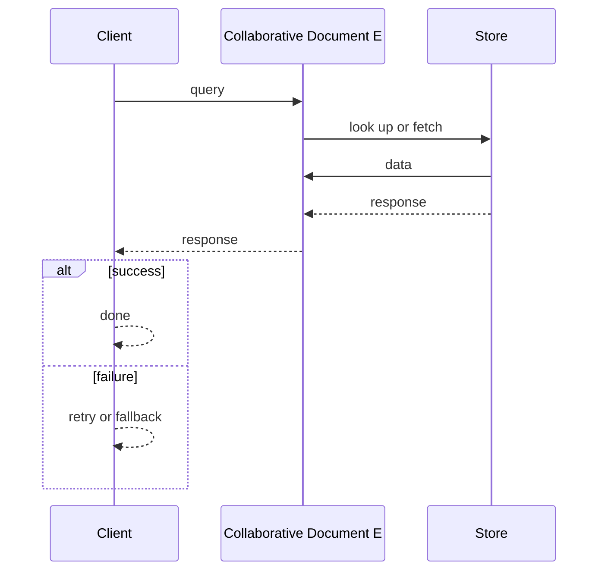
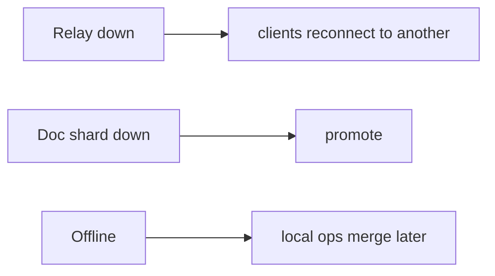

# Case Study: Collaborative Document Editor

> **Tier:** advanced · **Status:** complete · Original numbers and diagrams.

## 1. Problem statement

Real-time co-editing of a document by many users with conflict-free merging and presence — a CRDT/OT-based, offline-capable state system.


## 2. Scope

In (v1): real-time co-edit, presence, offline + merge, history. Out: comments, version branching (stage).


## 3. Functional requirements

- Multiple users edit concurrently.
- Merge edits without conflict.
- Show presence/cursors.
- Work offline and merge on reconnect.


## 4. Non-functional requirements

- Keystroke-to-render < 50 ms local.
- Merge correctness (no lost edits).
- Availability 100% for editing (offline ok).


## 5. Explicit assumptions

1. ~20 concurrent editors/doc, 10M docs. [assumption] 2. Ops ~1 KB. [assumption] 3. Merge must never lose edits. [constraint]


## 6. Traffic estimation

Edit ops per active doc; presence heartbeats. Modest aggregate; correctness is the challenge.


## 7. Storage estimation

Doc as a CRDT/OT op log; snapshots for fast load. ~10M docs x KB-MB.


## 8. Bandwidth estimation

Small ops streamed; modest aggregate.


## 9. API design

WebSocket for ops/presence; REST for snapshots/history.


## 10. Data model

doc(id, crdt state, op log, snapshots); presence(user, doc, cursor). Op log is the source of truth; state derived.


## 11. High-level architecture

```mermaid
%% created-for: system-design-mastery
flowchart LR
  U1 & U2 --> Relay[Op relay / gateway]
  Relay --> Doc[Doc service (CRDT/OT)]
  Doc --> Store[(Op log + snapshots)]
  Doc -->|merge| U1 & U2
  U3[Offline] -.reconnect.-> Relay
```


## 12. Request flow
Edits sent as ops -> doc service applies to CRDT -> merges deterministically -> broadcasts to all -> persisted in op log. Offline users accumulate ops locally and merge on reconnect.




## 13. Component responsibilities

Op relay/gateway, doc service (CRDT/OT engine), op log + snapshots, presence.


## 14. Database selection

Op log (append-only) + snapshots; CRDT state in memory derived. Rejected: last-write-wins (lost edits); server-locked editing (no offline).


## 15. Caching strategy

Doc state in memory; snapshots for fast load.


## 16. Partitioning strategy

Per doc (one doc's state on a shard); presence sharded by doc.


## 17. Replication strategy

Op log RF=3; CRDT state replicated for availability. CRDTs converge without coordination.


## 18. Consistency model

Causal/eventual with no lost edits (CRDT). Concurrency safe; ordering preserved per the CRDT rules.


## 19. Failure scenarios
Relay down -> clients reconnect to another; CRDT merge resumes. Doc shard down -> promote; op log persists. Offline -> local ops merge later.




## 20. Reliability strategy

SLI merge correctness, edit latency; SLO 99.9%. CRDTs give offline + no-lost-edits. Chaos: partition clients, assert merge on heal.


## 21. Security considerations

Per-doc auth; PII in docs; audit of edits; presence privacy.


## 22. Observability strategy

Edit latency, merge conflicts rate, presence freshness, op-log lag, snapshot freshness.


## 23. Cost considerations

Op-log storage + memory per active doc; snapshots cut load cost.


## 24. Scaling stages

Stage 1: op relay + CRDT. -> Stage 2: per-doc sharding + snapshots. -> Stage 3: offline + merge at scale. -> Stage 4: large docs, presence fan-out.


## 25. Trade-offs

CRDT (offline, no-lost) vs state metadata growth. OT (smaller state) vs central transform complexity. Snapshots (fast load) vs build cost.


## 26. Alternative designs

Last-write-wins (lost edits). Lock-based (no concurrency/offline). Mutable state (no audit/merge).


## 27. Interview discussion points

Clarify offline, concurrency, no-lost-edits. Surface CRDT/OT, op log, offline merge.


## 28. Original Mermaid diagrams
Standalone sources under `diagrams/case-studies/collaborative-document-editor/`: `context.mmd`, `request-sequence.mmd`, `failure-flow.mmd`, `scaling-evolution.mmd`. The diagrams are embedded in their respective sections: architecture in section 11, request flow in section 12, failure scenarios in section 19, and scaling stages in section 24.

## 29. Further reading

CRDTs: Level 4; real-time: Level 10; op log/event sourcing: Level 5.


## 30. Practical exercises

1. CRDT metadata compaction. 2. Large doc (book) editing. 3. Presence fan-out for 100 cursors. 4. Snapshot cadence vs load latency. 5. Merge two long-offline branches.


---
Previous: Online multiplayer game · Next: Code-hosting platform

