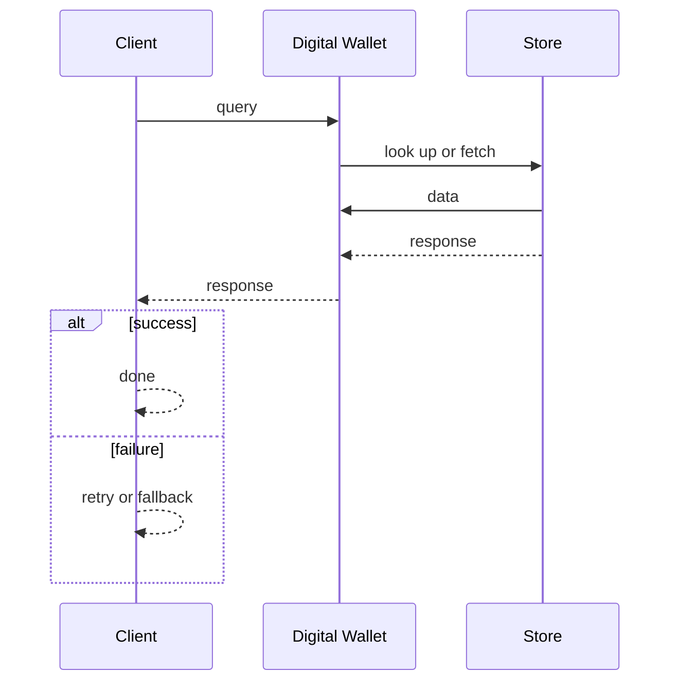
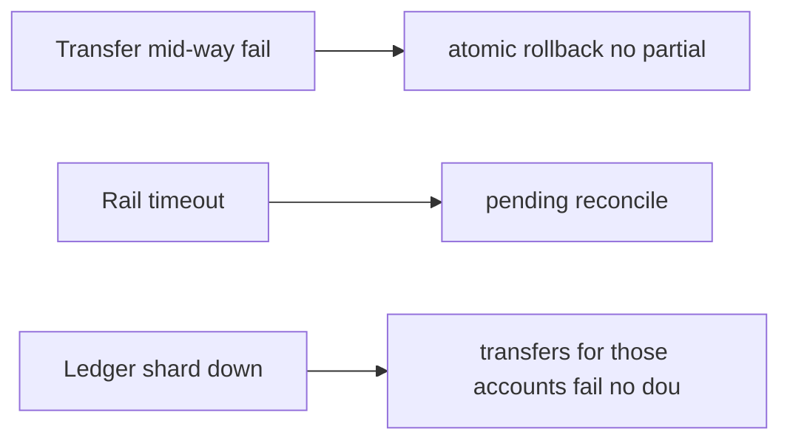

# Case Study: Digital Wallet

> **Tier:** advanced · **Status:** complete · Original numbers and diagrams.

## 1. Problem statement

Hold user balances and move money between users instantly (P2P) and to/from external rails — a balance + transfer system with strong consistency.


## 2. Scope

In (v1): balance, top-up/withdraw, P2P transfer, ledger. Out: cards, interest, multi-currency (stage).


## 3. Functional requirements

- Hold a balance per user. - Transfer between users instantly. - Top-up from / withdraw to bank. - Ledger every move.


## 4. Non-functional requirements

- No double-spend; balances never negative. - Transfer p99 < 1 s. - Availability 99.95%.


## 5. Explicit assumptions

1. 5M users, 2M transfers/day. [assumption] 2. Avg transfer $20. [assumption] 3. Balance must not go negative. [constraint]


## 6. Traffic estimation

2M transfers/day ~23/s avg, ~300/s peak.


## 7. Storage estimation

Balances + a ledger of every move; small but must be durable and auditable.


## 8. Bandwidth estimation

Tiny payloads; correctness/consistency is the concern.


## 9. API design

| GET /balance | | amount | | POST /transfer | to, amount | transfer id | | POST /topup | amount | |


## 10. Data model

accounts(user, balance); transfers(id, from, to, amount, status); ledger(id, account, delta, ts) append-only. Balance = fold of ledger entries.


## 11. High-level architecture

```mermaid
%% created-for: system-design-mastery
flowchart LR
  User --> API[Wallet API]
  API --> Tx[Transfer tx: debit + credit]
  Tx --> Ledger[(Append-only ledger)]
  Tx --> Bal[Balance check (no negative)]
  API --> Rails[Bank rails (topup/withdraw)]
  Ledger --> Reconcile[Reconcile vs bank]
```


## 12. Request flow

Transfer: a transaction debits sender, credits receiver atomically (reject if insufficient), appends two ledger entries. Top-up/withdraw via bank rails, reconciled.


## 13. Component responsibilities

Wallet API, transfer service, ledger, balance checker, bank-rail connector, reconciliation.


## 14. Database selection

Transactional RDBMS (atomic debit/credit) + append-only ledger. Rejected: mutable balance-only (no audit); eventual consistency (double-spend).


## 15. Caching strategy

Balance read cache; transfers always via the authoritative ledger/transaction.


## 16. Partitioning strategy

Accounts partitioned by user; a transfer within a partition is local; cross-partition is a distributed transaction (saga/2PC-lite).


## 17. Replication strategy

Ledger synchronous RF=3; balances derived. Idempotent transfers by transfer id.


## 18. Consistency model

Strong per account: atomic debit/credit; no negative balance. Cross-partition transfers are transactional (or saga with compensation).


## 19. Failure scenarios

Transfer mid-way fail -> atomic rollback (no partial). Rail timeout -> pending + reconcile. Ledger shard down -> transfers for those accounts fail (no double-spend).


## 20. Reliability strategy

SLI transfer latency, double-spend (0), negative-balance (0); SLO 99.95%. Idempotent transfers. Chaos: kill a ledger shard, assert no double-spend.


## 21. Security considerations

Strong auth; PCI for card top-up; audit; fraud on transfers; per-user limits.


## 22. Observability strategy

Transfer latency, success/decline, rail latency, reconciliation drift, double-spend guards.


## 23. Cost considerations

Transactional DB + rail fees; correctness-first. Hot-account contention is the operational challenge.


## 24. Scaling stages

Stage 1: balances + transfers. -> Stage 2: sharded accounts + ledger. -> Stage 3: multi-currency, cards. -> Stage 4: multi-region with regional balances.


## 25. Trade-offs

Strong consistency (no double-spend) vs throughput. Atomic transfer vs saga. Balance cache (reads) vs ledger (writes).


## 26. Alternative designs

Eventual balance (double-spend). Mutable balance no ledger (no audit). Saga for everything (latency).


## 27. Interview discussion points

Clarify double-spend, latency, rails. Surface atomic debit/credit, the append-only ledger, and reconciliation.


## 28. Original Mermaid diagrams

Standalone sources under `diagrams/case-studies/digital-wallet/`: `context.mmd`, `request-sequence.mmd`, `failure-flow.mmd`, `scaling-evolution.mmd`. Request sequence and failure flow:





## 29. Further reading

Ledger/payment: Level 10; transactions: Level 4; idempotency: Level 4.


## 30. Practical exercises

1. Hot-account (one user) contention. 2. Cross-shard transfer atomicity. 3. Rail timeout reconciliation. 4. Multi-currency. 5. Fraud on P2P.


---
Previous: Payment gateway · Next: Hotel-booking

