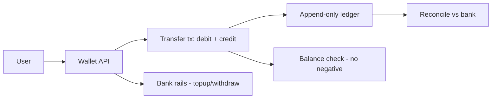
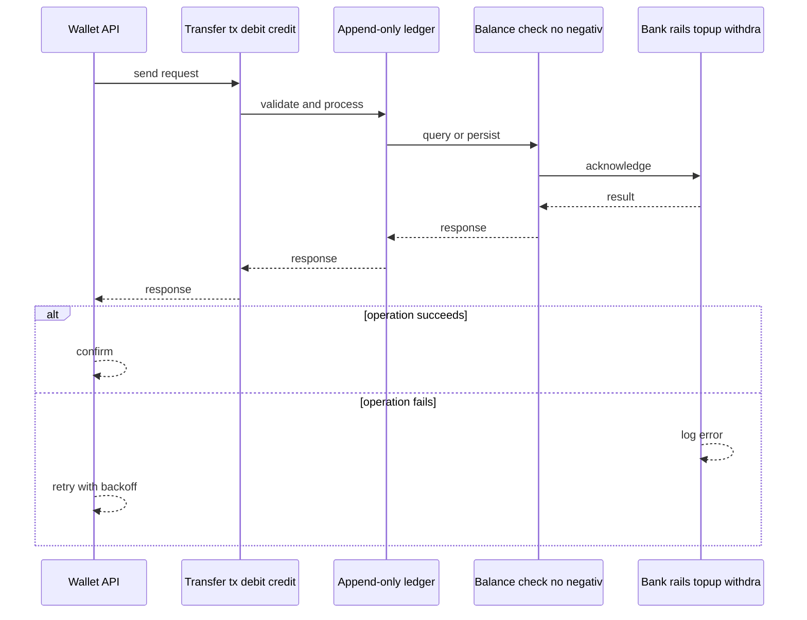
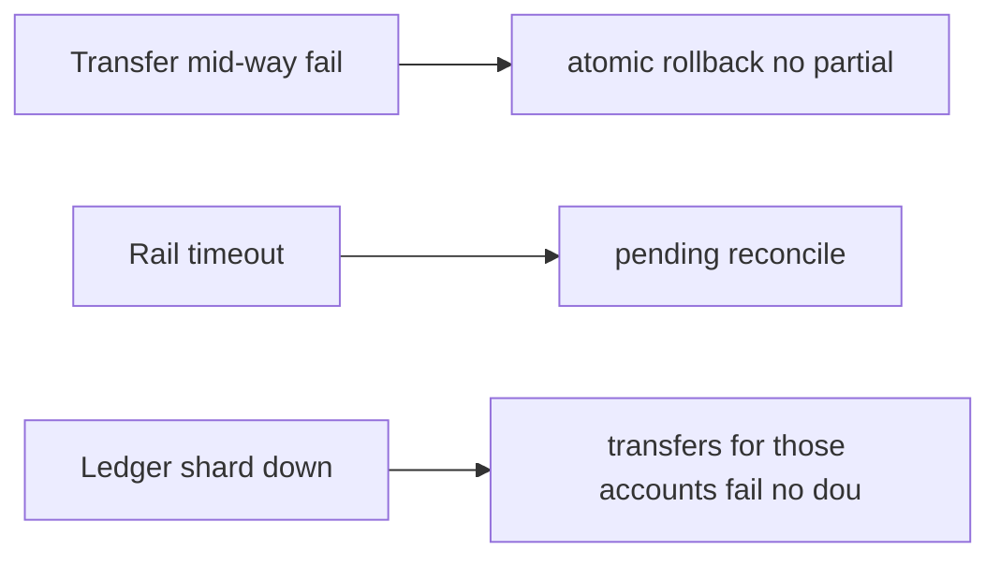
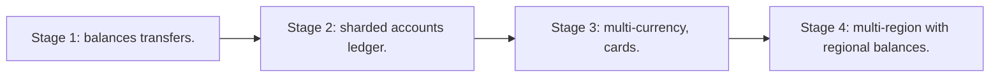

# Case Study: Digital Wallet

> **Tier:** advanced · **Status:** complete · Original numbers and diagrams.

## 1. Problem statement
Hold user balances and move money between users instantly (P2P) and to/from external rails — a balance + transfer system with strong consistency. This is a advanced-tier system design challenge because it must handle strict consistency and zero data loss while ensuring no single point of failure. The design must be production-grade: observable, debuggable, reversible, and able to survive component failures without data loss or cascading outages.

## 2. Scope
In (v1): balance, top-up/withdraw, P2P transfer, ledger. Out: cards, interest, multi-currency (stage).

For Digital Wallet, these boundaries keep the first version focused on the core user value. Adding more features would dilute the design and delay shipping. Each excluded item is a scaling stage — a candidate for the next iteration once the baseline is proven.

## 3. Functional requirements
- Hold a balance per user.
- Transfer between users instantly.
- Top-up from / withdraw to bank.
- Ledger every move.

For Digital Wallet, these requirements drive specific architectural decisions: the read-write ratio determines the caching strategy, the durability target sets the replication mode, and the idempotency requirement shapes the API contract.

## 4. Non-functional requirements
- No double-spend; balances never negative.
- Transfer p99 < 1 s.
- Availability 99.95%.

For Digital Wallet, each non-functional target constrains a specific component: the latency SLO bounds the number of synchronous hops, the availability target forces redundancy across availability zones, and the cost ceiling limits the replication factor and storage tier.

## 5. Explicit assumptions
1. 5M users, 2M transfers/day. [assumption] 2. Avg transfer $20. [assumption] 3. Balance must not go negative. [constraint]

For Digital Wallet, if these assumptions are off by an order of magnitude, the architecture must adapt: 10x traffic may require earlier sharding, a different read-write ratio changes the caching strategy, and a higher peak multiplier demands more headroom.

## 6. Traffic estimation
2M transfers/day ~23/s avg, ~300/s peak.

To derive the request rate: divide the daily volume by 86,400 seconds to get the average rate, then multiply by 5-10x for peak. The read-to-write ratio determines whether the system is cache-dominated (read-heavy) or write-path-dominated (write-heavy). For Digital Wallet, this ratio shapes the entire storage and replication strategy.

## 7. Storage estimation
Balances + a ledger of every move; small but must be durable and auditable.

For Digital Wallet, storage growth is projected from the daily write volume and retention policy. Index overhead and compression factors are accounted for in the total.

## 8. Bandwidth estimation
Tiny payloads; correctness/consistency is the concern.

Bandwidth is request rate multiplied by average payload size for ingress, and response rate multiplied by response size for egress. CDN and edge caching reduce origin egress. Compression reduces bandwidth by 50-80 percent where applicable. For Digital Wallet, bandwidth may or may not be the binding constraint — compare it against compute and storage to find out.

## 9. API design
| Method | Path | Request | Response |
|--------|------|---------|----------|
| GET /balance |
| POST |/transfer | to, amount | transfer id |
| POST /topup | amount | |

## 10. Data model
accounts(user, balance); transfers(id, from, to, amount, status); ledger(id, account, delta, ts) append-only. Balance = fold of ledger entries.

For Digital Wallet, the data model follows the access pattern. The primary lookup determines the partition key; secondary lookups determine indexes. Denormalization is used selectively on hot read paths.

## 11. High-level architecture

## 12. Request flow
Transfer: a transaction debits sender, credits receiver atomically (reject if insufficient), appends two ledger entries. Top-up/withdraw via bank rails, reconciled.

## 13. Component responsibilities
Wallet API, transfer service, ledger, balance checker, bank-rail connector, reconciliation.

For Digital Wallet, each component has one job. The gateway authenticates and routes. Services are stateless and scale horizontally. The data tier is the stateful core that scales by sharding.

## 14. Database selection
Transactional RDBMS (atomic debit/credit) + append-only ledger. Rejected: mutable balance-only (no audit); eventual consistency (double-spend).

For Digital Wallet, the database was chosen by access pattern, not familiarity. The rejected alternatives were wrong for this workload, not bad in general.

## 15. Caching strategy
Balance read cache; transfers always via the authoritative ledger/transaction.

For Digital Wallet, the cache strategy matches the staleness tolerance. Cache-aside for most data, write-through where read-after-write matters, stampede protection on hot keys.

## 16. Partitioning strategy
Accounts partitioned by user; a transfer within a partition is local; cross-partition is a distributed transaction (saga/2PC-lite).

For Digital Wallet, the partition key balances query locality with even load distribution. Sharding strategy matters because a poor key creates hot spots under real traffic patterns.

## 17. Replication strategy
Ledger synchronous RF=3; balances derived. Idempotent transfers by transfer id.

For Digital Wallet, replication mode is split: synchronous where durability is critical, asynchronous elsewhere for throughput. RF=3 tolerates one failure. Failover is tested regularly.

## 18. Consistency model
Strong per account: atomic debit/credit; no negative balance. Cross-partition transfers are transactional (or saga with compensation).

For Digital Wallet, the consistency level is the weakest users accept. Read-your-writes is provided where needed. Eventual consistency is bounded and monitored, not unbounded and silent.

## 19. Failure scenarios
Transfer mid-way fail -> atomic rollback (no partial). Rail timeout -> pending + reconcile. Ledger shard down -> transfers for those accounts fail (no double-spend).

## 20. Reliability strategy
SLI transfer latency, double-spend (0), negative-balance (0); SLO 99.95%. Idempotent transfers. Chaos: kill a ledger shard, assert no double-spend.

For Digital Wallet, the SLO makes reliability measurable. The error budget balances feature velocity with stability. Chaos testing validates that resilience claims hold under real failures.

## 21. Security considerations
Strong auth; PCI for card top-up; audit; fraud on transfers; per-user limits.

For Digital Wallet, security layers TLS, encryption at rest, RBAC, PII redaction, and audit. The policy gateway is fail-closed for AI-augmented operations.

## 22. Observability strategy
Transfer latency, success/decline, rail latency, reconciliation drift, double-spend guards.

For Digital Wallet, observability combines logs, metrics, and traces with correlation IDs. Golden signals drive the first dashboard. Alerts fire on burn rate, not raw thresholds.

## 23. Cost considerations
Transactional DB + rail fees; correctness-first. Hot-account contention is the operational challenge.

For Digital Wallet, cost is driven by the binding resource. Caching, tiering, batching, and right-sizing are the levers. Cost per request is tracked and alerted on.

## 24. Scaling stages
Stage 1: balances + transfers. -> Stage 2: sharded accounts + ledger. -> Stage 3: multi-currency, cards. -> Stage 4: multi-region with regional balances.

## 25. Trade-offs
Strong consistency (no double-spend) vs throughput. Atomic transfer vs saga. Balance cache (reads) vs ledger (writes).

For Digital Wallet, each trade-off lists what was chosen, what was rejected, and why. This makes the design defensible in review — every decision has documented reasoning.

## 26. Alternative designs
Eventual balance (double-spend). Mutable balance no ledger (no audit). Saga for everything (latency).

For Digital Wallet, the alternatives are real architectures that work under different constraints. They were rejected for this workload's specific requirements, not because they are bad designs.

## 27. Interview discussion points
Clarify double-spend, latency, rails. Surface atomic debit/credit, the append-only ledger, and reconciliation.

For Digital Wallet in an interview: clarify scope first, surface the read-write ratio, design the hot path deeply, discuss failures, and offer an alternative. Weak candidates skip failure modes.

## 28. Original Mermaid diagrams
Standalone sources under `diagrams/case-studies/digital-wallet/`: `context.mmd`, `request-sequence.mmd`, `failure-flow.mmd`, `scaling-evolution.mmd`. The diagrams are embedded in their respective sections: architecture in section 11, request flow in section 12, failure scenarios in section 19, and scaling stages in section 24.

## 29. Further reading
Ledger/payment: Level 10; transactions: Level 4; idempotency: Level 4. Sources: `S-DYNAMO` `S-RAFT` `S-SPANNER`.

## 30. Practical exercises

1. Hot-account (one user) contention. 2. Cross-shard transfer atomicity. 3. Rail timeout reconciliation. 4. Multi-currency. 5. Fraud on P2P.

---
Previous: Payment gateway · Next: Hotel-booking

