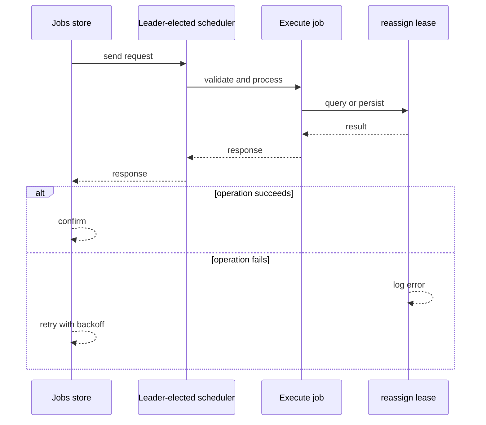
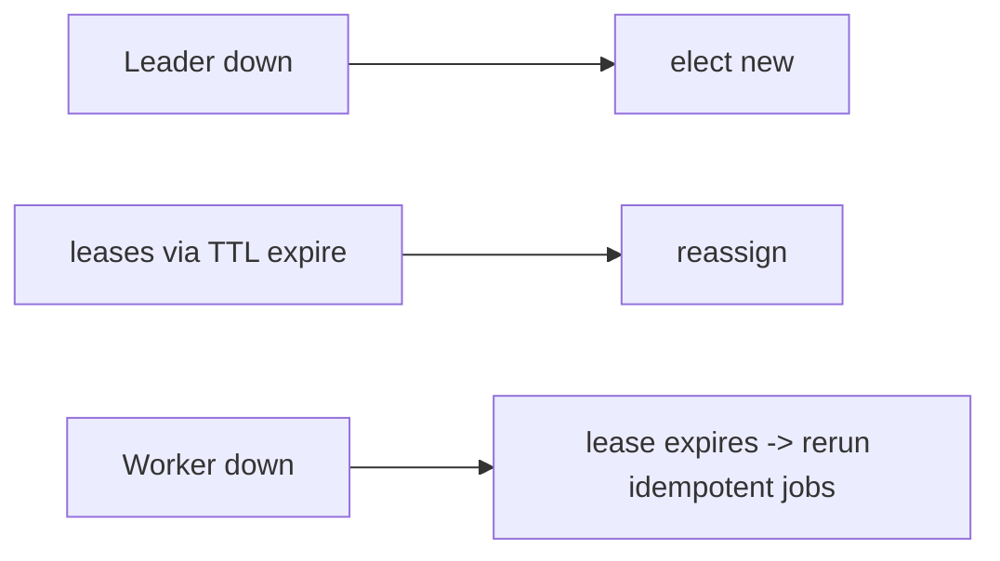
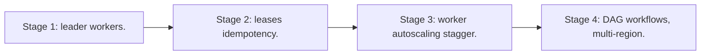

# Case Study: Distributed Scheduler

> **Tier:** advanced · **Status:** complete · Original numbers and diagrams.

## 1. Problem statement
Run scheduled jobs across a fleet with single-execution semantics, retries, and failure isolation — a distributed cron/batch runner. This is a advanced-tier system design challenge because it must handle high availability under peak load while ensuring no single point of failure. The design must be production-grade: observable, debuggable, reversible, and able to survive component failures without data loss or cascading outages.

## 2. Scope
In (v1): schedule jobs at a time/interval, single-execution, retries, status, concurrency caps. Out: DAG workflows (noted).

For Distributed Scheduler, these boundaries keep the first version focused on the core user value. Adding more features would dilute the design and delay shipping. Each excluded item is a scaling stage — a candidate for the next iteration once the baseline is proven.

## 3. Functional requirements
- Schedule a job at a time or interval.
- Run exactly once even with many nodes.
- Retry on failure; record status.
- Enforce concurrency limits.

For Distributed Scheduler, these requirements drive specific architectural decisions: the read-write ratio determines the caching strategy, the durability target sets the replication mode, and the idempotency requirement shapes the API contract.

## 4. Non-functional requirements
- At-most-one execution per scheduled run.
- Availability 99.9% (jobs run, possibly late).
- Survive node loss without skipping.

For Distributed Scheduler, each non-functional target constrains a specific component: the latency SLO bounds the number of synchronous hops, the availability target forces redundancy across availability zones, and the cost ceiling limits the replication factor and storage tier.

## 5. Explicit assumptions
1. 100k jobs/day, 1k concurrent. [assumption] 2. Some jobs every minute; some daily. [assumption] 3. Jobs 1s-10min. [constraint]

For Distributed Scheduler, if these assumptions are off by an order of magnitude, the architecture must adapt: 10x traffic may require earlier sharding, a different read-write ratio changes the caching strategy, and a higher peak multiplier demands more headroom.

## 6. Traffic estimation
Job execution spikes on cron boundaries (many at minute/hour/day rollover). Control plane is low-QPS.

To derive the request rate: divide the daily volume by 86,400 seconds to get the average rate, then multiply by 5-10x for peak. The read-to-write ratio determines whether the system is cache-dominated (read-heavy) or write-path-dominated (write-heavy). For Distributed Scheduler, this ratio shapes the entire storage and replication strategy.

## 7. Storage estimation
Job definitions + run history; small (GBs). The state to protect: 'has this run started?'

For Distributed Scheduler, storage growth is projected from the daily write volume and retention policy. Index overhead and compression factors are accounted for in the total.

## 8. Bandwidth estimation
Job payloads small; worker-to-service control is light.

Bandwidth is request rate multiplied by average payload size for ingress, and response rate multiplied by response size for egress. CDN and edge caching reduce origin egress. Compression reduces bandwidth by 50-80 percent where applicable. For Distributed Scheduler, bandwidth may or may not be the binding constraint — compare it against compute and storage to find out.

## 9. API design
| Method | Path | Request | Response |
|--------|------|---------|----------|
| POST /jobs | schedule, action | id |
| GET |/jobs/:id/runs | | history |

## 10. Data model
jobs(id, schedule, action, concurrency); runs(job_id, run_id, status, attempts, ts). A lease/lock per (job, run).

For Distributed Scheduler, the data model follows the access pattern. The primary lookup determines the partition key; secondary lookups determine indexes. Denormalization is used selectively on hot read paths.

## 11. High-level architecture

```mermaid
%% created-for: system-design-mastery
flowchart LR
  DB[Jobs store] --> Leader[Leader-elected scheduler]
  Leader -->|acquire lease per (job,run)| Workers
  Workers --> Exec[Execute job]
  Exec --> DB
  Workers -.fail.-> Requeue[reassign lease]
```

## 12. Request flow
At a job's time, the scheduler (leader) acquires a lease for (job, run), assigns a worker, executes, records status; on worker loss the lease expires and another worker runs it.



## 13. Component responsibilities
Scheduler (leader-elected), jobs store, workers, lease store.

For Distributed Scheduler, each component has one job. The gateway authenticates and routes. Services are stateless and scale horizontally. The data tier is the stateful core that scales by sharding.

## 14. Database selection
Relational for job defs + runs (small, transactional); a lease/lock store (consensus or DB row lock). Rejected: cron on every node (double-run).

For Distributed Scheduler, the database was chosen by access pattern, not familiarity. The rejected alternatives were wrong for this workload, not bad in general.

## 15. Caching strategy
Schedule cache; lease in a fast store.

For Distributed Scheduler, the cache strategy matches the staleness tolerance. Cache-aside for most data, write-through where read-after-write matters, stampede protection on hot keys.

## 16. Partitioning strategy
Workers scaled by concurrent job count; leases partitioned by job hash. Time-based spikes handled by worker autoscaling.

For Distributed Scheduler, the partition key balances query locality with even load distribution. Sharding strategy matters because a poor key creates hot spots under real traffic patterns.

## 17. Replication strategy
Jobs/runs replicated for durability. Leader election (Raft) ensures one scheduler. Lease TTL prevents a dead worker from holding a run forever.

For Distributed Scheduler, replication mode is split: synchronous where durability is critical, asynchronous elsewhere for throughput. RF=3 tolerates one failure. Failover is tested regularly.

## 18. Consistency model
Single-execution via lease + leader (strong for 'who runs this'). Run status eventually visible.

For Distributed Scheduler, the consistency level is the weakest users accept. Read-your-writes is provided where needed. Eventual consistency is bounded and monitored, not unbounded and silent.

## 19. Failure scenarios
Leader down -> elect new; leases via TTL expire -> reassign. Worker down -> lease expires -> rerun (idempotent jobs). Double-run prevented by lease.



## 20. Reliability strategy
SLI job on-time %, double-run rate; SLO 99.9%. Leases + idempotent jobs. Chaos: kill leader and a worker, assert jobs run once.

For Distributed Scheduler, the SLO makes reliability measurable. The error budget balances feature velocity with stability. Chaos testing validates that resilience claims hold under real failures.

## 21. Security considerations
Job auth (who may schedule); secret injection per job; isolate workers (untrusted job code).

For Distributed Scheduler, security layers TLS, encryption at rest, RBAC, PII redaction, and audit. The policy gateway is fail-closed for AI-augmented operations.

## 22. Observability strategy
Job start/finish, run latency, missed runs, double-run count, worker utilization, queue at cron spikes.

For Distributed Scheduler, observability combines logs, metrics, and traces with correlation IDs. Golden signals drive the first dashboard. Alerts fire on burn rate, not raw thresholds.

## 23. Cost considerations
Workers (autoscaled) dominate; cost spikes at cron boundaries — scale workers and stagger.

For Distributed Scheduler, cost is driven by the binding resource. Caching, tiering, batching, and right-sizing are the levers. Cost per request is tracked and alerted on.

## 24. Scaling stages
Stage 1: leader + workers. -> Stage 2: leases + idempotency. -> Stage 3: worker autoscaling + stagger. -> Stage 4: DAG workflows, multi-region.



## 25. Trade-offs
At-most-once (lease) vs at-least-once (idempotent retry) — both via lease + idempotent. Leader (simple) vs distributed lock per run.

For Distributed Scheduler, each trade-off lists what was chosen, what was rejected, and why. This makes the design defensible in review — every decision has documented reasoning.

## 26. Alternative designs
Cron on every node (double-run). A single scheduler no election (SPOF). External managed scheduler (offloads ops).

For Distributed Scheduler, the alternatives are real architectures that work under different constraints. They were rejected for this workload's specific requirements, not because they are bad designs.

## 27. Interview discussion points
Clarify single-execution, retry, spikes. Surface leader election + leases + idempotency — the crux.

For Distributed Scheduler in an interview: clarify scope first, surface the read-write ratio, design the hot path deeply, discuss failures, and offer an alternative. Weak candidates skip failure modes.

## 28. Original Mermaid diagrams
Standalone sources under `diagrams/case-studies/distributed-scheduler/`: `context.mmd`, `request-sequence.mmd`, `failure-flow.mmd`, `scaling-evolution.mmd`. The diagrams are embedded in their respective sections: architecture in section 11, request flow in section 12, failure scenarios in section 19, and scaling stages in section 24.

## 29. Further reading
Consensus/leases: Level 4; idempotency: Level 4; schedulers: Level 2. Sources: `S-CHASH` `S-DYNAMO`.

## 30. Practical exercises

1. Add DAG dependencies. 2. Design staggering at cron spikes. 3. A job must not double-run across a partition. 4. Add per-tenant concurrency caps. 5. Multi-region scheduler failover.

---
Previous: Metrics platform · Next: Ride-hailing

