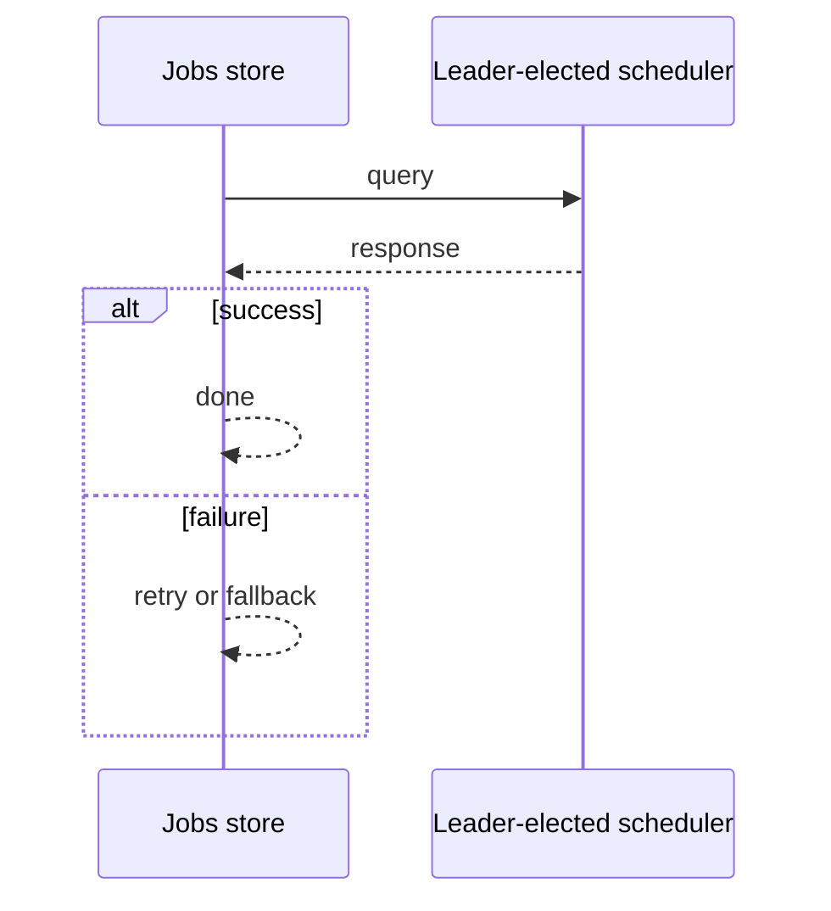
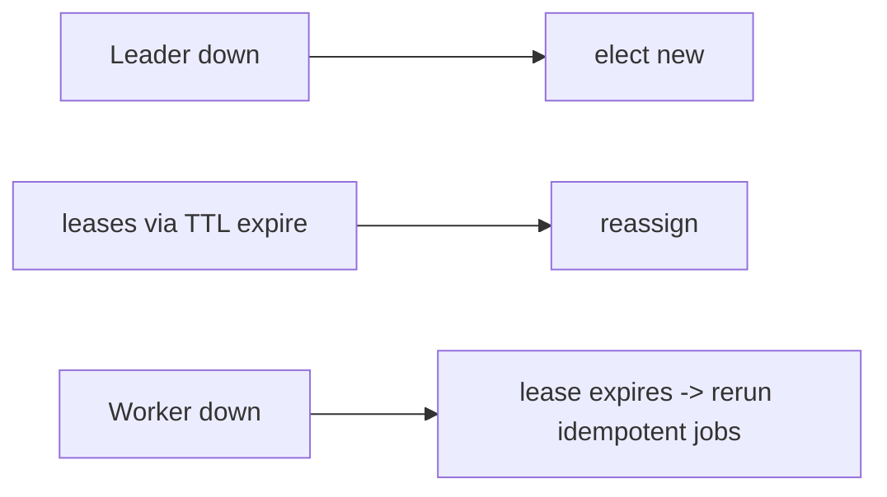

# Case Study: Distributed Scheduler

> **Tier:** advanced · **Status:** complete · Original numbers and diagrams.

## 1. Problem statement

Run scheduled jobs across a fleet with single-execution semantics, retries, and failure isolation — a distributed cron/batch runner.


## 2. Scope

In (v1): schedule jobs at a time/interval, single-execution, retries, status, concurrency caps. Out: DAG workflows (noted).


## 3. Functional requirements

- Schedule a job at a time or interval.
- Run exactly once even with many nodes.
- Retry on failure; record status.
- Enforce concurrency limits.


## 4. Non-functional requirements

- At-most-one execution per scheduled run.
- Availability 99.9% (jobs run, possibly late).
- Survive node loss without skipping.


## 5. Explicit assumptions

1. 100k jobs/day, 1k concurrent. [assumption] 2. Some jobs every minute; some daily. [assumption] 3. Jobs 1s-10min. [constraint]


## 6. Traffic estimation

Job execution spikes on cron boundaries (many at minute/hour/day rollover). Control plane is low-QPS.


## 7. Storage estimation

Job definitions + run history; small (GBs). The state to protect: 'has this run started?'


## 8. Bandwidth estimation

Job payloads small; worker-to-service control is light.


## 9. API design

| POST /jobs | schedule, action | id |
| GET |/jobs/:id/runs | | history |


## 10. Data model

jobs(id, schedule, action, concurrency); runs(job_id, run_id, status, attempts, ts). A lease/lock per (job, run).


## 11. High-level architecture

```mermaid
%% created-for: system-design-mastery
flowchart LR
  DB[Jobs store] --> Leader[Leader-elected scheduler]
  Leader -->|acquire lease per (job,run)| Workers
  Workers --> Exec[Execute job]
  Exec --> DB
  Workers -.fail.-> Requeue[reassign lease]
```


## 12. Request flow
At a job's time, the scheduler (leader) acquires a lease for (job, run), assigns a worker, executes, records status; on worker loss the lease expires and another worker runs it.




## 13. Component responsibilities

Scheduler (leader-elected), jobs store, workers, lease store.


## 14. Database selection

Relational for job defs + runs (small, transactional); a lease/lock store (consensus or DB row lock). Rejected: cron on every node (double-run).


## 15. Caching strategy

Schedule cache; lease in a fast store.


## 16. Partitioning strategy

Workers scaled by concurrent job count; leases partitioned by job hash. Time-based spikes handled by worker autoscaling.


## 17. Replication strategy

Jobs/runs replicated for durability. Leader election (Raft) ensures one scheduler. Lease TTL prevents a dead worker from holding a run forever.


## 18. Consistency model

Single-execution via lease + leader (strong for 'who runs this'). Run status eventually visible.


## 19. Failure scenarios
Leader down -> elect new; leases via TTL expire -> reassign. Worker down -> lease expires -> rerun (idempotent jobs). Double-run prevented by lease.




## 20. Reliability strategy

SLI job on-time %, double-run rate; SLO 99.9%. Leases + idempotent jobs. Chaos: kill leader and a worker, assert jobs run once.


## 21. Security considerations

Job auth (who may schedule); secret injection per job; isolate workers (untrusted job code).


## 22. Observability strategy

Job start/finish, run latency, missed runs, double-run count, worker utilization, queue at cron spikes.


## 23. Cost considerations

Workers (autoscaled) dominate; cost spikes at cron boundaries — scale workers and stagger.


## 24. Scaling stages

Stage 1: leader + workers. -> Stage 2: leases + idempotency. -> Stage 3: worker autoscaling + stagger. -> Stage 4: DAG workflows, multi-region.


## 25. Trade-offs

At-most-once (lease) vs at-least-once (idempotent retry) — both via lease + idempotent. Leader (simple) vs distributed lock per run.


## 26. Alternative designs

Cron on every node (double-run). A single scheduler no election (SPOF). External managed scheduler (offloads ops).


## 27. Interview discussion points

Clarify single-execution, retry, spikes. Surface leader election + leases + idempotency — the crux.


## 28. Original Mermaid diagrams
Standalone sources under `diagrams/case-studies/distributed-scheduler/`: `context.mmd`, `request-sequence.mmd`, `failure-flow.mmd`, `scaling-evolution.mmd`. The diagrams are embedded in their respective sections: architecture in section 11, request flow in section 12, failure scenarios in section 19, and scaling stages in section 24.

## 29. Further reading

Consensus/leases: Level 4; idempotency: Level 4; schedulers: Level 2.


## 30. Practical exercises

1. Add DAG dependencies. 2. Design staggering at cron spikes. 3. A job must not double-run across a partition. 4. Add per-tenant concurrency caps. 5. Multi-region scheduler failover.


---
Previous: Metrics platform · Next: Ride-hailing

