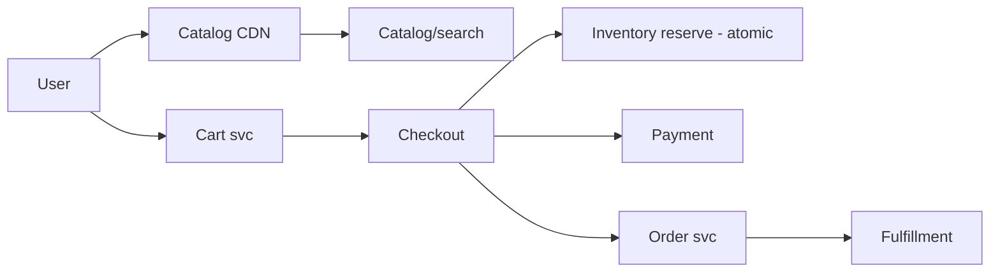
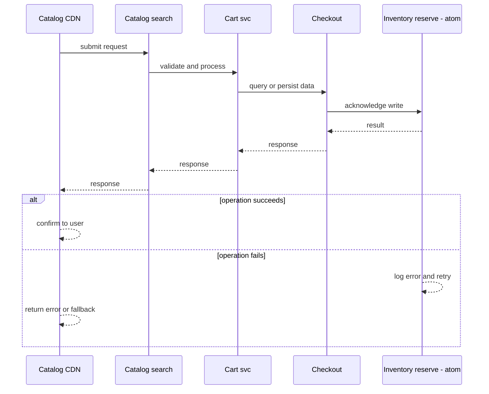
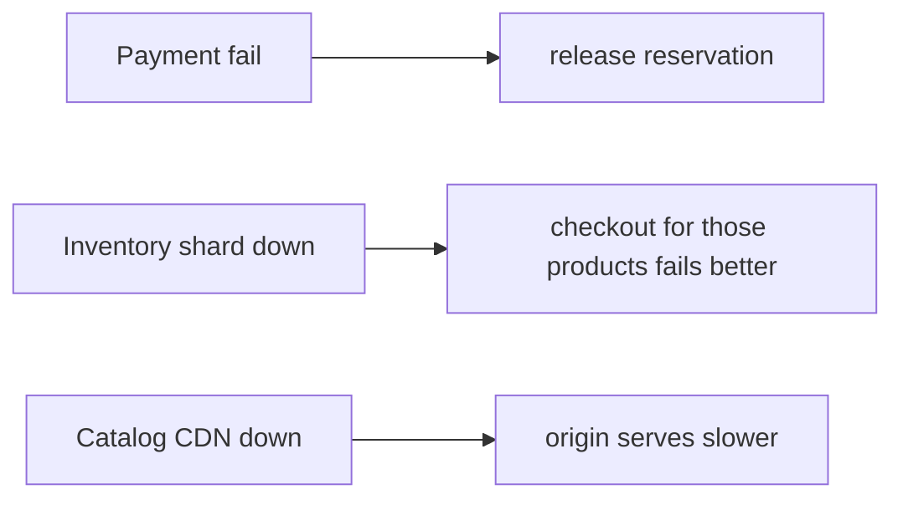
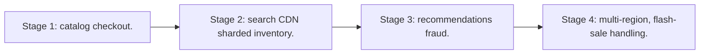

# Case Study: E-commerce Platform

> **Tier:** advanced · **Status:** complete · Original numbers and diagrams.

## 1. Problem statement
Browse catalog, cart, checkout, payment, orders, and fulfillment — a transactional commerce system with mixed read-heavy catalog and write-critical checkout. This is a advanced-tier system design challenge because it must handle high availability under peak load while ensuring no single point of failure. The design must be production-grade: observable, debuggable, reversible, and able to survive component failures without data loss or cascading outages.

## 2. Scope
In (v1): catalog browse, cart, checkout, payment, order, inventory. Out: recommendations, returns (stage).

For E-commerce Platform, these boundaries keep the first version focused on the core user value. Adding more features would dilute the design and delay shipping. Each excluded item is a scaling stage — a candidate for the next iteration once the baseline is proven.

## 3. Functional requirements
- Browse/search catalog.
- Manage cart.
- Checkout + pay.
- Place order + reserve inventory.
- Fulfill.

For E-commerce Platform, these requirements drive specific architectural decisions: the read-write ratio determines the caching strategy, the durability target sets the replication mode, and the idempotency requirement shapes the API contract.

## 4. Non-functional requirements
- Browse p99 < 200 ms (CDN/search).
- Checkout consistency: don't oversell inventory.
- Availability 99.95% (checkout = revenue).

For E-commerce Platform, each non-functional target constrains a specific component: the latency SLO bounds the number of synchronous hops, the availability target forces redundancy across availability zones, and the cost ceiling limits the replication factor and storage tier.

## 5. Explicit assumptions
1. 10M products, 1M orders/day. [assumption] 2. Catalog reads 100x writes. [assumption] 3. Inventory must not oversell. [constraint]

For E-commerce Platform, if these assumptions are off by an order of magnitude, the architecture must adapt: 10x traffic may require earlier sharding, a different read-write ratio changes the caching strategy, and a higher peak multiplier demands more headroom.

## 6. Traffic estimation
Catalog: millions of views/s; checkout: 1M/day ~12/s avg, ~300/s peak (events).

To derive the request rate: divide the daily volume by 86,400 seconds to get the average rate, then multiply by 5-10x for peak. The read-to-write ratio determines whether the system is cache-dominated (read-heavy) or write-path-dominated (write-heavy). For E-commerce Platform, this ratio shapes the entire storage and replication strategy.

## 7. Storage estimation
Catalog (10M products x KB = GBs-TBs with media); orders + inventory (transactional).

For E-commerce Platform, storage growth is projected from the daily write volume and retention policy. Index overhead and compression factors are accounted for in the total.

## 8. Bandwidth estimation
Catalog media via CDN (egress heavy); checkout small.

Bandwidth is request rate multiplied by average payload size for ingress, and response rate multiplied by response size for egress. CDN and edge caching reduce origin egress. Compression reduces bandwidth by 50-80 percent where applicable. For E-commerce Platform, bandwidth may or may not be the binding constraint — compare it against compute and storage to find out.

## 9. API design
| Method | Path | Request | Response |
|--------|------|---------|----------|
| GET /products?... |
| POST |/cart | | |
| POST /checkout | cart, payment | order id |

## 10. Data model
products(id, attrs, stock); cart(user, items); orders(id, items, status, payment); inventory(product, stock). Inventory reservation must be atomic.

For E-commerce Platform, the data model follows the access pattern. The primary lookup determines the partition key; secondary lookups determine indexes. Denormalization is used selectively on hot read paths.

## 11. High-level architecture

## 12. Request flow
Browse via CDN/search. Checkout reserves inventory atomically, charges payment, creates order, emits to fulfillment. Failed payment releases the reservation.

## 13. Component responsibilities
Catalog/search, cart, checkout, inventory, payment, order, fulfillment.

For E-commerce Platform, each component has one job. The gateway authenticates and routes. Services are stateless and scale horizontally. The data tier is the stateful core that scales by sharding.

## 14. Database selection
Catalog: search engine + KV. Orders/inventory: transactional RDBMS (atomic reserve). Rejected: inventory in a cache (oversell risk).

For E-commerce Platform, the database was chosen by access pattern, not familiarity. The rejected alternatives were wrong for this workload, not bad in general.

## 15. Caching strategy
Catalog on CDN + cache; cart cached per user. Inventory: cache for reads but reserve on the DB (authoritative).

For E-commerce Platform, the cache strategy matches the staleness tolerance. Cache-aside for most data, write-through where read-after-write matters, stampede protection on hot keys.

## 16. Partitioning strategy
Catalog sharded by category/id; orders by id; inventory by product (hot products need care).

For E-commerce Platform, the partition key balances query locality with even load distribution. Sharding strategy matters because a poor key creates hot spots under real traffic patterns.

## 17. Replication strategy
Catalog replicated widely (read-mostly); orders/inventory leader-follower RF=3; payment strongly consistent.

For E-commerce Platform, replication mode is split: synchronous where durability is critical, asynchronous elsewhere for throughput. RF=3 tolerates one failure. Failover is tested regularly.

## 18. Consistency model
Inventory: strong reservation (no oversell) via DB transaction. Catalog: eventually consistent. Orders: read-your-writes for the buyer.

For E-commerce Platform, the consistency level is the weakest users accept. Read-your-writes is provided where needed. Eventual consistency is bounded and monitored, not unbounded and silent.

## 19. Failure scenarios
Payment fail -> release reservation. Inventory shard down -> checkout for those products fails (better than oversell). Catalog CDN down -> origin serves (slower).

## 20. Reliability strategy
SLI checkout success, browse latency; SLO 99.95% checkout. Idempotent checkout (idempotency key). Chaos: kill an inventory shard, assert no oversell.

For E-commerce Platform, the SLO makes reliability measurable. The error budget balances feature velocity with stability. Chaos testing validates that resilience claims hold under real failures.

## 21. Security considerations
PCI for payment (tokenize, never store PAN); auth; rate-limit checkout abuse; anti-fraud hooks.

For E-commerce Platform, security layers TLS, encryption at rest, RBAC, PII redaction, and audit. The policy gateway is fail-closed for AI-augmented operations.

## 22. Observability strategy
Browse latency, checkout success, payment auth rate, inventory reservation failures, order lifecycle.

For E-commerce Platform, observability combines logs, metrics, and traces with correlation IDs. Golden signals drive the first dashboard. Alerts fire on burn rate, not raw thresholds.

## 23. Cost considerations
Catalog media egress (CDN) + payment fees + transactional DB. Inventory accuracy is correctness, not cost.

For E-commerce Platform, cost is driven by the binding resource. Caching, tiering, batching, and right-sizing are the levers. Cost per request is tracked and alerted on.

## 24. Scaling stages
Stage 1: catalog + checkout. -> Stage 2: search + CDN + sharded inventory. -> Stage 3: recommendations + fraud. -> Stage 4: multi-region, flash-sale handling.

## 25. Trade-offs
Inventory strong (no oversell) vs throughput. CDN catalog (fast) vs freshness. Idempotent checkout (safe) vs simple.

For E-commerce Platform, each trade-off lists what was chosen, what was rejected, and why. This makes the design defensible in review — every decision has documented reasoning.

## 26. Alternative designs
Inventory in cache (oversell). Single DB (won't scale catalog reads). Synchronous everything in checkout (fragile).

For E-commerce Platform, the alternatives are real architectures that work under different constraints. They were rejected for this workload's specific requirements, not because they are bad designs.

## 27. Interview discussion points
Clarify flash sales, oversell tolerance, checkout latency. Surface inventory atomicity, idempotent checkout, catalog caching.

For E-commerce Platform in an interview: clarify scope first, surface the read-write ratio, design the hot path deeply, discuss failures, and offer an alternative. Weak candidates skip failure modes.

## 28. Original Mermaid diagrams
Standalone sources under `diagrams/case-studies/ecommerce-platform/`: `context.mmd`, `request-sequence.mmd`, `failure-flow.mmd`, `scaling-evolution.mmd`. The diagrams are embedded in their respective sections: architecture in section 11, request flow in section 12, failure scenarios in section 19, and scaling stages in section 24.

## 29. Further reading
Search: Level 2; transactions: Level 4; caching: Level 2; payment: Level 10. Sources: `S-CHASH` `S-DYNAMO`.

## 30. Practical exercises

1. Design a flash sale (no oversell, no melt). 2. Inventory reservation across shards. 3. Idempotent checkout. 4. Cart read-your-writes. 5. Multi-region catalog freshness.

---
Previous: Food-delivery · Next: Inventory-management

