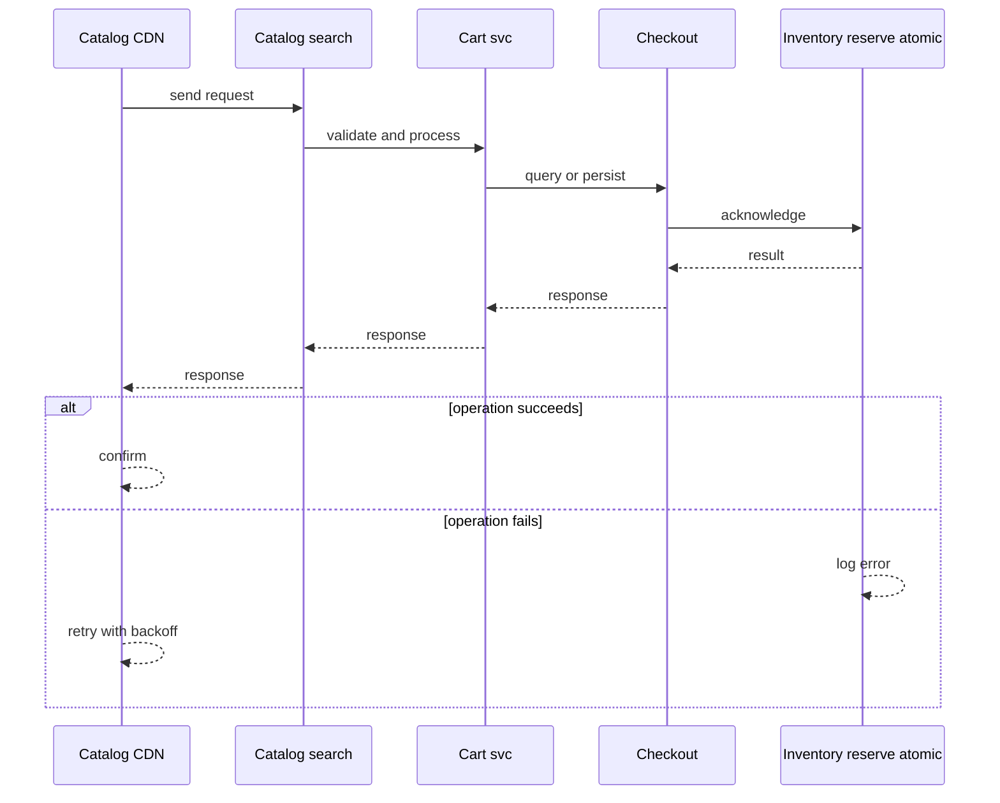
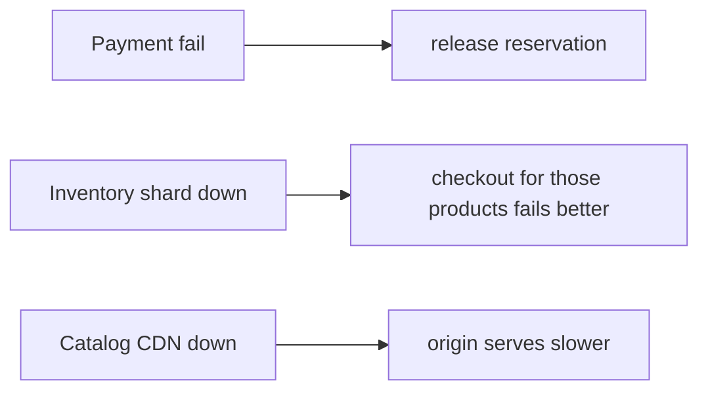
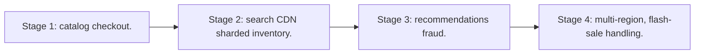

# Case Study: E-commerce Platform

> **Tier:** advanced · **Status:** complete · Original numbers and diagrams.

## 1. Problem statement

Browse catalog, cart, checkout, payment, orders, and fulfillment — a transactional commerce system with mixed read-heavy catalog and write-critical checkout.

## 2. Scope

In (v1): catalog browse, cart, checkout, payment, order, inventory. Out: recommendations, returns (stage).

## 3. Functional requirements

- Browse/search catalog.
- Manage cart.
- Checkout + pay.
- Place order + reserve inventory.
- Fulfill.

## 4. Non-functional requirements

- Browse p99 < 200 ms (CDN/search).
- Checkout consistency: don't oversell inventory.
- Availability 99.95% (checkout = revenue).

## 5. Explicit assumptions

1. 10M products, 1M orders/day. [assumption] 2. Catalog reads 100x writes. [assumption] 3. Inventory must not oversell. [constraint]

## 6. Traffic estimation
Catalog: millions of views/s; checkout: 1M/day ~12/s avg, ~300/s peak (events).

## 7. Storage estimation
Catalog (10M products x KB = GBs-TBs with media); orders + inventory (transactional).

## 8. Bandwidth estimation
Catalog media via CDN (egress heavy); checkout small.

## 9. API design
| Method | Path | Request | Response |
|--------|------|---------|----------|
| GET /products?... |
| POST |/cart | | |
| POST /checkout | cart, payment | order id |

## 10. Data model

products(id, attrs, stock); cart(user, items); orders(id, items, status, payment); inventory(product, stock). Inventory reservation must be atomic.

## 11. High-level architecture

```mermaid
%% created-for: system-design-mastery
flowchart LR
  User --> CDN[Catalog CDN] --> Catalog[Catalog/search]
  User --> Cart[Cart svc]
  Cart --> Checkout[Checkout]
  Checkout --> Inv[Inventory reserve (atomic)]
  Checkout --> Pay[Payment]
  Checkout --> Order[Order svc]
  Order --> Fulfill[Fulfillment]
```

## 12. Request flow
Browse via CDN/search. Checkout reserves inventory atomically, charges payment, creates order, emits to fulfillment. Failed payment releases the reservation.



## 13. Component responsibilities

Catalog/search, cart, checkout, inventory, payment, order, fulfillment.

## 14. Database selection

Catalog: search engine + KV. Orders/inventory: transactional RDBMS (atomic reserve). Rejected: inventory in a cache (oversell risk).

## 15. Caching strategy

Catalog on CDN + cache; cart cached per user. Inventory: cache for reads but reserve on the DB (authoritative).

## 16. Partitioning strategy

Catalog sharded by category/id; orders by id; inventory by product (hot products need care).

## 17. Replication strategy

Catalog replicated widely (read-mostly); orders/inventory leader-follower RF=3; payment strongly consistent.

## 18. Consistency model

Inventory: strong reservation (no oversell) via DB transaction. Catalog: eventually consistent. Orders: read-your-writes for the buyer.

## 19. Failure scenarios
Payment fail -> release reservation. Inventory shard down -> checkout for those products fails (better than oversell). Catalog CDN down -> origin serves (slower).



## 20. Reliability strategy

SLI checkout success, browse latency; SLO 99.95% checkout. Idempotent checkout (idempotency key). Chaos: kill an inventory shard, assert no oversell.

## 21. Security considerations

PCI for payment (tokenize, never store PAN); auth; rate-limit checkout abuse; anti-fraud hooks.

## 22. Observability strategy

Browse latency, checkout success, payment auth rate, inventory reservation failures, order lifecycle.

## 23. Cost considerations

Catalog media egress (CDN) + payment fees + transactional DB. Inventory accuracy is correctness, not cost.

## 24. Scaling stages
Stage 1: catalog + checkout. -> Stage 2: search + CDN + sharded inventory. -> Stage 3: recommendations + fraud. -> Stage 4: multi-region, flash-sale handling.



## 25. Trade-offs

Inventory strong (no oversell) vs throughput. CDN catalog (fast) vs freshness. Idempotent checkout (safe) vs simple.

## 26. Alternative designs

Inventory in cache (oversell). Single DB (won't scale catalog reads). Synchronous everything in checkout (fragile).

## 27. Interview discussion points

Clarify flash sales, oversell tolerance, checkout latency. Surface inventory atomicity, idempotent checkout, catalog caching.

## 28. Original Mermaid diagrams
Standalone sources under `diagrams/case-studies/ecommerce-platform/`: `context.mmd`, `request-sequence.mmd`, `failure-flow.mmd`, `scaling-evolution.mmd`. The diagrams are embedded in their respective sections: architecture in section 11, request flow in section 12, failure scenarios in section 19, and scaling stages in section 24.

## 29. Further reading
Search: Level 2; transactions: Level 4; caching: Level 2; payment: Level 10. Sources: `S-CHASH` `S-DYNAMO`.

## 30. Practical exercises

1. Design a flash sale (no oversell, no melt). 2. Inventory reservation across shards. 3. Idempotent checkout. 4. Cart read-your-writes. 5. Multi-region catalog freshness.

---
Previous: Food-delivery · Next: Inventory-management

