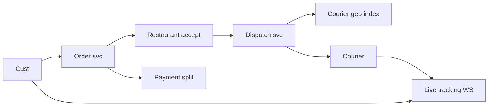

# Case Study: Food-Delivery Platform

> **Tier:** advanced · **Status:** draft · Original numbers and diagrams.

## 1. Problem statement

Customers order from restaurants; a courier delivers. Three-sided marketplace with real-time courier dispatch and order tracking.

## 2. Scope

In (v1): browse/order, restaurant accept, courier dispatch, live tracking, payment. Out: scheduled/group orders.

## 3. Functional requirements

- Customer orders from a restaurant. - Restaurant accepts/prepares. - Dispatch a courier; track delivery. - Pay all parties.

## 4. Non-functional requirements

- Dispatch latency < 30 s. - Tracking freshness < 5 s. - Availability 99.9%.

## 5. Explicit assumptions

1. 500k orders/day, ~30 min each. [assumption] 2. Couriers 50k. [assumption] 3. Peak 10x at meal times. [constraint]

## 6. Traffic estimation

500k orders/day; dispatch bursts at meal times; live tracking for every active order+courier.

## 7. Storage estimation

Restaurants/menu, orders, courier location; orders ~500k/day x KB; courier geo index live.

## 8. Bandwidth estimation

Live location updates from active couriers + order status pushes; small messages at scale.

## 9. API design

| POST /orders | items, restaurant | order id | | WS /orders/:id | | live status | | POST /couriers/location | loc | ack

## 10. Data model

restaurant(id, menu, loc); order(id, customer, restaurant, items, status, courier); courier(id, loc, status). Geo index of available couriers.

## 11. High-level architecture

## 12. Request flow

Order -> restaurant accepts -> dispatch finds a nearby available courier -> courier accepts -> live tracking -> on delivery, payment split to restaurant+courier.

## 13. Component responsibilities

Order svc, restaurant svc, dispatch + geo index, courier location, tracking gateway, payment.

## 14. Database selection

Order store (relational, transactional); geo index (in-memory); menu/restaurant KV. Payment needs ACID.

## 15. Caching strategy

Menu/restaurant cached; courier geo index in memory; order hot state cached.

## 16. Partitioning strategy

Geo index by region; orders by id; couriers sharded to location gateways.

## 17. Replication strategy

Order store RF=3; geo index replicated per region; courier location ephemeral.

## 18. Consistency model

Order status strongly tracked per order. Geo/dispatch eventually consistent across regions.

## 19. Failure scenarios

No courier nearby -> expand radius + queue + notify customer of delay. Tracking gateway down -> reconnect. Payment fail -> retry; order still tracked.

## 20. Reliability strategy

SLI dispatch latency, tracking freshness; SLO 99.9%. Expand-radius fallback; idempotent payment. Chaos: kill dispatch shard, assert degraded dispatch.

## 21. Security considerations

Customer/courier/restaurant auth; location privacy post-delivery; payment integrity; menu tamper protection.

## 22. Observability strategy

Dispatch latency, no-courier rate, tracking freshness, order lifecycle, payment success.

## 23. Cost considerations

Real-time infra + maps/routing + payment fees dominate. Couriers idle time is the marketplace economics, not infra.

## 24. Scaling stages

Stage 1: order + dispatch. -> Stage 2: geo-partitioned dispatch + tracking. -> Stage 3: batching, predicted ETAs. -> Stage 4: multi-region, marketplace balancing.

## 25. Trade-offs

Dispatch latency vs courier utilization. Live WS vs polling. Expand radius (match) vs wait (utilization).

## 26. Alternative designs

Polling tracking (latency/battery). Manual dispatch (doesn't scale). Central matcher (SPOF).

## 27. Interview discussion points

Clarify three-sided timing, dispatch radius, ETA. Surface geo dispatch, real-time tracking, payment split.

## 28. Original Mermaid diagrams

`diagrams/case-studies/food-delivery/context.mmd`; key diagram inline above.

## 29. Further reading

Geo: Level 3; real-time: Level 10; payment: Level 10 ledger.

## 30. Practical exercises

1. Add batching of nearby orders. 2. Predicted courier ETAs. 3. No-courier surge pricing. 4. Reconnect storm mitigation. 5. Multi-tenant restaurant onboarding.

---
Previous: Ride-hailing · Next: E-commerce
