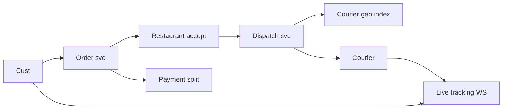
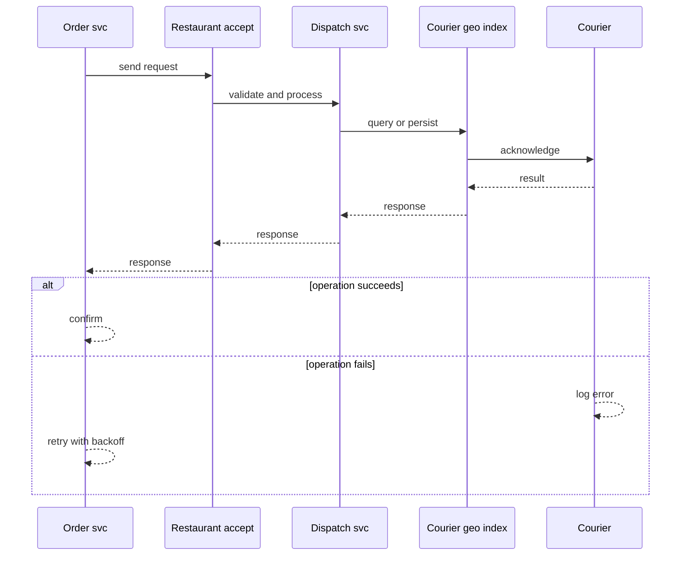
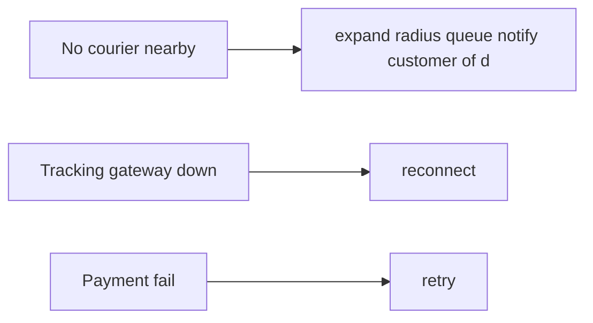
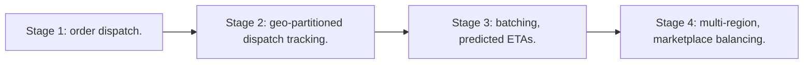

# Case Study: Food-Delivery Platform

> **Tier:** advanced · **Status:** complete · Original numbers and diagrams.

## 1. Problem statement
Customers order from restaurants; a courier delivers. Three-sided marketplace with real-time courier dispatch and order tracking. This is a advanced-tier system design challenge because it must handle high availability under peak load while ensuring no single point of failure. The design must be production-grade: observable, debuggable, reversible, and able to survive component failures without data loss or cascading outages.

## 2. Scope
In (v1): browse/order, restaurant accept, courier dispatch, live tracking, payment. Out: scheduled/group orders.

For Food-Delivery Platform, these boundaries keep the first version focused on the core user value. Adding more features would dilute the design and delay shipping. Each excluded item is a scaling stage — a candidate for the next iteration once the baseline is proven.

## 3. Functional requirements
- Customer orders from a restaurant.
- Restaurant accepts/prepares.
- Dispatch a courier; track delivery.
- Pay all parties.

For Food-Delivery Platform, these requirements drive specific architectural decisions: the read-write ratio determines the caching strategy, the durability target sets the replication mode, and the idempotency requirement shapes the API contract.

## 4. Non-functional requirements
- Dispatch latency < 30 s.
- Tracking freshness < 5 s.
- Availability 99.9%.

For Food-Delivery Platform, each non-functional target constrains a specific component: the latency SLO bounds the number of synchronous hops, the availability target forces redundancy across availability zones, and the cost ceiling limits the replication factor and storage tier.

## 5. Explicit assumptions
1. 500k orders/day, ~30 min each. [assumption] 2. Couriers 50k. [assumption] 3. Peak 10x at meal times. [constraint]

For Food-Delivery Platform, if these assumptions are off by an order of magnitude, the architecture must adapt: 10x traffic may require earlier sharding, a different read-write ratio changes the caching strategy, and a higher peak multiplier demands more headroom.

## 6. Traffic estimation
500k orders/day; dispatch bursts at meal times; live tracking for every active order+courier.

To derive the request rate: divide the daily volume by 86,400 seconds to get the average rate, then multiply by 5-10x for peak. The read-to-write ratio determines whether the system is cache-dominated (read-heavy) or write-path-dominated (write-heavy). For Food-Delivery Platform, this ratio shapes the entire storage and replication strategy.

## 7. Storage estimation
Restaurants/menu, orders, courier location; orders ~500k/day x KB; courier geo index live.

For Food-Delivery Platform, storage growth is projected from the daily write volume and retention policy. Index overhead and compression factors are accounted for in the total.

## 8. Bandwidth estimation
Live location updates from active couriers + order status pushes; small messages at scale.

Bandwidth is request rate multiplied by average payload size for ingress, and response rate multiplied by response size for egress. CDN and edge caching reduce origin egress. Compression reduces bandwidth by 50-80 percent where applicable. For Food-Delivery Platform, bandwidth may or may not be the binding constraint — compare it against compute and storage to find out.

## 9. API design
| Method | Path | Request | Response |
|--------|------|---------|----------|
| POST /orders | items, restaurant | order id |
| WS |/orders/:id | | live status |
| POST /couriers/location | loc | ack |

## 10. Data model
restaurant(id, menu, loc); order(id, customer, restaurant, items, status, courier); courier(id, loc, status). Geo index of available couriers.

For Food-Delivery Platform, the data model follows the access pattern. The primary lookup determines the partition key; secondary lookups determine indexes. Denormalization is used selectively on hot read paths.

## 11. High-level architecture

## 12. Request flow
Order -> restaurant accepts -> dispatch finds a nearby available courier -> courier accepts -> live tracking -> on delivery, payment split to restaurant+courier.

## 13. Component responsibilities
Order svc, restaurant svc, dispatch + geo index, courier location, tracking gateway, payment.

For Food-Delivery Platform, each component has one job. The gateway authenticates and routes. Services are stateless and scale horizontally. The data tier is the stateful core that scales by sharding.

## 14. Database selection
Order store (relational, transactional); geo index (in-memory); menu/restaurant KV. Payment needs ACID.

For Food-Delivery Platform, the database was chosen by access pattern, not familiarity. The rejected alternatives were wrong for this workload, not bad in general.

## 15. Caching strategy
Menu/restaurant cached; courier geo index in memory; order hot state cached.

For Food-Delivery Platform, the cache strategy matches the staleness tolerance. Cache-aside for most data, write-through where read-after-write matters, stampede protection on hot keys.

## 16. Partitioning strategy
Geo index by region; orders by id; couriers sharded to location gateways.

For Food-Delivery Platform, the partition key balances query locality with even load distribution. Sharding strategy matters because a poor key creates hot spots under real traffic patterns.

## 17. Replication strategy
Order store RF=3; geo index replicated per region; courier location ephemeral.

For Food-Delivery Platform, replication mode is split: synchronous where durability is critical, asynchronous elsewhere for throughput. RF=3 tolerates one failure. Failover is tested regularly.

## 18. Consistency model
Order status strongly tracked per order. Geo/dispatch eventually consistent across regions.

For Food-Delivery Platform, the consistency level is the weakest users accept. Read-your-writes is provided where needed. Eventual consistency is bounded and monitored, not unbounded and silent.

## 19. Failure scenarios
No courier nearby -> expand radius + queue + notify customer of delay. Tracking gateway down -> reconnect. Payment fail -> retry; order still tracked.

## 20. Reliability strategy
SLI dispatch latency, tracking freshness; SLO 99.9%. Expand-radius fallback; idempotent payment. Chaos: kill dispatch shard, assert degraded dispatch.

For Food-Delivery Platform, the SLO makes reliability measurable. The error budget balances feature velocity with stability. Chaos testing validates that resilience claims hold under real failures.

## 21. Security considerations
Customer/courier/restaurant auth; location privacy post-delivery; payment integrity; menu tamper protection.

For Food-Delivery Platform, security layers TLS, encryption at rest, RBAC, PII redaction, and audit. The policy gateway is fail-closed for AI-augmented operations.

## 22. Observability strategy
Dispatch latency, no-courier rate, tracking freshness, order lifecycle, payment success.

For Food-Delivery Platform, observability combines logs, metrics, and traces with correlation IDs. Golden signals drive the first dashboard. Alerts fire on burn rate, not raw thresholds.

## 23. Cost considerations
Real-time infra + maps/routing + payment fees dominate. Couriers idle time is the marketplace economics, not infra.

For Food-Delivery Platform, cost is driven by the binding resource. Caching, tiering, batching, and right-sizing are the levers. Cost per request is tracked and alerted on.

## 24. Scaling stages
Stage 1: order + dispatch. -> Stage 2: geo-partitioned dispatch + tracking. -> Stage 3: batching, predicted ETAs. -> Stage 4: multi-region, marketplace balancing.

## 25. Trade-offs
Dispatch latency vs courier utilization. Live WS vs polling. Expand radius (match) vs wait (utilization).

For Food-Delivery Platform, each trade-off lists what was chosen, what was rejected, and why. This makes the design defensible in review — every decision has documented reasoning.

## 26. Alternative designs
Polling tracking (latency/battery). Manual dispatch (doesn't scale). Central matcher (SPOF).

For Food-Delivery Platform, the alternatives are real architectures that work under different constraints. They were rejected for this workload's specific requirements, not because they are bad designs.

## 27. Interview discussion points
Clarify three-sided timing, dispatch radius, ETA. Surface geo dispatch, real-time tracking, payment split.

For Food-Delivery Platform in an interview: clarify scope first, surface the read-write ratio, design the hot path deeply, discuss failures, and offer an alternative. Weak candidates skip failure modes.

## 28. Original Mermaid diagrams
Standalone sources under `diagrams/case-studies/food-delivery/`: `context.mmd`, `request-sequence.mmd`, `failure-flow.mmd`, `scaling-evolution.mmd`. The diagrams are embedded in their respective sections: architecture in section 11, request flow in section 12, failure scenarios in section 19, and scaling stages in section 24.

## 29. Further reading
Geo: Level 3; real-time: Level 10; payment: Level 10 ledger. Sources: `S-CHASH` `S-DYNAMO`.

## 30. Practical exercises

1. Add batching of nearby orders. 2. Predicted courier ETAs. 3. No-courier surge pricing. 4. Reconnect storm mitigation. 5. Multi-tenant restaurant onboarding.

---
Previous: Ride-hailing · Next: E-commerce

