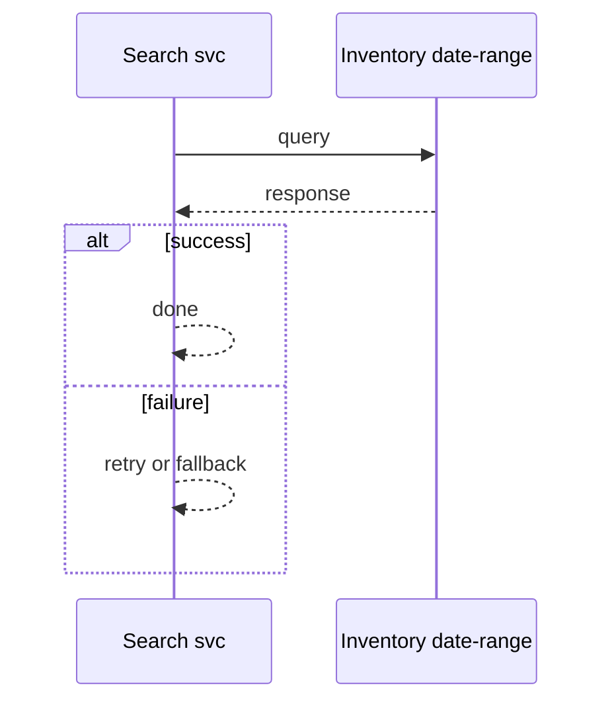
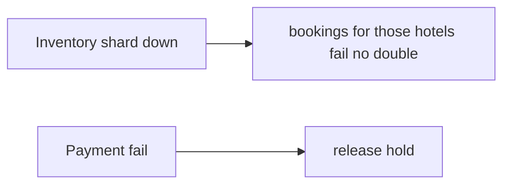

# Case Study: Hotel-Booking Platform

> **Tier:** advanced · **Status:** complete · Original numbers and diagrams.

## 1. Problem statement

Search hotel availability across many properties, hold/reserve rooms, and book — inventory with date ranges and overbooking-aware reservations.


## 2. Scope

In (v1): search by date/location, availability, reserve, book, pay. Out: dynamic pricing ML (stage).


## 3. Functional requirements

- Search available hotels by date/location. - Hold a room temporarily. - Confirm booking + pay. - Cancel/release.


## 4. Non-functional requirements

- No double-book a room. - Search p99 < 1 s. - Availability freshness near-real-time.


## 5. Explicit assumptions

1. 50k hotels, ~10 rooms each, 1M bookings/day. [assumption] 2. Date-range inventory per room/night. [assumption] 3. Hold expires in 10 min. [constraint]


## 6. Traffic estimation

Search high (millions/day); bookings ~12/s avg; availability checks higher.


## 7. Storage estimation

Inventory per (hotel, room, date) — a large sparse 3D structure; bookings history.


## 8. Bandwidth estimation

Search responses medium; booking small.


## 9. API design

| GET /search | city, date range | hotels | | POST /hold | room, dates | hold id | | POST /book | hold id, pay | booking id |


## 10. Data model

inventory(hotel, room, date, status); holds(id, hotel, room, dates, exp); bookings(id, hotel, room, dates, payment).


## 11. High-level architecture

```mermaid
%% created-for: system-design-mastery
flowchart LR
  User --> Search[Search svc] --> Inv[Inventory (date-range)]
  Search --> Results
  User --> Hold[Hold svc] --> Inv
  Hold --> Expire[Hold expiry]
  User --> Book[Book svc] --> Inv & Pay[Payment]
```


## 12. Request flow

Search queries date-range inventory -> hold temporarily reserves rooms (TTL) -> book confirms + pays, converting hold to booking; expiry releases holds.


## 13. Component responsibilities

Search, inventory store (date-range), hold service, booking, payment.


## 14. Database selection

Inventory: a store optimized for date-range availability (relational or KV keyed by (hotel,date)); bookings transactional. Rejected: naive scan (slow).


## 15. Caching strategy

Search results cached short TTL; availability cached with hold-aware invalidation.


## 16. Partitioning strategy

Inventory by hotel (co-locates a hotel's dates); bookings by id; search by region/geohash.


## 17. Replication strategy

Inventory RF=3; holds ephemeral (TTL). Bookings strongly durable.


## 18. Consistency model

Strong per (hotel,room,date): no double-book via atomic reserve. Search availability eventually consistent with holds.


## 19. Failure scenarios

Hold expiry releases rooms on timeout. Inventory shard down -> bookings for those hotels fail (no double-book). Payment fail -> release hold.


## 20. Reliability strategy

SLI search latency, double-book (0); SLO 99.9%. Hold TTL prevents stuck inventory. Chaos: kill inventory shard, assert no double-book.


## 21. Security considerations

Per-user auth; payment PCI; no leaking competitor inventory; rate-limit scraping.


## 22. Observability strategy

Search latency, hold conversion rate, expiry rate, double-book guards, payment success.


## 23. Cost considerations

Search infra + payment; inventory accuracy is correctness. Overbooking policy (if allowed) must be explicit.


## 24. Scaling stages

Stage 1: search + hold + book. -> Stage 2: sharded date-range inventory. -> Stage 3: dynamic pricing + recommendations. -> Stage 4: multi-region, overbooking-aware.


## 25. Trade-offs

Hold (no double-book) vs inventory tied up by abandoned holds (TTL). Strong inventory vs search throughput. Cache availability vs hold freshness.


## 26. Alternative designs

No hold (race/double-book). Mutable inventory no audit. Overbooking without explicit policy.


## 27. Interview discussion points

Clarify date-range inventory, hold/expiry, overbooking. Surface atomic reservation and the hold TTL.


## 28. Original Mermaid diagrams

Standalone sources under `diagrams/case-studies/hotel-booking/`: `context.mmd`, `request-sequence.mmd`, `failure-flow.mmd`, `scaling-evolution.mmd`. Request sequence and failure flow:





## 29. Further reading

Inventory/transactions: Level 4; search: Level 2; payment: Level 10.


## 30. Practical exercises

1. Overbooking policy (controlled). 2. Hot hotel/date contention. 3. Search across regions. 4. Hold expiry vs user still paying. 5. Dynamic pricing inputs.


---
Previous: Digital wallet · Next: Airline-reservation

