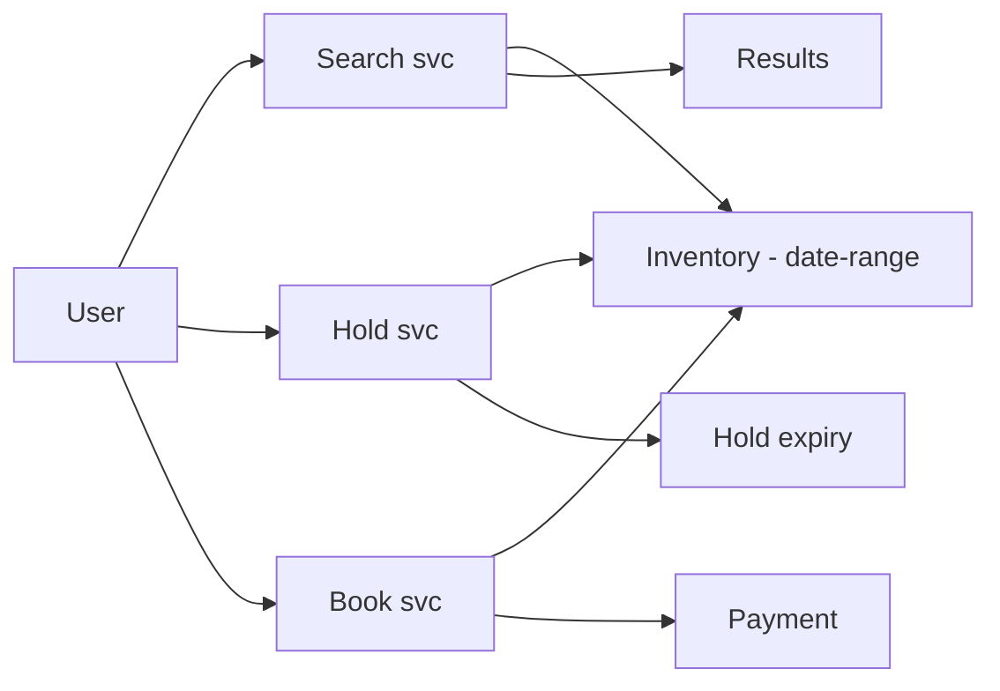
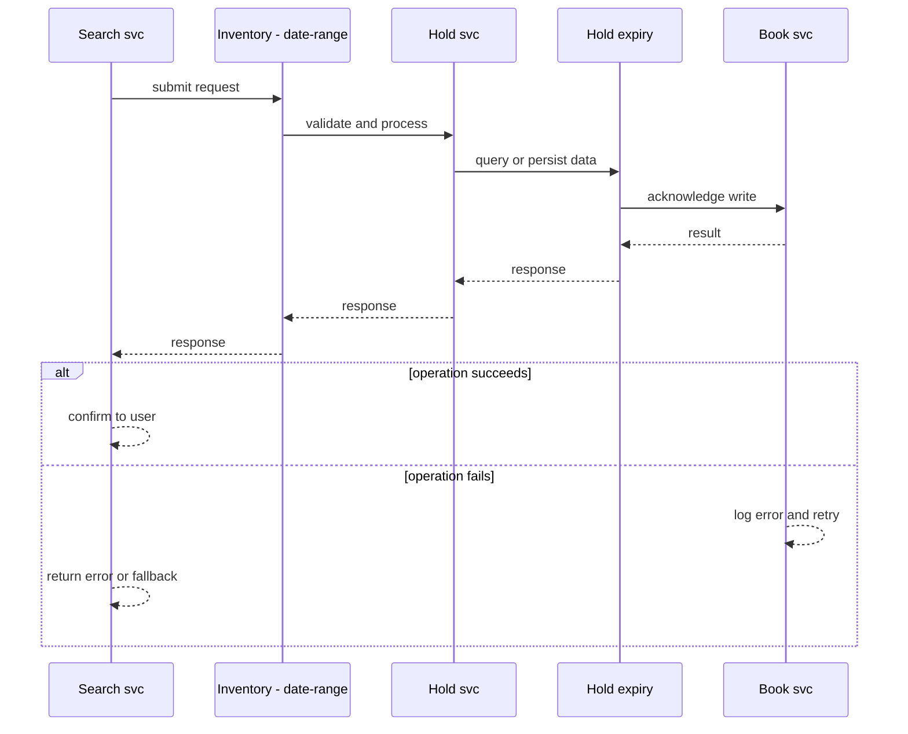
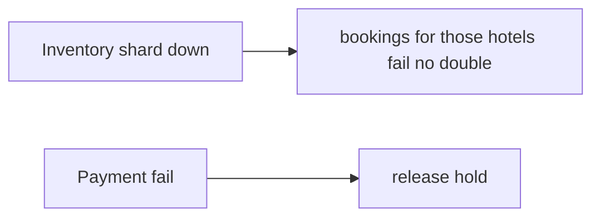
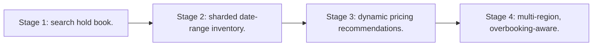

# Case Study: Hotel-Booking Platform

> **Tier:** advanced · **Status:** complete · Original numbers and diagrams.

## 1. Problem statement
Search hotel availability across many properties, hold/reserve rooms, and book — inventory with date ranges and overbooking-aware reservations. This is a advanced-tier system design challenge because it must handle high availability under peak load while ensuring no single point of failure. The design must be production-grade: observable, debuggable, reversible, and able to survive component failures without data loss or cascading outages.

## 2. Scope
In (v1): search by date/location, availability, reserve, book, pay. Out: dynamic pricing ML (stage).

For Hotel-Booking Platform, these boundaries keep the first version focused on the core user value. Adding more features would dilute the design and delay shipping. Each excluded item is a scaling stage — a candidate for the next iteration once the baseline is proven.

## 3. Functional requirements
- Search available hotels by date/location.
- Hold a room temporarily.
- Confirm booking + pay.
- Cancel/release.

For Hotel-Booking Platform, these requirements drive specific architectural decisions: the read-write ratio determines the caching strategy, the durability target sets the replication mode, and the idempotency requirement shapes the API contract.

## 4. Non-functional requirements
- No double-book a room.
- Search p99 < 1 s.
- Availability freshness near-real-time.

For Hotel-Booking Platform, each non-functional target constrains a specific component: the latency SLO bounds the number of synchronous hops, the availability target forces redundancy across availability zones, and the cost ceiling limits the replication factor and storage tier.

## 5. Explicit assumptions
1. 50k hotels, ~10 rooms each, 1M bookings/day. [assumption] 2. Date-range inventory per room/night. [assumption] 3. Hold expires in 10 min. [constraint]

For Hotel-Booking Platform, if these assumptions are off by an order of magnitude, the architecture must adapt: 10x traffic may require earlier sharding, a different read-write ratio changes the caching strategy, and a higher peak multiplier demands more headroom.

## 6. Traffic estimation
Search high (millions/day); bookings ~12/s avg; availability checks higher.

To derive the request rate: divide the daily volume by 86,400 seconds to get the average rate, then multiply by 5-10x for peak. The read-to-write ratio determines whether the system is cache-dominated (read-heavy) or write-path-dominated (write-heavy). For Hotel-Booking Platform, this ratio shapes the entire storage and replication strategy.

## 7. Storage estimation
Inventory per (hotel, room, date) — a large sparse 3D structure; bookings history.

For Hotel-Booking Platform, storage growth is projected from the daily write volume and retention policy. Index overhead and compression factors are accounted for in the total.

## 8. Bandwidth estimation
Search responses medium; booking small.

Bandwidth is request rate multiplied by average payload size for ingress, and response rate multiplied by response size for egress. CDN and edge caching reduce origin egress. Compression reduces bandwidth by 50-80 percent where applicable. For Hotel-Booking Platform, bandwidth may or may not be the binding constraint — compare it against compute and storage to find out.

## 9. API design
| Method | Path | Request | Response |
|--------|------|---------|----------|
| GET /search | city, date range | hotels |
| POST |/hold | room, dates | hold id |
| POST /book | hold id, pay | booking id |

## 10. Data model
inventory(hotel, room, date, status); holds(id, hotel, room, dates, exp); bookings(id, hotel, room, dates, payment).

For Hotel-Booking Platform, the data model follows the access pattern. The primary lookup determines the partition key; secondary lookups determine indexes. Denormalization is used selectively on hot read paths.

## 11. High-level architecture

## 12. Request flow
Search queries date-range inventory -> hold temporarily reserves rooms (TTL) -> book confirms + pays, converting hold to booking; expiry releases holds.

## 13. Component responsibilities
Search, inventory store (date-range), hold service, booking, payment.

For Hotel-Booking Platform, each component has one job. The gateway authenticates and routes. Services are stateless and scale horizontally. The data tier is the stateful core that scales by sharding.

## 14. Database selection
Inventory: a store optimized for date-range availability (relational or KV keyed by (hotel,date)); bookings transactional. Rejected: naive scan (slow).

For Hotel-Booking Platform, the database was chosen by access pattern, not familiarity. The rejected alternatives were wrong for this workload, not bad in general.

## 15. Caching strategy
Search results cached short TTL; availability cached with hold-aware invalidation.

For Hotel-Booking Platform, the cache strategy matches the staleness tolerance. Cache-aside for most data, write-through where read-after-write matters, stampede protection on hot keys.

## 16. Partitioning strategy
Inventory by hotel (co-locates a hotel's dates); bookings by id; search by region/geohash.

For Hotel-Booking Platform, the partition key balances query locality with even load distribution. Sharding strategy matters because a poor key creates hot spots under real traffic patterns.

## 17. Replication strategy
Inventory RF=3; holds ephemeral (TTL). Bookings strongly durable.

For Hotel-Booking Platform, replication mode is split: synchronous where durability is critical, asynchronous elsewhere for throughput. RF=3 tolerates one failure. Failover is tested regularly.

## 18. Consistency model
Strong per (hotel,room,date): no double-book via atomic reserve. Search availability eventually consistent with holds.

For Hotel-Booking Platform, the consistency level is the weakest users accept. Read-your-writes is provided where needed. Eventual consistency is bounded and monitored, not unbounded and silent.

## 19. Failure scenarios
Hold expiry releases rooms on timeout. Inventory shard down -> bookings for those hotels fail (no double-book). Payment fail -> release hold.

For Hotel-Booking Platform, each failure has a specific response plan. The design principle is degrade-don't-cascade: bulkheads isolate dependencies, circuit breakers stop calls to failing services, and timeouts bound every outbound call.

## 20. Reliability strategy
SLI search latency, double-book (0); SLO 99.9%. Hold TTL prevents stuck inventory. Chaos: kill inventory shard, assert no double-book.

For Hotel-Booking Platform, the SLO makes reliability measurable. The error budget balances feature velocity with stability. Chaos testing validates that resilience claims hold under real failures.

## 21. Security considerations
Per-user auth; payment PCI; no leaking competitor inventory; rate-limit scraping.

For Hotel-Booking Platform, security layers TLS, encryption at rest, RBAC, PII redaction, and audit. The policy gateway is fail-closed for AI-augmented operations.

## 22. Observability strategy
Search latency, hold conversion rate, expiry rate, double-book guards, payment success.

For Hotel-Booking Platform, observability combines logs, metrics, and traces with correlation IDs. Golden signals drive the first dashboard. Alerts fire on burn rate, not raw thresholds.

## 23. Cost considerations
Search infra + payment; inventory accuracy is correctness. Overbooking policy (if allowed) must be explicit.

For Hotel-Booking Platform, cost is driven by the binding resource. Caching, tiering, batching, and right-sizing are the levers. Cost per request is tracked and alerted on.

## 24. Scaling stages
Stage 1: search + hold + book. -> Stage 2: sharded date-range inventory. -> Stage 3: dynamic pricing + recommendations. -> Stage 4: multi-region, overbooking-aware.

## 25. Trade-offs
Hold (no double-book) vs inventory tied up by abandoned holds (TTL). Strong inventory vs search throughput. Cache availability vs hold freshness.

For Hotel-Booking Platform, each trade-off lists what was chosen, what was rejected, and why. This makes the design defensible in review — every decision has documented reasoning.

## 26. Alternative designs
No hold (race/double-book). Mutable inventory no audit. Overbooking without explicit policy.

For Hotel-Booking Platform, the alternatives are real architectures that work under different constraints. They were rejected for this workload's specific requirements, not because they are bad designs.

## 27. Interview discussion points
Clarify date-range inventory, hold/expiry, overbooking. Surface atomic reservation and the hold TTL.

For Hotel-Booking Platform in an interview: clarify scope first, surface the read-write ratio, design the hot path deeply, discuss failures, and offer an alternative. Weak candidates skip failure modes.

## 28. Original Mermaid diagrams
Standalone sources under `diagrams/case-studies/hotel-booking/`: `context.mmd`, `request-sequence.mmd`, `failure-flow.mmd`, `scaling-evolution.mmd`. The diagrams are embedded in their respective sections: architecture in section 11, request flow in section 12, failure scenarios in section 19, and scaling stages in section 24.

## 29. Further reading
Inventory/transactions: Level 4; search: Level 2; payment: Level 10. Sources: `S-CHASH` `S-DYNAMO`.

## 30. Practical exercises

1. Overbooking policy (controlled). 2. Hot hotel/date contention. 3. Search across regions. 4. Hold expiry vs user still paying. 5. Dynamic pricing inputs.

---
Previous: Digital wallet · Next: Airline-reservation

