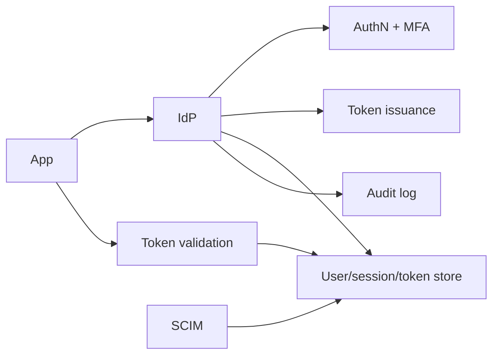
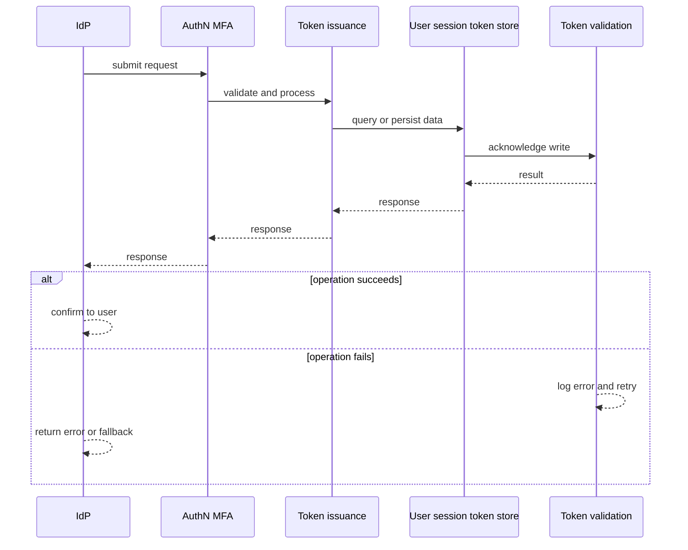
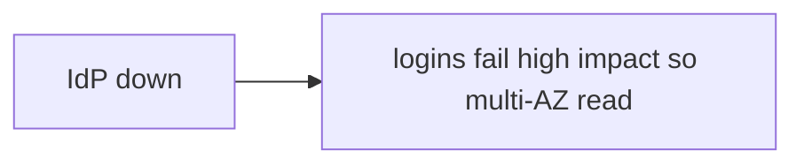
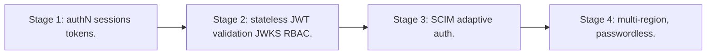

# Case Study: Identity & Access-Management Platform

> **Tier:** advanced · **Status:** complete · Original numbers and diagrams.

## 1. Problem statement
Issue and verify identities, manage sessions/tokens, and authorize access across many apps — a security-critical, high-availability root of trust. This is a advanced-tier system design challenge because it must handle high availability under peak load while ensuring no single point of failure. The design must be production-grade: observable, debuggable, reversible, and able to survive component failures without data loss or cascading outages.

## 2. Scope
In (v1): authN (password/MFA), sessions, token issuance/validation, RBAC, SCIM provisioning. Out: social IdP, adaptive auth (stage).

For Identity & Access-Management Platform, these boundaries keep the first version focused on the core user value. Adding more features would dilute the design and delay shipping. Each excluded item is a scaling stage — a candidate for the next iteration once the baseline is proven.

## 3. Functional requirements
- Authenticate users (password/MFA).
- Issue/validate tokens/sessions.
- Enforce authorization (RBAC).
- Provision/deprovision users (SCIM).
- Audit access.

For Identity & Access-Management Platform, these requirements drive specific architectural decisions: the read-write ratio determines the caching strategy, the durability target sets the replication mode, and the idempotency requirement shapes the API contract.

## 4. Non-functional requirements
- Availability 99.99% (every app depends on it).
- Token validation p99 < 20 ms.
- Strong security; revocation works.

For Identity & Access-Management Platform, each non-functional target constrains a specific component: the latency SLO bounds the number of synchronous hops, the availability target forces redundancy across availability zones, and the cost ceiling limits the replication factor and storage tier.

## 5. Explicit assumptions
1. 10M users, 100 apps. [assumption] 2. 1k logins/s, 50k token validations/s. [assumption] 3. MFA on sensitive actions. [constraint]

For Identity & Access-Management Platform, if these assumptions are off by an order of magnitude, the architecture must adapt: 10x traffic may require earlier sharding, a different read-write ratio changes the caching strategy, and a higher peak multiplier demands more headroom.

## 6. Traffic estimation
Token validation dominates (every API call); logins fewer. Read-heavy on the validation path.

To derive the request rate: divide the daily volume by 86,400 seconds to get the average rate, then multiply by 5-10x for peak. The read-to-write ratio determines whether the system is cache-dominated (read-heavy) or write-path-dominated (write-heavy). For Identity & Access-Management Platform, this ratio shapes the entire storage and replication strategy.

## 7. Storage estimation
Users, credentials (hashed), sessions, tokens, roles, audit logs. Small but security-critical.

For Identity & Access-Management Platform, storage growth is projected from the daily write volume and retention policy. Index overhead and compression factors are accounted for in the total.

## 8. Bandwidth estimation
Small payloads; bandwidth trivial. Latency + availability + security dominate.

Bandwidth is request rate multiplied by average payload size for ingress, and response rate multiplied by response size for egress. CDN and edge caching reduce origin egress. Compression reduces bandwidth by 50-80 percent where applicable. For Identity & Access-Management Platform, bandwidth may or may not be the binding constraint — compare it against compute and storage to find out.

## 9. API design
| Method | Path | Request | Response |
|--------|------|---------|----------|
| POST /login | creds | token |
| POST |/validate | token | valid/claims |
| GET /users/:id/roles | | roles |

## 10. Data model
users(id, creds_hash, mfa); sessions(id, user, exp); tokens(jti, user, scopes, exp, revoked); roles; audit(id, actor, action, ts).

For Identity & Access-Management Platform, the data model follows the access pattern. The primary lookup determines the partition key; secondary lookups determine indexes. Denormalization is used selectively on hot read paths.

## 11. High-level architecture

## 12. Request flow
Login: verify creds + MFA -> issue session/token -> audit. API call: app validates token with IdP (or via JWKS locally) -> enforce RBAC -> audit. Provisioning via SCIM.

## 13. Component responsibilities
AuthN/MFA, token service, session store, RBAC engine, validation (JWKS), SCIM, audit.

For Identity & Access-Management Platform, each component has one job. The gateway authenticates and routes. Services are stateless and scale horizontally. The data tier is the stateful core that scales by sharding.

## 14. Database selection
User/session store: strongly-consistent, durable (sync replication). Token validation: JWKS public keys cached locally (stateless validation). Audit: append-only. Rejected: per-call DB lookup for validation (latency).

For Identity & Access-Management Platform, the database was chosen by access pattern, not familiarity. The rejected alternatives were wrong for this workload, not bad in general.

## 15. Caching strategy
JWKS cached at apps for stateless JWT validation; session cache; revoke via short TTLs + denylist.

For Identity & Access-Management Platform, the cache strategy matches the staleness tolerance. Cache-aside for most data, write-through where read-after-write matters, stampede protection on hot keys.

## 16. Partitioning strategy
Users partitioned by id; validation distributed (stateless JWKS); audit partitioned by date.

For Identity & Access-Management Platform, the partition key balances query locality with even load distribution. Sharding strategy matters because a poor key creates hot spots under real traffic patterns.

## 17. Replication strategy
User/session store RF=3 synchronous; JWKS keys replicated to all apps; audit durable.

For Identity & Access-Management Platform, replication mode is split: synchronous where durability is critical, asynchronous elsewhere for throughput. RF=3 tolerates one failure. Failover is tested regularly.

## 18. Consistency model
Strong for authN (correct login). Tokens: revocation via short TTL + denylist (eventual). Audit append-only.

For Identity & Access-Management Platform, the consistency level is the weakest users accept. Read-your-writes is provided where needed. Eventual consistency is bounded and monitored, not unbounded and silent.

## 19. Failure scenarios
IdP down -> logins fail (high impact) so multi-AZ + read replicas; token validation via cached JWKS continues (apps stay up). Key rotation must be safe (dual-active).

For Identity & Access-Management Platform, each failure has a specific response plan. The design principle is degrade-don't-cascade: bulkheads isolate dependencies, circuit breakers stop calls to failing services, and timeouts bound every outbound call.

## 20. Reliability strategy
SLI login success, validation latency; SLO 99.99%. Stateless validation keeps apps up during IdP issues. Chaos: kill IdP writes, assert apps still validate tokens.

For Identity & Access-Management Platform, the SLO makes reliability measurable. The error budget balances feature velocity with stability. Chaos testing validates that resilience claims hold under real failures.

## 21. Security considerations
Hashed creds (slow KDF), MFA, short token TTL + rotation, JWKS rotation, audit, least privilege, SCIM deprovision.

For Identity & Access-Management Platform, security layers TLS, encryption at rest, RBAC, PII redaction, and audit. The policy gateway is fail-closed for AI-augmented operations.

## 22. Observability strategy
Login rate, MFA challenge rate, validation p99, token issuance, revocation events, failed-login spikes (abuse).

For Identity & Access-Management Platform, observability combines logs, metrics, and traces with correlation IDs. Golden signals drive the first dashboard. Alerts fire on burn rate, not raw thresholds.

## 23. Cost considerations
Always-on critical infra (multi-AZ) + audit storage. 99.99% costs more redundancy.

For Identity & Access-Management Platform, cost is driven by the binding resource. Caching, tiering, batching, and right-sizing are the levers. Cost per request is tracked and alerted on.

## 24. Scaling stages
Stage 1: authN + sessions + tokens. -> Stage 2: stateless JWT validation (JWKS) + RBAC. -> Stage 3: SCIM + adaptive auth. -> Stage 4: multi-region, passwordless.

## 25. Trade-offs
Stateless validation (scale, survives IdP issues) vs revocation difficulty (short TTL + denylist). 99.99% (cost) vs 99.9%. Centralized IdP (consistency) vs SPOF.

For Identity & Access-Management Platform, each trade-off lists what was chosen, what was rejected, and why. This makes the design defensible in review — every decision has documented reasoning.

## 26. Alternative designs
Per-app auth (duplicated, inconsistent, insecure). Long-lived un-revocable tokens (unsafe). Per-call DB validation (slow).

For Identity & Access-Management Platform, the alternatives are real architectures that work under different constraints. They were rejected for this workload's specific requirements, not because they are bad designs.

## 27. Interview discussion points
Clarify availability target, revocation, MFA. Surface stateless JWKS validation, short TTL + denylist, 99.99% redundancy.

For Identity & Access-Management Platform in an interview: clarify scope first, surface the read-write ratio, design the hot path deeply, discuss failures, and offer an alternative. Weak candidates skip failure modes.

## 28. Original Mermaid diagrams
Standalone sources under `diagrams/case-studies/iam-platform/`: `context.mmd`, `request-sequence.mmd`, `failure-flow.mmd`, `scaling-evolution.mmd`. The diagrams are embedded in their respective sections: architecture in section 11, request flow in section 12, failure scenarios in section 19, and scaling stages in section 24.

## 29. Further reading
Auth/OIDC/JWT: Level 7; RBAC/zero-trust: Level 7. Sources: `S-CHASH` `S-DYNAMO`.

## 30. Practical exercises

1. JWKS rotation with zero downtime. 2. Token revocation at scale. 3. Adaptive/MFA step-up. 4. Survive IdP write outage (apps stay up). 5. SCIM deprovision race.

---
Previous: API gateway · Next: Real-time analytics platform

