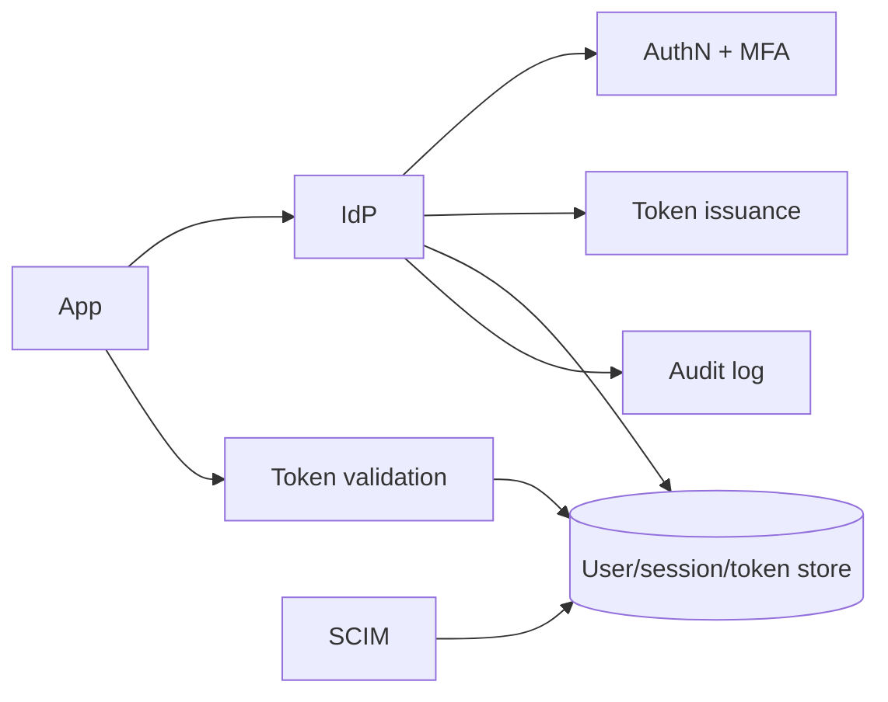
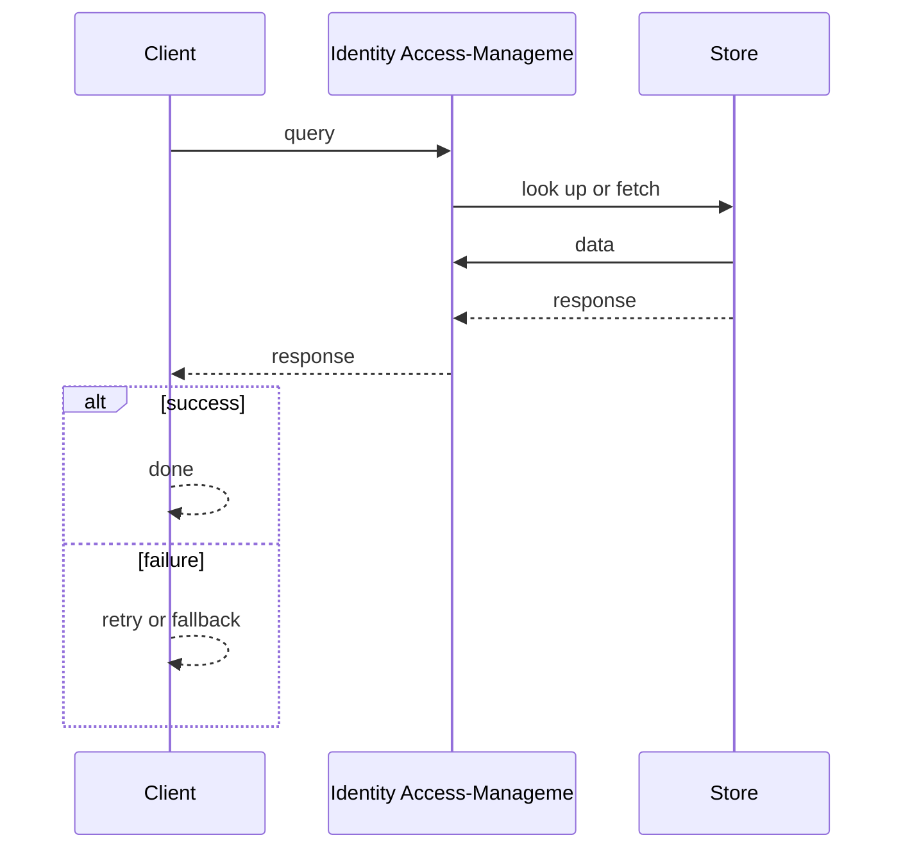
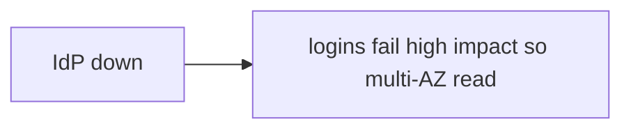

# Case Study: Identity & Access-Management Platform

> **Tier:** advanced · **Status:** complete · Original numbers and diagrams.

## 1. Problem statement

Issue and verify identities, manage sessions/tokens, and authorize access across many apps — a security-critical, high-availability root of trust.

## 2. Scope

In (v1): authN (password/MFA), sessions, token issuance/validation, RBAC, SCIM provisioning. Out: social IdP, adaptive auth (stage).

## 3. Functional requirements

- Authenticate users (password/MFA).
- Issue/validate tokens/sessions.
- Enforce authorization (RBAC).
- Provision/deprovision users (SCIM).
- Audit access.

## 4. Non-functional requirements

- Availability 99.99% (every app depends on it).
- Token validation p99 < 20 ms.
- Strong security; revocation works.

## 5. Explicit assumptions

1. 10M users, 100 apps. [assumption] 2. 1k logins/s, 50k token validations/s. [assumption] 3. MFA on sensitive actions. [constraint]

## 6. Traffic estimation

Token validation dominates (every API call); logins fewer. Read-heavy on the validation path.

## 7. Storage estimation

Users, credentials (hashed), sessions, tokens, roles, audit logs. Small but security-critical.

## 8. Bandwidth estimation

Small payloads; bandwidth trivial. Latency + availability + security dominate.

## 9. API design

| POST /login | creds | token |
| POST |/validate | token | valid/claims | | GET /users/:id/roles | | roles |

## 10. Data model

users(id, creds_hash, mfa); sessions(id, user, exp); tokens(jti, user, scopes, exp, revoked); roles; audit(id, actor, action, ts).

## 11. High-level architecture

## 12. Request flow

Login: verify creds + MFA -> issue session/token -> audit. API call: app validates token with IdP (or via JWKS locally) -> enforce RBAC -> audit. Provisioning via SCIM.

## 13. Component responsibilities

AuthN/MFA, token service, session store, RBAC engine, validation (JWKS), SCIM, audit.

## 14. Database selection

User/session store: strongly-consistent, durable (sync replication). Token validation: JWKS public keys cached locally (stateless validation). Audit: append-only. Rejected: per-call DB lookup for validation (latency).

## 15. Caching strategy

JWKS cached at apps for stateless JWT validation; session cache; revoke via short TTLs + denylist.

## 16. Partitioning strategy

Users partitioned by id; validation distributed (stateless JWKS); audit partitioned by date.

## 17. Replication strategy

User/session store RF=3 synchronous; JWKS keys replicated to all apps; audit durable.

## 18. Consistency model

Strong for authN (correct login). Tokens: revocation via short TTL + denylist (eventual). Audit append-only.

## 19. Failure scenarios

IdP down -> logins fail (high impact) so multi-AZ + read replicas; token validation via cached JWKS continues (apps stay up). Key rotation must be safe (dual-active).

## 20. Reliability strategy

SLI login success, validation latency; SLO 99.99%. Stateless validation keeps apps up during IdP issues. Chaos: kill IdP writes, assert apps still validate tokens.

## 21. Security considerations

Hashed creds (slow KDF), MFA, short token TTL + rotation, JWKS rotation, audit, least privilege, SCIM deprovision.

## 22. Observability strategy

Login rate, MFA challenge rate, validation p99, token issuance, revocation events, failed-login spikes (abuse).

## 23. Cost considerations

Always-on critical infra (multi-AZ) + audit storage. 99.99% costs more redundancy.

## 24. Scaling stages

Stage 1: authN + sessions + tokens. -> Stage 2: stateless JWT validation (JWKS) + RBAC. -> Stage 3: SCIM + adaptive auth. -> Stage 4: multi-region, passwordless.

## 25. Trade-offs

Stateless validation (scale, survives IdP issues) vs revocation difficulty (short TTL + denylist). 99.99% (cost) vs 99.9%. Centralized IdP (consistency) vs SPOF.

## 26. Alternative designs

Per-app auth (duplicated, inconsistent, insecure). Long-lived un-revocable tokens (unsafe). Per-call DB validation (slow).

## 27. Interview discussion points

Clarify availability target, revocation, MFA. Surface stateless JWKS validation, short TTL + denylist, 99.99% redundancy.

## 28. Original Mermaid diagrams

Standalone sources under `diagrams/case-studies/iam-platform/`: `context.mmd`, `request-sequence.mmd`, `failure-flow.mmd`, `scaling-evolution.mmd`. Request sequence and failure flow:

## 29. Further reading

Auth/OIDC/JWT: Level 7; RBAC/zero-trust: Level 7.

## 30. Practical exercises

1. JWKS rotation with zero downtime. 2. Token revocation at scale. 3. Adaptive/MFA step-up. 4. Survive IdP write outage (apps stay up). 5. SCIM deprovision race.

---
Previous: API gateway · Next: Real-time analytics platform

