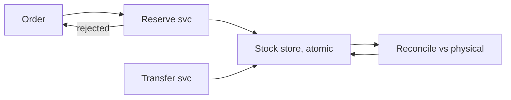
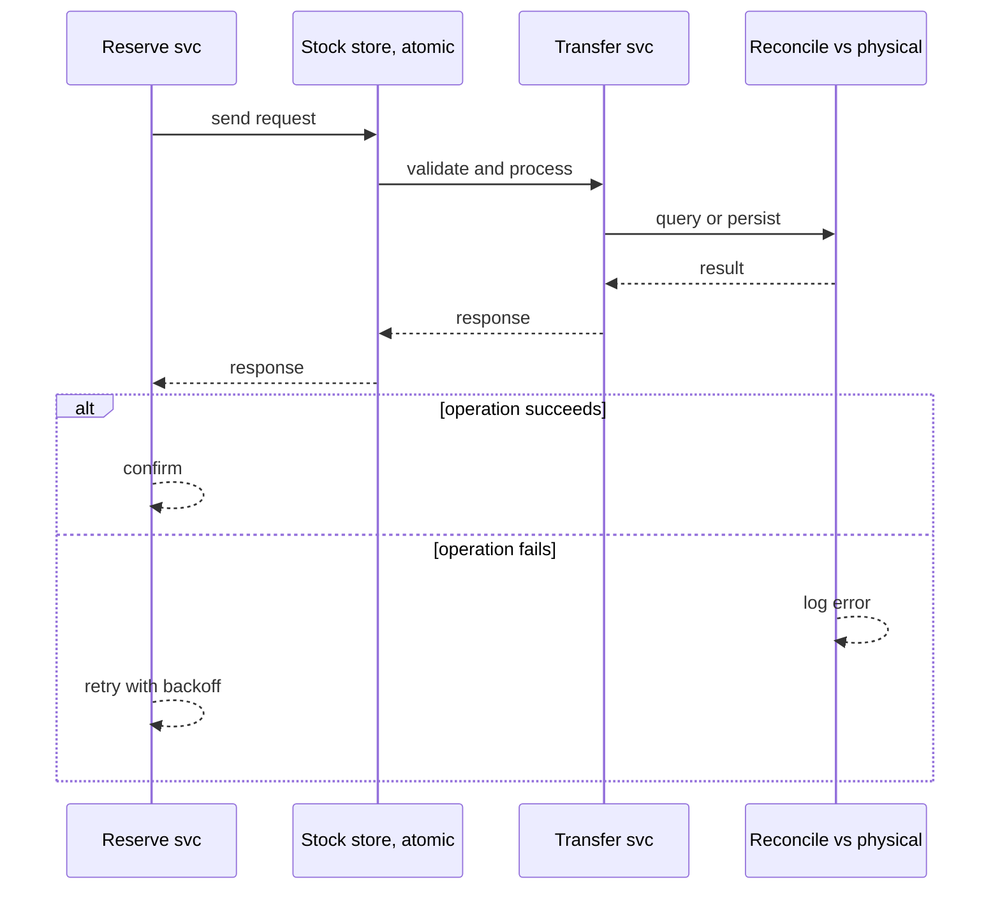
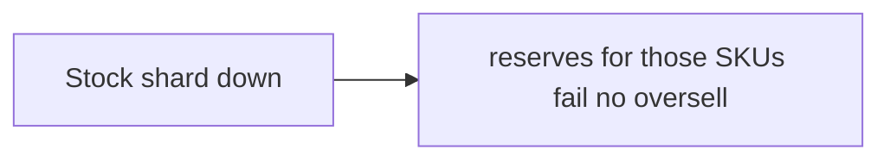
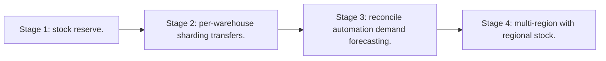

# Case Study: Inventory-Management Platform

> **Tier:** advanced · **Status:** complete · Original numbers and diagrams.

## 1. Problem statement

Track stock across many warehouses in real time, with atomic reservations and reconciliation — a strongly-consistent, write-critical system.

## 2. Scope

In (v1): per-warehouse stock, reservations, transfers, reconciliation. Out: demand forecasting (stage).

## 3. Functional requirements

- Track stock per warehouse/SKU.
- Atomically reserve/release on order.
- Transfer between warehouses.
- Reconcile to physical counts.

## 4. Non-functional requirements

- No oversell.
- Reserve latency < 50 ms.
- Availability 99.9%.

## 5. Explicit assumptions

1. 1M SKUs, 100 warehouses. [assumption] 2. Reserves 1k/s avg, 10k/s peak. [assumption] 3. Stock must not go negative. [constraint]

## 6. Traffic estimation
Reserve/release ~1k/s; reads higher (availability checks). Write-critical correctness path.

## 7. Storage estimation

Stock per (warehouse, SKU) — small but high-write; reservation log; transfer history.

## 8. Bandwidth estimation
Small messages; bandwidth trivial; correctness is the concern.

## 9. API design
| Method | Path | Request | Response |
|--------|------|---------|----------|
| POST /reserve | wh, sku, qty | reserved/rejected |
| POST |/release | reserve id | ack |
| POST /transfer | from,to,sku,qty | ack |

## 10. Data model

stock(warehouse, sku, available, reserved); reservations(id, wh, sku, qty, status); transfers(id, from, to, sku, qty).

## 11. High-level architecture

## 12. Request flow
Reserve: atomic decrement of available + increment reserved; reject if insufficient. Release reverses. Transfer moves stock between warehouses atomically. Reconcile adjusts to physical counts with audit.

## 13. Component responsibilities

Reserve svc, stock store (atomic), transfer svc, reconcile job.

## 14. Database selection

Transactional RDBMS or a strongly-consistent KV with atomic compare-and-set per (wh,sku). Rejected: cache as authoritative (oversell).

## 15. Caching strategy

Read cache for availability; reservations always on the authoritative store.

## 16. Partitioning strategy

Partition by warehouse (co-locates a warehouse's SKUs; transfers cross-partition but are rare). Hot SKUs partitioned further.

## 17. Replication strategy

Stock RF=3, synchronous replication on the reserve path for no-oversell after failover.

## 18. Consistency model

Strong per (warehouse, SKU): atomic reserve; no oversell even under failover. Cross-warehouse transfers are transactions.

## 19. Failure scenarios
Stock shard down -> reserves for those SKUs fail (no oversell); reads return last-known or unavailable. Reconcile corrects drift.

## 20. Reliability strategy

SLI reserve latency, oversell rate (must be 0); SLO 99.9%. Idempotent reserves. Chaos: kill a stock shard, assert rejects not oversell.

## 21. Security considerations

Per-warehouse auth; audit all stock changes; tamper-evident reconciliation.

## 22. Observability strategy

Reserve latency, reject rate, stock drift, reconcile adjustments, transfer backlog.

## 23. Cost considerations

Transactional DB; correctness-first. Hot-SKU contention (not cost) is the operational challenge.

## 24. Scaling stages
Stage 1: stock + reserve. -> Stage 2: per-warehouse sharding + transfers. -> Stage 3: reconcile automation + demand forecasting. -> Stage 4: multi-region with regional stock.

## 25. Trade-offs

Strong consistency (no oversell) vs throughput. Per-warehouse partitioning (locality) vs cross-wh transfers. Cache reads (fast) vs authoritative reserve (correct).

## 26. Alternative designs

Eventual stock (oversell). Cache as source (oversell). Denormalized stock per region (reconciliation pain).

## 27. Interview discussion points

Clarify oversell tolerance, warehouse model, transfers. Surface atomic reservation and reconciliation.

## 28. Original Mermaid diagrams
Standalone sources under `diagrams/case-studies/inventory-management/`: `context.mmd`, `request-sequence.mmd`, `failure-flow.mmd`, `scaling-evolution.mmd`. The diagrams are embedded in their respective sections: architecture in section 11, request flow in section 12, failure scenarios in section 19, and scaling stages in section 24.

## 29. Further reading
Transactions: Level 4; sharding: Level 3; consistency: Level 4. Sources: `S-CHASH` `S-DYNAMO`.

## 30. Practical exercises

1. Hot SKU contention mitigation. 2. Transfer atomicity across warehouses. 3. Reconcile after a shard failure. 4. Multi-region regional stock. 5. Demand forecasting inputs.

---
Previous: E-commerce · Next: Payment gateway

