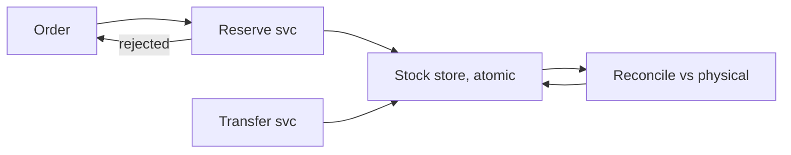
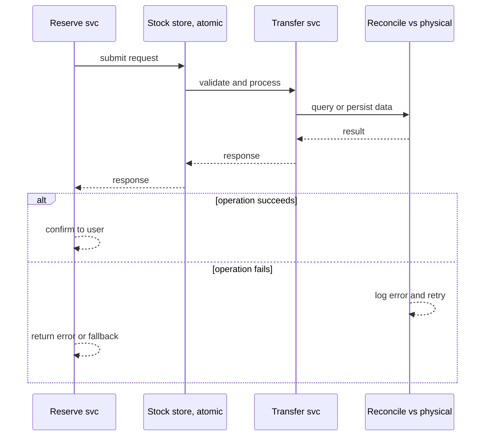
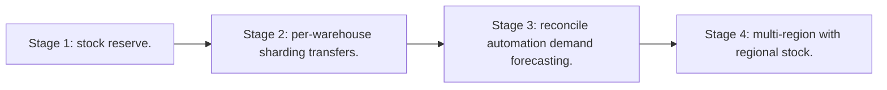

# Case Study: Inventory-Management Platform

> **Tier:** advanced · **Status:** complete · Original numbers and diagrams.

## 1. Problem statement
Track stock across many warehouses in real time, with atomic reservations and reconciliation — a strongly-consistent, write-critical system. This is a advanced-tier system design challenge because it must handle high availability under peak load while ensuring no single point of failure. The design must be production-grade: observable, debuggable, reversible, and able to survive component failures without data loss or cascading outages.

## 2. Scope
In (v1): per-warehouse stock, reservations, transfers, reconciliation. Out: demand forecasting (stage).

For Inventory-Management Platform, these boundaries keep the first version focused on the core user value. Adding more features would dilute the design and delay shipping. Each excluded item is a scaling stage — a candidate for the next iteration once the baseline is proven.

## 3. Functional requirements
- Track stock per warehouse/SKU.
- Atomically reserve/release on order.
- Transfer between warehouses.
- Reconcile to physical counts.

For Inventory-Management Platform, these requirements drive specific architectural decisions: the read-write ratio determines the caching strategy, the durability target sets the replication mode, and the idempotency requirement shapes the API contract.

## 4. Non-functional requirements
- No oversell.
- Reserve latency < 50 ms.
- Availability 99.9%.

For Inventory-Management Platform, each non-functional target constrains a specific component: the latency SLO bounds the number of synchronous hops, the availability target forces redundancy across availability zones, and the cost ceiling limits the replication factor and storage tier.

## 5. Explicit assumptions
1. 1M SKUs, 100 warehouses. [assumption] 2. Reserves 1k/s avg, 10k/s peak. [assumption] 3. Stock must not go negative. [constraint]

For Inventory-Management Platform, if these assumptions are off by an order of magnitude, the architecture must adapt: 10x traffic may require earlier sharding, a different read-write ratio changes the caching strategy, and a higher peak multiplier demands more headroom.

## 6. Traffic estimation
Reserve/release ~1k/s; reads higher (availability checks). Write-critical correctness path.

To derive the request rate: divide the daily volume by 86,400 seconds to get the average rate, then multiply by 5-10x for peak. The read-to-write ratio determines whether the system is cache-dominated (read-heavy) or write-path-dominated (write-heavy). For Inventory-Management Platform, this ratio shapes the entire storage and replication strategy.

## 7. Storage estimation
Stock per (warehouse, SKU) — small but high-write; reservation log; transfer history.

For Inventory-Management Platform, storage growth is projected from the daily write volume and retention policy. Index overhead and compression factors are accounted for in the total.

## 8. Bandwidth estimation
Small messages; bandwidth trivial; correctness is the concern.

Bandwidth is request rate multiplied by average payload size for ingress, and response rate multiplied by response size for egress. CDN and edge caching reduce origin egress. Compression reduces bandwidth by 50-80 percent where applicable. For Inventory-Management Platform, bandwidth may or may not be the binding constraint — compare it against compute and storage to find out.

## 9. API design
| Method | Path | Request | Response |
|--------|------|---------|----------|
| POST /reserve | wh, sku, qty | reserved/rejected |
| POST |/release | reserve id | ack |
| POST /transfer | from,to,sku,qty | ack |

## 10. Data model
stock(warehouse, sku, available, reserved); reservations(id, wh, sku, qty, status); transfers(id, from, to, sku, qty).

For Inventory-Management Platform, the data model follows the access pattern. The primary lookup determines the partition key; secondary lookups determine indexes. Denormalization is used selectively on hot read paths.

## 11. High-level architecture

## 12. Request flow
Reserve: atomic decrement of available + increment reserved; reject if insufficient. Release reverses. Transfer moves stock between warehouses atomically. Reconcile adjusts to physical counts with audit.

## 13. Component responsibilities
Reserve svc, stock store (atomic), transfer svc, reconcile job.

For Inventory-Management Platform, each component has one job. The gateway authenticates and routes. Services are stateless and scale horizontally. The data tier is the stateful core that scales by sharding.

## 14. Database selection
Transactional RDBMS or a strongly-consistent KV with atomic compare-and-set per (wh,sku). Rejected: cache as authoritative (oversell).

For Inventory-Management Platform, the database was chosen by access pattern, not familiarity. The rejected alternatives were wrong for this workload, not bad in general.

## 15. Caching strategy
Read cache for availability; reservations always on the authoritative store.

For Inventory-Management Platform, the cache strategy matches the staleness tolerance. Cache-aside for most data, write-through where read-after-write matters, stampede protection on hot keys.

## 16. Partitioning strategy
Partition by warehouse (co-locates a warehouse's SKUs; transfers cross-partition but are rare). Hot SKUs partitioned further.

For Inventory-Management Platform, the partition key balances query locality with even load distribution. Sharding strategy matters because a poor key creates hot spots under real traffic patterns.

## 17. Replication strategy
Stock RF=3, synchronous replication on the reserve path for no-oversell after failover.

For Inventory-Management Platform, replication mode is split: synchronous where durability is critical, asynchronous elsewhere for throughput. RF=3 tolerates one failure. Failover is tested regularly.

## 18. Consistency model
Strong per (warehouse, SKU): atomic reserve; no oversell even under failover. Cross-warehouse transfers are transactions.

For Inventory-Management Platform, the consistency level is the weakest users accept. Read-your-writes is provided where needed. Eventual consistency is bounded and monitored, not unbounded and silent.

## 19. Failure scenarios
Stock shard down -> reserves for those SKUs fail (no oversell); reads return last-known or unavailable. Reconcile corrects drift.

For Inventory-Management Platform, each failure has a specific response plan. The design principle is degrade-don't-cascade: bulkheads isolate dependencies, circuit breakers stop calls to failing services, and timeouts bound every outbound call.

## 20. Reliability strategy
SLI reserve latency, oversell rate (must be 0); SLO 99.9%. Idempotent reserves. Chaos: kill a stock shard, assert rejects not oversell.

For Inventory-Management Platform, the SLO makes reliability measurable. The error budget balances feature velocity with stability. Chaos testing validates that resilience claims hold under real failures.

## 21. Security considerations
Per-warehouse auth; audit all stock changes; tamper-evident reconciliation.

For Inventory-Management Platform, security layers TLS, encryption at rest, RBAC, PII redaction, and audit. The policy gateway is fail-closed for AI-augmented operations.

## 22. Observability strategy
Reserve latency, reject rate, stock drift, reconcile adjustments, transfer backlog.

For Inventory-Management Platform, observability combines logs, metrics, and traces with correlation IDs. Golden signals drive the first dashboard. Alerts fire on burn rate, not raw thresholds.

## 23. Cost considerations
Transactional DB; correctness-first. Hot-SKU contention (not cost) is the operational challenge.

For Inventory-Management Platform, cost is driven by the binding resource. Caching, tiering, batching, and right-sizing are the levers. Cost per request is tracked and alerted on.

## 24. Scaling stages
Stage 1: stock + reserve. -> Stage 2: per-warehouse sharding + transfers. -> Stage 3: reconcile automation + demand forecasting. -> Stage 4: multi-region with regional stock.

## 25. Trade-offs
Strong consistency (no oversell) vs throughput. Per-warehouse partitioning (locality) vs cross-wh transfers. Cache reads (fast) vs authoritative reserve (correct).

For Inventory-Management Platform, each trade-off lists what was chosen, what was rejected, and why. This makes the design defensible in review — every decision has documented reasoning.

## 26. Alternative designs
Eventual stock (oversell). Cache as source (oversell). Denormalized stock per region (reconciliation pain).

For Inventory-Management Platform, the alternatives are real architectures that work under different constraints. They were rejected for this workload's specific requirements, not because they are bad designs.

## 27. Interview discussion points
Clarify oversell tolerance, warehouse model, transfers. Surface atomic reservation and reconciliation.

For Inventory-Management Platform in an interview: clarify scope first, surface the read-write ratio, design the hot path deeply, discuss failures, and offer an alternative. Weak candidates skip failure modes.

## 28. Original Mermaid diagrams
Standalone sources under `diagrams/case-studies/inventory-management/`: `context.mmd`, `request-sequence.mmd`, `failure-flow.mmd`, `scaling-evolution.mmd`. The diagrams are embedded in their respective sections: architecture in section 11, request flow in section 12, failure scenarios in section 19, and scaling stages in section 24.

## 29. Further reading
Transactions: Level 4; sharding: Level 3; consistency: Level 4. Sources: `S-CHASH` `S-DYNAMO`.

## 30. Practical exercises

1. Hot SKU contention mitigation. 2. Transfer atomicity across warehouses. 3. Reconcile after a shard failure. 4. Multi-region regional stock. 5. Demand forecasting inputs.

---
Previous: E-commerce · Next: Payment gateway

