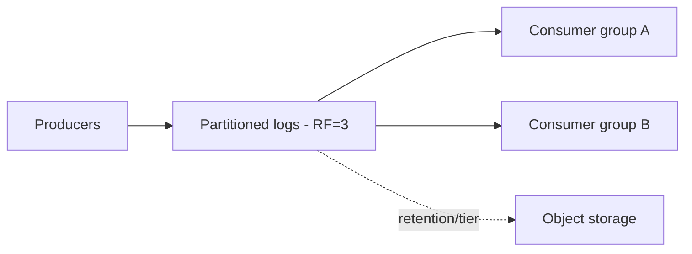
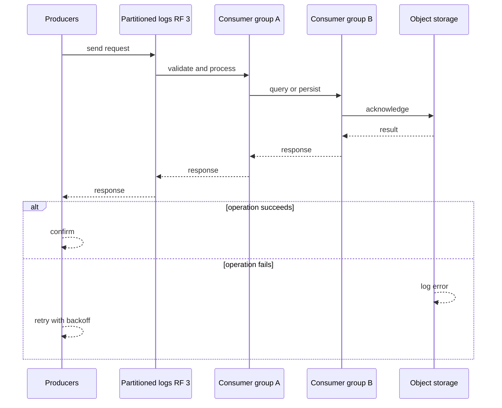
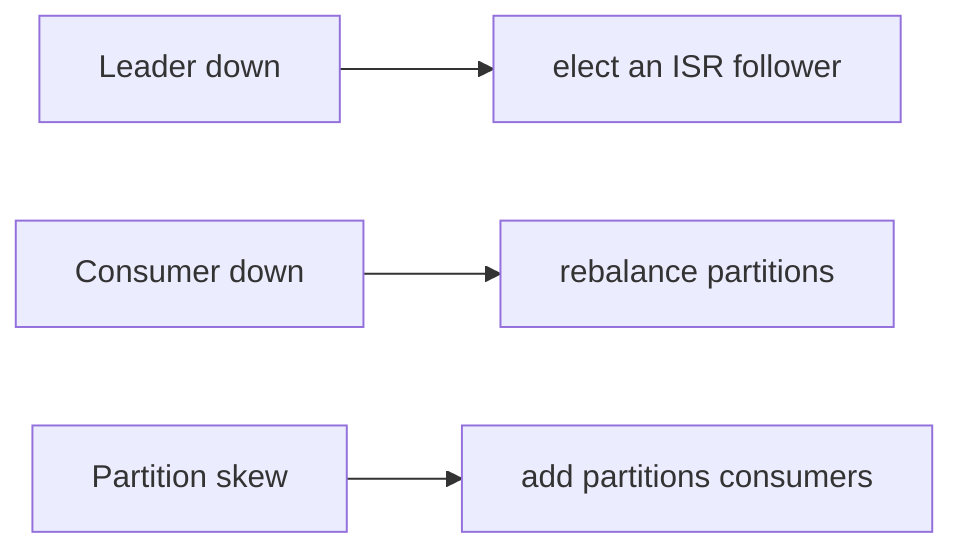
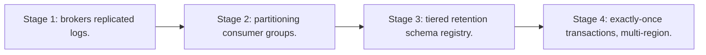

# Case Study: Message Broker

> **Tier:** advanced · **Status:** complete · Original numbers and diagrams.

## 1. Problem statement
A durable, partitioned, multi-consumer message broker (Kafka-like): producers publish to topics partitioned by key; consumer groups read independently and replay from retained logs. This is a advanced-tier system design challenge because it must handle high availability under peak load while ensuring no single point of failure. The design must be production-grade: observable, debuggable, reversible, and able to survive component failures without data loss or cascading outages.

## 2. Scope
In (v1): produce/consume topics, partitioned logs, consumer groups, retention, at-least-once + idempotent. Out: exactly-once transactions, schema registry (noted as stage).

For Message Broker, these boundaries keep the first version focused on the core user value. Adding more features would dilute the design and delay shipping. Each excluded item is a scaling stage — a candidate for the next iteration once the baseline is proven.

## 3. Functional requirements
- Publish events to a partitioned topic.
- Multiple consumer groups read independently.
- Retain events by time/size for replay.
- Per-partition ordering.
- At-least-once; idempotent consumers.

For Message Broker, these requirements drive specific architectural decisions: the read-write ratio determines the caching strategy, the durability target sets the replication mode, and the idempotency requirement shapes the API contract.

## 4. Non-functional requirements
- Ingest millions of events/s.
- Consumer lag bounded.
- Durability 11 nines (replicated log).
- Availability 99.9%.

For Message Broker, each non-functional target constrains a specific component: the latency SLO bounds the number of synchronous hops, the availability target forces redundancy across availability zones, and the cost ceiling limits the replication factor and storage tier.

## 5. Explicit assumptions
1. 1M events/s, avg 1 KB. [assumption] 2. Retain 7 days. [constraint] 3. RF=3 per partition. [constraint]

For Message Broker, if these assumptions are off by an order of magnitude, the architecture must adapt: 10x traffic may require earlier sharding, a different read-write ratio changes the caching strategy, and a higher peak multiplier demands more headroom.

## 6. Traffic estimation
1M events/s ingest; many consumer groups replay concurrently. Write-heavy, append-only.

To derive the request rate: divide the daily volume by 86,400 seconds to get the average rate, then multiply by 5-10x for peak. The read-to-write ratio determines whether the system is cache-dominated (read-heavy) or write-path-dominated (write-heavy). For Message Broker, this ratio shapes the entire storage and replication strategy.

## 7. Storage estimation
1M/s x 1 KB x 86400 x 7 = ~600 TB retained (RF=3 -> ~1.8 PB raw). Partitioned; tier old to object storage.

For Message Broker, storage growth is projected from the daily write volume and retention policy. Index overhead and compression factors are accounted for in the total.

## 8. Bandwidth estimation
1M/s x 1 KB = ~1 GB/s ingress; consumers read the same data N times (fan-out read amplification).

Bandwidth is request rate multiplied by average payload size for ingress, and response rate multiplied by response size for egress. CDN and edge caching reduce origin egress. Compression reduces bandwidth by 50-80 percent where applicable. For Message Broker, bandwidth may or may not be the binding constraint — compare it against compute and storage to find out.

## 9. API design
| Method | Path | Request | Response |
|--------|------|---------|----------|
| produce(topic,key,payload) | ack offsets | | consume(topic,group,offset) | batch of events |

## 10. Data model
Topics partitioned by key into append-only logs; each partition is an ordered, replicated sequence of (offset, ts, key, value). Offsets are consumer cursors.

For Message Broker, the data model follows the access pattern. The primary lookup determines the partition key; secondary lookups determine indexes. Denormalization is used selectively on hot read paths.

## 11. High-level architecture

## 12. Request flow
Produce: route by key to a partition leader, append, replicate to followers, ack on RF. Consume: a group splits partitions; each consumer reads its partitions by offset, commits offsets.

## 13. Component responsibilities
Brokers (partition leaders/followers), partition log store, consumer-group coordinator (offsets), tiering job, controller (metadata).

For Message Broker, each component has one job. The gateway authenticates and routes. Services are stateless and scale horizontally. The data tier is the stateful core that scales by sharding.

## 14. Database selection
Append-only logs on local disk (fast sequential writes) + replicated; metadata in a consensus store (Raft). Rejected: a DB as the log (loses the throughput/retention model).

For Message Broker, the database was chosen by access pattern, not familiarity. The rejected alternatives were wrong for this workload, not bad in general.

## 15. Caching strategy
Consumers cache offsets; hot partitions cached in OS page cache. No app-level cache on the write path.

For Message Broker, the cache strategy matches the staleness tolerance. Cache-aside for most data, write-through where read-after-write matters, stampede protection on hot keys.

## 16. Partitioning strategy
Partition by key for ordering locality; partition count sized for parallelism + throughput; rebalance consumers across partitions.

For Message Broker, the partition key balances query locality with even load distribution. Sharding strategy matters because a poor key creates hot spots under real traffic patterns.

## 17. Replication strategy
Each partition: leader + 2 followers (RF=3), async by default; leader handles reads/writes, followers fetch. ISR (in-sync replicas) controls ack quorum.

For Message Broker, replication mode is split: synchronous where durability is critical, asynchronous elsewhere for throughput. RF=3 tolerates one failure. Failover is tested regularly.

## 18. Consistency model
Per-partition total order. Within a partition, ordering is strict; across partitions, no global order. At-least-once delivery; effectively-once with idempotent consumers + transactional output.

For Message Broker, the consistency level is the weakest users accept. Read-your-writes is provided where needed. Eventual consistency is bounded and monitored, not unbounded and silent.

## 19. Failure scenarios
Leader down -> elect an ISR follower; minor data loss only if an un-replicated leader is lost (ack=all prevents). Consumer down -> rebalance partitions; offsets resume. Partition skew -> add partitions/consumers.

## 20. Reliability strategy
SLI ingest latency, consumer lag, durability; SLO 99.9%. ack=all + RF=3 for no data loss on one failure. Chaos: kill a broker, assert election + no loss.

For Message Broker, the SLO makes reliability measurable. The error budget balances feature velocity with stability. Chaos testing validates that resilience claims hold under real failures.

## 21. Security considerations
TLS + SASL auth; per-topic ACLs; per-tenant quotas; don't log payloads with PII.

For Message Broker, security layers TLS, encryption at rest, RBAC, PII redaction, and audit. The policy gateway is fail-closed for AI-augmented operations.

## 22. Observability strategy
Bytes/s per topic, consumer lag per group, ISR shrink, leader elections, partition skew, disk fill.

For Message Broker, observability combines logs, metrics, and traces with correlation IDs. Golden signals drive the first dashboard. Alerts fire on burn rate, not raw thresholds.

## 23. Cost considerations
Storage (retention x RF) + network (fan-out reads) dominate. Tier old partitions to object storage; right-size RF.

For Message Broker, cost is driven by the binding resource. Caching, tiering, batching, and right-sizing are the levers. Cost per request is tracked and alerted on.

## 24. Scaling stages
Stage 1: brokers + replicated logs. -> Stage 2: partitioning + consumer groups. -> Stage 3: tiered retention + schema registry. -> Stage 4: exactly-once transactions, multi-region.

## 25. Trade-offs
Throughput/retention vs cost. Per-partition ordering vs global order. ack=all (no loss) vs latency. Tier (cost) vs replay latency.

For Message Broker, each trade-off lists what was chosen, what was rejected, and why. This makes the design defensible in review — every decision has documented reasoning.

## 26. Alternative designs
A queue with delete-on-read (loses replay/multi-consumer). A DB-backed log (lower throughput). Single broker (SPOF).

For Message Broker, the alternatives are real architectures that work under different constraints. They were rejected for this workload's specific requirements, not because they are bad designs.

## 27. Interview discussion points
Clarify ordering scope (partition vs global), retention, delivery semantics, replay. Surface the partitioned-log + consumer-group + retention model.

For Message Broker in an interview: clarify scope first, surface the read-write ratio, design the hot path deeply, discuss failures, and offer an alternative. Weak candidates skip failure modes.

## 28. Original Mermaid diagrams
Standalone sources under `diagrams/case-studies/message-broker/`: `context.mmd`, `request-sequence.mmd`, `failure-flow.mmd`, `scaling-evolution.mmd`. The diagrams are embedded in their respective sections: architecture in section 11, request flow in section 12, failure scenarios in section 19, and scaling stages in section 24.

## 29. Further reading

Kafka: S-KAFKA; replication: Level 3; delivery semantics: Level 4.

## 30. Practical exercises

1. Add exactly-once transactions across consume-process-produce. 2. Design partition rebalance without stalling. 3. Retain 1 year — storage and tiering. 4. Hot partition (one key) — mitigation. 5. Multi-region replication for disaster recovery.

---
Previous: (advanced start) · Next: Metrics platform

