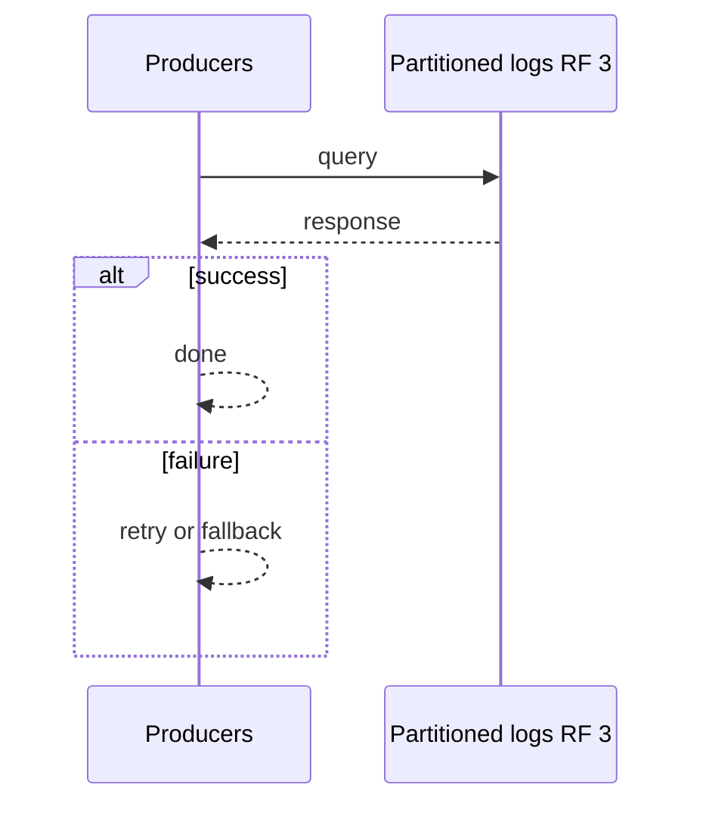
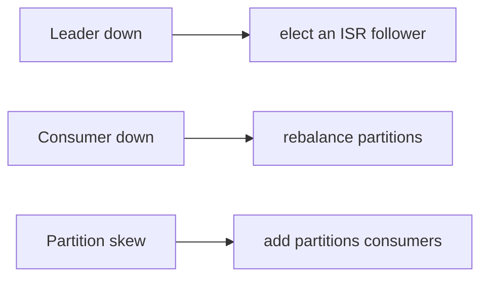

# Case Study: Message Broker

> **Tier:** advanced · **Status:** complete · Original numbers and diagrams.

## 1. Problem statement

A durable, partitioned, multi-consumer message broker (Kafka-like): producers publish to topics partitioned by key; consumer groups read independently and replay from retained logs.


## 2. Scope

In (v1): produce/consume topics, partitioned logs, consumer groups, retention, at-least-once + idempotent. Out: exactly-once transactions, schema registry (noted as stage).


## 3. Functional requirements

- Publish events to a partitioned topic. - Multiple consumer groups read independently. - Retain events by time/size for replay. - Per-partition ordering. - At-least-once; idempotent consumers.


## 4. Non-functional requirements

- Ingest millions of events/s. - Consumer lag bounded. - Durability 11 nines (replicated log). - Availability 99.9%.


## 5. Explicit assumptions

1. 1M events/s, avg 1 KB. [assumption] 2. Retain 7 days. [constraint] 3. RF=3 per partition. [constraint]


## 6. Traffic estimation

1M events/s ingest; many consumer groups replay concurrently. Write-heavy, append-only.


## 7. Storage estimation

1M/s x 1 KB x 86400 x 7 = ~600 TB retained (RF=3 -> ~1.8 PB raw). Partitioned; tier old to object storage.


## 8. Bandwidth estimation

1M/s x 1 KB = ~1 GB/s ingress; consumers read the same data N times (fan-out read amplification).


## 9. API design

| produce(topic,key,payload) | ack offsets | | consume(topic,group,offset) | batch of events |


## 10. Data model

Topics partitioned by key into append-only logs; each partition is an ordered, replicated sequence of (offset, ts, key, value). Offsets are consumer cursors.


## 11. High-level architecture

```mermaid
%% created-for: system-design-mastery
flowchart LR
  P[Producers] --> Part[Partitioned logs (RF=3)]
  Part --> CG1[Consumer group A]
  Part --> CG2[Consumer group B]
  Part -.retention/tier.-> Cold[Object storage]
```


## 12. Request flow

Produce: route by key to a partition leader, append, replicate to followers, ack on RF. Consume: a group splits partitions; each consumer reads its partitions by offset, commits offsets.


## 13. Component responsibilities

Brokers (partition leaders/followers), partition log store, consumer-group coordinator (offsets), tiering job, controller (metadata).


## 14. Database selection

Append-only logs on local disk (fast sequential writes) + replicated; metadata in a consensus store (Raft). Rejected: a DB as the log (loses the throughput/retention model).


## 15. Caching strategy

Consumers cache offsets; hot partitions cached in OS page cache. No app-level cache on the write path.


## 16. Partitioning strategy

Partition by key for ordering locality; partition count sized for parallelism + throughput; rebalance consumers across partitions.


## 17. Replication strategy

Each partition: leader + 2 followers (RF=3), async by default; leader handles reads/writes, followers fetch. ISR (in-sync replicas) controls ack quorum.


## 18. Consistency model

Per-partition total order. Within a partition, ordering is strict; across partitions, no global order. At-least-once delivery; effectively-once with idempotent consumers + transactional output.


## 19. Failure scenarios

Leader down -> elect an ISR follower; minor data loss only if an un-replicated leader is lost (ack=all prevents). Consumer down -> rebalance partitions; offsets resume. Partition skew -> add partitions/consumers.


## 20. Reliability strategy

SLI ingest latency, consumer lag, durability; SLO 99.9%. ack=all + RF=3 for no data loss on one failure. Chaos: kill a broker, assert election + no loss.


## 21. Security considerations

TLS + SASL auth; per-topic ACLs; per-tenant quotas; don't log payloads with PII.


## 22. Observability strategy

Bytes/s per topic, consumer lag per group, ISR shrink, leader elections, partition skew, disk fill.


## 23. Cost considerations

Storage (retention x RF) + network (fan-out reads) dominate. Tier old partitions to object storage; right-size RF.


## 24. Scaling stages

Stage 1: brokers + replicated logs. -> Stage 2: partitioning + consumer groups. -> Stage 3: tiered retention + schema registry. -> Stage 4: exactly-once transactions, multi-region.


## 25. Trade-offs

Throughput/retention vs cost. Per-partition ordering vs global order. ack=all (no loss) vs latency. Tier (cost) vs replay latency.


## 26. Alternative designs

A queue with delete-on-read (loses replay/multi-consumer). A DB-backed log (lower throughput). Single broker (SPOF).


## 27. Interview discussion points

Clarify ordering scope (partition vs global), retention, delivery semantics, replay. Surface the partitioned-log + consumer-group + retention model.


## 28. Original Mermaid diagrams

Standalone sources under `diagrams/case-studies/message-broker/`: `context.mmd`, `request-sequence.mmd`, `failure-flow.mmd`, `scaling-evolution.mmd`. Request sequence and failure flow:





## 29. Further reading

Kafka: S-KAFKA; replication: Level 3; delivery semantics: Level 4.


## 30. Practical exercises

1. Add exactly-once transactions across consume-process-produce. 2. Design partition rebalance without stalling. 3. Retain 1 year — storage and tiering. 4. Hot partition (one key) — mitigation. 5. Multi-region replication for disaster recovery.


---
Previous: (advanced start) · Next: Metrics platform

