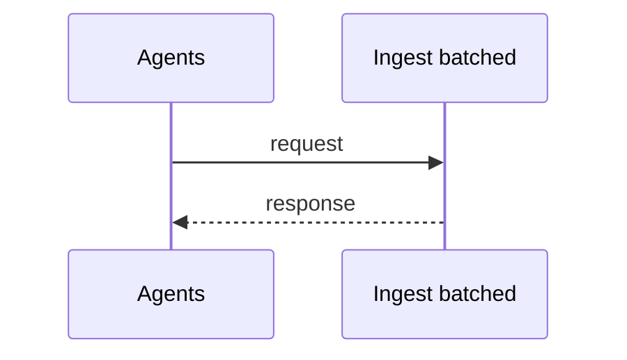
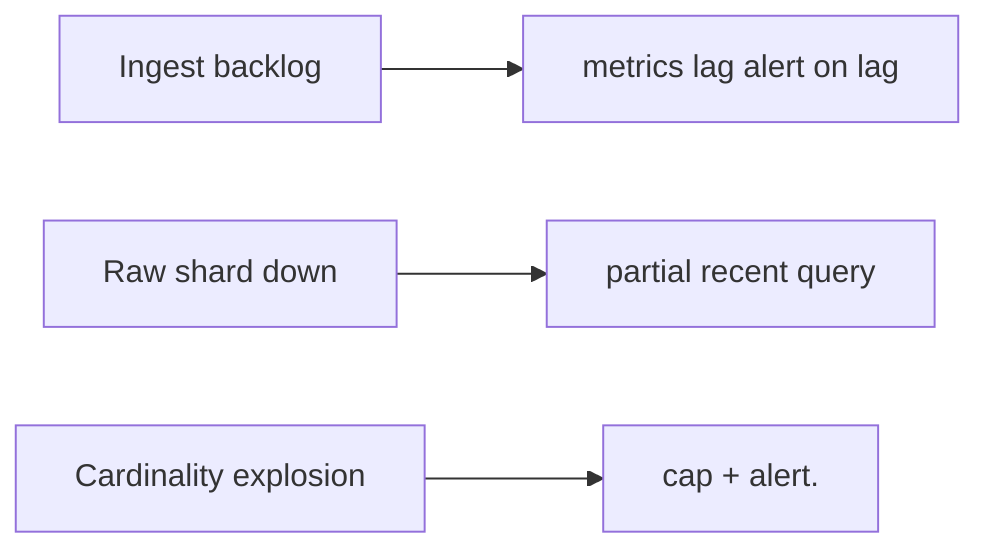
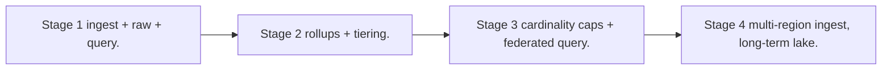

# Case Study: Metrics Platform

> **Tier:** advanced · **Status:** draft · Original numbers and diagrams.

## 1. Problem statement

Ingest time-series metrics at high cardinality (per-label), store efficiently, query for dashboards/alerts, and downsample old data.

## 2. Scope

In (v1): ingest counters/gauges/histograms, store time-series, query by label+window, downsample, alert. Out: traces/logs (separate).

## 3. Functional requirements

- Ingest metric points with labels. - Query by label selectors over a time window. - Downsample/rollup old data. - Alert on thresholds.

## 4. Non-functional requirements

- Ingest millions of points/s. - Query p99 < 2 s. - Hot data recent (hours/days); cold downsampled. - Cardinality must be bounded.

## 5. Explicit assumptions

1. 1M points/s, ~200 B each with labels. [assumption] 2. Retain 1h raw, 30d 1-min rollups, 1y 5-min. [constraint] 3. Cardinality cap per metric. [constraint]

## 6. Traffic estimation

1M points/s ingest; queries fan out across series by label. Write-heavy; reads bursty (dashboard refresh).

## 7. Storage estimation

1M/s x 200 B x 3600 = 720 GB/h raw; rollups far smaller. Cardinality (unique label sets) is the real cost driver.

## 8. Bandwidth estimation

Ingress ~200 MB/s; dashboards pull aggregations, not raw points — bandwidth modest after rollups.

## 9. API design

| POST /ingest (batch) | points | ack | | GET /query | selectors, window, step | series |

## 10. Data model

Series keyed by (metric, label set); points are (ts, value). Stored columnar/gorilla-encoded, compressed; downsampled rollups by interval.

## 11. High-level architecture

```mermaid
%% origin: original to system-design-mastery
flowchart LR
  Src[Agents] --> Ingest[Ingest (batched)] --> Stream[Stream] --> Raw[Raw store (recent)]
  Stream --> Roll[Rollup workers] --> Cold[Downsampled store]
  Query[Query API] --> Raw & Cold
  Alert[Alert engine] --> Query
```

## 12. Request flow

Ingest: agents batch -> ingest -> stream -> raw store (hot) + rollup workers (downsample to cold). Query: route by window to raw or rollups, fan out by label, aggregate.

## 13. Component responsibilities

Ingest, raw store (hot), rollup workers, downsampled store, query engine, alert engine.

## 14. Database selection

Time-series store (columnar, delta-of-delta encoding) for hot; object/columnar for cold rollups. Rejected: a general DB (no TS compression/sparse handling).

## 15. Caching strategy

Recent raw in memory; common dashboard queries cached. Cardinality cache to detect/limit label explosion.

## 16. Partitioning strategy

Partition by (metric, label-hash) and time bucket so a query touches few partitions. Time-bucketing also drives lifecycle.

## 17. Replication strategy

Hot store RF=3; cold rollups in durable object storage. Ingest at-least-once; idempotent aggregation (counters merge).

## 18. Consistency model

Recent data near-real-time (seconds lag). Downsampled values eventually consistent. Counters: merge is idempotent.

## 19. Failure scenarios

Ingest backlog -> metrics lag (alert on lag). Raw shard down -> partial recent query; cold unaffected. Cardinality explosion -> cap + alert.

## 20. Reliability strategy

SLI ingest success, query latency; SLO 99.9% ingest. Backpressure on ingest; cap cardinality. Chaos: kill a raw shard, assert partial-but-serving.

## 21. Security considerations

Per-tenant isolation of metrics; label values redact PII; rate-limit ingest per tenant to prevent cardinality DoS.

## 22. Observability strategy

Ingest rate, ingest lag, cardinality, query latency, rollup freshness. Alert on lag and cardinality spikes.

## 23. Cost considerations

Storage + cardinality dominate. Downsample aggressively; cap high-cardinality labels; tier cold.

## 24. Scaling stages

Stage 1: ingest + raw + query. -> Stage 2: rollups + tiering. -> Stage 3: cardinality caps + federated query. -> Stage 4: multi-region ingest, long-term lake.

## 25. Trade-offs

Raw retention (accuracy) vs storage cost (downsample). Cardinality (query power) vs cost/explosion. Per-tenant caps (cost) vs fidelity.

## 26. Alternative designs

All-raw forever (cost explosion). A general DB (no TS optimization). One hot index unpartitioned (can't scale).

## 27. Interview discussion points

Clarify ingest rate, retention, cardinality, query patterns. Surface time-series compression, rollups, and cardinality as the cost driver.

## 28. Original Mermaid diagrams

Standalone sources under `diagrams/case-studies/metrics-platform/`: `context.mmd`, `request-sequence.mmd`, `failure-flow.mmd`, `scaling-evolution.mmd`. Additional diagrams for this case study:






## 29. Further reading

Time-series: Level 3; observability: Level 8; tiering: Level 3.

## 30. Practical exercises

1. Cap cardinality without losing needed queries. 2. Re-estimate retaining raw 7 days. 3. Design a query over 1 year cheaply. 4. Add histograms (quantiles) aggregation. 5. Cardinality DoS by a tenant — mitigation.


---
Previous: Message broker · Next: Distributed scheduler
