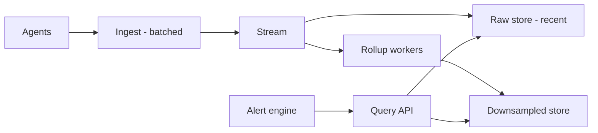
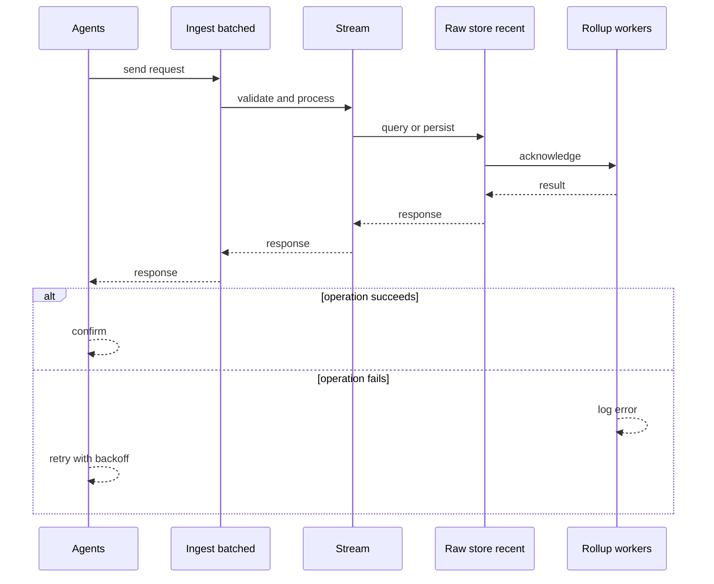
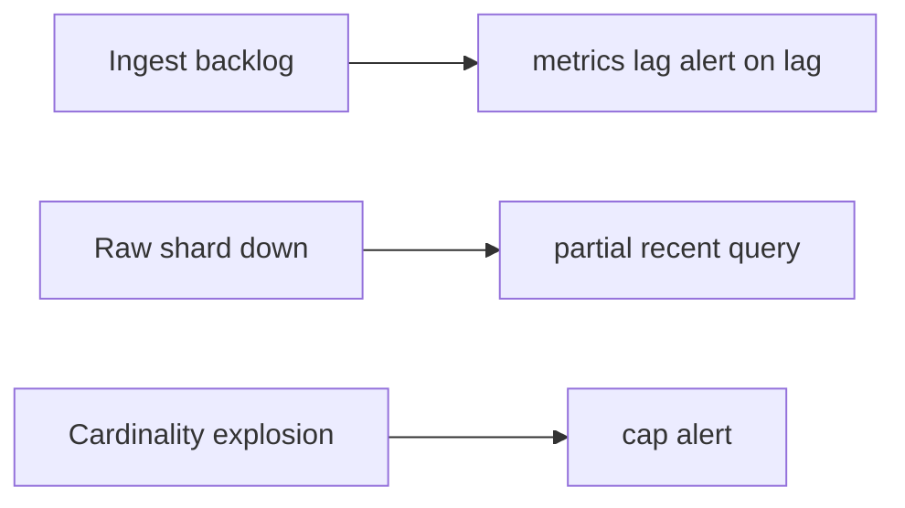
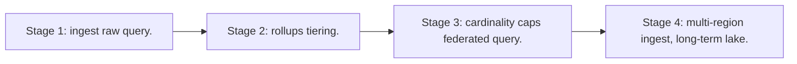

# Case Study: Metrics Platform

> **Tier:** advanced · **Status:** complete · Original numbers and diagrams.

## 1. Problem statement
Ingest time-series metrics at high cardinality (per-label), store efficiently, query for dashboards/alerts, and downsample old data. This is a advanced-tier system design challenge because it must handle high availability under peak load while ensuring no single point of failure. The design must be production-grade: observable, debuggable, reversible, and able to survive component failures without data loss or cascading outages.

## 2. Scope
In (v1): ingest counters/gauges/histograms, store time-series, query by label+window, downsample, alert. Out: traces/logs (separate).

For Metrics Platform, these boundaries keep the first version focused on the core user value. Adding more features would dilute the design and delay shipping. Each excluded item is a scaling stage — a candidate for the next iteration once the baseline is proven.

## 3. Functional requirements
- Ingest metric points with labels.
- Query by label selectors over a time window.
- Downsample/rollup old data.
- Alert on thresholds.

For Metrics Platform, these requirements drive specific architectural decisions: the read-write ratio determines the caching strategy, the durability target sets the replication mode, and the idempotency requirement shapes the API contract.

## 4. Non-functional requirements
- Ingest millions of points/s.
- Query p99 < 2 s.
- Hot data recent (hours/days); cold downsampled.
- Cardinality must be bounded.

For Metrics Platform, each non-functional target constrains a specific component: the latency SLO bounds the number of synchronous hops, the availability target forces redundancy across availability zones, and the cost ceiling limits the replication factor and storage tier.

## 5. Explicit assumptions
1. 1M points/s, ~200 B each with labels. [assumption] 2. Retain 1h raw, 30d 1-min rollups, 1y 5-min. [constraint] 3. Cardinality cap per metric. [constraint]

For Metrics Platform, if these assumptions are off by an order of magnitude, the architecture must adapt: 10x traffic may require earlier sharding, a different read-write ratio changes the caching strategy, and a higher peak multiplier demands more headroom.

## 6. Traffic estimation
1M points/s ingest; queries fan out across series by label. Write-heavy; reads bursty (dashboard refresh).

To derive the request rate: divide the daily volume by 86,400 seconds to get the average rate, then multiply by 5-10x for peak. The read-to-write ratio determines whether the system is cache-dominated (read-heavy) or write-path-dominated (write-heavy). For Metrics Platform, this ratio shapes the entire storage and replication strategy.

## 7. Storage estimation
1M/s x 200 B x 3600 = 720 GB/h raw; rollups far smaller. Cardinality (unique label sets) is the real cost driver.

For Metrics Platform, storage growth is projected from the daily write volume and retention policy. Index overhead and compression factors are accounted for in the total.

## 8. Bandwidth estimation
Ingress ~200 MB/s; dashboards pull aggregations, not raw points — bandwidth modest after rollups.

Bandwidth is request rate multiplied by average payload size for ingress, and response rate multiplied by response size for egress. CDN and edge caching reduce origin egress. Compression reduces bandwidth by 50-80 percent where applicable. For Metrics Platform, bandwidth may or may not be the binding constraint — compare it against compute and storage to find out.

## 9. API design
| Method | Path | Request | Response |
|--------|------|---------|----------|
| POST /ingest (batch) | points | ack |
| GET |/query | selectors, window, step | series |

## 10. Data model
Series keyed by (metric, label set); points are (ts, value). Stored columnar/gorilla-encoded, compressed; downsampled rollups by interval.

For Metrics Platform, the data model follows the access pattern. The primary lookup determines the partition key; secondary lookups determine indexes. Denormalization is used selectively on hot read paths.

## 11. High-level architecture

## 12. Request flow
Ingest: agents batch -> ingest -> stream -> raw store (hot) + rollup workers (downsample to cold). Query: route by window to raw or rollups, fan out by label, aggregate.

## 13. Component responsibilities
Ingest, raw store (hot), rollup workers, downsampled store, query engine, alert engine.

For Metrics Platform, each component has one job. The gateway authenticates and routes. Services are stateless and scale horizontally. The data tier is the stateful core that scales by sharding.

## 14. Database selection
Time-series store (columnar, delta-of-delta encoding) for hot; object/columnar for cold rollups. Rejected: a general DB (no TS compression/sparse handling).

For Metrics Platform, the database was chosen by access pattern, not familiarity. The rejected alternatives were wrong for this workload, not bad in general.

## 15. Caching strategy
Recent raw in memory; common dashboard queries cached. Cardinality cache to detect/limit label explosion.

For Metrics Platform, the cache strategy matches the staleness tolerance. Cache-aside for most data, write-through where read-after-write matters, stampede protection on hot keys.

## 16. Partitioning strategy
Partition by (metric, label-hash) and time bucket so a query touches few partitions. Time-bucketing also drives lifecycle.

For Metrics Platform, the partition key balances query locality with even load distribution. Sharding strategy matters because a poor key creates hot spots under real traffic patterns.

## 17. Replication strategy
Hot store RF=3; cold rollups in durable object storage. Ingest at-least-once; idempotent aggregation (counters merge).

For Metrics Platform, replication mode is split: synchronous where durability is critical, asynchronous elsewhere for throughput. RF=3 tolerates one failure. Failover is tested regularly.

## 18. Consistency model
Recent data near-real-time (seconds lag). Downsampled values eventually consistent. Counters: merge is idempotent.

For Metrics Platform, the consistency level is the weakest users accept. Read-your-writes is provided where needed. Eventual consistency is bounded and monitored, not unbounded and silent.

## 19. Failure scenarios
Ingest backlog -> metrics lag (alert on lag). Raw shard down -> partial recent query; cold unaffected. Cardinality explosion -> cap + alert.

## 20. Reliability strategy
SLI ingest success, query latency; SLO 99.9% ingest. Backpressure on ingest; cap cardinality. Chaos: kill a raw shard, assert partial-but-serving.

For Metrics Platform, the SLO makes reliability measurable. The error budget balances feature velocity with stability. Chaos testing validates that resilience claims hold under real failures.

## 21. Security considerations
Per-tenant isolation of metrics; label values redact PII; rate-limit ingest per tenant to prevent cardinality DoS.

For Metrics Platform, security layers TLS, encryption at rest, RBAC, PII redaction, and audit. The policy gateway is fail-closed for AI-augmented operations.

## 22. Observability strategy
Ingest rate, ingest lag, cardinality, query latency, rollup freshness. Alert on lag and cardinality spikes.

For Metrics Platform, observability combines logs, metrics, and traces with correlation IDs. Golden signals drive the first dashboard. Alerts fire on burn rate, not raw thresholds.

## 23. Cost considerations
Storage + cardinality dominate. Downsample aggressively; cap high-cardinality labels; tier cold.

For Metrics Platform, cost is driven by the binding resource. Caching, tiering, batching, and right-sizing are the levers. Cost per request is tracked and alerted on.

## 24. Scaling stages
Stage 1: ingest + raw + query. -> Stage 2: rollups + tiering. -> Stage 3: cardinality caps + federated query. -> Stage 4: multi-region ingest, long-term lake.

## 25. Trade-offs
Raw retention (accuracy) vs storage cost (downsample). Cardinality (query power) vs cost/explosion. Per-tenant caps (cost) vs fidelity.

For Metrics Platform, each trade-off lists what was chosen, what was rejected, and why. This makes the design defensible in review — every decision has documented reasoning.

## 26. Alternative designs
All-raw forever (cost explosion). A general DB (no TS optimization). One hot index unpartitioned (can't scale).

For Metrics Platform, the alternatives are real architectures that work under different constraints. They were rejected for this workload's specific requirements, not because they are bad designs.

## 27. Interview discussion points
Clarify ingest rate, retention, cardinality, query patterns. Surface time-series compression, rollups, and cardinality as the cost driver.

For Metrics Platform in an interview: clarify scope first, surface the read-write ratio, design the hot path deeply, discuss failures, and offer an alternative. Weak candidates skip failure modes.

## 28. Original Mermaid diagrams
Standalone sources under `diagrams/case-studies/metrics-platform/`: `context.mmd`, `request-sequence.mmd`, `failure-flow.mmd`, `scaling-evolution.mmd`. The diagrams are embedded in their respective sections: architecture in section 11, request flow in section 12, failure scenarios in section 19, and scaling stages in section 24.

## 29. Further reading
Time-series: Level 3; observability: Level 8; tiering: Level 3. Sources: `S-CHASH` `S-DYNAMO`.

## 30. Practical exercises

1. Cap cardinality without losing needed queries. 2. Re-estimate retaining raw 7 days. 3. Design a query over 1 year cheaply. 4. Add histograms (quantiles) aggregation. 5. Cardinality DoS by a tenant — mitigation.

---
Previous: Message broker · Next: Distributed scheduler

