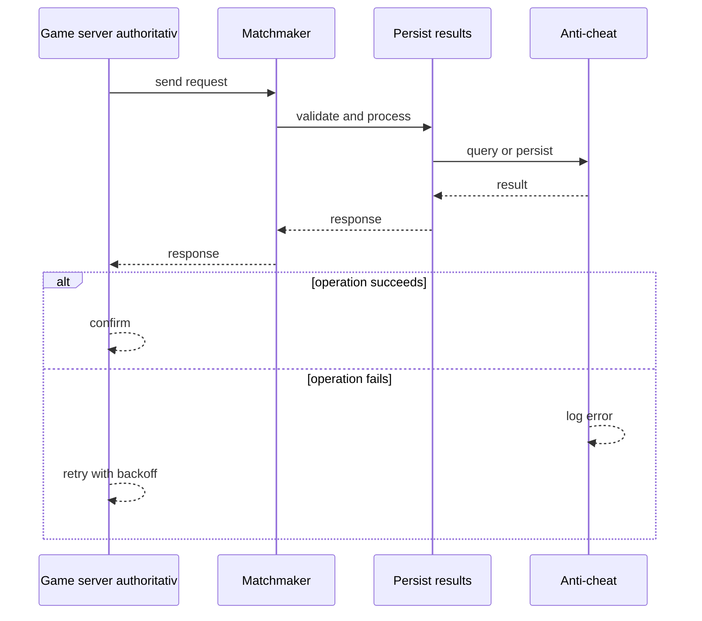
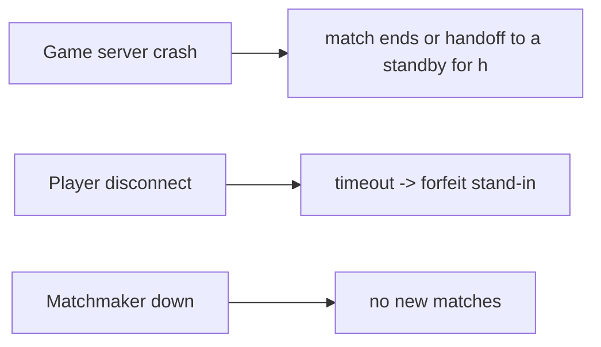
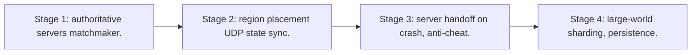

# Case Study: Online Multiplayer Game

> **Tier:** advanced · **Status:** complete · Original numbers and diagrams.

## 1. Problem statement
Real-time authoritative game state, low-latency input replication, and matchmaking — latency-critical, stateful-server, large-fan-out state. This is a advanced-tier system design challenge because it must handle real-time latency under load while ensuring no single point of failure. The design must be production-grade: observable, debuggable, reversible, and able to survive component failures without data loss or cascading outages.

## 2. Scope
In (v1): real-time match, authoritative server, state sync, matchmaking. Out: persistence, anti-cheat (noted).

For Online Multiplayer Game, these boundaries keep the first version focused on the core user value. Adding more features would dilute the design and delay shipping. Each excluded item is a scaling stage — a candidate for the next iteration once the baseline is proven.

## 3. Functional requirements
- Match players.
- Run authoritative game state on a server.
- Replicate state to players at ~tick rate.
- Persist match results.

For Online Multiplayer Game, these requirements drive specific architectural decisions: the read-write ratio determines the caching strategy, the durability target sets the replication mode, and the idempotency requirement shapes the API contract.

## 4. Non-functional requirements
- Tick-to-player latency < 100 ms. - 60 ticks/s authoritative loop.
- Availability 99.9% per match.

For Online Multiplayer Game, each non-functional target constrains a specific component: the latency SLO bounds the number of synchronous hops, the availability target forces redundancy across availability zones, and the cost ceiling limits the replication factor and storage tier.

## 5. Explicit assumptions
1. 1M concurrent players, 100k matches. [assumption] 2. 64 players/match, 60 ticks/s. [assumption] 3. State delta ~1 KB/tick. [assumption]

For Online Multiplayer Game, if these assumptions are off by an order of magnitude, the architecture must adapt: 10x traffic may require earlier sharding, a different read-write ratio changes the caching strategy, and a higher peak multiplier demands more headroom.

## 6. Traffic estimation
1M players x 60/s inputs + state deltas — very high small-message rate; UDP for latency.

To derive the request rate: divide the daily volume by 86,400 seconds to get the average rate, then multiply by 5-10x for peak. The read-to-write ratio determines whether the system is cache-dominated (read-heavy) or write-path-dominated (write-heavy). For Online Multiplayer Game, this ratio shapes the entire storage and replication strategy.

## 7. Storage estimation
Match state ephemeral; results + player profiles persisted.

For Online Multiplayer Game, storage growth is projected from the daily write volume and retention policy. Index overhead and compression factors are accounted for in the total.

## 8. Bandwidth estimation
State deltas: 100k matches x 64 x 60/s x ~small — significant aggregate; per-match modest.

Bandwidth is request rate multiplied by average payload size for ingress, and response rate multiplied by response size for egress. CDN and edge caching reduce origin egress. Compression reduces bandwidth by 50-80 percent where applicable. For Online Multiplayer Game, bandwidth may or may not be the binding constraint — compare it against compute and storage to find out.

## 9. API design

UDP game protocol for state; REST for matchmaking/profile; WebSocket optional.

## 10. Data model
match_state(match, authoritative); player profile; match results. State in-memory on the game server.

For Online Multiplayer Game, the data model follows the access pattern. The primary lookup determines the partition key; secondary lookups determine indexes. Denormalization is used selectively on hot read paths.

## 11. High-level architecture

```mermaid
%% created-for: system-design-mastery
flowchart LR
  P1 & P2 & P3 --> GS[Game server - authoritative, 60 tps]
  GS -->|state delta (UDP)| P1 & P2 & P3
  MM[Matchmaker] --> GS
  GS --> Persist[Persist results]
  GS --> AntiCheat[Anti-cheat]
```

## 12. Request flow
Matchmaker forms a match -> allocates a game server -> players send inputs (UDP) -> authoritative server advances state 60 tps -> replicates deltas to all -> on end, persist results.



## 13. Component responsibilities
Matchmaker, game servers (authoritative), state replicator, persistence, anti-cheat.

For Online Multiplayer Game, each component has one job. The gateway authenticates and routes. Services are stateless and scale horizontally. The data tier is the stateful core that scales by sharding.

## 14. Database selection
In-memory authoritative state; profiles/results in a durable store. Rejected: client-authoritative (cheating).

For Online Multiplayer Game, the database was chosen by access pattern, not familiarity. The rejected alternatives were wrong for this workload, not bad in general.

## 15. Caching strategy
Profiles cached; match state is the in-memory authoritative cache.

For Online Multiplayer Game, the cache strategy matches the staleness tolerance. Cache-aside for most data, write-through where read-after-write matters, stampede protection on hot keys.

## 16. Partitioning strategy
Per-match server (one match per server instance); matchmaking sharded by region/skill.

For Online Multiplayer Game, the partition key balances query locality with even load distribution. Sharding strategy matters because a poor key creates hot spots under real traffic patterns.

## 17. Replication strategy
Game server is the authority; no replication needed for correctness (a crash ends the match — migrate/handoff is advanced). Region-based for latency.

For Online Multiplayer Game, replication mode is split: synchronous where durability is critical, asynchronous elsewhere for throughput. RF=3 tolerates one failure. Failover is tested regularly.

## 18. Consistency model
Authoritative: the server is the single source of truth; clients see lagging projections. Strong within a match.

For Online Multiplayer Game, the consistency level is the weakest users accept. Read-your-writes is provided where needed. Eventual consistency is bounded and monitored, not unbounded and silent.

## 19. Failure scenarios
Game server crash -> match ends (or handoff to a standby for high-tier). Player disconnect -> timeout -> forfeit/stand-in. Matchmaker down -> no new matches.



## 20. Reliability strategy
SLI tick latency, match completion; SLO 99.9% per match. Region placement for latency. Chaos: kill a game server, assert graceful match end.

For Online Multiplayer Game, the SLO makes reliability measurable. The error budget balances feature velocity with stability. Chaos testing validates that resilience claims hold under real failures.

## 21. Security considerations
Client-authoritative forbidden (cheat); input validation; anti-cheat on server; rate-limit inputs.

For Online Multiplayer Game, security layers TLS, encryption at rest, RBAC, PII redaction, and audit. The policy gateway is fail-closed for AI-augmented operations.

## 22. Observability strategy
Tick rate stability, p99 tick-to-player latency, match completion, disconnect rate, server CPU.

For Online Multiplayer Game, observability combines logs, metrics, and traces with correlation IDs. Golden signals drive the first dashboard. Alerts fire on burn rate, not raw thresholds.

## 23. Cost considerations
Compute (one server per match) dominates; autoscale game servers by match demand; region placement.

For Online Multiplayer Game, cost is driven by the binding resource. Caching, tiering, batching, and right-sizing are the levers. Cost per request is tracked and alerted on.

## 24. Scaling stages
Stage 1: authoritative servers + matchmaker. -> Stage 2: region placement + UDP state sync. -> Stage 3: server handoff on crash, anti-cheat. -> Stage 4: large-world sharding, persistence.



## 25. Trade-offs
Authoritative (anti-cheat) vs server cost. UDP (latency) vs TCP (reliability). 60 tps (smooth) vs CPU. Region (latency) vs matchmaking breadth.

For Online Multiplayer Game, each trade-off lists what was chosen, what was rejected, and why. This makes the design defensible in review — every decision has documented reasoning.

## 26. Alternative designs
Client-authoritative (cheating). TCP state (latency). Single global server (latency).

For Online Multiplayer Game, the alternatives are real architectures that work under different constraints. They were rejected for this workload's specific requirements, not because they are bad designs.

## 27. Interview discussion points
Clarify tick rate, latency, anti-cheat, region. Surface authoritative server, UDP state sync, region placement.

For Online Multiplayer Game in an interview: clarify scope first, surface the read-write ratio, design the hot path deeply, discuss failures, and offer an alternative. Weak candidates skip failure modes.

## 28. Original Mermaid diagrams
Standalone sources under `diagrams/case-studies/multiplayer-game/`: `context.mmd`, `request-sequence.mmd`, `failure-flow.mmd`, `scaling-evolution.mmd`. The diagrams are embedded in their respective sections: architecture in section 11, request flow in section 12, failure scenarios in section 19, and scaling stages in section 24.

## 29. Further reading
Real-time/edge: Level 10; UDP: Level 0; autoscaling: Level 9. Sources: `S-CHASH` `S-DYNAMO`.

## 30. Practical exercises

1. Server handoff on crash mid-match. 2. Lag compensation. 3. 1000-player large-world sharding. 4. Matchmaking by skill across regions. 5. Anti-cheat design.

---
Previous: Airline-reservation · Next: Collaborative document editor

