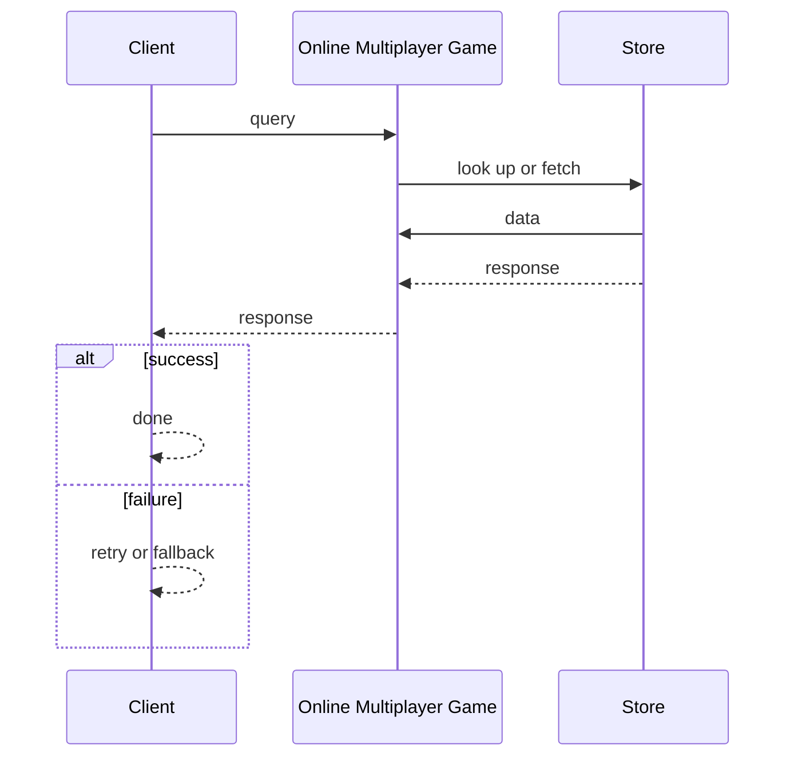
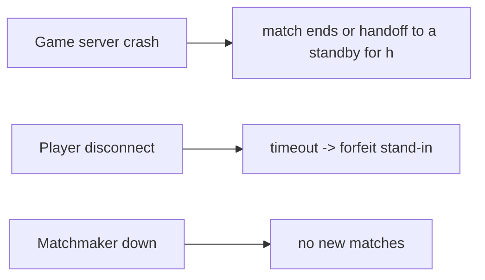

# Case Study: Online Multiplayer Game

> **Tier:** advanced · **Status:** complete · Original numbers and diagrams.

## 1. Problem statement

Real-time authoritative game state, low-latency input replication, and matchmaking — latency-critical, stateful-server, large-fan-out state.


## 2. Scope

In (v1): real-time match, authoritative server, state sync, matchmaking. Out: persistence, anti-cheat (noted).


## 3. Functional requirements

- Match players. - Run authoritative game state on a server. - Replicate state to players at ~tick rate. - Persist match results.


## 4. Non-functional requirements

- Tick-to-player latency < 100 ms. - 60 ticks/s authoritative loop. - Availability 99.9% per match.


## 5. Explicit assumptions

1. 1M concurrent players, 100k matches. [assumption] 2. 64 players/match, 60 ticks/s. [assumption] 3. State delta ~1 KB/tick. [assumption]


## 6. Traffic estimation

1M players x 60/s inputs + state deltas — very high small-message rate; UDP for latency.


## 7. Storage estimation

Match state ephemeral; results + player profiles persisted.


## 8. Bandwidth estimation

State deltas: 100k matches x 64 x 60/s x ~small — significant aggregate; per-match modest.


## 9. API design

UDP game protocol for state; REST for matchmaking/profile; WebSocket optional.


## 10. Data model

match_state(match, authoritative); player profile; match results. State in-memory on the game server.


## 11. High-level architecture

```mermaid
%% created-for: system-design-mastery
flowchart LR
  P1 & P2 & P3 --> GS[Game server (authoritative, 60 tps)]
  GS -->|state delta (UDP)| P1 & P2 & P3
  MM[Matchmaker] --> GS
  GS --> Persist[Persist results]
  GS --> AntiCheat[Anti-cheat]
```


## 12. Request flow

Matchmaker forms a match -> allocates a game server -> players send inputs (UDP) -> authoritative server advances state 60 tps -> replicates deltas to all -> on end, persist results.


## 13. Component responsibilities

Matchmaker, game servers (authoritative), state replicator, persistence, anti-cheat.


## 14. Database selection

In-memory authoritative state; profiles/results in a durable store. Rejected: client-authoritative (cheating).


## 15. Caching strategy

Profiles cached; match state is the in-memory authoritative cache.


## 16. Partitioning strategy

Per-match server (one match per server instance); matchmaking sharded by region/skill.


## 17. Replication strategy

Game server is the authority; no replication needed for correctness (a crash ends the match — migrate/handoff is advanced). Region-based for latency.


## 18. Consistency model

Authoritative: the server is the single source of truth; clients see lagging projections. Strong within a match.


## 19. Failure scenarios

Game server crash -> match ends (or handoff to a standby for high-tier). Player disconnect -> timeout -> forfeit/stand-in. Matchmaker down -> no new matches.


## 20. Reliability strategy

SLI tick latency, match completion; SLO 99.9% per match. Region placement for latency. Chaos: kill a game server, assert graceful match end.


## 21. Security considerations

Client-authoritative forbidden (cheat); input validation; anti-cheat on server; rate-limit inputs.


## 22. Observability strategy

Tick rate stability, p99 tick-to-player latency, match completion, disconnect rate, server CPU.


## 23. Cost considerations

Compute (one server per match) dominates; autoscale game servers by match demand; region placement.


## 24. Scaling stages

Stage 1: authoritative servers + matchmaker. -> Stage 2: region placement + UDP state sync. -> Stage 3: server handoff on crash, anti-cheat. -> Stage 4: large-world sharding, persistence.


## 25. Trade-offs

Authoritative (anti-cheat) vs server cost. UDP (latency) vs TCP (reliability). 60 tps (smooth) vs CPU. Region (latency) vs matchmaking breadth.


## 26. Alternative designs

Client-authoritative (cheating). TCP state (latency). Single global server (latency).


## 27. Interview discussion points

Clarify tick rate, latency, anti-cheat, region. Surface authoritative server, UDP state sync, region placement.


## 28. Original Mermaid diagrams

Standalone sources under `diagrams/case-studies/multiplayer-game/`: `context.mmd`, `request-sequence.mmd`, `failure-flow.mmd`, `scaling-evolution.mmd`. Request sequence and failure flow:





## 29. Further reading

Real-time/edge: Level 10; UDP: Level 0; autoscaling: Level 9.


## 30. Practical exercises

1. Server handoff on crash mid-match. 2. Lag compensation. 3. 1000-player large-world sharding. 4. Matchmaking by skill across regions. 5. Anti-cheat design.


---
Previous: Airline-reservation · Next: Collaborative document editor

