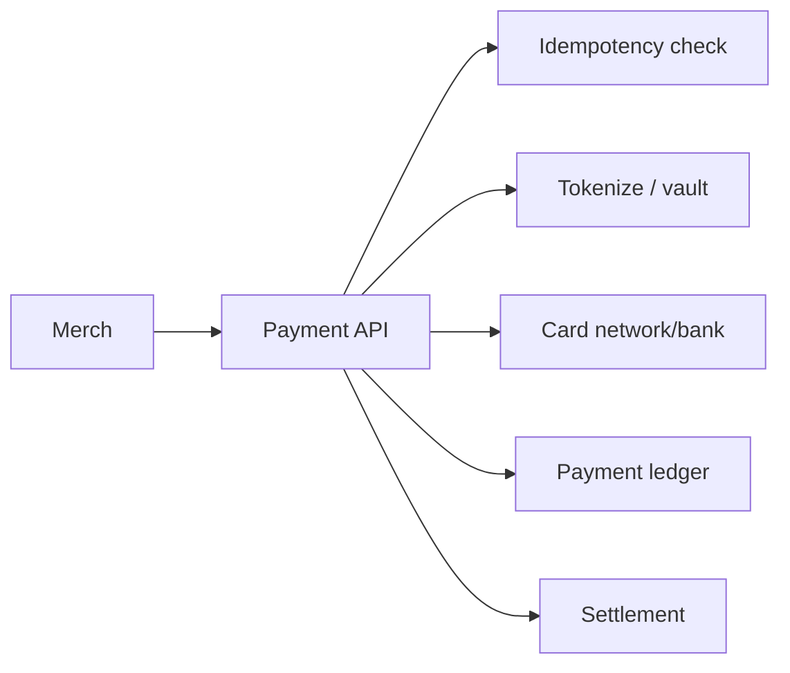
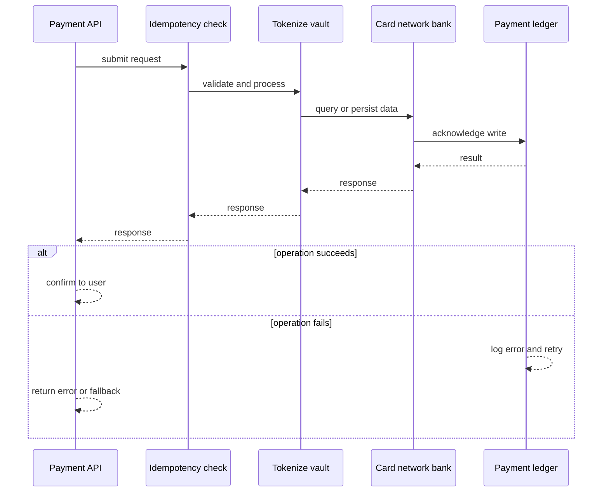
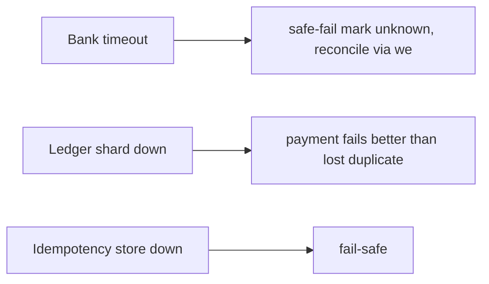
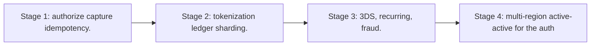

# Case Study: Payment Gateway

> **Tier:** advanced · **Status:** complete · Original numbers and diagrams.

## 1. Problem statement
Accept a payment from a customer to a merchant, authorize against card networks/banks, and settle — a PCI-scoped, idempotent, strongly-durable money path. This is a advanced-tier system design challenge because it must handle strict consistency and zero data loss while ensuring every transaction is durable, atomic, and auditable. The design must be production-grade: observable, debuggable, reversible, and able to survive component failures without data loss or cascading outages.

## 2. Scope
In (v1): authorize + capture + refund, idempotent, PCI tokenization. Out: 3DS, recurring billing (stage).

For Payment Gateway, these boundaries keep the first version focused on the core user value. Adding more features would dilute the design and delay shipping. Each excluded item is a scaling stage — a candidate for the next iteration once the baseline is proven.

## 3. Functional requirements
- Authorize a payment (hold).
- Capture (settle the hold).
- Refund.
- Idempotent by request key.
- Tokenize card data (PCI).

For Payment Gateway, these requirements drive specific architectural decisions: the read-write ratio determines the caching strategy, the durability target sets the replication mode, and the idempotency requirement shapes the API contract.

## 4. Non-functional requirements
- No double-charge.
- Durability 11 nines of payment records.
- Availability 99.95% (money path).
- PCI-DSS compliant.

For Payment Gateway, each non-functional target constrains a specific component: the latency SLO bounds the number of synchronous hops, the availability target forces redundancy across availability zones, and the cost ceiling limits the replication factor and storage tier.

## 5. Explicit assumptions
1. 1M payments/day, ~12/s avg, 300/s peak. [assumption] 2. Auth p99 < 3 s (network-dependent). [constraint] 3. Idempotency key per intent. [constraint]

For Payment Gateway, if these assumptions are off by an order of magnitude, the architecture must adapt: 10x traffic may require earlier sharding, a different read-write ratio changes the caching strategy, and a higher peak multiplier demands more headroom.

## 6. Traffic estimation
1M payments/day; auth is the latency-critical path (network round trips to banks).

To derive the request rate: divide the daily volume by 86,400 seconds to get the average rate, then multiply by 5-10x for peak. The read-to-write ratio determines whether the system is cache-dominated (read-heavy) or write-path-dominated (write-heavy). For Payment Gateway, this ratio shapes the entire storage and replication strategy.

## 7. Storage estimation
Payments + idempotency keys + tokens; small but must be durable and auditable.

For Payment Gateway, storage growth is projected from the daily write volume and retention policy. Index overhead and compression factors are accounted for in the total.

## 8. Bandwidth estimation
Small payloads; latency dominated by bank/network round trips, not bandwidth.

Bandwidth is request rate multiplied by average payload size for ingress, and response rate multiplied by response size for egress. CDN and edge caching reduce origin egress. Compression reduces bandwidth by 50-80 percent where applicable. For Payment Gateway, bandwidth may or may not be the binding constraint — compare it against compute and storage to find out.

## 9. API design
| Method | Path | Request | Response |
|--------|------|---------|----------|
| POST /payments/authorize | amount, token, key | auth id |
| POST |/payments/:id/capture | | |
| POST /payments/:id/refund | | |

## 10. Data model
payments(id, key, amount, status, token, ts); idempotency_keys(key -> payment_id, status); tokens (PCI vault). Ledger entries per payment.

For Payment Gateway, the data model follows the access pattern. The primary lookup determines the partition key; secondary lookups determine indexes. Denormalization is used selectively on hot read paths.

## 11. High-level architecture

## 12. Request flow
Authorize: check idempotency key -> tokenize card -> authorize via network -> record in ledger -> return auth. Capture/refund update ledger. Retries with same key return original result.

## 13. Component responsibilities
API, idempotency store, token vault (PCI), network connector, ledger, settlement.

For Payment Gateway, each component has one job. The gateway authenticates and routes. Services are stateless and scale horizontally. The data tier is the stateful core that scales by sharding.

## 14. Database selection
Ledger: append-only, strongly durable (synchronous replication). Idempotency: KV keyed by request key. Rejected: mutable balances, non-idempotent writes.

For Payment Gateway, the database was chosen by access pattern, not familiarity. The rejected alternatives were wrong for this workload, not bad in general.

## 15. Caching strategy
Idempotency key cache (fast seen-check). No caching of money state.

For Payment Gateway, the cache strategy matches the staleness tolerance. Cache-aside for most data, write-through where read-after-write matters, stampede protection on hot keys.

## 16. Partitioning strategy
Ledger partitioned by payment id; idempotency by key hash. Hot merchants partitioned further.

For Payment Gateway, the partition key balances query locality with even load distribution. Sharding strategy matters because a poor key creates hot spots under real traffic patterns.

## 17. Replication strategy
Ledger synchronous RF=3 (no loss on one failure). Idempotency store replicated.

For Payment Gateway, replication mode is split: synchronous where durability is critical, asynchronous elsewhere for throughput. RF=3 tolerates one failure. Failover is tested regularly.

## 18. Consistency model
Strong: a payment is authorized exactly once per idempotency key. Ledger is the source of truth; capture/refund are ledger entries.

For Payment Gateway, the consistency level is the weakest users accept. Read-your-writes is provided where needed. Eventual consistency is bounded and monitored, not unbounded and silent.

## 19. Failure scenarios
Bank timeout -> safe-fail (mark unknown, reconcile via webhook/queue) never assume success. Ledger shard down -> payment fails (better than lost/duplicate). Idempotency store down -> fail-safe.

## 20. Reliability strategy
SLI auth success, double-charge rate (0), unknown-resolution rate; SLO 99.95%. Safe-fail + reconcile. Chaos: kill a ledger shard, assert no double-charge.

For Payment Gateway, the SLO makes reliability measurable. The error budget balances feature velocity with stability. Chaos testing validates that resilience claims hold under real failures.

## 21. Security considerations
PCI-DSS: never store PAN (tokenize); HSM key mgmt; mTLS to networks; audit every payment; fraud hooks.

For Payment Gateway, security layers TLS, encryption at rest, RBAC, PII redaction, and audit. The policy gateway is fail-closed for AI-augmented operations.

## 22. Observability strategy
Auth success/decline rates, p99 latency, unknown-resolution queue, settlement reconciliation, double-charge guards.

For Payment Gateway, observability combines logs, metrics, and traces with correlation IDs. Golden signals drive the first dashboard. Alerts fire on burn rate, not raw thresholds.

## 23. Cost considerations
Bank/network fees + PCI compliance + durable storage. Idempotency prevents direct loss/duplicate cost.

For Payment Gateway, cost is driven by the binding resource. Caching, tiering, batching, and right-sizing are the levers. Cost per request is tracked and alerted on.

## 24. Scaling stages
Stage 1: authorize/capture + idempotency. -> Stage 2: tokenization + ledger sharding. -> Stage 3: 3DS, recurring, fraud. -> Stage 4: multi-region active-active for the auth path.

## 25. Trade-offs
Safe-fail (no double-charge) vs false declines. Synchronous durability (no loss) vs latency. Tokenization (PCI) vs vault complexity.

For Payment Gateway, each trade-off lists what was chosen, what was rejected, and why. This makes the design defensible in review — every decision has documented reasoning.

## 26. Alternative designs
Assume success on timeout (double-charge risk). Mutable balances (no audit). Non-idempotent API (duplicates).

For Payment Gateway, the alternatives are real architectures that work under different constraints. They were rejected for this workload's specific requirements, not because they are bad designs.

## 27. Interview discussion points
Clarify double-charge tolerance, bank timeouts, PCI. Surface idempotency, safe-fail + reconcile, and the durable ledger.

For Payment Gateway in an interview: clarify scope first, surface the read-write ratio, design the hot path deeply, discuss failures, and offer an alternative. Weak candidates skip failure modes.

## 28. Original Mermaid diagrams
Standalone sources under `diagrams/case-studies/payment-gateway/`: `context.mmd`, `request-sequence.mmd`, `failure-flow.mmd`, `scaling-evolution.mmd`. The diagrams are embedded in their respective sections: architecture in section 11, request flow in section 12, failure scenarios in section 19, and scaling stages in section 24.

## 29. Further reading
Ledger/payment: Level 10; idempotency: Level 4; PCI/HSM: Level 7. Sources: `S-DYNAMO` `S-RAFT` `S-SPANNER`.

## 30. Practical exercises

1. Design the unknown-resolution reconciliation. 2. Refund after a partial capture. 3. 3DS challenge flow. 4. Webhook idempotency from banks. 5. Multi-region active-active auth.

---
Previous: Inventory-management · Next: Digital wallet

