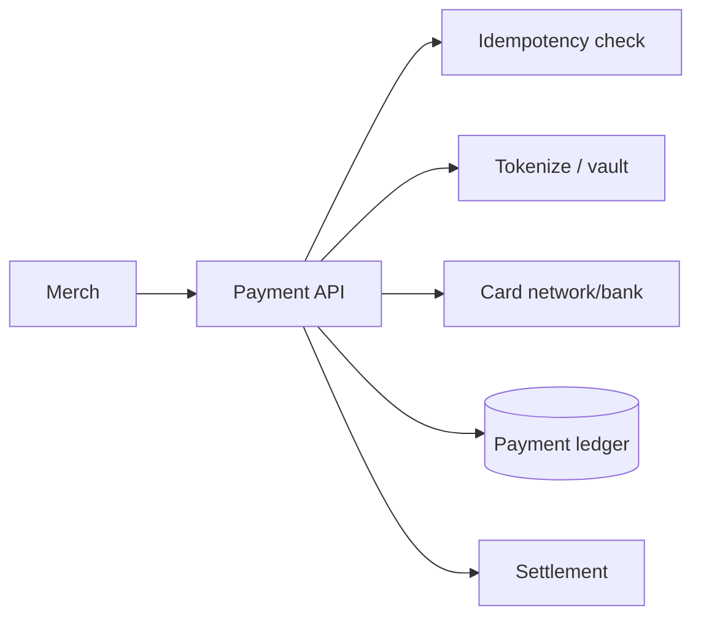
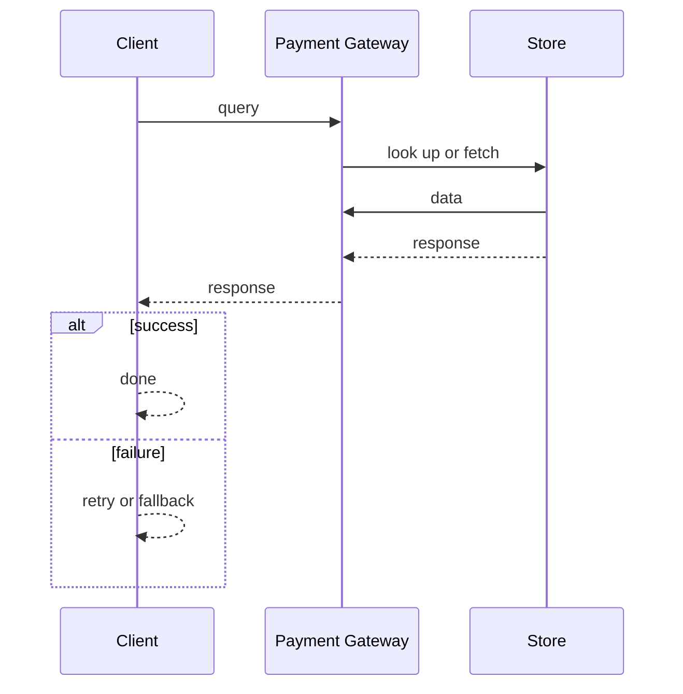
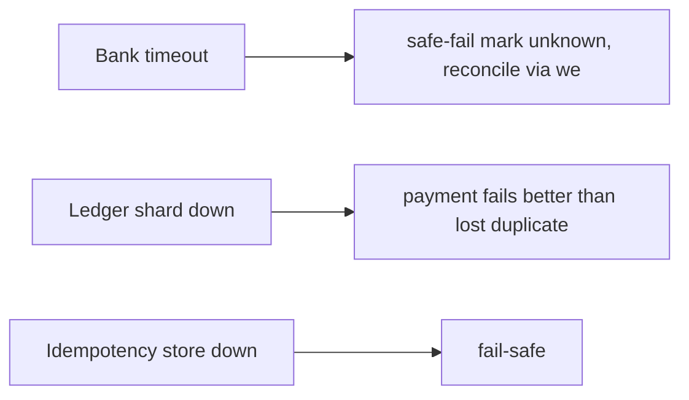

# Case Study: Payment Gateway

> **Tier:** advanced · **Status:** complete · Original numbers and diagrams.

## 1. Problem statement

Accept a payment from a customer to a merchant, authorize against card networks/banks, and settle — a PCI-scoped, idempotent, strongly-durable money path.

## 2. Scope

In (v1): authorize + capture + refund, idempotent, PCI tokenization. Out: 3DS, recurring billing (stage).

## 3. Functional requirements

- Authorize a payment (hold). - Capture (settle the hold). - Refund. - Idempotent by request key. - Tokenize card data (PCI).

## 4. Non-functional requirements

- No double-charge. - Durability 11 nines of payment records. - Availability 99.95% (money path). - PCI-DSS compliant.

## 5. Explicit assumptions

1. 1M payments/day, ~12/s avg, 300/s peak. [assumption] 2. Auth p99 < 3 s (network-dependent). [constraint] 3. Idempotency key per intent. [constraint]

## 6. Traffic estimation

1M payments/day; auth is the latency-critical path (network round trips to banks).

## 7. Storage estimation

Payments + idempotency keys + tokens; small but must be durable and auditable.

## 8. Bandwidth estimation

Small payloads; latency dominated by bank/network round trips, not bandwidth.

## 9. API design

| POST /payments/authorize | amount, token, key | auth id | | POST /payments/:id/capture | | | | POST /payments/:id/refund | | |

## 10. Data model

payments(id, key, amount, status, token, ts); idempotency_keys(key -> payment_id, status); tokens (PCI vault). Ledger entries per payment.

## 11. High-level architecture

## 12. Request flow

Authorize: check idempotency key -> tokenize card -> authorize via network -> record in ledger -> return auth. Capture/refund update ledger. Retries with same key return original result.

## 13. Component responsibilities

API, idempotency store, token vault (PCI), network connector, ledger, settlement.

## 14. Database selection

Ledger: append-only, strongly durable (synchronous replication). Idempotency: KV keyed by request key. Rejected: mutable balances, non-idempotent writes.

## 15. Caching strategy

Idempotency key cache (fast seen-check). No caching of money state.

## 16. Partitioning strategy

Ledger partitioned by payment id; idempotency by key hash. Hot merchants partitioned further.

## 17. Replication strategy

Ledger synchronous RF=3 (no loss on one failure). Idempotency store replicated.

## 18. Consistency model

Strong: a payment is authorized exactly once per idempotency key. Ledger is the source of truth; capture/refund are ledger entries.

## 19. Failure scenarios

Bank timeout -> safe-fail (mark unknown, reconcile via webhook/queue) never assume success. Ledger shard down -> payment fails (better than lost/duplicate). Idempotency store down -> fail-safe.

## 20. Reliability strategy

SLI auth success, double-charge rate (0), unknown-resolution rate; SLO 99.95%. Safe-fail + reconcile. Chaos: kill a ledger shard, assert no double-charge.

## 21. Security considerations

PCI-DSS: never store PAN (tokenize); HSM key mgmt; mTLS to networks; audit every payment; fraud hooks.

## 22. Observability strategy

Auth success/decline rates, p99 latency, unknown-resolution queue, settlement reconciliation, double-charge guards.

## 23. Cost considerations

Bank/network fees + PCI compliance + durable storage. Idempotency prevents direct loss/duplicate cost.

## 24. Scaling stages

Stage 1: authorize/capture + idempotency. -> Stage 2: tokenization + ledger sharding. -> Stage 3: 3DS, recurring, fraud. -> Stage 4: multi-region active-active for the auth path.

## 25. Trade-offs

Safe-fail (no double-charge) vs false declines. Synchronous durability (no loss) vs latency. Tokenization (PCI) vs vault complexity.

## 26. Alternative designs

Assume success on timeout (double-charge risk). Mutable balances (no audit). Non-idempotent API (duplicates).

## 27. Interview discussion points

Clarify double-charge tolerance, bank timeouts, PCI. Surface idempotency, safe-fail + reconcile, and the durable ledger.

## 28. Original Mermaid diagrams

Standalone sources under `diagrams/case-studies/payment-gateway/`: `context.mmd`, `request-sequence.mmd`, `failure-flow.mmd`, `scaling-evolution.mmd`. Request sequence and failure flow:

## 29. Further reading

Ledger/payment: Level 10; idempotency: Level 4; PCI/HSM: Level 7.

## 30. Practical exercises

1. Design the unknown-resolution reconciliation. 2. Refund after a partial capture. 3. 3DS challenge flow. 4. Webhook idempotency from banks. 5. Multi-region active-active auth.

---
Previous: Inventory-management · Next: Digital wallet

