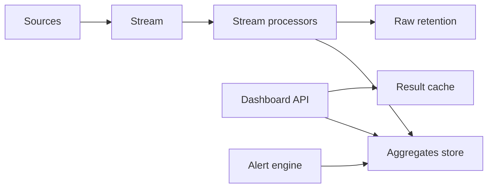
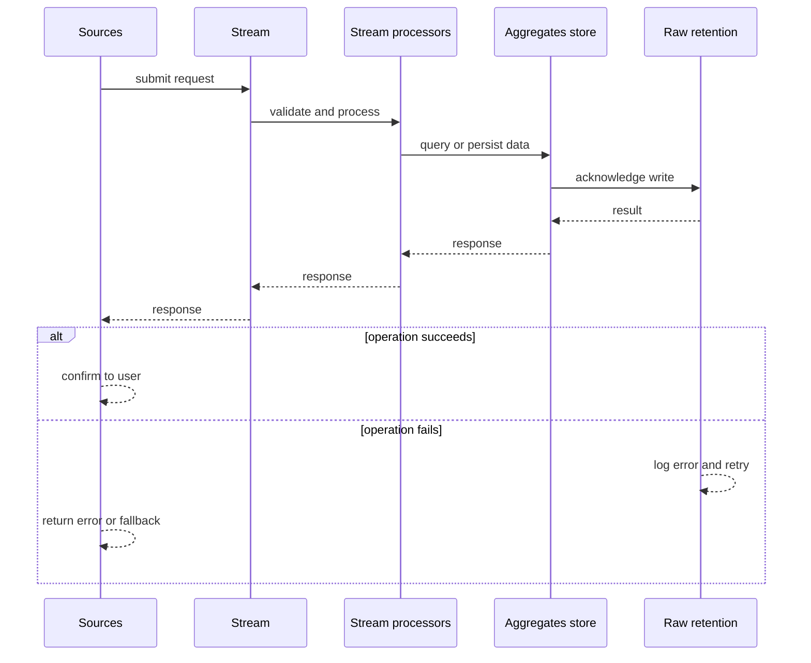
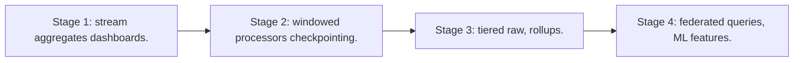

# Case Study: Real-Time Analytics Platform

> **Tier:** advanced · **Status:** complete · Original numbers and diagrams.

## 1. Problem statement
Ingest events continuously, aggregate, and serve sub-second dashboards/queries over recent and historical data — a stream + serving store. This is a advanced-tier system design challenge because it must handle high-throughput data ingestion while ensuring no single point of failure. The design must be production-grade: observable, debuggable, reversible, and able to survive component failures without data loss or cascading outages.

## 2. Scope
In (v1): ingest events, real-time aggregations, dashboards, alerts. Out: ad-hoc SQL on raw (stage).

For Real-Time Analytics Platform, these boundaries keep the first version focused on the core user value. Adding more features would dilute the design and delay shipping. Each excluded item is a scaling stage — a candidate for the next iteration once the baseline is proven.

## 3. Functional requirements
- Ingest events continuously.
- Compute real-time aggregations (windows).
- Serve dashboards sub-second.
- Alert on aggregates.

For Real-Time Analytics Platform, these requirements drive specific architectural decisions: the read-write ratio determines the caching strategy, the durability target sets the replication mode, and the idempotency requirement shapes the API contract.

## 4. Non-functional requirements
- Dashboard refresh < 1 s.
- Ingest millions of events/s.
- Recent data low-latency; historical queryable.

For Real-Time Analytics Platform, each non-functional target constrains a specific component: the latency SLO bounds the number of synchronous hops, the availability target forces redundancy across availability zones, and the cost ceiling limits the replication factor and storage tier.

## 5. Explicit assumptions
1. 1M events/s, ~200 B. [assumption] 2. Dashboards on 1-min/1h windows. [assumption] 3. Retain 1 year. [constraint]

For Real-Time Analytics Platform, if these assumptions are off by an order of magnitude, the architecture must adapt: 10x traffic may require earlier sharding, a different read-write ratio changes the caching strategy, and a higher peak multiplier demands more headroom.

## 6. Traffic estimation
1M events/s ingest; dashboard reads bursty; queries scan aggregates not raw.

To derive the request rate: divide the daily volume by 86,400 seconds to get the average rate, then multiply by 5-10x for peak. The read-to-write ratio determines whether the system is cache-dominated (read-heavy) or write-path-dominated (write-heavy). For Real-Time Analytics Platform, this ratio shapes the entire storage and replication strategy.

## 7. Storage estimation
Raw stream retained (replay) + aggregates; PB over a year. Tier cold.

For Real-Time Analytics Platform, storage growth is projected from the daily write volume and retention policy. Index overhead and compression factors are accounted for in the total.

## 8. Bandwidth estimation
Ingress ~200 MB/s; dashboards pull aggregates (small).

Bandwidth is request rate multiplied by average payload size for ingress, and response rate multiplied by response size for egress. CDN and edge caching reduce origin egress. Compression reduces bandwidth by 50-80 percent where applicable. For Real-Time Analytics Platform, bandwidth may or may not be the binding constraint — compare it against compute and storage to find out.

## 9. API design
| Method | Path | Request | Response |
|--------|------|---------|----------|
| POST /ingest (batch) | events | ack |
| GET |/dashboard | query | series |

## 10. Data model
events(stream, partitioned by key); aggregates(metric, window, value); dashboards(query -> cached result).

For Real-Time Analytics Platform, the data model follows the access pattern. The primary lookup determines the partition key; secondary lookups determine indexes. Denormalization is used selectively on hot read paths.

## 11. High-level architecture

## 12. Request flow
Ingest -> stream -> processors compute windowed aggregates -> aggregates store (+ raw retained for replay) -> dashboard API reads aggregates (cached) -> alerts on thresholds.

## 13. Component responsibilities
Ingest, stream, processors (windowed, stateful), aggregates store, dashboard API, alert engine.

For Real-Time Analytics Platform, each component has one job. The gateway authenticates and routes. Services are stateless and scale horizontally. The data tier is the stateful core that scales by sharding.

## 14. Database selection
Aggregates: a fast serving store (columnar/KV) for sub-second reads; raw: retained stream/object for replay. Rejected: query raw for every dashboard (slow).

For Real-Time Analytics Platform, the database was chosen by access pattern, not familiarity. The rejected alternatives were wrong for this workload, not bad in general.

## 15. Caching strategy
Dashboard results cached (short TTL); aggregates in memory for hot windows.

For Real-Time Analytics Platform, the cache strategy matches the staleness tolerance. Cache-aside for most data, write-through where read-after-write matters, stampede protection on hot keys.

## 16. Partitioning strategy
Stream partitioned by key; aggregates by (metric, window); raw by time for replay.

For Real-Time Analytics Platform, the partition key balances query locality with even load distribution. Sharding strategy matters because a poor key creates hot spots under real traffic patterns.

## 17. Replication strategy
Aggregates RF=3; raw retained in durable storage; processors checkpoint (effectively-once).

For Real-Time Analytics Platform, replication mode is split: synchronous where durability is critical, asynchronous elsewhere for throughput. RF=3 tolerates one failure. Failover is tested regularly.

## 18. Consistency model
Aggregates near-real-time (window lag seconds). Exactly-once via checkpoints + idempotent aggregation. Historical via replay.

For Real-Time Analytics Platform, the consistency level is the weakest users accept. Read-your-writes is provided where needed. Eventual consistency is bounded and monitored, not unbounded and silent.

## 19. Failure scenarios
Processor failure -> restore from checkpoint, replay (idempotent). Aggregate store down -> dashboard degrades to cached/last. Raw retention gap -> historical loss (alert).

## 20. Reliability strategy
SLI ingest lag, dashboard latency; SLO 99.9%. Checkpoint recovery. Chaos: kill processors, assert replay + no double counts.

For Real-Time Analytics Platform, the SLO makes reliability measurable. The error budget balances feature velocity with stability. Chaos testing validates that resilience claims hold under real failures.

## 21. Security considerations
Per-tenant data isolation; redact PII at ingest; access control on dashboards; retention/deletion.

For Real-Time Analytics Platform, security layers TLS, encryption at rest, RBAC, PII redaction, and audit. The policy gateway is fail-closed for AI-augmented operations.

## 22. Observability strategy
Ingest rate, processor lag, window freshness, dashboard p99, query rate, checkpoint failures.

For Real-Time Analytics Platform, observability combines logs, metrics, and traces with correlation IDs. Golden signals drive the first dashboard. Alerts fire on burn rate, not raw thresholds.

## 23. Cost considerations
Storage (raw + aggregates) + compute (processors). Downsample old aggregates; tier raw cold.

For Real-Time Analytics Platform, cost is driven by the binding resource. Caching, tiering, batching, and right-sizing are the levers. Cost per request is tracked and alerted on.

## 24. Scaling stages
Stage 1: stream + aggregates + dashboards. -> Stage 2: windowed processors + checkpointing. -> Stage 3: tiered raw, rollups. -> Stage 4: federated queries, ML features.

## 25. Trade-offs
Precompute aggregates (fast reads, write cost) vs query raw (slow). Retain raw (replay) vs cost. Exactly-once (correctness) vs throughput.

For Real-Time Analytics Platform, each trade-off lists what was chosen, what was rejected, and why. This makes the design defensible in review — every decision has documented reasoning.

## 26. Alternative designs
Query raw per dashboard (slow). No checkpointing (double counts on recovery). All-hot retention (cost).

For Real-Time Analytics Platform, the alternatives are real architectures that work under different constraints. They were rejected for this workload's specific requirements, not because they are bad designs.

## 27. Interview discussion points
Clarify event rate, dashboard latency, retention. Surface stream + aggregates + serving store + checkpointing.

For Real-Time Analytics Platform in an interview: clarify scope first, surface the read-write ratio, design the hot path deeply, discuss failures, and offer an alternative. Weak candidates skip failure modes.

## 28. Original Mermaid diagrams
Standalone sources under `diagrams/case-studies/real-time-analytics/`: `context.mmd`, `request-sequence.mmd`, `failure-flow.mmd`, `scaling-evolution.mmd`. The diagrams are embedded in their respective sections: architecture in section 11, request flow in section 12, failure scenarios in section 19, and scaling stages in section 24.

## 29. Further reading
Streams: Level 10; checkpointing/CDC: Level 4; dashboards: Level 8. Sources: `S-MAPREDUCE` `S-LAMBDA`.

## 30. Practical exercises

1. Window with late events (watermarks). 2. Replay a day of events to rebuild aggregates. 3. Sub-second dashboard at 10M events/s. 4. Exactly-once across a processor restart. 5. Tier raw cold — recall latency.

---
Previous: Identity & access-management · Next: Recommendation engine

