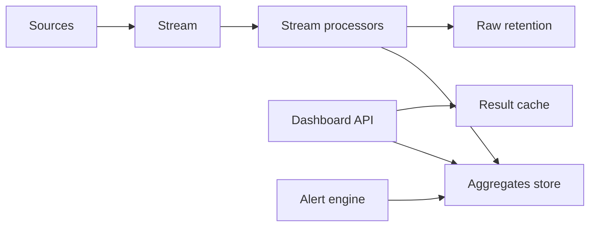
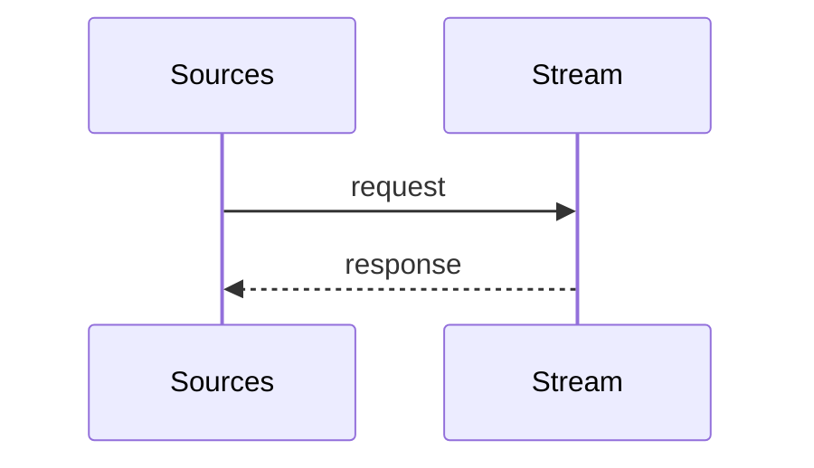
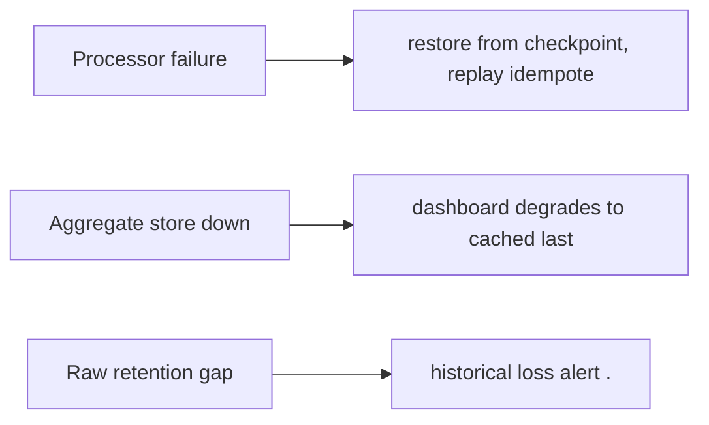
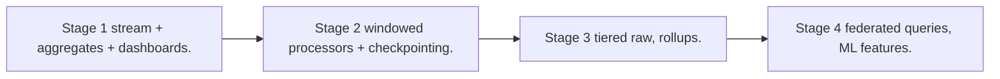

# Case Study: Real-Time Analytics Platform

> **Tier:** advanced · **Status:** beta · Original numbers and diagrams.

## 1. Problem statement

Ingest events continuously, aggregate, and serve sub-second dashboards/queries over recent and historical data — a stream + serving store.

## 2. Scope

In (v1): ingest events, real-time aggregations, dashboards, alerts. Out: ad-hoc SQL on raw (stage).

## 3. Functional requirements

- Ingest events continuously. - Compute real-time aggregations (windows). - Serve dashboards sub-second. - Alert on aggregates.

## 4. Non-functional requirements

- Dashboard refresh < 1 s. - Ingest millions of events/s. - Recent data low-latency; historical queryable.

## 5. Explicit assumptions

1. 1M events/s, ~200 B. [assumption] 2. Dashboards on 1-min/1h windows. [assumption] 3. Retain 1 year. [constraint]

## 6. Traffic estimation

1M events/s ingest; dashboard reads bursty; queries scan aggregates not raw.

## 7. Storage estimation

Raw stream retained (replay) + aggregates; PB over a year. Tier cold.

## 8. Bandwidth estimation

Ingress ~200 MB/s; dashboards pull aggregates (small).

## 9. API design

| POST /ingest (batch) | events | ack | | GET /dashboard | query | series |

## 10. Data model

events(stream, partitioned by key); aggregates(metric, window, value); dashboards(query -> cached result).

## 11. High-level architecture

## 12. Request flow

Ingest -> stream -> processors compute windowed aggregates -> aggregates store (+ raw retained for replay) -> dashboard API reads aggregates (cached) -> alerts on thresholds.

## 13. Component responsibilities

Ingest, stream, processors (windowed, stateful), aggregates store, dashboard API, alert engine.

## 14. Database selection

Aggregates: a fast serving store (columnar/KV) for sub-second reads; raw: retained stream/object for replay. Rejected: query raw for every dashboard (slow).

## 15. Caching strategy

Dashboard results cached (short TTL); aggregates in memory for hot windows.

## 16. Partitioning strategy

Stream partitioned by key; aggregates by (metric, window); raw by time for replay.

## 17. Replication strategy

Aggregates RF=3; raw retained in durable storage; processors checkpoint (effectively-once).

## 18. Consistency model

Aggregates near-real-time (window lag seconds). Exactly-once via checkpoints + idempotent aggregation. Historical via replay.

## 19. Failure scenarios

Processor failure -> restore from checkpoint, replay (idempotent). Aggregate store down -> dashboard degrades to cached/last. Raw retention gap -> historical loss (alert).

## 20. Reliability strategy

SLI ingest lag, dashboard latency; SLO 99.9%. Checkpoint recovery. Chaos: kill processors, assert replay + no double counts.

## 21. Security considerations

Per-tenant data isolation; redact PII at ingest; access control on dashboards; retention/deletion.

## 22. Observability strategy

Ingest rate, processor lag, window freshness, dashboard p99, query rate, checkpoint failures.

## 23. Cost considerations

Storage (raw + aggregates) + compute (processors). Downsample old aggregates; tier raw cold.

## 24. Scaling stages

Stage 1: stream + aggregates + dashboards. -> Stage 2: windowed processors + checkpointing. -> Stage 3: tiered raw, rollups. -> Stage 4: federated queries, ML features.

## 25. Trade-offs

Precompute aggregates (fast reads, write cost) vs query raw (slow). Retain raw (replay) vs cost. Exactly-once (correctness) vs throughput.

## 26. Alternative designs

Query raw per dashboard (slow). No checkpointing (double counts on recovery). All-hot retention (cost).

## 27. Interview discussion points

Clarify event rate, dashboard latency, retention. Surface stream + aggregates + serving store + checkpointing.

## 28. Original Mermaid diagrams

Standalone sources under `diagrams/case-studies/real-time-analytics/`: `context.mmd`, `request-sequence.mmd`, `failure-flow.mmd`, `scaling-evolution.mmd`. Additional diagrams for this case study:

## 29. Further reading

Streams: Level 10; checkpointing/CDC: Level 4; dashboards: Level 8.

## 30. Practical exercises

1. Window with late events (watermarks). 2. Replay a day of events to rebuild aggregates. 3. Sub-second dashboard at 10M events/s. 4. Exactly-once across a processor restart. 5. Tier raw cold — recall latency.

---
Previous: Identity & access-management · Next: Recommendation engine
