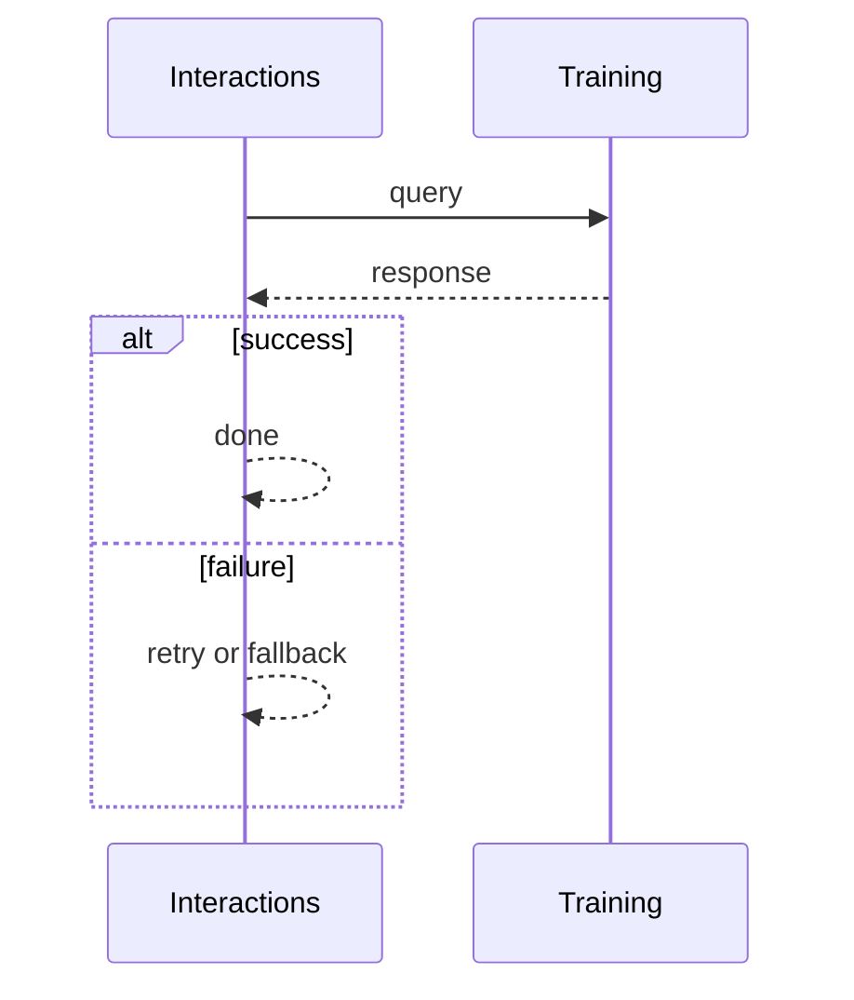
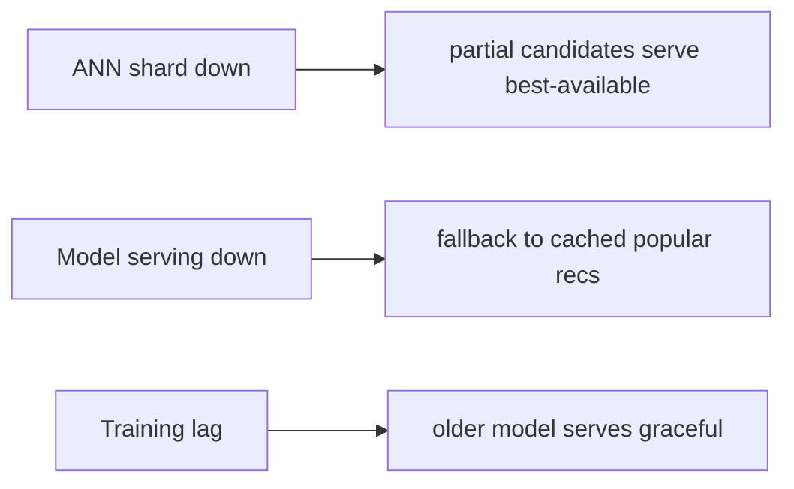

# Case Study: Recommendation Engine

> **Tier:** advanced · **Status:** complete · Original numbers and diagrams.

## 1. Problem statement

Generate personalized recommendations from user history and item features in real time — a retrieval + ranking + serving ML pipeline.


## 2. Scope

In (v1): candidate retrieval, ranking, serving, feedback loop. Out: cold-start, multi-objective (stage).


## 3. Functional requirements

- Retrieve candidate items for a user.
- Rank by predicted relevance.
- Serve top-k in <100 ms.
- Learn from feedback (clicks).


## 4. Non-functional requirements

- Serve p99 < 100 ms.
- Availability 99.9%.
- Freshness: incorporate recent behavior.


## 5. Explicit assumptions

1. 100M users, 1B items, 1k recs/user/day. [assumption] 2. Candidate set ~1k, serve top-50. [assumption] 3. Models retrained hourly. [constraint]


## 6. Traffic estimation

1k recs/user x 100M = high read QPS; ranking is the compute cost.


## 7. Storage estimation

User/item features, embeddings, interaction history, models. Embeddings large (GBs).


## 8. Bandwidth estimation

Recommendations small; feature fetch is the bandwidth (embeddings).


## 9. API design

| GET /recs/:user | | top-k items |


## 10. Data model

users(features); items(features, embeddings); interactions(user, item, action, ts); models(version).


## 11. High-level architecture

```mermaid
%% created-for: system-design-mastery
flowchart LR
  User --> RecSvc[Rec service]
  RecSvc --> Retrieval[Retrieval (ann + filters)] --> Candidates
  Candidates --> Rank[Ranker (model)] --> TopK
  RecSvc --> Feat[Feature store]
  Interact[Interactions] --> Train[Training] --> Model[Model registry] --> Rank
```


## 12. Request flow

Request -> retrieval (ANN + business filters) -> ranker scores candidates with user+item features -> top-k served -> interaction logged -> hourly retraining updates the model.


## 13. Component responsibilities

Retrieval (ANN index), ranker (model serving), feature store, interaction log, training, model registry.


## 14. Database selection

Feature store (online + offline); ANN index for retrieval; interaction log (stream); model registry (artifacts). Rejected: scoring all 1B items (impossible).


## 15. Caching strategy

Candidate lists cached per user (short TTL); feature cache; popular items cached.


## 16. Partitioning strategy

ANN index sharded by item partition; ranker scaled by QPS; interactions partitioned by user.


## 17. Replication strategy

Features + ANN index replicated; interactions retained (stream) for retraining; models versioned.


## 18. Consistency model

Recommendations eventually consistent with behavior (a click reflects within the next training cycle). Real-time features update quickly.


## 19. Failure scenarios

ANN shard down -> partial candidates (serve best-available). Model serving down -> fallback to cached/popular recs. Training lag -> older model serves (graceful).


## 20. Reliability strategy

SLI serve latency, coverage; SLO 99.9%. Fallback to popular/cached recs. Chaos: kill ranker, assert fallback recs.


## 21. Security considerations

Per-user auth; privacy of interactions; don't leak cross-user features; audit.


## 22. Observability strategy

Serve p99, candidate coverage, model freshness, click-through, fallback rate.


## 23. Cost considerations

ANN index (memory) + model serving (compute) + training. Retrieval limits ranking cost; cache hot recs.


## 24. Scaling stages

Stage 1: retrieval + rank + serve. -> Stage 2: feature store + ANN sharding. -> Stage 3: real-time features + hourly retrain. -> Stage 4: multi-objective, cold-start, multi-region.


## 25. Trade-offs

Retrieval (cheap, recall) vs rank (accurate, costly) — funnel. Freshness (retrain freq) vs cost. Personalized (relevance) vs popular fallback (availability).


## 26. Alternative designs

Score all items (impossible). No retraining (stale). Popular-only (no personalization).


## 27. Interview discussion points

Clarify latency, item scale, freshness. Surface the retrieval+ranking funnel, feature store, and feedback loop.


## 28. Original Mermaid diagrams

Standalone sources under `diagrams/case-studies/recommendation-engine/`: `context.mmd`, `request-sequence.mmd`, `failure-flow.mmd`, `scaling-evolution.mmd`. Request sequence and failure flow:





## 29. Further reading

ML/feature stores: Level 10; vector search: Level 10; streams: Level 10.


## 30. Practical exercises

1. Cold-start for new users/items. 2. Real-time feature freshness. 3. Retrain without downtime. 4. Fallback when the ranker is slow. 5. Multi-objective ranking.


---
Previous: Real-time analytics · Next: Banking ledger

