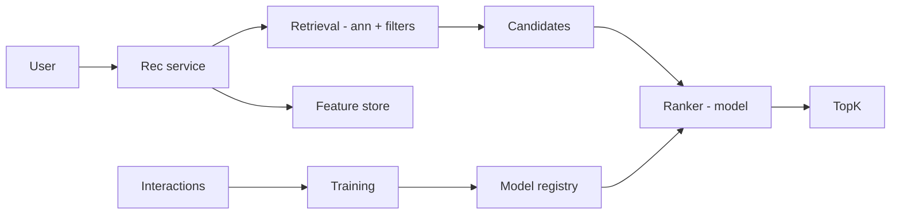
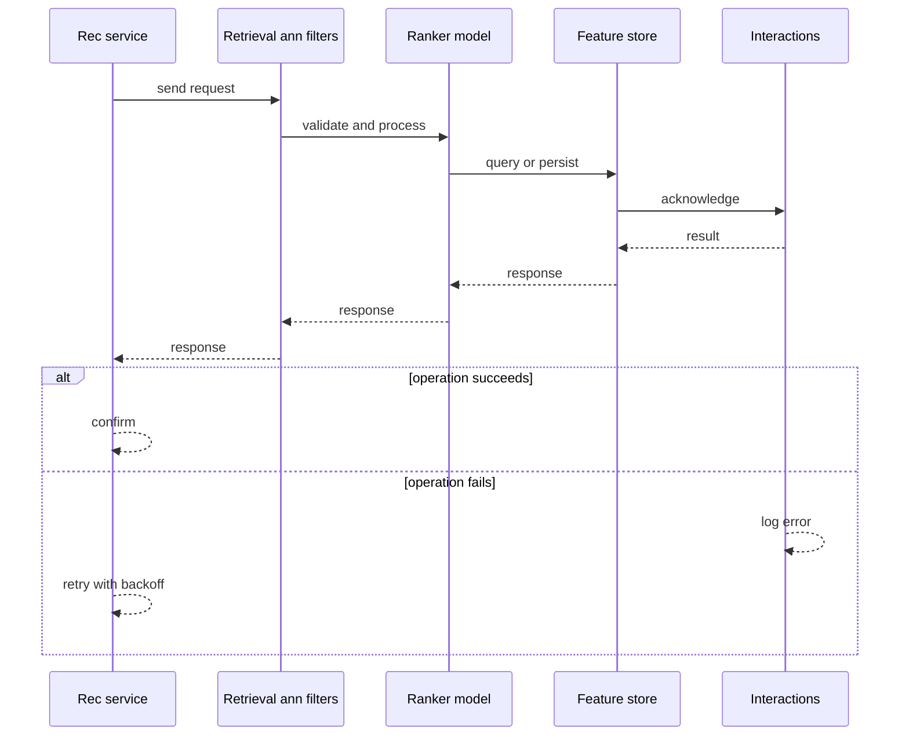
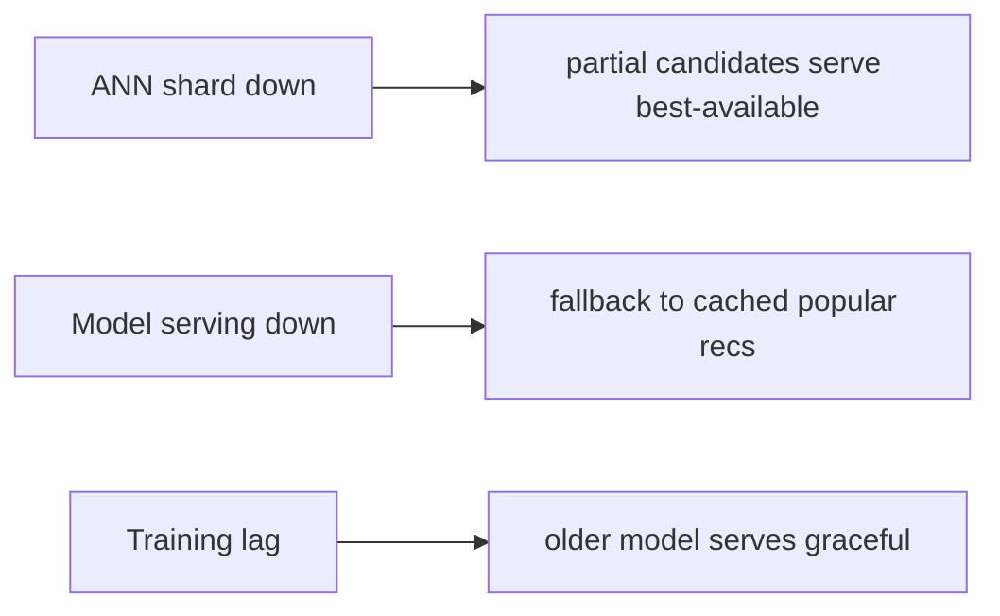
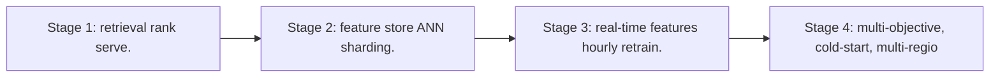

# Case Study: Recommendation Engine

> **Tier:** advanced · **Status:** complete · Original numbers and diagrams.

## 1. Problem statement
Generate personalized recommendations from user history and item features in real time — a retrieval + ranking + serving ML pipeline. This is a advanced-tier system design challenge because it must handle high availability under peak load while ensuring no single point of failure. The design must be production-grade: observable, debuggable, reversible, and able to survive component failures without data loss or cascading outages.

## 2. Scope
In (v1): candidate retrieval, ranking, serving, feedback loop. Out: cold-start, multi-objective (stage).

For Recommendation Engine, these boundaries keep the first version focused on the core user value. Adding more features would dilute the design and delay shipping. Each excluded item is a scaling stage — a candidate for the next iteration once the baseline is proven.

## 3. Functional requirements
- Retrieve candidate items for a user.
- Rank by predicted relevance.
- Serve top-k in <100 ms.
- Learn from feedback (clicks).

For Recommendation Engine, these requirements drive specific architectural decisions: the read-write ratio determines the caching strategy, the durability target sets the replication mode, and the idempotency requirement shapes the API contract.

## 4. Non-functional requirements
- Serve p99 < 100 ms.
- Availability 99.9%.
- Freshness: incorporate recent behavior.

For Recommendation Engine, each non-functional target constrains a specific component: the latency SLO bounds the number of synchronous hops, the availability target forces redundancy across availability zones, and the cost ceiling limits the replication factor and storage tier.

## 5. Explicit assumptions
1. 100M users, 1B items, 1k recs/user/day. [assumption] 2. Candidate set ~1k, serve top-50. [assumption] 3. Models retrained hourly. [constraint]

For Recommendation Engine, if these assumptions are off by an order of magnitude, the architecture must adapt: 10x traffic may require earlier sharding, a different read-write ratio changes the caching strategy, and a higher peak multiplier demands more headroom.

## 6. Traffic estimation
1k recs/user x 100M = high read QPS; ranking is the compute cost.

To derive the request rate: divide the daily volume by 86,400 seconds to get the average rate, then multiply by 5-10x for peak. The read-to-write ratio determines whether the system is cache-dominated (read-heavy) or write-path-dominated (write-heavy). For Recommendation Engine, this ratio shapes the entire storage and replication strategy.

## 7. Storage estimation
User/item features, embeddings, interaction history, models. Embeddings large (GBs).

For Recommendation Engine, storage growth is projected from the daily write volume and retention policy. Index overhead and compression factors are accounted for in the total.

## 8. Bandwidth estimation
Recommendations small; feature fetch is the bandwidth (embeddings).

Bandwidth is request rate multiplied by average payload size for ingress, and response rate multiplied by response size for egress. CDN and edge caching reduce origin egress. Compression reduces bandwidth by 50-80 percent where applicable. For Recommendation Engine, bandwidth may or may not be the binding constraint — compare it against compute and storage to find out.

## 9. API design
| Method | Path | Request | Response |
|--------|------|---------|----------|
| GET /recs/:user | | top-k items |

## 10. Data model
users(features); items(features, embeddings); interactions(user, item, action, ts); models(version).

For Recommendation Engine, the data model follows the access pattern. The primary lookup determines the partition key; secondary lookups determine indexes. Denormalization is used selectively on hot read paths.

## 11. High-level architecture

## 12. Request flow
Request -> retrieval (ANN + business filters) -> ranker scores candidates with user+item features -> top-k served -> interaction logged -> hourly retraining updates the model.

## 13. Component responsibilities
Retrieval (ANN index), ranker (model serving), feature store, interaction log, training, model registry.

For Recommendation Engine, each component has one job. The gateway authenticates and routes. Services are stateless and scale horizontally. The data tier is the stateful core that scales by sharding.

## 14. Database selection
Feature store (online + offline); ANN index for retrieval; interaction log (stream); model registry (artifacts). Rejected: scoring all 1B items (impossible).

For Recommendation Engine, the database was chosen by access pattern, not familiarity. The rejected alternatives were wrong for this workload, not bad in general.

## 15. Caching strategy
Candidate lists cached per user (short TTL); feature cache; popular items cached.

For Recommendation Engine, the cache strategy matches the staleness tolerance. Cache-aside for most data, write-through where read-after-write matters, stampede protection on hot keys.

## 16. Partitioning strategy
ANN index sharded by item partition; ranker scaled by QPS; interactions partitioned by user.

For Recommendation Engine, the partition key balances query locality with even load distribution. Sharding strategy matters because a poor key creates hot spots under real traffic patterns.

## 17. Replication strategy
Features + ANN index replicated; interactions retained (stream) for retraining; models versioned.

For Recommendation Engine, replication mode is split: synchronous where durability is critical, asynchronous elsewhere for throughput. RF=3 tolerates one failure. Failover is tested regularly.

## 18. Consistency model
Recommendations eventually consistent with behavior (a click reflects within the next training cycle). Real-time features update quickly.

For Recommendation Engine, the consistency level is the weakest users accept. Read-your-writes is provided where needed. Eventual consistency is bounded and monitored, not unbounded and silent.

## 19. Failure scenarios
ANN shard down -> partial candidates (serve best-available). Model serving down -> fallback to cached/popular recs. Training lag -> older model serves (graceful).

## 20. Reliability strategy
SLI serve latency, coverage; SLO 99.9%. Fallback to popular/cached recs. Chaos: kill ranker, assert fallback recs.

For Recommendation Engine, the SLO makes reliability measurable. The error budget balances feature velocity with stability. Chaos testing validates that resilience claims hold under real failures.

## 21. Security considerations
Per-user auth; privacy of interactions; don't leak cross-user features; audit.

For Recommendation Engine, security layers TLS, encryption at rest, RBAC, PII redaction, and audit. The policy gateway is fail-closed for AI-augmented operations.

## 22. Observability strategy
Serve p99, candidate coverage, model freshness, click-through, fallback rate.

For Recommendation Engine, observability combines logs, metrics, and traces with correlation IDs. Golden signals drive the first dashboard. Alerts fire on burn rate, not raw thresholds.

## 23. Cost considerations
ANN index (memory) + model serving (compute) + training. Retrieval limits ranking cost; cache hot recs.

For Recommendation Engine, cost is driven by the binding resource. Caching, tiering, batching, and right-sizing are the levers. Cost per request is tracked and alerted on.

## 24. Scaling stages
Stage 1: retrieval + rank + serve. -> Stage 2: feature store + ANN sharding. -> Stage 3: real-time features + hourly retrain. -> Stage 4: multi-objective, cold-start, multi-region.

## 25. Trade-offs
Retrieval (cheap, recall) vs rank (accurate, costly) — funnel. Freshness (retrain freq) vs cost. Personalized (relevance) vs popular fallback (availability).

For Recommendation Engine, each trade-off lists what was chosen, what was rejected, and why. This makes the design defensible in review — every decision has documented reasoning.

## 26. Alternative designs
Score all items (impossible). No retraining (stale). Popular-only (no personalization).

For Recommendation Engine, the alternatives are real architectures that work under different constraints. They were rejected for this workload's specific requirements, not because they are bad designs.

## 27. Interview discussion points
Clarify latency, item scale, freshness. Surface the retrieval+ranking funnel, feature store, and feedback loop.

For Recommendation Engine in an interview: clarify scope first, surface the read-write ratio, design the hot path deeply, discuss failures, and offer an alternative. Weak candidates skip failure modes.

## 28. Original Mermaid diagrams
Standalone sources under `diagrams/case-studies/recommendation-engine/`: `context.mmd`, `request-sequence.mmd`, `failure-flow.mmd`, `scaling-evolution.mmd`. The diagrams are embedded in their respective sections: architecture in section 11, request flow in section 12, failure scenarios in section 19, and scaling stages in section 24.

## 29. Further reading
ML/feature stores: Level 10; vector search: Level 10; streams: Level 10. Sources: `S-CHASH` `S-DYNAMO`.

## 30. Practical exercises

1. Cold-start for new users/items. 2. Real-time feature freshness. 3. Retrain without downtime. 4. Fallback when the ranker is slow. 5. Multi-objective ranking.

---
Previous: Real-time analytics · Next: Banking ledger

