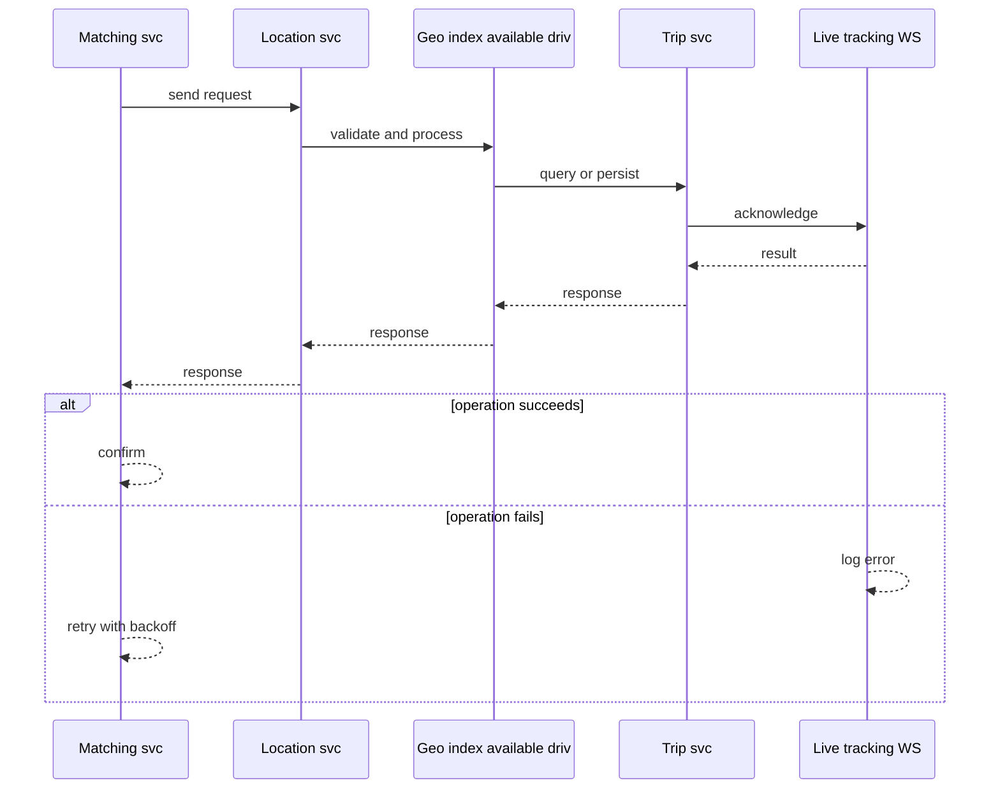
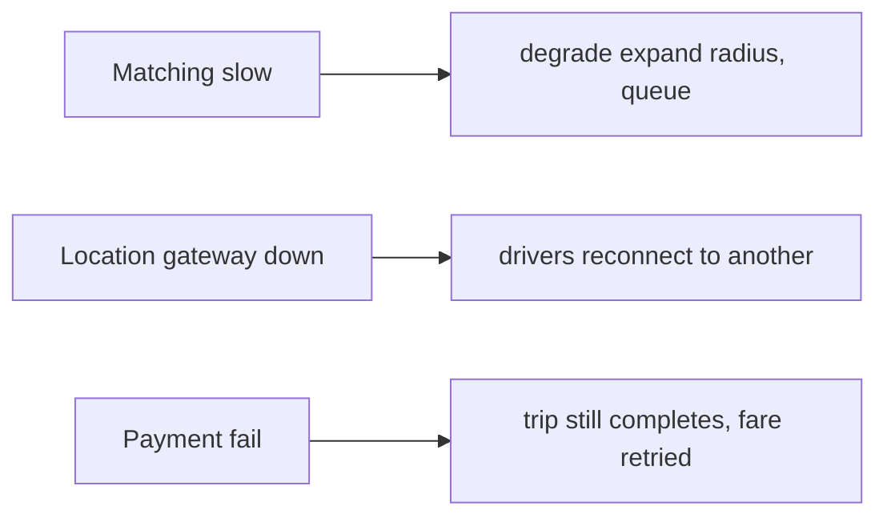
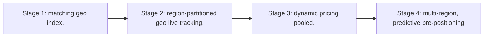

# Case Study: Ride-Hailing Platform

> **Tier:** advanced · **Status:** complete · Original numbers and diagrams.

## 1. Problem statement

Match riders to nearby drivers in real time, route them, and price dynamically — a real-time spatial-matching + stateful-trip system.

## 2. Scope

In (v1): request ride, match nearby driver, track trip, fare. Out: pooled rides, scheduled rides (stage).

## 3. Functional requirements

- Rider requests a ride.
- Match to a nearby available driver.
- Track trip live.
- Compute and charge fare.

## 4. Non-functional requirements

- Match latency < 5 s.
- Live tracking p99 < 1 s updates.
- Availability 99.9% (matching is revenue).

## 5. Explicit assumptions

1. 100k drivers, 1M rides/day, ~20 min avg. [assumption] 2. Match within ~3 km. [assumption] 3. Peak 10x. [constraint]

## 6. Traffic estimation
1M rides/day; match ~12/s avg, ~120/s peak. Live tracking: every active trip pushes location/s.

## 7. Storage estimation
Driver location (live, in-memory) + trip history (grows). Driver index ~100k x small; trips ~1M/day x KB.

## 8. Bandwidth estimation
Location updates from every active driver/ride at ~1/s — connection + small messages at scale.

## 9. API design
| Method | Path | Request | Response |
|--------|------|---------|----------|
| POST /rides | pickup, dropoff | ride id |
| WS |/rides/:id/stream | | live trip |
| POST /drivers/location | lat,lng | ack |

## 10. Data model

driver(id, loc, status); trip(id, rider, driver, status, route, fare); location stream. Spatial index of available drivers.

## 11. High-level architecture

```mermaid
%% created-for: system-design-mastery
flowchart LR
  Rider --> API --> Match[Matching svc]
  Driver --> LocSvc[Location svc] --> Geo[Geo index (available drivers)]
  Match --> Geo
  Match --> Trip[Trip svc]
  Trip --> Stream[Live tracking WS]
  Trip --> Fare[Fare + payment]
```

## 12. Request flow
Rider requests -> matching queries the geo index for nearby available drivers -> offers to nearest -> driver accepts -> trip created -> live tracking via WS -> on completion fare + payment.



## 13. Component responsibilities

Matching svc, location svc + geo index, trip svc, live-tracking gateway, fare/payment.

## 14. Database selection

Geo index (Redis GEO / geohash) for nearby-driver lookup; trip store (relational/KV); location stream in-memory. Rejected: scanning all drivers (too slow).

## 15. Caching strategy

Driver availability + location in memory (the geo index). Trip hot state cached.

## 16. Partitioning strategy

Geo index partitioned by region/geohash cell; trips partitioned by trip id; location gateways sharded by driver.

## 17. Replication strategy

Geo index replicated per region; trip store RF=3. Location is ephemeral (last-known wins).

## 18. Consistency model

Matching eventually consistent across regions (a driver's status may lag). Trip status strongly tracked per trip.

## 19. Failure scenarios
Matching slow -> degrade (expand radius, queue). Location gateway down -> drivers reconnect to another. Payment fail -> trip still completes, fare retried.



## 20. Reliability strategy

SLI match latency, tracking freshness; SLO 99.9%. Expand-radius fallback; idempotent fare. Chaos: kill a geo shard, assert match degrades not fails.

## 21. Security considerations

Driver/rider auth; location privacy (don't expose live location after dropoff); fare integrity.

## 22. Observability strategy

Match latency, match rate, driver availability, tracking freshness, fare success, surge accuracy.

## 23. Cost considerations

Real-time infra (WS + geo index in memory) + maps/routing APIs (third-party cost) dominate.

## 24. Scaling stages
Stage 1: matching + geo index. -> Stage 2: region-partitioned geo + live tracking. -> Stage 3: dynamic pricing + pooled. -> Stage 4: multi-region, predictive pre-positioning.



## 25. Trade-offs

Match latency vs radius/accuracy. In-memory geo (fast) vs DB scan (cheap, slow). Real-time WS vs polling.

## 26. Alternative designs

Polling location (battery + latency). DB scan for nearby (slow). Central single matcher (SPOF).

## 27. Interview discussion points

Clarify match radius, latency, pooling, surge. Surface the geo index, real-time tracking, and matching trade-offs.

## 28. Original Mermaid diagrams
Standalone sources under `diagrams/case-studies/ride-hailing/`: `context.mmd`, `request-sequence.mmd`, `failure-flow.mmd`, `scaling-evolution.mmd`. The diagrams are embedded in their respective sections: architecture in section 11, request flow in section 12, failure scenarios in section 19, and scaling stages in section 24.

## 29. Further reading
Geo/sharding: Level 3; real-time/WS: Level 10 edge; queues: Level 2. Sources: `S-CHASH` `S-DYNAMO`.

## 30. Practical exercises

1. Add pooled matching. 2. Design surge pricing inputs. 3. Driver location at 1M drivers — geo index scale. 4. Reconnect storm mitigation. 5. Predictive driver pre-positioning.

---
Previous: Distributed scheduler · Next: Food-delivery

