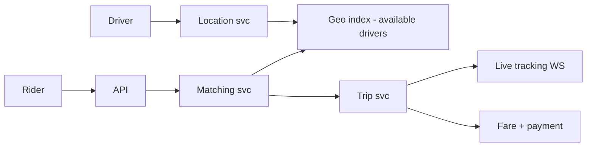
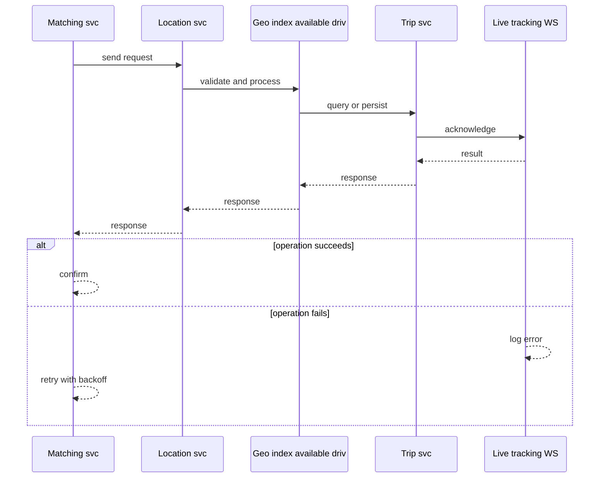
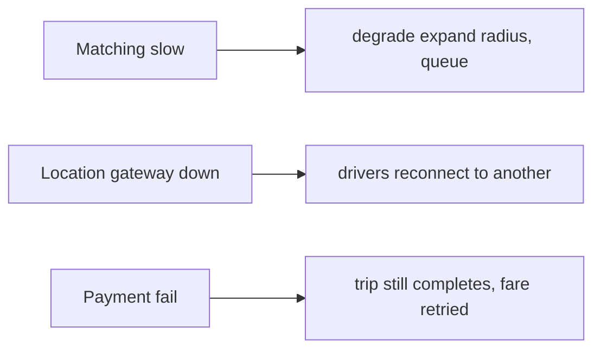
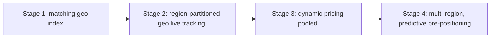

# Case Study: Ride-Hailing Platform

> **Tier:** advanced · **Status:** complete · Original numbers and diagrams.

## 1. Problem statement
Match riders to nearby drivers in real time, route them, and price dynamically — a real-time spatial-matching + stateful-trip system. This is a advanced-tier system design challenge because it must handle high availability under peak load while ensuring no single point of failure. The design must be production-grade: observable, debuggable, reversible, and able to survive component failures without data loss or cascading outages.

## 2. Scope
In (v1): request ride, match nearby driver, track trip, fare. Out: pooled rides, scheduled rides (stage).

For Ride-Hailing Platform, these boundaries keep the first version focused on the core user value. Adding more features would dilute the design and delay shipping. Each excluded item is a scaling stage — a candidate for the next iteration once the baseline is proven.

## 3. Functional requirements
- Rider requests a ride.
- Match to a nearby available driver.
- Track trip live.
- Compute and charge fare.

For Ride-Hailing Platform, these requirements drive specific architectural decisions: the read-write ratio determines the caching strategy, the durability target sets the replication mode, and the idempotency requirement shapes the API contract.

## 4. Non-functional requirements
- Match latency < 5 s.
- Live tracking p99 < 1 s updates.
- Availability 99.9% (matching is revenue).

For Ride-Hailing Platform, each non-functional target constrains a specific component: the latency SLO bounds the number of synchronous hops, the availability target forces redundancy across availability zones, and the cost ceiling limits the replication factor and storage tier.

## 5. Explicit assumptions
1. 100k drivers, 1M rides/day, ~20 min avg. [assumption] 2. Match within ~3 km. [assumption] 3. Peak 10x. [constraint]

For Ride-Hailing Platform, if these assumptions are off by an order of magnitude, the architecture must adapt: 10x traffic may require earlier sharding, a different read-write ratio changes the caching strategy, and a higher peak multiplier demands more headroom.

## 6. Traffic estimation
1M rides/day; match ~12/s avg, ~120/s peak. Live tracking: every active trip pushes location/s.

To derive the request rate: divide the daily volume by 86,400 seconds to get the average rate, then multiply by 5-10x for peak. The read-to-write ratio determines whether the system is cache-dominated (read-heavy) or write-path-dominated (write-heavy). For Ride-Hailing Platform, this ratio shapes the entire storage and replication strategy.

## 7. Storage estimation
Driver location (live, in-memory) + trip history (grows). Driver index ~100k x small; trips ~1M/day x KB.

For Ride-Hailing Platform, storage growth is projected from the daily write volume and retention policy. Index overhead and compression factors are accounted for in the total.

## 8. Bandwidth estimation
Location updates from every active driver/ride at ~1/s — connection + small messages at scale.

Bandwidth is request rate multiplied by average payload size for ingress, and response rate multiplied by response size for egress. CDN and edge caching reduce origin egress. Compression reduces bandwidth by 50-80 percent where applicable. For Ride-Hailing Platform, bandwidth may or may not be the binding constraint — compare it against compute and storage to find out.

## 9. API design
| Method | Path | Request | Response |
|--------|------|---------|----------|
| POST /rides | pickup, dropoff | ride id |
| WS |/rides/:id/stream | | live trip |
| POST /drivers/location | lat,lng | ack |

## 10. Data model
driver(id, loc, status); trip(id, rider, driver, status, route, fare); location stream. Spatial index of available drivers.

For Ride-Hailing Platform, the data model follows the access pattern. The primary lookup determines the partition key; secondary lookups determine indexes. Denormalization is used selectively on hot read paths.

## 11. High-level architecture

## 12. Request flow
Rider requests -> matching queries the geo index for nearby available drivers -> offers to nearest -> driver accepts -> trip created -> live tracking via WS -> on completion fare + payment.

## 13. Component responsibilities
Matching svc, location svc + geo index, trip svc, live-tracking gateway, fare/payment.

For Ride-Hailing Platform, each component has one job. The gateway authenticates and routes. Services are stateless and scale horizontally. The data tier is the stateful core that scales by sharding.

## 14. Database selection
Geo index (Redis GEO / geohash) for nearby-driver lookup; trip store (relational/KV); location stream in-memory. Rejected: scanning all drivers (too slow).

For Ride-Hailing Platform, the database was chosen by access pattern, not familiarity. The rejected alternatives were wrong for this workload, not bad in general.

## 15. Caching strategy
Driver availability + location in memory (the geo index). Trip hot state cached.

For Ride-Hailing Platform, the cache strategy matches the staleness tolerance. Cache-aside for most data, write-through where read-after-write matters, stampede protection on hot keys.

## 16. Partitioning strategy
Geo index partitioned by region/geohash cell; trips partitioned by trip id; location gateways sharded by driver.

For Ride-Hailing Platform, the partition key balances query locality with even load distribution. Sharding strategy matters because a poor key creates hot spots under real traffic patterns.

## 17. Replication strategy
Geo index replicated per region; trip store RF=3. Location is ephemeral (last-known wins).

For Ride-Hailing Platform, replication mode is split: synchronous where durability is critical, asynchronous elsewhere for throughput. RF=3 tolerates one failure. Failover is tested regularly.

## 18. Consistency model
Matching eventually consistent across regions (a driver's status may lag). Trip status strongly tracked per trip.

For Ride-Hailing Platform, the consistency level is the weakest users accept. Read-your-writes is provided where needed. Eventual consistency is bounded and monitored, not unbounded and silent.

## 19. Failure scenarios
Matching slow -> degrade (expand radius, queue). Location gateway down -> drivers reconnect to another. Payment fail -> trip still completes, fare retried.

## 20. Reliability strategy
SLI match latency, tracking freshness; SLO 99.9%. Expand-radius fallback; idempotent fare. Chaos: kill a geo shard, assert match degrades not fails.

For Ride-Hailing Platform, the SLO makes reliability measurable. The error budget balances feature velocity with stability. Chaos testing validates that resilience claims hold under real failures.

## 21. Security considerations
Driver/rider auth; location privacy (don't expose live location after dropoff); fare integrity.

For Ride-Hailing Platform, security layers TLS, encryption at rest, RBAC, PII redaction, and audit. The policy gateway is fail-closed for AI-augmented operations.

## 22. Observability strategy
Match latency, match rate, driver availability, tracking freshness, fare success, surge accuracy.

For Ride-Hailing Platform, observability combines logs, metrics, and traces with correlation IDs. Golden signals drive the first dashboard. Alerts fire on burn rate, not raw thresholds.

## 23. Cost considerations
Real-time infra (WS + geo index in memory) + maps/routing APIs (third-party cost) dominate.

For Ride-Hailing Platform, cost is driven by the binding resource. Caching, tiering, batching, and right-sizing are the levers. Cost per request is tracked and alerted on.

## 24. Scaling stages
Stage 1: matching + geo index. -> Stage 2: region-partitioned geo + live tracking. -> Stage 3: dynamic pricing + pooled. -> Stage 4: multi-region, predictive pre-positioning.

## 25. Trade-offs
Match latency vs radius/accuracy. In-memory geo (fast) vs DB scan (cheap, slow). Real-time WS vs polling.

For Ride-Hailing Platform, each trade-off lists what was chosen, what was rejected, and why. This makes the design defensible in review — every decision has documented reasoning.

## 26. Alternative designs
Polling location (battery + latency). DB scan for nearby (slow). Central single matcher (SPOF).

For Ride-Hailing Platform, the alternatives are real architectures that work under different constraints. They were rejected for this workload's specific requirements, not because they are bad designs.

## 27. Interview discussion points
Clarify match radius, latency, pooling, surge. Surface the geo index, real-time tracking, and matching trade-offs.

For Ride-Hailing Platform in an interview: clarify scope first, surface the read-write ratio, design the hot path deeply, discuss failures, and offer an alternative. Weak candidates skip failure modes.

## 28. Original Mermaid diagrams
Standalone sources under `diagrams/case-studies/ride-hailing/`: `context.mmd`, `request-sequence.mmd`, `failure-flow.mmd`, `scaling-evolution.mmd`. The diagrams are embedded in their respective sections: architecture in section 11, request flow in section 12, failure scenarios in section 19, and scaling stages in section 24.

## 29. Further reading
Geo/sharding: Level 3; real-time/WS: Level 10 edge; queues: Level 2. Sources: `S-CHASH` `S-DYNAMO`.

## 30. Practical exercises

1. Add pooled matching. 2. Design surge pricing inputs. 3. Driver location at 1M drivers — geo index scale. 4. Reconnect storm mitigation. 5. Predictive driver pre-positioning.

---
Previous: Distributed scheduler · Next: Food-delivery

