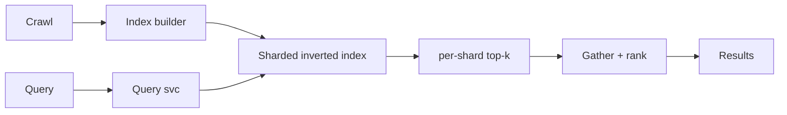

# Case Study: Search Engine

> **Tier:** advanced · **Status:** draft · Original numbers and diagrams.

## 11. High-level architecture

## 28. Original Mermaid diagrams

`diagrams/case-studies/search-engine/context.mmd`; key diagram inline above.

## 1. Problem statement

Crawl, index, and rank web-scale documents and answer text queries in milliseconds — a sharded inverted-index + ranking system.

## 2. Scope

In (v1): crawl-derived index, query, ranking, results page. Out: personalization, ads (stage).

## 3. Functional requirements

- Index web documents (inverted index). - Answer text queries with ranked results. - Update the index as content changes.

## 4. Non-functional requirements

- Query p99 < 500 ms. - Index billions of docs. - Freshness within days (web scale).

## 5. Explicit assumptions

1. 10B docs, query ~10k/s. [assumption] 2. Avg query scans top-k per shard. [assumption] 3. Re-index daily + streaming updates. [constraint]

## 6. Traffic estimation

Query-heavy; indexing batch + streaming. Reads dominate.

## 7. Storage estimation

Inverted index (terabytes); docs content in object storage; metadata. Tier cold.

## 8. Bandwidth estimation

Result snippets small; index builds scan large data.

## 9. API design

| GET /search | q, page | results |

## 10. Data model

inverted_index(term -> [doc, score]) sharded; docs(id, url, text, rank signals); query logs.

## 12. Request flow

Crawl feeds the index builder -> sharded inverted index. Query fans out to shards -> each returns per-shard top-k -> gather merges and re-ranks -> results. Index updated by streaming + daily rebuild.

## 13. Component responsibilities

Crawl, index builder, sharded index, query service, gather/ranker.

## 14. Database selection

Sharded inverted index (custom/Lucene-like) + object storage for docs. Rejected: scanning all docs per query (intractable).

## 15. Caching strategy

Hot query results cached; top results for common queries cached.

## 16. Partitioning strategy

Index sharded by doc (per-shard top-k + gather). Hot terms replicated.

## 17. Replication strategy

Index replicated for availability; rebuilt on version change via parallel-index canary.

## 18. Consistency model

Index eventually consistent with the web (freshness days). Query results consistent within an index version.

## 19. Failure scenarios

Shard down -> partial results (warn) or fail. Index rebuild slow -> serve old version. Gather node down -> retry.

## 20. Reliability strategy

SLI query latency, freshness; SPO 99.9%. Partial-results fallback. Chaos: kill a shard, assert partial results.

## 21. Security considerations

Anti-spam/SEO-abuse; safe-search; privacy of query logs; rate-limit scraping.

## 22. Observability strategy

Query p99, freshness, per-shard latency, gather latency, index build time, spam rate.

## 23. Cost considerations

Index storage (memory/disk) + crawl egress + compute (ranking). Caching hot queries cuts cost.

## 24. Scaling stages

Stage 1: crawl + index + query. -> Stage 2: sharded index + gather. -> Stage 3: streaming freshness + ranking signals. -> Stage 4: multi-region, personalization.

## 25. Trade-offs

Shard by doc (simple fan-out) vs by term (fewer lookups, unbalanced). Freshness (streaming) vs index cost. Cache (cost) vs freshness.

## 26. Alternative designs

Scan all docs (intractable). Single index (can't scale). No freshness (stale results).

## 27. Interview discussion points

Clarify scale, latency, freshness. Surface sharded inverted index, per-shard top-k + gather, freshness.

## 29. Further reading

Search: Level 2/3; sharding: Level 3; ranking: Level 10.

## 30. Practical exercises

1. Per-shard top-k + gather correctness. 2. Streaming freshness vs daily rebuild. 3. Hot-term replication. 4. Anti-SEO ranking. 5. Multi-region query serving.

---
Previous: Recommendation engine · Next: Cloud file-storage platform
