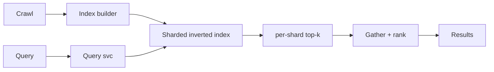
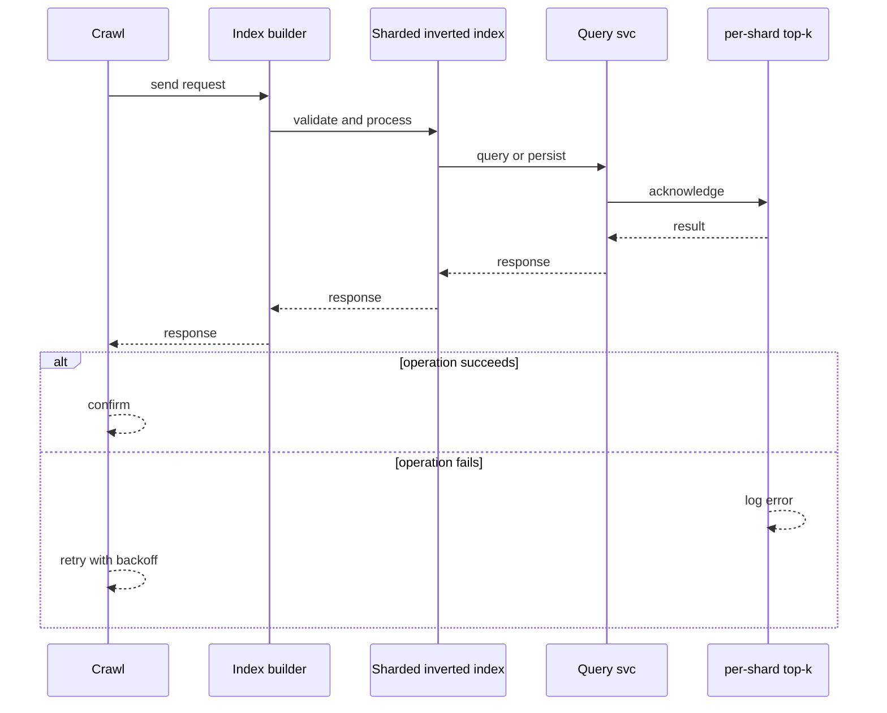
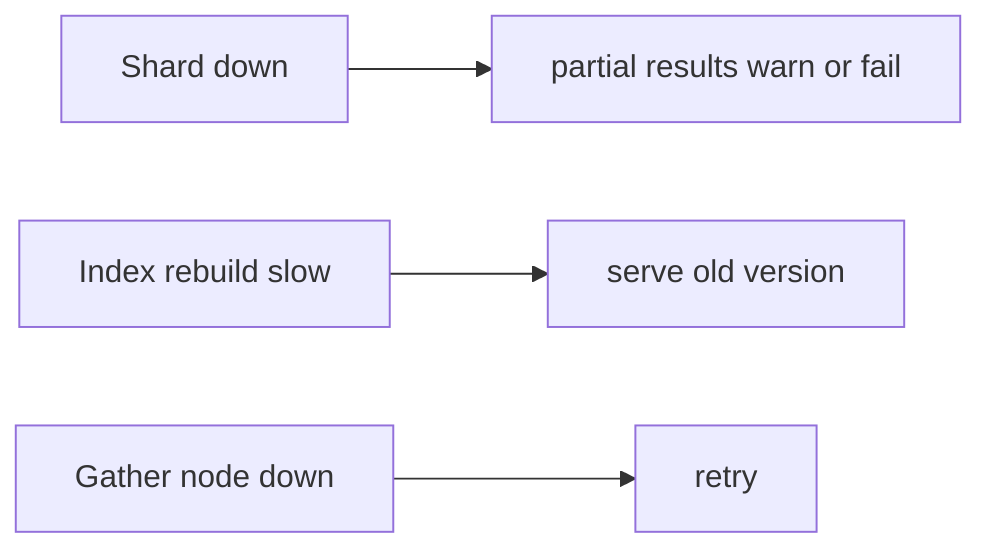
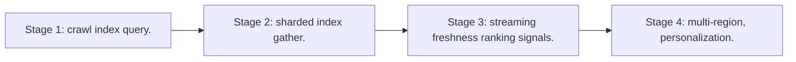

# Case Study: Search Engine

> **Tier:** advanced · **Status:** complete · Original numbers and diagrams.

## 1. Problem statement
Crawl, index, and rank web-scale documents and answer text queries in milliseconds — a sharded inverted-index + ranking system. This is a advanced-tier system design challenge because it must handle millions of reads per second while ensuring grounded, cited, and permission-aware answers. The design must be production-grade: observable, debuggable, reversible, and able to survive component failures without data loss or cascading outages.

## 2. Scope
In (v1): crawl-derived index, query, ranking, results page. Out: personalization, ads (stage).

For Search Engine, these boundaries keep the first version focused on the core user value. Adding more features would dilute the design and delay shipping. Each excluded item is a scaling stage — a candidate for the next iteration once the baseline is proven.

## 3. Functional requirements
- Index web documents (inverted index).
- Answer text queries with ranked results.
- Update the index as content changes.

For Search Engine, these requirements drive specific architectural decisions: the read-write ratio determines the caching strategy, the durability target sets the replication mode, and the idempotency requirement shapes the API contract.

## 4. Non-functional requirements
- Query p99 < 500 ms.
- Index billions of docs.
- Freshness within days (web scale).

For Search Engine, each non-functional target constrains a specific component: the latency SLO bounds the number of synchronous hops, the availability target forces redundancy across availability zones, and the cost ceiling limits the replication factor and storage tier.

## 5. Explicit assumptions
1. 10B docs, query ~10k/s. [assumption] 2. Avg query scans top-k per shard. [assumption] 3. Re-index daily + streaming updates. [constraint]

For Search Engine, if these assumptions are off by an order of magnitude, the architecture must adapt: 10x traffic may require earlier sharding, a different read-write ratio changes the caching strategy, and a higher peak multiplier demands more headroom.

## 6. Traffic estimation
Query-heavy; indexing batch + streaming. Reads dominate.

To derive the request rate: divide the daily volume by 86,400 seconds to get the average rate, then multiply by 5-10x for peak. The read-to-write ratio determines whether the system is cache-dominated (read-heavy) or write-path-dominated (write-heavy). For Search Engine, this ratio shapes the entire storage and replication strategy.

## 7. Storage estimation
Inverted index (terabytes); docs content in object storage; metadata. Tier cold.

For Search Engine, storage growth is projected from the daily write volume and retention policy. Index overhead and compression factors are accounted for in the total.

## 8. Bandwidth estimation
Result snippets small; index builds scan large data.

Bandwidth is request rate multiplied by average payload size for ingress, and response rate multiplied by response size for egress. CDN and edge caching reduce origin egress. Compression reduces bandwidth by 50-80 percent where applicable. For Search Engine, bandwidth may or may not be the binding constraint — compare it against compute and storage to find out.

## 9. API design
| Method | Path | Request | Response |
|--------|------|---------|----------|
| GET /search | q, page | results |

## 10. Data model
inverted_index(term -> [doc, score]) sharded; docs(id, url, text, rank signals); query logs.

For Search Engine, the data model follows the access pattern. The primary lookup determines the partition key; secondary lookups determine indexes. Denormalization is used selectively on hot read paths.

## 11. High-level architecture

## 12. Request flow
Crawl feeds the index builder -> sharded inverted index. Query fans out to shards -> each returns per-shard top-k -> gather merges and re-ranks -> results. Index updated by streaming + daily rebuild.

## 13. Component responsibilities
Crawl, index builder, sharded index, query service, gather/ranker.

For Search Engine, each component has one job. The gateway authenticates and routes. Services are stateless and scale horizontally. The data tier is the stateful core that scales by sharding.

## 14. Database selection
Sharded inverted index (custom/Lucene-like) + object storage for docs. Rejected: scanning all docs per query (intractable).

For Search Engine, the database was chosen by access pattern, not familiarity. The rejected alternatives were wrong for this workload, not bad in general.

## 15. Caching strategy
Hot query results cached; top results for common queries cached.

For Search Engine, the cache strategy matches the staleness tolerance. Cache-aside for most data, write-through where read-after-write matters, stampede protection on hot keys.

## 16. Partitioning strategy
Index sharded by doc (per-shard top-k + gather). Hot terms replicated.

For Search Engine, the partition key balances query locality with even load distribution. Sharding strategy matters because a poor key creates hot spots under real traffic patterns.

## 17. Replication strategy
Index replicated for availability; rebuilt on version change via parallel-index canary.

For Search Engine, replication mode is split: synchronous where durability is critical, asynchronous elsewhere for throughput. RF=3 tolerates one failure. Failover is tested regularly.

## 18. Consistency model
Index eventually consistent with the web (freshness days). Query results consistent within an index version.

For Search Engine, the consistency level is the weakest users accept. Read-your-writes is provided where needed. Eventual consistency is bounded and monitored, not unbounded and silent.

## 19. Failure scenarios
Shard down -> partial results (warn) or fail. Index rebuild slow -> serve old version. Gather node down -> retry.

## 20. Reliability strategy
SLI query latency, freshness; SPO 99.9%. Partial-results fallback. Chaos: kill a shard, assert partial results.

For Search Engine, the SLO makes reliability measurable. The error budget balances feature velocity with stability. Chaos testing validates that resilience claims hold under real failures.

## 21. Security considerations
Anti-spam/SEO-abuse; safe-search; privacy of query logs; rate-limit scraping.

For Search Engine, security layers TLS, encryption at rest, RBAC, PII redaction, and audit. The policy gateway is fail-closed for AI-augmented operations.

## 22. Observability strategy
Query p99, freshness, per-shard latency, gather latency, index build time, spam rate.

For Search Engine, observability combines logs, metrics, and traces with correlation IDs. Golden signals drive the first dashboard. Alerts fire on burn rate, not raw thresholds.

## 23. Cost considerations
Index storage (memory/disk) + crawl egress + compute (ranking). Caching hot queries cuts cost.

For Search Engine, cost is driven by the binding resource. Caching, tiering, batching, and right-sizing are the levers. Cost per request is tracked and alerted on.

## 24. Scaling stages
Stage 1: crawl + index + query. -> Stage 2: sharded index + gather. -> Stage 3: streaming freshness + ranking signals. -> Stage 4: multi-region, personalization.

## 25. Trade-offs
Shard by doc (simple fan-out) vs by term (fewer lookups, unbalanced). Freshness (streaming) vs index cost. Cache (cost) vs freshness.

For Search Engine, each trade-off lists what was chosen, what was rejected, and why. This makes the design defensible in review — every decision has documented reasoning.

## 26. Alternative designs
Scan all docs (intractable). Single index (can't scale). No freshness (stale results).

For Search Engine, the alternatives are real architectures that work under different constraints. They were rejected for this workload's specific requirements, not because they are bad designs.

## 27. Interview discussion points
Clarify scale, latency, freshness. Surface sharded inverted index, per-shard top-k + gather, freshness.

For Search Engine in an interview: clarify scope first, surface the read-write ratio, design the hot path deeply, discuss failures, and offer an alternative. Weak candidates skip failure modes.

## 28. Original Mermaid diagrams
Standalone sources under `diagrams/case-studies/search-engine/`: `context.mmd`, `request-sequence.mmd`, `failure-flow.mmd`, `scaling-evolution.mmd`. The diagrams are embedded in their respective sections: architecture in section 11, request flow in section 12, failure scenarios in section 19, and scaling stages in section 24.

## 29. Further reading
Search: Level 2/3; sharding: Level 3; ranking: Level 10. Sources: `S-VECTORDB` `S-RAG`.

## 30. Practical exercises

1. Per-shard top-k + gather correctness. 2. Streaming freshness vs daily rebuild. 3. Hot-term replication. 4. Anti-SEO ranking. 5. Multi-region query serving.

---
Previous: Recommendation engine · Next: Cloud file-storage platform

