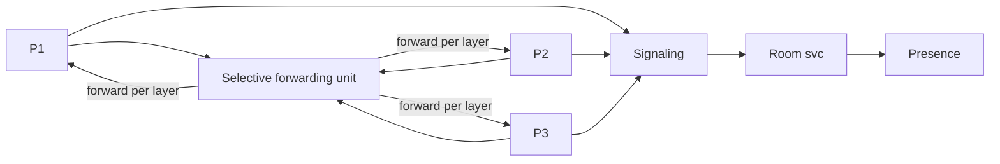

# Case Study: Video-Conferencing System

> **Tier:** advanced · **Status:** draft · Original numbers and diagrams.

## 11. High-level architecture

## 28. Original Mermaid diagrams

`diagrams/case-studies/video-conferencing/context.mmd`; key diagram inline above.

## 1. Problem statement

Real-time multiparty audio/video calls: low-latency media transport, selective forwarding, and presence — a stateful, real-time media system.

## 2. Scope

In (v1): 1:1 and small-group calls, audio/video, screen share, presence. Out: large webinars, recording/transcription (stage).

## 3. Functional requirements

- Start/join a call. - Send/receive audio/video with low latency. - Selectively forward each participant media. - Show presence; mute/leave.

## 4. Non-functional requirements

- One-way media latency < 200 ms. - 30 fps video; audio priority. - Availability 99.9 percent (calls are real-time, no retries).

## 5. Explicit assumptions

1. 1M concurrent calls, ~4 participants avg. [assumption] 2. Video ~1.5 Mbps/participant. [assumption] 3. UDP/SRTP transport. [constraint]

## 6. Traffic estimation

Real-time media flows; high aggregate bandwidth; small control messages.

## 7. Storage estimation

Call metadata; recordings (if enabled) to object storage. Live media is in-flight, not stored.

## 8. Bandwidth estimation

N x N media forwarding — dominant; selective forwarding (SFU) cuts it from mesh to star.

## 9. API design

signaling over WS; media over UDP/SRTP; REST for room/presence.

## 10. Data model

rooms(id, participants, sfu); presence(user, room); signaling state per room. Media is live streams, not persisted.

## 12. Request flow

Participants signal to a room -> media sent to an SFU (not a mesh) -> SFU selectively forwards each participant media to others (per-layer/bandwidth) -> presence updates. On leave, teardown.

## 13. Component responsibilities

Signaling, room service, presence, SFU (media), recording (optional).

## 14. Database selection

Room/presence: in-memory + a fast store; recordings to object storage. Rejected: mesh (N^2 bandwidth); recording live media to a DB.

## 15. Caching strategy

Room/presence in memory; hot room metadata cached.

## 16. Partitioning strategy

SFU instances per call (one call's media on one SFU); rooms sharded by id; signaling by room.

## 17. Replication strategy

Presence/rooms replicated for availability; an SFU loss ends/migrates a call (real-time, can't replay). Region-based for latency.

## 18. Consistency model

Call state strongly tracked per room (who's in). Media is real-time (no consistency, just latency). Presence eventual.

## 19. Failure scenarios

SFU down -> call drops or migrates to another SFU (best-effort). Participant network loss -> jitter buffer; degrade quality. Signaling down -> can't start calls.

## 20. Reliability strategy

SLI media latency, call setup time, drop rate; SLO 99.9 percent. Region placement + graceful degradation. Chaos: kill an SFU, assert graceful call migration/drop.

## 21. Security considerations

E2E/SRTP encryption; per-room auth; media isolation; rate-limit signaling; no recording without consent.

## 22. Observability strategy

One-way latency, jitter, packet loss, call setup time, drop rate, SFU load, concurrent calls.

## 23. Cost considerations

Media egress + SFU compute (always-on, real-time) dominate. SFU per-call sizing; region placement for egress.

## 24. Scaling stages

Stage 1: signaling + SFU. -> Stage 2: per-call SFU + presence. -> Stage 3: simulcast/multilayer + recording. -> Stage 4: large webinars (one-to-many), multi-region.

## 25. Trade-offs

SFU (scales bandwidth vs mesh) vs extra hop. UDP (latency) vs reliability (jitter buffer). E2E encryption (privacy) vs server processing (SFU needs media). Region (latency) vs cross-region signaling.

## 26. Alternative designs

Mesh (N^2 bandwidth, doesn't scale). TCP media (latency). Record everything (cost/privacy).

## 27. Interview discussion points

Clarify participants, latency, E2E, recording. Surface SFU, UDP/SRTP, signaling vs media split, degradation.

## 29. Further reading

Real-time/edge: Level 10; UDP: Level 0; presence/real-time: chat case.

## 30. Practical exercises

1. Simulcast/multilayer bitrate adaptation. 2. SFU failover mid-call. 3. Large webinar (one-to-many) fanout. 4. E2E encryption with an SFU. 5. Reconnect after a network drop.

---
Previous: Real-time analytics platform · Next: Online multiplayer game
