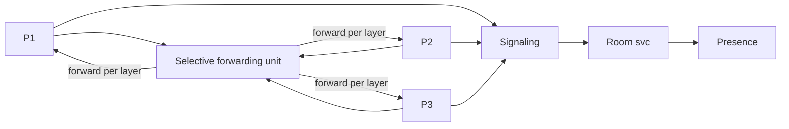
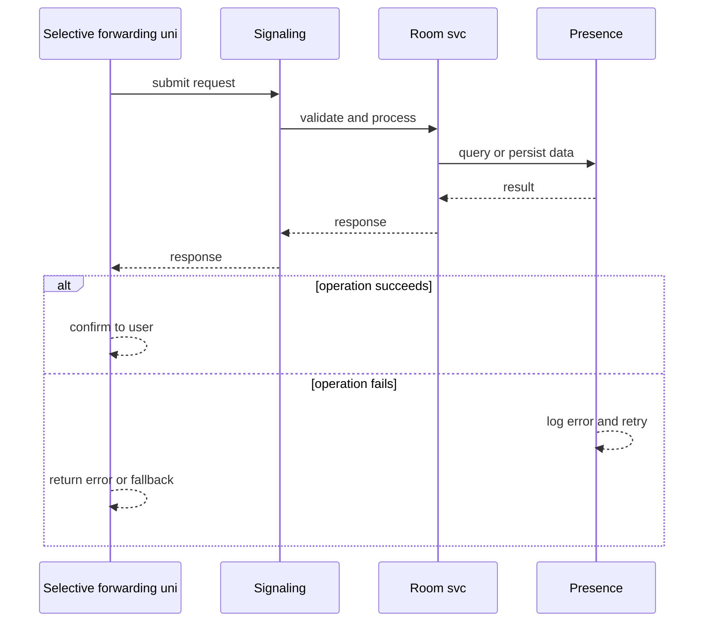
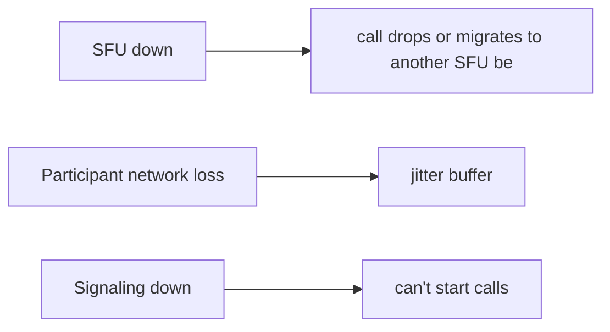
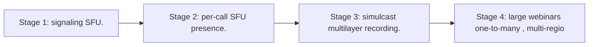

# Case Study: Video-Conferencing System

> **Tier:** advanced · **Status:** complete · Original numbers and diagrams.

## 1. Problem statement
Real-time multiparty audio/video calls: low-latency media transport, selective forwarding, and presence — a stateful, real-time media system. This is a advanced-tier system design challenge because it must handle real-time latency under load while ensuring low-latency bidirectional communication. The design must be production-grade: observable, debuggable, reversible, and able to survive component failures without data loss or cascading outages.

## 2. Scope
In (v1): 1:1 and small-group calls, audio/video, screen share, presence. Out: large webinars, recording/transcription (stage).

For Video-Conferencing System, these boundaries keep the first version focused on the core user value. Adding more features would dilute the design and delay shipping. Each excluded item is a scaling stage — a candidate for the next iteration once the baseline is proven.

## 3. Functional requirements
- Start/join a call.
- Send/receive audio/video with low latency.
- Selectively forward each participant media.
- Show presence; mute/leave.

For Video-Conferencing System, these requirements drive specific architectural decisions: the read-write ratio determines the caching strategy, the durability target sets the replication mode, and the idempotency requirement shapes the API contract.

## 4. Non-functional requirements
- One-way media latency < 200 ms. - 30 fps video; audio priority.
- Availability 99.9 percent (calls are real-time, no retries).

For Video-Conferencing System, each non-functional target constrains a specific component: the latency SLO bounds the number of synchronous hops, the availability target forces redundancy across availability zones, and the cost ceiling limits the replication factor and storage tier.

## 5. Explicit assumptions
1. 1M concurrent calls, ~4 participants avg. [assumption] 2. Video ~1.5 Mbps/participant. [assumption] 3. UDP/SRTP transport. [constraint]

For Video-Conferencing System, if these assumptions are off by an order of magnitude, the architecture must adapt: 10x traffic may require earlier sharding, a different read-write ratio changes the caching strategy, and a higher peak multiplier demands more headroom.

## 6. Traffic estimation
Real-time media flows; high aggregate bandwidth; small control messages.

To derive the request rate: divide the daily volume by 86,400 seconds to get the average rate, then multiply by 5-10x for peak. The read-to-write ratio determines whether the system is cache-dominated (read-heavy) or write-path-dominated (write-heavy). For Video-Conferencing System, this ratio shapes the entire storage and replication strategy.

## 7. Storage estimation
Call metadata; recordings (if enabled) to object storage. Live media is in-flight, not stored.

For Video-Conferencing System, storage growth is projected from the daily write volume and retention policy. Index overhead and compression factors are accounted for in the total.

## 8. Bandwidth estimation
N x N media forwarding — dominant; selective forwarding (SFU) cuts it from mesh to star.

Bandwidth is request rate multiplied by average payload size for ingress, and response rate multiplied by response size for egress. CDN and edge caching reduce origin egress. Compression reduces bandwidth by 50-80 percent where applicable. For Video-Conferencing System, bandwidth may or may not be the binding constraint — compare it against compute and storage to find out.

## 9. API design

signaling over WS; media over UDP/SRTP; REST for room/presence.

## 10. Data model
rooms(id, participants, sfu); presence(user, room); signaling state per room. Media is live streams, not persisted.

For Video-Conferencing System, the data model follows the access pattern. The primary lookup determines the partition key; secondary lookups determine indexes. Denormalization is used selectively on hot read paths.

## 11. High-level architecture

## 12. Request flow
Participants signal to a room -> media sent to an SFU (not a mesh) -> SFU selectively forwards each participant media to others (per-layer/bandwidth) -> presence updates. On leave, teardown.

## 13. Component responsibilities
Signaling, room service, presence, SFU (media), recording (optional).

For Video-Conferencing System, each component has one job. The gateway authenticates and routes. Services are stateless and scale horizontally. The data tier is the stateful core that scales by sharding.

## 14. Database selection
Room/presence: in-memory + a fast store; recordings to object storage. Rejected: mesh (N^2 bandwidth); recording live media to a DB.

For Video-Conferencing System, the database was chosen by access pattern, not familiarity. The rejected alternatives were wrong for this workload, not bad in general.

## 15. Caching strategy
Room/presence in memory; hot room metadata cached.

For Video-Conferencing System, the cache strategy matches the staleness tolerance. Cache-aside for most data, write-through where read-after-write matters, stampede protection on hot keys.

## 16. Partitioning strategy
SFU instances per call (one call's media on one SFU); rooms sharded by id; signaling by room.

For Video-Conferencing System, the partition key balances query locality with even load distribution. Sharding strategy matters because a poor key creates hot spots under real traffic patterns.

## 17. Replication strategy
Presence/rooms replicated for availability; an SFU loss ends/migrates a call (real-time, can't replay). Region-based for latency.

For Video-Conferencing System, replication mode is split: synchronous where durability is critical, asynchronous elsewhere for throughput. RF=3 tolerates one failure. Failover is tested regularly.

## 18. Consistency model
Call state strongly tracked per room (who's in). Media is real-time (no consistency, just latency). Presence eventual.

For Video-Conferencing System, the consistency level is the weakest users accept. Read-your-writes is provided where needed. Eventual consistency is bounded and monitored, not unbounded and silent.

## 19. Failure scenarios
SFU down -> call drops or migrates to another SFU (best-effort). Participant network loss -> jitter buffer; degrade quality. Signaling down -> can't start calls.

## 20. Reliability strategy
SLI media latency, call setup time, drop rate; SLO 99.9 percent. Region placement + graceful degradation. Chaos: kill an SFU, assert graceful call migration/drop.

For Video-Conferencing System, the SLO makes reliability measurable. The error budget balances feature velocity with stability. Chaos testing validates that resilience claims hold under real failures.

## 21. Security considerations
E2E/SRTP encryption; per-room auth; media isolation; rate-limit signaling; no recording without consent.

For Video-Conferencing System, security layers TLS, encryption at rest, RBAC, PII redaction, and audit. The policy gateway is fail-closed for AI-augmented operations.

## 22. Observability strategy
One-way latency, jitter, packet loss, call setup time, drop rate, SFU load, concurrent calls.

For Video-Conferencing System, observability combines logs, metrics, and traces with correlation IDs. Golden signals drive the first dashboard. Alerts fire on burn rate, not raw thresholds.

## 23. Cost considerations
Media egress + SFU compute (always-on, real-time) dominate. SFU per-call sizing; region placement for egress.

For Video-Conferencing System, cost is driven by the binding resource. Caching, tiering, batching, and right-sizing are the levers. Cost per request is tracked and alerted on.

## 24. Scaling stages
Stage 1: signaling + SFU. -> Stage 2: per-call SFU + presence. -> Stage 3: simulcast/multilayer + recording. -> Stage 4: large webinars (one-to-many), multi-region.

## 25. Trade-offs
SFU (scales bandwidth vs mesh) vs extra hop. UDP (latency) vs reliability (jitter buffer). E2E encryption (privacy) vs server processing (SFU needs media). Region (latency) vs cross-region signaling.

For Video-Conferencing System, each trade-off lists what was chosen, what was rejected, and why. This makes the design defensible in review — every decision has documented reasoning.

## 26. Alternative designs
Mesh (N^2 bandwidth, doesn't scale). TCP media (latency). Record everything (cost/privacy).

For Video-Conferencing System, the alternatives are real architectures that work under different constraints. They were rejected for this workload's specific requirements, not because they are bad designs.

## 27. Interview discussion points
Clarify participants, latency, E2E, recording. Surface SFU, UDP/SRTP, signaling vs media split, degradation.

For Video-Conferencing System in an interview: clarify scope first, surface the read-write ratio, design the hot path deeply, discuss failures, and offer an alternative. Weak candidates skip failure modes.

## 28. Original Mermaid diagrams
Standalone sources under `diagrams/case-studies/video-conferencing/`: `context.mmd`, `request-sequence.mmd`, `failure-flow.mmd`, `scaling-evolution.mmd`. The diagrams are embedded in their respective sections: architecture in section 11, request flow in section 12, failure scenarios in section 19, and scaling stages in section 24.

## 29. Further reading
Real-time/edge: Level 10; UDP: Level 0; presence/real-time: chat case. Sources: `S-CHASH` `S-DYNAMO`.

## 30. Practical exercises

1. Simulcast/multilayer bitrate adaptation. 2. SFU failover mid-call. 3. Large webinar (one-to-many) fanout. 4. E2E encryption with an SFU. 5. Reconnect after a network drop.

---
Previous: Real-time analytics platform · Next: Online multiplayer game

