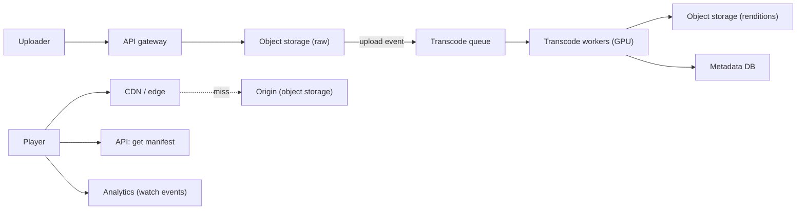
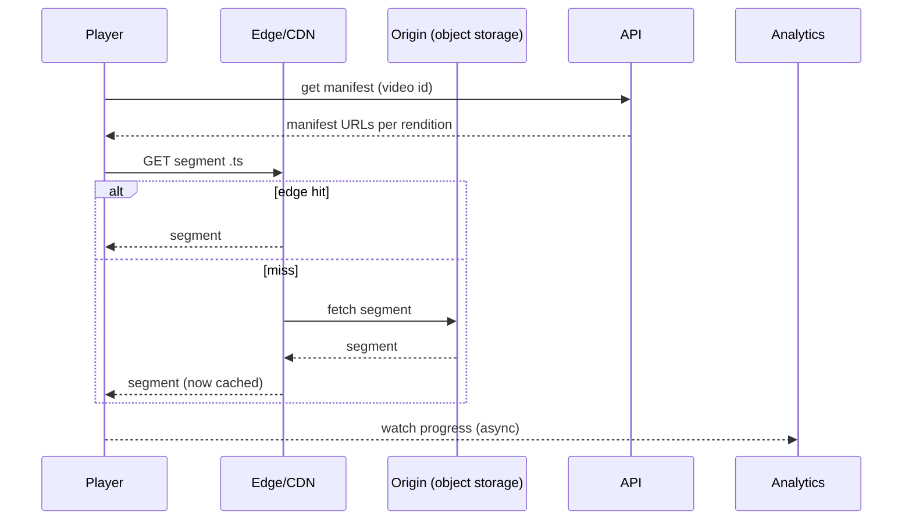
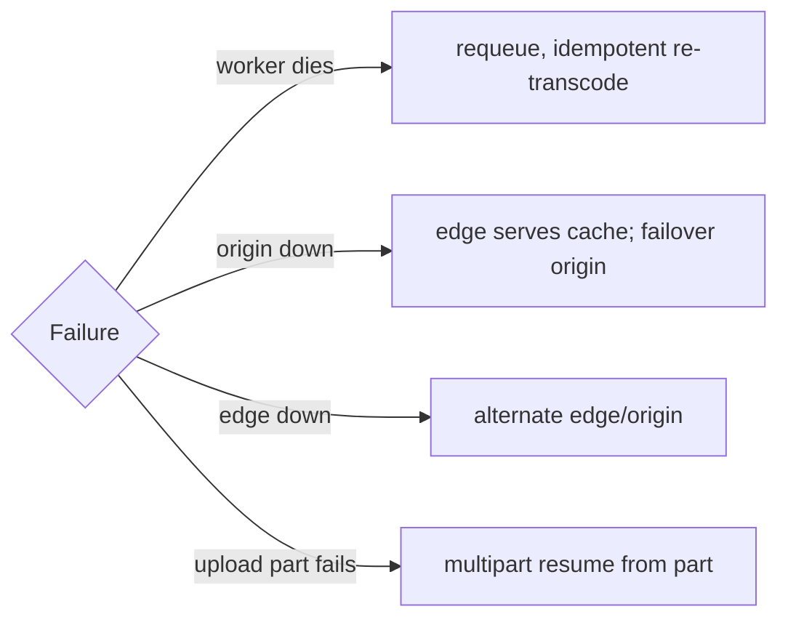
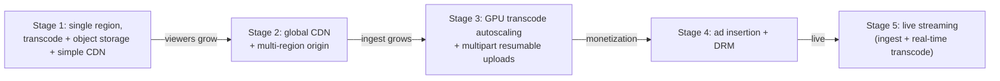
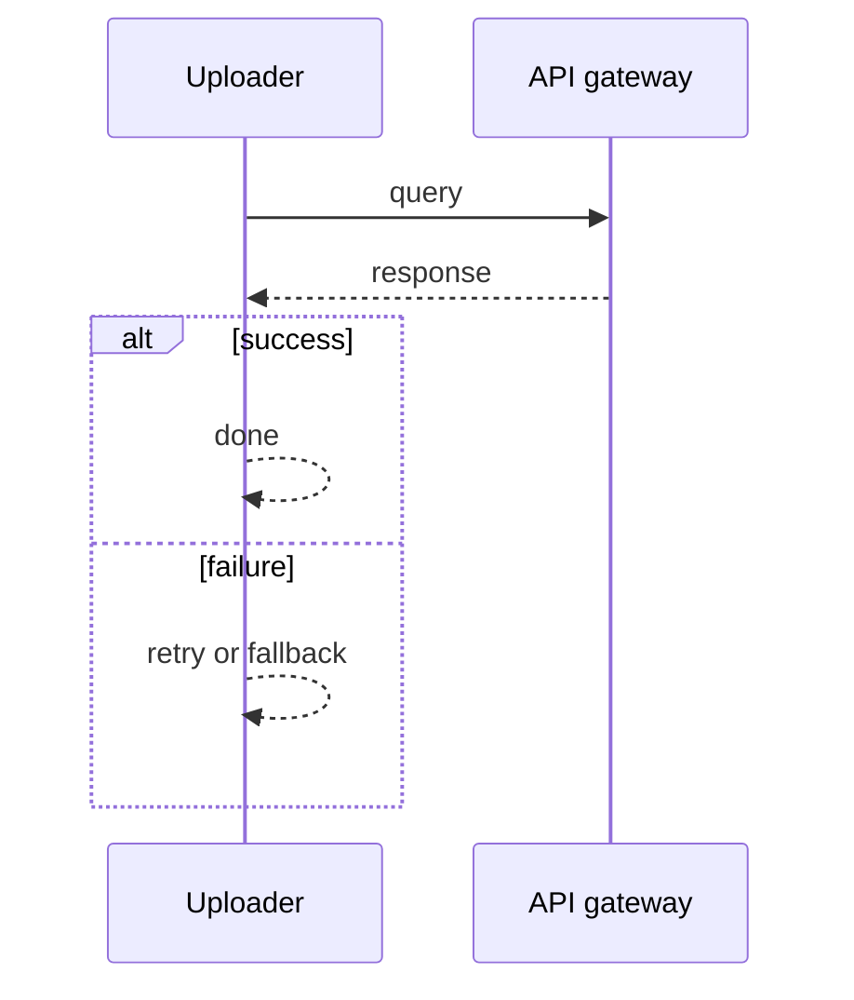
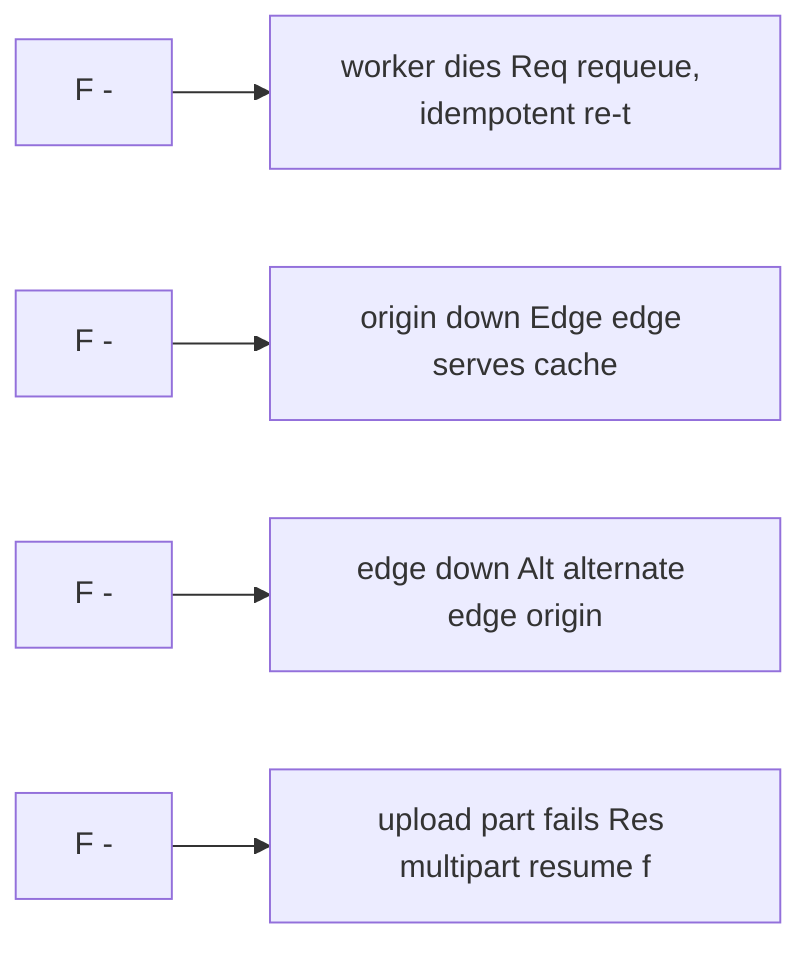

# Case Study: Video-Streaming Platform

> **Tier:** advanced · **Status:** complete
> A complete advanced case study demonstrating the 30-section template for a bandwidth- and
> storage-dominated, globally-served system. All numbers and diagrams are original.

## 1. Problem statement
Users want to upload videos and watch them on any device, anywhere, at the best quality
their connection supports. We must store large video files durably, transcode them into
multiple resolutions/bitrates, and stream them globally with low start-up latency and high
availability.

## 2. Scope
**In (v1):** upload, transcoding to multiple renditions (HLS adaptive bitrate), on-demand
playback, per-video metadata, basic DRM-ready hooks, watch analytics.
**Out (v1):** live streaming, user-generated social features, ad insertion, full DRM
license server — noted as scaling stages.

## 3. Functional requirements
- The system **shall** accept an upload and store it durably.
- The system **shall** transcode the upload into multiple renditions for adaptive bitrate.
- The system **shall** stream renditions via adaptive bitrate (HLS/DASH) to clients.
- The system **shall** serve the rendition matching the client's bandwidth (adaptive).
- The system **shall** record watch progress and basic view analytics.

## 4. Non-functional requirements
- Start-up latency < 2 s p95 (edge-served).
- Availability 99.9% for playback (uploads may be eventually processed).
- Durability 11 nines for stored video (object storage).
- Bandwidth-dominated: egress is the binding cost; storage grows linearly with uploads.
- Global: edge-served; origin in multi-region.

## 5. Explicit assumptions
1. 1,000 new videos/hour average, each ~1 GB raw, 10 min duration. [assumption]
2. Each video transcoded to 4 renditions (240p/480p/720p/1080p); total transcoded ≈ 2.5× raw.
3. Each video watched ~100 times, average 30% of duration watched. [assumption]
4. Peak 10× average on views (viral/prime time). [constraint]
5. 1080p ≈ 5 Mbps; 720p ≈ 2.5; 480p ≈ 1; 240p ≈ 0.5 Mbps. [constraint]

## 6. Traffic estimation
- Ingest: 1,000/h × 1 GB ≈ 1 TB/h ingest ≈ 0.28 GB/s (modest).
- Views: 1,000/h × 100 views × (10 min × 0.3 watched) = 100k watch-hours/hour... recompute:
  - watch-hours/s = 1,000 uploads/h × 100 views × (3 min watched) / 3600 ≈ 83 watch-h/s.
  - Average bitrate ~2.5 Mbps → egress ≈ 83 × 2.5 Mbps ≈ 208 Mb/s ≈ 26 MB/s avg.
  - Peak (10×) ≈ 260 MB/s. (These are illustrative; real platforms are 100× larger.)
- Read:write ratio is enormous — millions of segment reads per upload.

## 7. Storage estimation
- New raw: 1 TB/h × 24 = 24 TB/day. Renditions ~2.5× → ~60 TB/day total stored.
- Per year ≈ 22 PB stored (raw + renditions). Object storage; tier cold renditions.
- Metadata: tiny relative to media.

## 8. Bandwidth estimation
- Egress dominates: peak ~260 MB/s here, but at real scale (millions of concurrent viewers)
  egress is the single largest cost. Edge caching is the lever that cuts origin egress.

## 9. API design
| Method | Path | Request | Response |
|--------|------|---------|----------|
| POST | /v1/videos | metadata | upload URL (multipart to object storage) |
| GET | /v1/videos/:id | — | metadata + playback URL (manifest) |
| GET | /play/:id/:rendition/manifest.m3u8 | — | HLS manifest |
| GET | /seg/:id/:rendition/:n.ts | — | video segment (CDN-cached) |
| POST | /v1/videos/:id/progress | position | OK |

Upload uses **presigned multipart** direct to object storage (not through the API server),
so large files don't pass through the app tier.

## 10. Data model
- `videos(id, owner, title, status, created_at, duration, renditions[])`
- `renditions(video_id, resolution, bitrate, manifest_url, segments[])`
- `watch_events(video_id, user_id, position, ts)` (async, for analytics)
Storage: object storage for media; a metadata DB (sharded by `video_id`); a search/analytics
store for discovery (out of v1 scope).

## 11. High-level architecture

## 12. Request flow
**Upload:** client gets a presigned multipart URL → uploads chunks directly to object
storage → notifies the API on completion → API enqueues a transcode job → workers produce
renditions + HLS manifests → metadata updated → video becomes playable.

**Playback:** client requests the manifest → resolves to renditions → player requests
segments from the CDN edge → edge serves cached segments or fetches from origin → adaptive
bitrate switches renditions as bandwidth changes → watch events emitted asynchronously.

## 13. Component responsibilities
- **API gateway**: auth, rate limiting, presigned URL issuance.
- **Object storage (raw + renditions)**: durable media store; multipart uploads.
- **Transcode queue + GPU workers**: produce renditions/manifests; autoscaled by queue depth.
- **CDN/edge**: serve segments near viewers; the dominant cost/latency lever.
- **Metadata DB**: video/rendition metadata, sharded by video_id.
- **Analytics pipeline**: async watch events for engagement and recommendations.

## 14. Database selection
**Chosen: object storage for media + sharded relational/KV for metadata.** Media is blobs —
object storage is the textbook fit (durable, cheap, infinite). Metadata is small and keyed,
suited to a sharded KV/relational store. **Rejected: a database for media** (wrong access
pattern, cost); **rejected: a single origin without CDN** (egress cost, latency).

## 15. Caching strategy
- **Edge (CDN)**: cache segments (the dominant read). Segments are immutable → cacheable
  indefinitely; manifests have short TTLs (they reference segment lists).
- **Manifest caching**: short TTL (segments may be added/removed).
- **Hot videos** dominate; the long tail is cold. Edge hit ratio for hot content is high;
  origin egress is dominated by the cold tail and the first play of new uploads.

## 16. Partitioning strategy
- Media is naturally partitioned: each video's segments are independent objects; object
  storage handles distribution internally.
- Metadata sharded by `video_id`; analytics partitioned by `(video_id, ts)`.

## 17. Replication strategy
- Object storage provides durability internally (erasure coding across facilities) — no app
  -level replication for media.
- Metadata DB: leader-follower, async, multi-region read replicas for global metadata reads.
- Transcode workers are stateless and autoscaled; a failed job is retried (idempotent:
  renditions overwrite).

## 18. Consistency model
- **Media**: immutable once transcoded; segments are content-addressed and never change →
  strong consistency trivially.
- **Metadata**: eventually consistent across read replicas; a freshly uploaded video is
  visible to its uploader immediately via the leader/read-your-writes.
- **Analytics**: eventually consistent; watch counts lag, which is fine.

## 19. Failure scenarios
| Failure | Response |
|---------|---------|
| Transcode worker dies mid-job | Requeue; renditions overwrite (idempotent) |
| Origin/region down | Edge keeps serving cached segments; new misses fail over to another origin |
| CDN edge down | Fail over to another edge or origin (higher latency) |
| Metadata DB leader down | Promote follower; playback continues from edge cache |
| Upload part fails | Multipart resumes from the failed part, not the start |

## 20. Reliability strategy
- SLI: playback start latency, playback success rate; SLO 99.9% availability, <2 s start.
- Edge caching means most playback survives origin failures (graceful degradation).
- Transcode queue + autoscaling absorbs ingest bursts; DLQ for repeatedly-failing jobs.
- Chaos: kill an origin region and assert playback continues from edge cache.
- Backpressure: workers scale with queue depth; ingest clients retry uploads with backoff.

## 21. Security considerations
- Presigned upload URLs are scoped and time-limited.
- Access control on private content (per-video authorization for playback).
- DRM-ready: segment encryption keys (out of v1) issued per authorized session.
- Rate limiting on uploads to prevent abuse; virus/malware scan on upload.
- Audit of access to private videos.

## 22. Observability strategy
- Golden signals on API, transcode workers, and playback start success.
- Edge hit ratio, origin egress, transcode queue depth, per-rendition quality switches.
- Tracing across upload→transcode→metadata; playback traced per segment batch.
- Alerts: edge hit-ratio drop (origin cost spike), transcode lag, playback error rate.

## 23. Cost considerations
- Egress dominates; the edge hit ratio is the single biggest cost lever.
- Storage: tier cold renditions (old, rarely-watched videos) to cheaper storage.
- Transcode: GPU workers are expensive; autoscale and reserve capacity for sustained load.
- Co-locate transcoding with the raw object (read once) to avoid re-fetching raw per rendition.

## 24. Scaling stages

## 25. Trade-offs
| Decision | Chosen | Rejected | Reason |
|----------|--------|----------|--------|
| Upload path | presigned multipart to object storage | through API server | avoid large files through app tier |
| Encoding | pre-transcode all renditions | transcode-on-demand | low start latency for on-demand |
| Delivery | global CDN + multi-region origin | single origin | egress cost + global latency |
| Media storage | object storage | database | blob access pattern |
| Analytics | async pipeline | synchronous | keep playback path minimal |

## 26. Alternative designs
- **Transcode-on-demand**: render a rendition only when first requested. Saves storage for
  the long tail but adds latency on first play; rejected for on-demand (start latency SLO).
- **P2P delivery**: peers share segments. Cuts egress but complex and inconsistent; rejected
  for v1 reliability; viable at extreme scale (see Level 10).
- **Single transcoding pipeline (CPU)**: simpler but can't keep up with ingest; GPU workers
  chosen for throughput.

## 27. Interview discussion points
- Clarify: on-demand vs live? resolutions? DRM? ads? global? These reshape the design.
- The key ambiguity is the read:write ratio and global/peak behavior; surface it early.
- Depth cue: discuss adaptive bitrate, edge hit ratio, egress cost, multipart resumable
  uploads, and the transcode queue/autoscaling.
- Watch for: routing all uploads through the API server, or ignoring the CDN/edge as the
  dominant lever.

## 28. Original Mermaid diagrams

Standalone sources under `diagrams/case-studies/video-streaming/`: `context.mmd`, `request-sequence.mmd`, `failure-flow.mmd`, `scaling-evolution.mmd`. Request sequence and failure flow:

## 29. Further reading
CDN/caching: Level 2 · object storage: Level 2 · queues: Level 2 · multi-region/edge: L10.

## 30. Practical exercises
1. Re-estimate at 10M videos/month and 1M concurrent viewers. What changes?
2. Add live streaming: what changes about ingest, transcode latency, and the CDN?
3. Design the DRM key-issuance flow for private content.
4. An origin region fails during prime time. Walk through what keeps playback alive.
5. Add ad insertion (server-side stitching). Where does it live and what does it cost?

---
Previous: [Distributed cache](../intermediate/distributed-cache.md) · Next: (next advanced case study)

