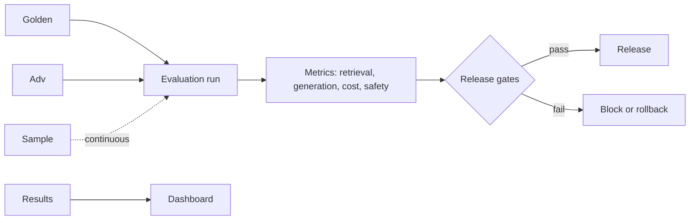
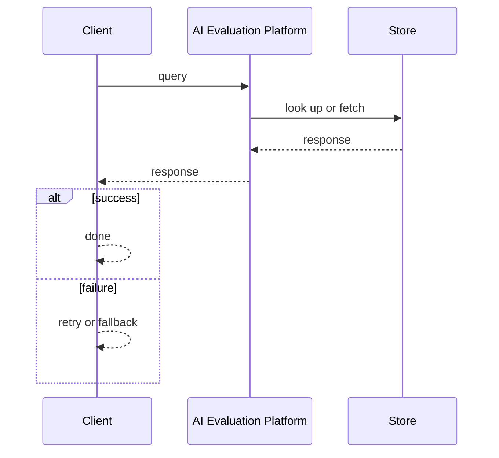
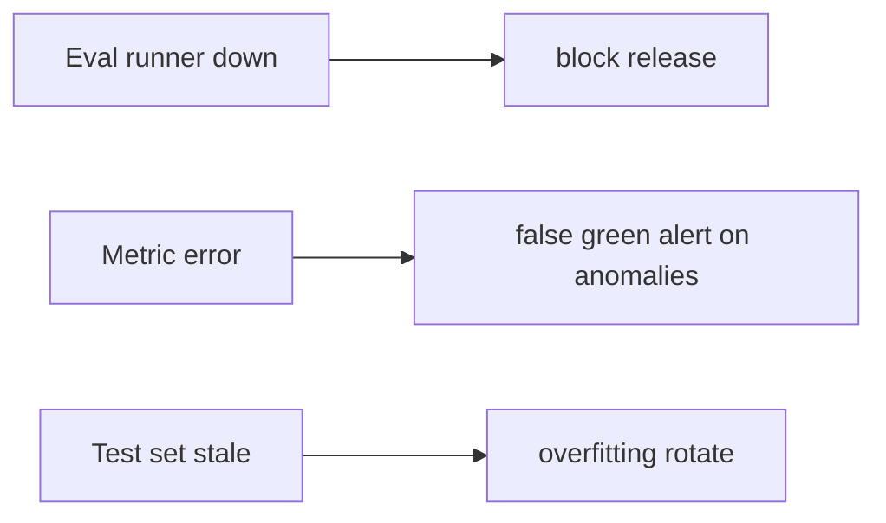

# Case Study: AI Evaluation Platform

> **Tier:** ai-systems · **Status:** complete · Original numbers and diagrams.

## 11. High-level architecture

## 28. Original Mermaid diagrams
Standalone sources under `diagrams/case-studies/ai-evaluation-platform/`: `context.mmd`, `request-sequence.mmd`, `failure-flow.mmd`, `scaling-evolution.mmd`. The diagrams are embedded in their respective sections: architecture in section 11, request flow in section 12, failure scenarios in section 19, and scaling stages in section 24.

## 1. Problem statement

A platform that continuously evaluates AI features (RAG, agents, LLM calls) against golden and adversarial test sets, with release gates, regression tracking, and rollback triggers.

## 2. Scope

In: golden + adversarial test sets, continuous evaluation, release gates, regression tracking, rollback triggers, dashboards. Out: automated model selection.

## 3. Functional requirements

- Maintain golden and adversarial test sets.
- Run evaluation before every release and continuously.
- Measure retrieval, generation, agent, cost, safety metrics.
- Set release gates with rollback triggers.
- Track regressions.
- Dashboard results.

## 4. Non-functional requirements

- Evaluation run < 10 min.
- No false-green gates.
- Availability 99.9 percent.

## 5. Explicit assumptions

1. 500 golden, 100 adversarial. 2. Eval per release + continuous sample. 3. 5 AI features.

## 6. Traffic estimation

Evaluation batch (bursty at release); continuous sample low-rate.

## 7. Storage estimation

Test sets + results + regression history; small, versioned, auditable.

## 8. Bandwidth estimation

Evaluation inference (LLM calls for golden set); moderate.

## 9. API design

POST /eval/run (feature, version) -> results; GET /eval/results -> metrics; POST /eval/gates -> pass/fail.

## 10. Data model

test_sets(id, feature, type, cases[]); results(id, feature, version, metrics, ts); gates(feature, metrics, thresholds, status).

## 12. Request flow
Golden + adversarial sets run before release -> measure metrics -> check gates (groundedness >= threshold, hallucination <= threshold, latency <= SLO, cost <= budget) -> pass: release; fail: block/rollback -> continuous sample -> dashboard tracks regressions.

## 13. Component responsibilities

Test set manager, evaluation runner, metric calculators, gate checker, regression tracker, dashboard.

## 14. Database selection

Test sets (versioned, Git-backed); results (time-series); gates (relational).

## 15. Caching strategy

Common eval results cached; test sets cached; metric calculations cached per version.

## 16. Partitioning strategy

Results by feature + version; test sets by feature; gates by feature.

## 17. Replication strategy

Results RF=3; test sets in Git; gates strongly consistent.

## 18. Consistency model

Results immutable per version; gates strongly consistent; regression tracking chronological.

## 19. Failure scenarios
Eval runner down -> block release. Metric error -> false green (alert on anomalies). Test set stale -> overfitting (rotate).

## 20. Reliability strategy

SLI eval accuracy, gate reliability; SLO 99.9 percent. Block release if eval fails.

## 21. Security considerations

Adversarial sets updated (not overfitted); per-tenant eval isolation; PII in test sets redacted; audit eval decisions.

## 22. Observability strategy

Eval run time, gate pass rate, regression count, metric trends, false-green incidents, test set freshness.

## 23. Cost considerations

Eval inference per release; amortize; use cheaper models for eval where possible.

## 24. Scaling stages

Stage 1: golden + gates + manual run. -> Stage 2: adversarial + continuous + regression. -> Stage 3: automated gates + dashboards. -> Stage 4: multi-feature + automated rollback.

## 25. Trade-offs

Thorough eval (quality) vs speed. Golden set size (coverage) vs cost. Continuous (fresh) vs pre-release (thorough). Strict gates (safe) vs false blocks (slow).

## 26. Alternative designs

No eval (ship blind). Vibe check (subjective). One metric (misses regressions). No gates (no rollback).

## 27. Interview discussion points

Clarify features, golden set size, gate thresholds, rollback. Surface golden/adversarial, metrics, gates, regression tracking.

## 29. Further reading

AI evaluation: docs/ai-systems/10-ai-evaluation; templates/ai/evaluation-plan.md; security: 09-ai-security.

## 30. Practical exercises

1. Define gates for a RAG feature. 2. Adversarial set for injection. 3. Regression detection. 4. Continuous sample design. 5. Automated rollback trigger.

---
Previous: Multi-model routing · Next: Prompt-management platform

