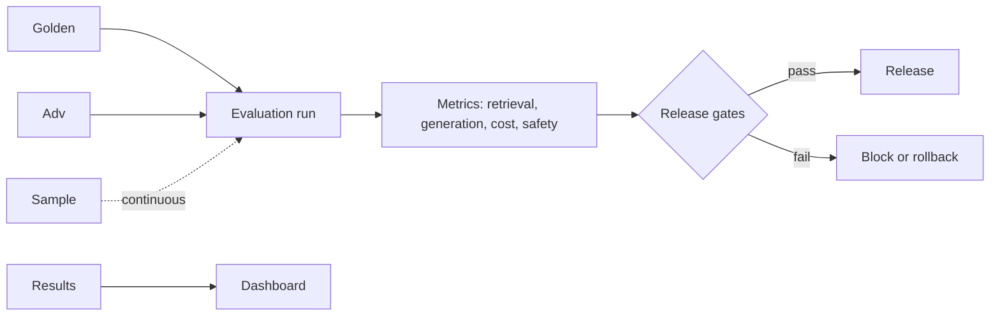
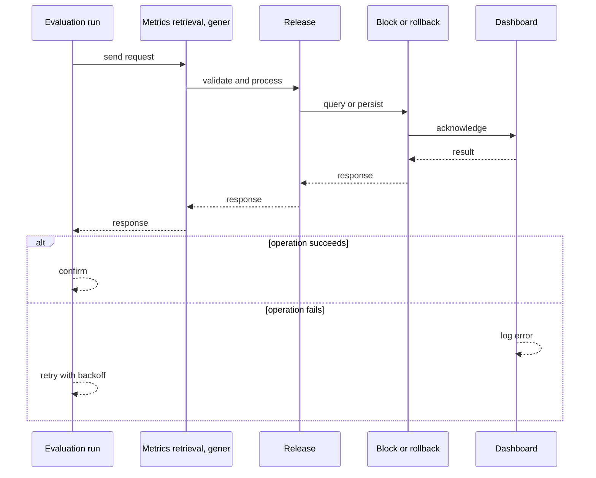
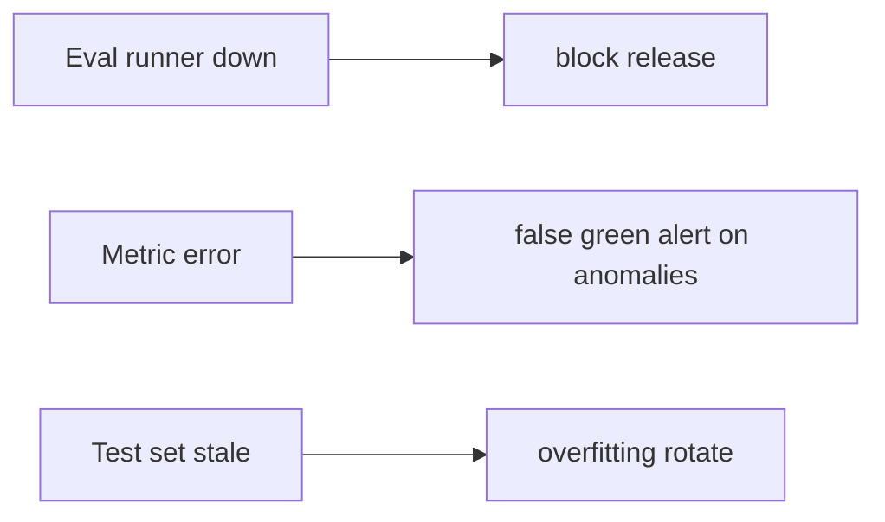
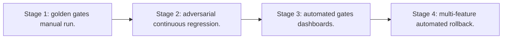

# Case Study: AI Evaluation Platform

> **Tier:** ai-systems · **Status:** complete · Original numbers and diagrams.

## 1. Problem statement
A platform that continuously evaluates AI features (RAG, agents, LLM calls) against golden and adversarial test sets, with release gates, regression tracking, and rollback triggers. This is a ai-systems-tier system design challenge because it must handle high availability under peak load while ensuring no single point of failure. The design must be production-grade: observable, debuggable, reversible, and able to survive component failures without data loss or cascading outages.

## 2. Scope
In: golden + adversarial test sets, continuous evaluation, release gates, regression tracking, rollback triggers, dashboards. Out: automated model selection.

For AI Evaluation Platform, these boundaries keep the first version focused on the core user value. Adding more features would dilute the design and delay shipping. Each excluded item is a scaling stage — a candidate for the next iteration once the baseline is proven.

## 3. Functional requirements
- Maintain golden and adversarial test sets.
- Run evaluation before every release and continuously.
- Measure retrieval, generation, agent, cost, safety metrics.
- Set release gates with rollback triggers.
- Track regressions.
- Dashboard results.

For AI Evaluation Platform, these requirements drive specific architectural decisions: the read-write ratio determines the caching strategy, the durability target sets the replication mode, and the idempotency requirement shapes the API contract.

## 4. Non-functional requirements
- Evaluation run < 10 min.
- No false-green gates.
- Availability 99.9 percent.

For AI Evaluation Platform, each non-functional target constrains a specific component: the latency SLO bounds the number of synchronous hops, the availability target forces redundancy across availability zones, and the cost ceiling limits the replication factor and storage tier.

## 5. Explicit assumptions
1. 500 golden, 100 adversarial. 2. Eval per release + continuous sample. 3. 5 AI features.

For AI Evaluation Platform, if these assumptions are off by an order of magnitude, the architecture must adapt: 10x traffic may require earlier sharding, a different read-write ratio changes the caching strategy, and a higher peak multiplier demands more headroom.

## 6. Traffic estimation
Evaluation batch (bursty at release); continuous sample low-rate.

To derive the request rate: divide the daily volume by 86,400 seconds to get the average rate, then multiply by 5-10x for peak. The read-to-write ratio determines whether the system is cache-dominated (read-heavy) or write-path-dominated (write-heavy). For AI Evaluation Platform, this ratio shapes the entire storage and replication strategy.

## 7. Storage estimation
Test sets + results + regression history; small, versioned, auditable.

For AI Evaluation Platform, storage growth is projected from the daily write volume and retention policy. Index overhead and compression factors are accounted for in the total.

## 8. Bandwidth estimation
Evaluation inference (LLM calls for golden set); moderate.

Bandwidth is request rate multiplied by average payload size for ingress, and response rate multiplied by response size for egress. CDN and edge caching reduce origin egress. Compression reduces bandwidth by 50-80 percent where applicable. For AI Evaluation Platform, bandwidth may or may not be the binding constraint — compare it against compute and storage to find out.

## 9. API design

POST /eval/run (feature, version) -> results; GET /eval/results -> metrics; POST /eval/gates -> pass/fail.

## 10. Data model
test_sets(id, feature, type, cases[]); results(id, feature, version, metrics, ts); gates(feature, metrics, thresholds, status).

For AI Evaluation Platform, the data model follows the access pattern. The primary lookup determines the partition key; secondary lookups determine indexes. Denormalization is used selectively on hot read paths.

## 11. High-level architecture

## 12. Request flow
Golden + adversarial sets run before release -> measure metrics -> check gates (groundedness >= threshold, hallucination <= threshold, latency <= SLO, cost <= budget) -> pass: release; fail: block/rollback -> continuous sample -> dashboard tracks regressions.

## 13. Component responsibilities
Test set manager, evaluation runner, metric calculators, gate checker, regression tracker, dashboard.

For AI Evaluation Platform, each component has one job. The gateway authenticates and routes. Services are stateless and scale horizontally. The data tier is the stateful core that scales by sharding.

## 14. Database selection
Test sets (versioned, Git-backed); results (time-series); gates (relational).

For AI Evaluation Platform, the database was chosen by access pattern, not familiarity. The rejected alternatives were wrong for this workload, not bad in general.

## 15. Caching strategy
Common eval results cached; test sets cached; metric calculations cached per version.

For AI Evaluation Platform, the cache strategy matches the staleness tolerance. Cache-aside for most data, write-through where read-after-write matters, stampede protection on hot keys.

## 16. Partitioning strategy
Results by feature + version; test sets by feature; gates by feature.

For AI Evaluation Platform, the partition key balances query locality with even load distribution. Sharding strategy matters because a poor key creates hot spots under real traffic patterns.

## 17. Replication strategy
Results RF=3; test sets in Git; gates strongly consistent.

For AI Evaluation Platform, replication mode is split: synchronous where durability is critical, asynchronous elsewhere for throughput. RF=3 tolerates one failure. Failover is tested regularly.

## 18. Consistency model
Results immutable per version; gates strongly consistent; regression tracking chronological.

For AI Evaluation Platform, the consistency level is the weakest users accept. Read-your-writes is provided where needed. Eventual consistency is bounded and monitored, not unbounded and silent.

## 19. Failure scenarios
Eval runner down -> block release. Metric error -> false green (alert on anomalies). Test set stale -> overfitting (rotate).

## 20. Reliability strategy
SLI eval accuracy, gate reliability; SLO 99.9 percent. Block release if eval fails.

For AI Evaluation Platform, the SLO makes reliability measurable. The error budget balances feature velocity with stability. Chaos testing validates that resilience claims hold under real failures.

## 21. Security considerations
Adversarial sets updated (not overfitted); per-tenant eval isolation; PII in test sets redacted; audit eval decisions.

For AI Evaluation Platform, security layers TLS, encryption at rest, RBAC, PII redaction, and audit. The policy gateway is fail-closed for AI-augmented operations.

## 22. Observability strategy
Eval run time, gate pass rate, regression count, metric trends, false-green incidents, test set freshness.

For AI Evaluation Platform, observability combines logs, metrics, and traces with correlation IDs. Golden signals drive the first dashboard. Alerts fire on burn rate, not raw thresholds.

## 23. Cost considerations
Eval inference per release; amortize; use cheaper models for eval where possible.

For AI Evaluation Platform, cost is driven by the binding resource. Caching, tiering, batching, and right-sizing are the levers. Cost per request is tracked and alerted on.

## 24. Scaling stages
Stage 1: golden + gates + manual run. -> Stage 2: adversarial + continuous + regression. -> Stage 3: automated gates + dashboards. -> Stage 4: multi-feature + automated rollback.

## 25. Trade-offs
Thorough eval (quality) vs speed. Golden set size (coverage) vs cost. Continuous (fresh) vs pre-release (thorough). Strict gates (safe) vs false blocks (slow).

For AI Evaluation Platform, each trade-off lists what was chosen, what was rejected, and why. This makes the design defensible in review — every decision has documented reasoning.

## 26. Alternative designs
No eval (ship blind). Vibe check (subjective). One metric (misses regressions). No gates (no rollback).

For AI Evaluation Platform, the alternatives are real architectures that work under different constraints. They were rejected for this workload's specific requirements, not because they are bad designs.

## 27. Interview discussion points
Clarify features, golden set size, gate thresholds, rollback. Surface golden/adversarial, metrics, gates, regression tracking.

For AI Evaluation Platform in an interview: clarify scope first, surface the read-write ratio, design the hot path deeply, discuss failures, and offer an alternative. Weak candidates skip failure modes.

## 28. Original Mermaid diagrams
Standalone sources under `diagrams/case-studies/ai-evaluation-platform/`: `context.mmd`, `request-sequence.mmd`, `failure-flow.mmd`, `scaling-evolution.mmd`. The diagrams are embedded in their respective sections: architecture in section 11, request flow in section 12, failure scenarios in section 19, and scaling stages in section 24.

## 29. Further reading
AI evaluation: docs/ai-systems/10-ai-evaluation; templates/ai/evaluation-plan.md; security: 09-ai-security. Sources: `S-CHASH` `S-DYNAMO`.

## 30. Practical exercises

1. Define gates for a RAG feature. 2. Adversarial set for injection. 3. Regression detection. 4. Continuous sample design. 5. Automated rollback trigger.

---
Previous: Multi-model routing · Next: Prompt-management platform

