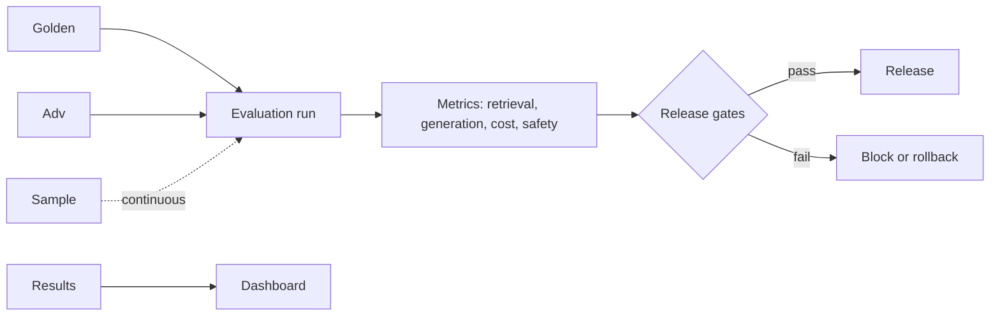
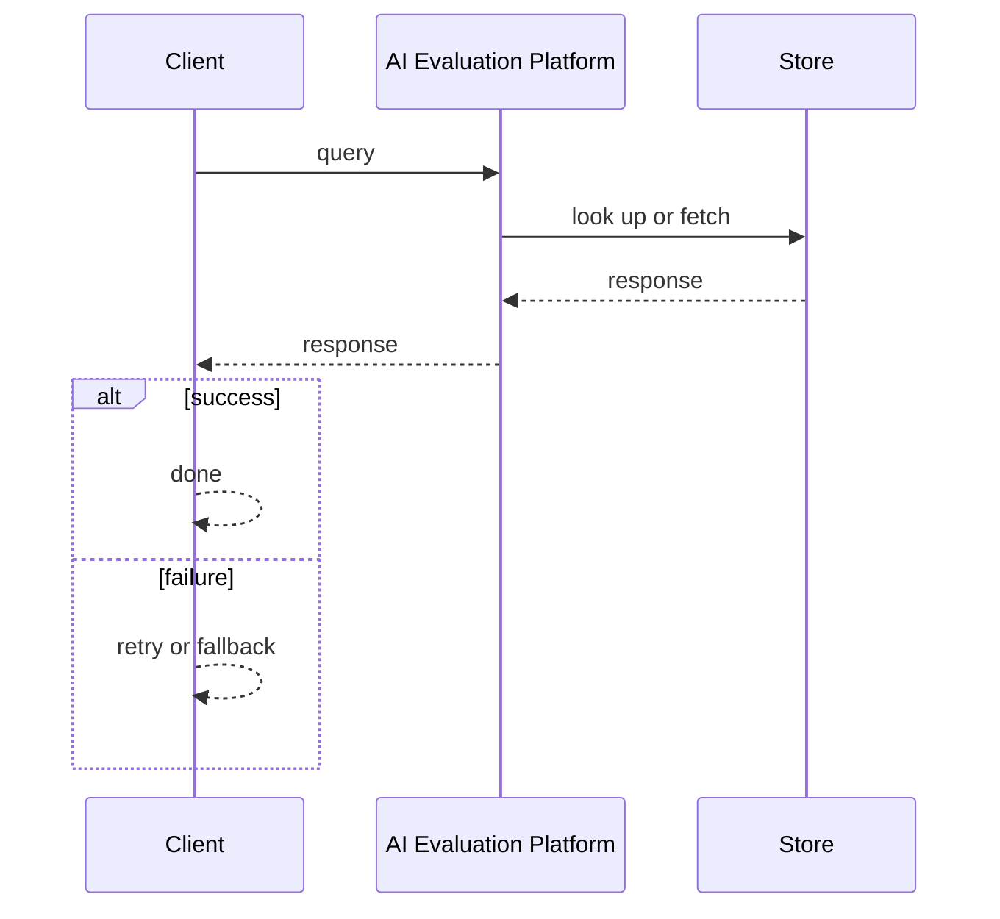
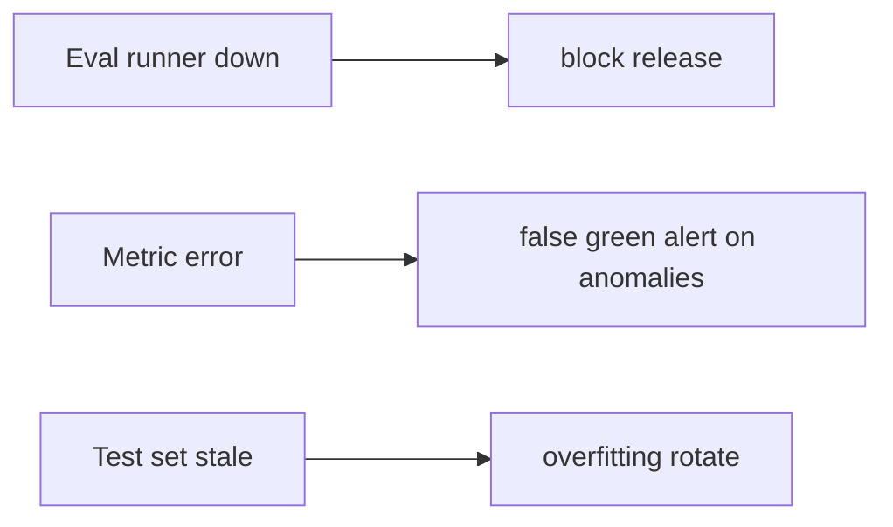

# Case Study: AI Evaluation Platform

> **Tier:** ai-systems · **Status:** complete · Original numbers and diagrams.

## 11. High-level architecture

## 28. Original Mermaid diagrams

Standalone sources under `diagrams/case-studies/ai-evaluation-platform/`: `context.mmd`, `request-sequence.mmd`, `failure-flow.mmd`, `scaling-evolution.mmd`. Request sequence and failure flow:

## 1. Problem statement

A platform that continuously evaluates AI features (RAG, agents, LLM calls) against golden and adversarial test sets, with release gates, regression tracking, and rollback triggers.

This system sits at the intersection of distributed systems and operational reliability. The design must balance latency versus durability while ensuring no single component failure cascades. The target audience includes engineers and operators, so the design must be observable, debuggable, and reversible.
## 2. Scope

In: golden + adversarial test sets, continuous evaluation, release gates, regression tracking, rollback triggers, dashboards. Out: automated model selection.

The scope boundary is deliberate: including too much in v1 risks a system that is broad but shallow. Each excluded feature is a candidate for a later iteration once the core loop is proven.
## 3. Functional requirements

- Maintain golden and adversarial test sets. - Run evaluation before every release and continuously. - Measure retrieval, generation, agent, cost, safety metrics. - Set release gates with rollback triggers. - Track regressions. - Dashboard results.

These requirements drive the architecture: the read-heavy pattern pushes toward caching; the durability requirement forces synchronous writes; the idempotency requirement means every write path handles redelivery without double-application.
## 4. Non-functional requirements

- Evaluation run < 10 min. - No false-green gates. - Availability 99.9 percent.

The non-functional targets shape every component choice: the latency SLO forces edge caching and limits synchronous cross-region calls; the availability target drives redundancy (RF=3, multi-AZ); the cost target constrains the model size.
## 5. Explicit assumptions

1. 500 golden, 100 adversarial. 2. Eval per release + continuous sample. 3. 5 AI features.

These assumptions are the load-bearing facts of the design. If any is wrong by an order of magnitude, the architecture must adapt: 10x more traffic may require sharding earlier; a different read-write ratio changes the caching strategy entirely.
## 6. Traffic estimation

Evaluation batch (bursty at release); continuous sample low-rate.

The traffic estimate reveals the binding constraint. Peak is modeled at 10x average. The read-write ratio determines whether the system is cache-dominated (read-heavy) or write-path-dominated (write-heavy), which changes the storage and replication strategy.
## 7. Storage estimation

Test sets + results + regression history; small, versioned, auditable.

Storage growth is linear with time and must be planned with retention. The estimate includes metadata and index overhead (20-30 percent above raw). Without a retention policy, storage grows unboundedly.
## 8. Bandwidth estimation

Evaluation inference (LLM calls for golden set); moderate.

Bandwidth is often not the binding constraint but becomes significant at the edge during viral spikes. CDN and edge caching cut origin egress; compression cuts bandwidth by 50-80 percent where applicable.
## 9. API design

POST /eval/run (feature, version) -> results; GET /eval/results -> metrics; POST /eval/gates -> pass/fail.

The API follows REST for external clients and gRPC for internal calls. Every write endpoint accepts an idempotency key. Rate limiting is enforced at the gateway before the service tier.
## 10. Data model

test_sets(id, feature, type, cases[]); results(id, feature, version, metrics, ts); gates(feature, metrics, thresholds, status).

The data model is designed around the access pattern, not the entity shape. The primary access path determines the partition key; secondary paths determine indexes. Denormalization is applied selectively where the hot read path would otherwise require expensive joins.
## 12. Request flow

Golden + adversarial sets run before release -> measure metrics -> check gates (groundedness >= threshold, hallucination <= threshold, latency <= SLO, cost <= budget) -> pass: release; fail: block/rollback -> continuous sample -> dashboard tracks regressions.

The request flow reveals the critical path: any component on the hot path that fails or slows degrades the user experience. The design applies timeouts, circuit breakers, and bulkheads to each hop. The write path includes an idempotency check before any state mutation.
## 13. Component responsibilities

Test set manager, evaluation runner, metric calculators, gate checker, regression tracker, dashboard.

Each component has a single, well-defined responsibility. The gateway handles auth and routing; the service tier is stateless and horizontally scalable; the data tier is the stateful core, carefully partitioned and replicated. The separation allows each tier to scale independently.
## 14. Database selection

Test sets (versioned, Git-backed); results (time-series); gates (relational).

The database choice is driven by the access pattern. The rejected alternatives were rejected for specific reasons: a relational DB was rejected if the workload is a single key lookup at massive scale; a KV store was rejected if joins and transactions are needed.
## 15. Caching strategy

Common eval results cached; test sets cached; metric calculations cached per version.

The caching strategy is designed around the staleness tolerance of the workload. Cache-aside is the default; write-through is used where read-after-write consistency is required. Stampede protection is applied to any key that can go viral. Cache entries are namespaced by tenant.
## 16. Partitioning strategy

Results by feature + version; test sets by feature; gates by feature.

The partition key co-locates related data while distributing load evenly. Consistent hashing with virtual nodes minimizes data movement when nodes change. A hot key is mitigated by caching, extra replication, or key splitting.
## 17. Replication strategy

Results RF=3; test sets in Git; gates strongly consistent.

Replication is synchronous on the write-confirmation path where durability is critical and asynchronous elsewhere. RF=3 tolerates one failure. Failover is tested, not just configured. Cross-region replication is asynchronous with a documented RPO.
## 18. Consistency model

Results immutable per version; gates strongly consistent; regression tracking chronological.

The consistency model is the weakest that users can tolerate. Read-your-writes is provided where the user expects to see their own write. Eventual consistency is bounded (seconds) and monitored. The system documents what eventual means to users.
## 19. Failure scenarios

Eval runner down -> block release. Metric error -> false green (alert on anomalies). Test set stale -> overfitting (rotate).

Each failure scenario has a documented response: which component detects it, how failover happens, what the user experiences, and how recovery is verified. Bulkheads and circuit breakers prevent one slow dependency from cascading.
## 20. Reliability strategy

SLI eval accuracy, gate reliability; SLO 99.9 percent. Block release if eval fails.

The SLO defines what good means measurably; the error budget is the allowed unavailability spent on deploys and feature risk. The system is tested with chaos engineering to verify resilience. An untested failover is not a failover.
## 21. Security considerations

Adversarial sets updated (not overfitted); per-tenant eval isolation; PII in test sets redacted; audit eval decisions.

Security is defense in depth: TLS, encryption at rest, RBAC with default-deny, PII redaction in logs, audit trails, and per-tenant isolation. For AI-augmented systems, the policy gateway is fail-closed: on any error, the system refuses to act.
## 22. Observability strategy

Eval run time, gate pass rate, regression count, metric trends, false-green incidents, test set freshness.

Observability uses logs, metrics, and traces with correlation IDs. The golden signals (latency, traffic, errors, saturation) are the first dashboard. Alerts fire on SLO burn rate, not raw thresholds. The on-call runbook for each alert is tested.
## 23. Cost considerations

Eval inference per release; amortize; use cheaper models for eval where possible.

Cost is dominated by the binding resource. Primary levers: caching (cuts read cost), tiering (cuts storage cost), batching (cuts per-request overhead), and right-sizing. Cost is tracked as a first-class metric and alerted on when unit cost spikes.
## 24. Scaling stages

Stage 1: golden + gates + manual run. -> Stage 2: adversarial + continuous + regression. -> Stage 3: automated gates + dashboards. -> Stage 4: multi-feature + automated rollback.

The scaling stages are triggered by specific thresholds, not by calendar. Each stage is a deliberate architectural change: Stage 1 handles initial load; Stage 2 when a single node saturates; Stage 3 when latency exceeds the SLO; Stage 4 when hot keys threaten the origin.
## 25. Trade-offs

Thorough eval (quality) vs speed. Golden set size (coverage) vs cost. Continuous (fresh) vs pre-release (thorough). Strict gates (safe) vs false blocks (slow).

Every trade-off has a rejected alternative with a reason. The design does not present one option as universally correct; it presents the chosen option, the rejected alternative, and the workload-specific reason.
## 26. Alternative designs

No eval (ship blind). Vibe check (subjective). One metric (misses regressions). No gates (no rollback).

The alternative designs are genuine architectures that would work under different constraints. They were rejected for this workload because of specific requirements that make them inferior here but not universally inferior.
## 27. Interview discussion points

Clarify features, golden set size, gate thresholds, rollback. Surface golden/adversarial, metrics, gates, regression tracking.

In an interview, the strongest candidates clarify ambiguity before designing, surface the read-write ratio and the binding resource, design the hot path deeply, discuss failure modes explicitly, and offer an alternative with a reason.
## 29. Further reading

AI evaluation: docs/ai-systems/10-ai-evaluation; templates/ai/evaluation-plan.md; security: 09-ai-security.

The further reading cites primary sources (RFCs, papers, official documentation) via stable IDs in SOURCES.md, not secondary blog posts. Each citation is chosen because it is the authoritative source for a specific technical claim.
## 30. Practical exercises

1. Define gates for a RAG feature. 2. Adversarial set for injection. 3. Regression detection. 4. Continuous sample design. 5. Automated rollback trigger.

---
Previous: Multi-model routing · Next: Prompt-management platform

The exercises push the reader beyond v1: re-estimating at 10x reveals capacity limits; adding a new requirement forces an architectural change; designing the failover test reveals whether resilience claims are real.
