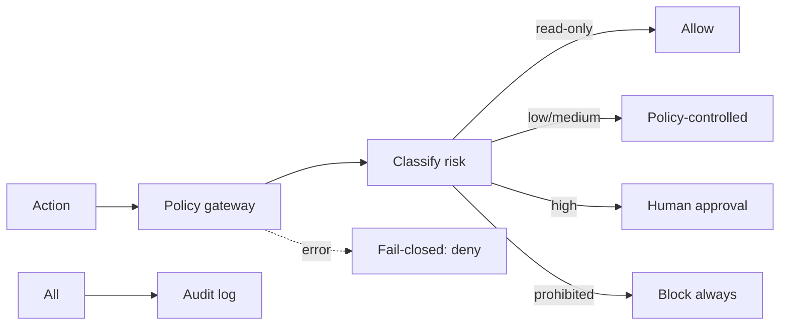
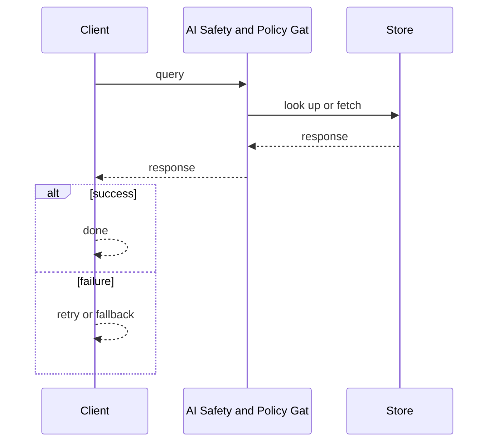
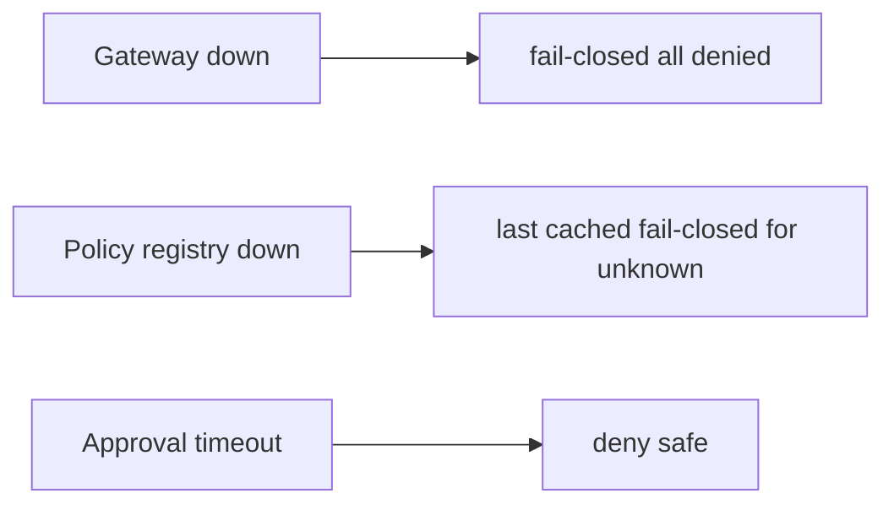

# Case Study: AI Safety and Policy Gateway

> **Tier:** ai-systems · **Status:** complete · Original numbers and diagrams.

## 1. Problem statement

A centralized policy gateway that intercepts every AI action, enforces safety policies (no auto-high-risk, no PII to unapproved models, no secrets), routes high-risk to human approval, and is fail-closed.

## 2. Scope

In: policy registry, action interceptor, risk-tier classification, approval workflow, audit, fail-closed. Out: policy authoring UI.

## 3. Functional requirements

- Intercept every AI action before execution.
- Classify risk (read-only, low, medium, high, prohibited).
- Allow read-only automatically.
- Route high-risk to human approval.
- Block prohibited actions.
- Audit everything.
- Fail-closed on any error.

## 4. Non-functional requirements

- Policy decision < 10 ms.
- Never allow prohibited.
- Availability 99.95 percent (fail-closed if down).

## 5. Explicit assumptions

1. 10k actions/s. 2. 80 percent read-only, 15 percent low/medium, 5 percent high-risk. 3. High-risk approval < 5 min.

## 6. Traffic estimation

10k actions/s; policy evaluation fast (in-memory rules).

## 7. Storage estimation

Policies + audit + approvals; small, tamper-evident.

## 8. Bandwidth estimation

Action metadata small; gateway adds minimal latency.

## 9. API design

POST /evaluate (action, context, user) -> allow/pending/deny; POST /approve (action_id, approver) -> approved/denied.

## 10. Data model

policies(id, rule, risk_level, action_patterns); actions(id, user, action, risk, status, ts); approvals(id, action, approver, decision, ts).

## 11. High-level architecture

## 12. Request flow
AI action -> gateway intercepts -> classify risk -> read-only: allow; low/medium: policy-controlled; high: human approval; prohibited: block always -> on error: fail-closed (deny all) -> audit everything.

## 13. Component responsibilities

Policy registry, action interceptor, risk classifier, approval workflow, audit logger, fail-closed handler.

## 14. Database selection

Policy registry (KV, hot-reloaded); actions (append-only); approvals (relational, audited).

## 15. Caching strategy

Policy rules cached in-memory; action decisions cached; approval status cached.

## 16. Partitioning strategy

Actions by tenant; policies global; approvals by status.

## 17. Replication strategy

Policy registry RF=3; actions append-only; gateway stateless + HA; approvals RF=3.

## 18. Consistency model

Policies strongly consistent (hot-reloaded); actions append-only; approvals strongly consistent.

## 19. Failure scenarios
Gateway down -> fail-closed (all denied). Policy registry down -> last cached (fail-closed for unknown). Approval timeout -> deny (safe).

## 20. Reliability strategy

SLI decision latency, zero-prohibited-allowed; SLO 99.95 percent. Fail-closed on any error.

## 21. Security considerations

This IS security. Key policies: never expose passwords/keys, never auto-execute high-risk, never disable firewalls, never modify routing without approval, never send confidential to unapproved models, never upgrade outside maintenance windows.

## 22. Observability strategy

Action rate by risk tier, approval rate, denial rate, prohibited attempts (0), gateway latency, fail-closed events.

## 23. Cost considerations

Gateway cheap (stateless, in-memory rules); value is preventing unsafe actions. Approval workflow is human time.

## 24. Scaling stages

Stage 1: policy + intercept + classify + audit. -> Stage 2: approval + fail-closed + HA. -> Stage 3: policy versioning + per-tenant. -> Stage 4: enterprise governance + multi-region.

## 25. Trade-offs

Fail-closed (safe, blocks on error) vs fail-open (available, risky). Strict (safe) vs friction (slow). Centralized (consistent) vs decentralized (fast).

## 26. Alternative designs

No gateway (unguarded). Fail-open (unsafe on error). Per-agent policies (inconsistent). No audit (no accountability).

## 27. Interview discussion points

Clarify risk tiers, approval workflow, fail-closed behavior, audit. Surface classification, approval, fail-closed, audit, no-prohibited principle.

## 28. Original Mermaid diagrams
Standalone sources under `diagrams/case-studies/ai-safety-policy-gateway/`: `context.mmd`, `request-sequence.mmd`, `failure-flow.mmd`, `scaling-evolution.mmd`. The diagrams are embedded in their respective sections: architecture in section 11, request flow in section 12, failure scenarios in section 19, and scaling stages in section 24.

## 29. Further reading

AI security: docs/ai-systems/09-ai-security; templates/ai/ai-threat-model.md; templates/network/network-ai-security-review.md.

## 30. Practical exercises

1. Define 5 risk tiers with examples. 2. Fail-closed design. 3. Approval workflow with timeout. 4. Policy hot-reload. 5. Audit replay.

---
Previous: Prompt management · Next: Enterprise agent platform

